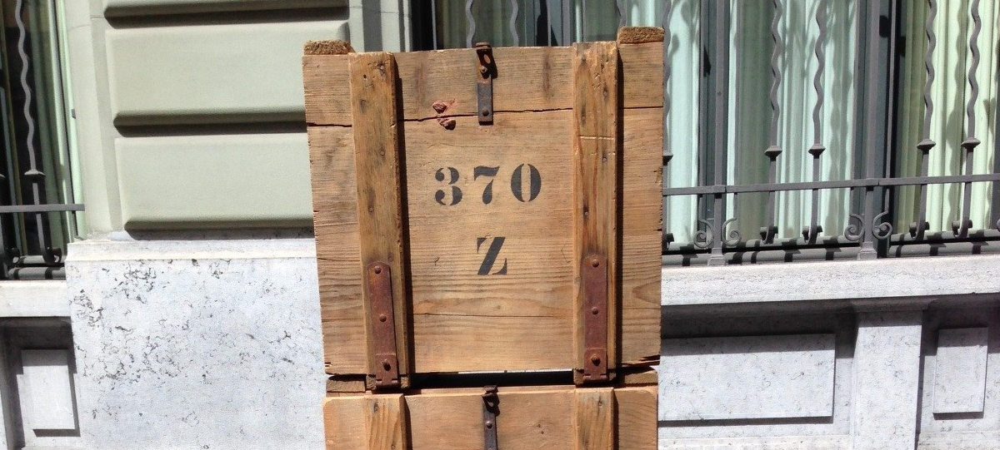
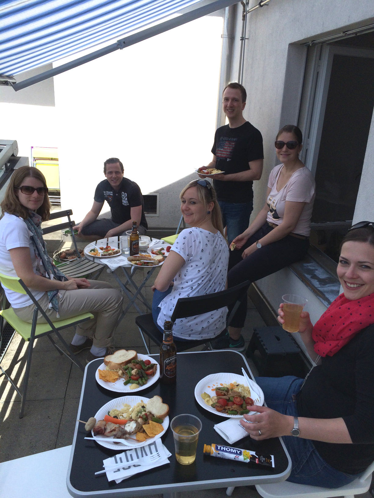
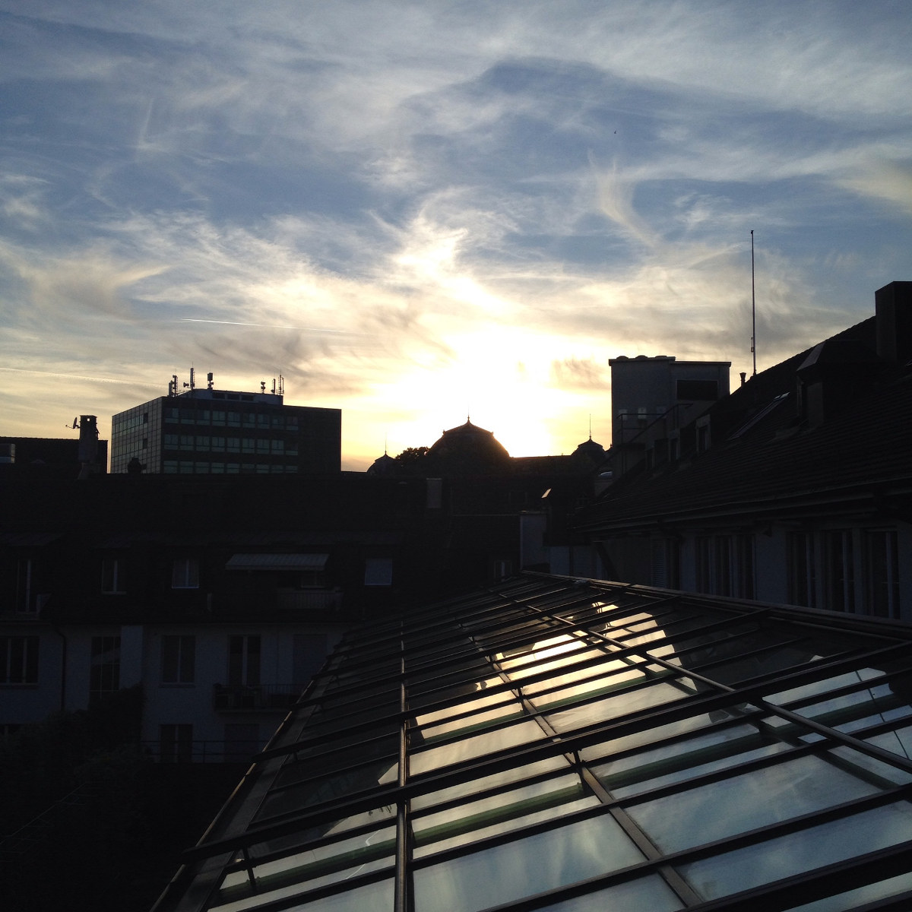
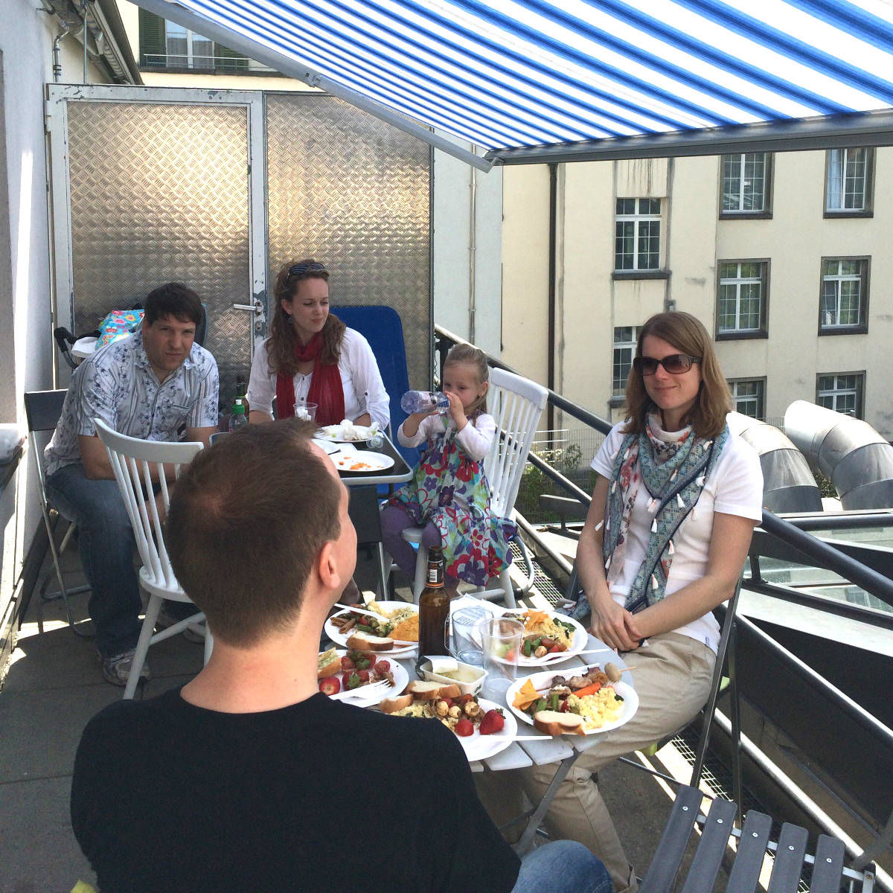
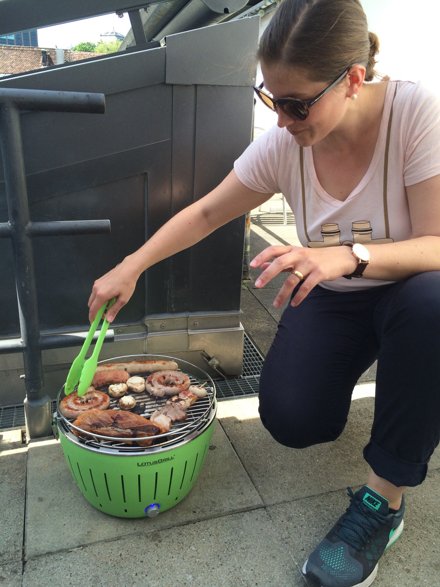

+++
title = "Aarbergergasse - es geht los"
date = "2015-05-13"
description = "Der Tastenaufschlag hallt zwar noch etwas wegen der leeren Wände, aber seit der Schlüsselübergabe am 1. Mai nimmt die Einrichtung langsam Form an."
image = "kiste.jpg"
authors = [ "Marco Jakob" ]
comments = true
tags = [ "Coworking" ]
+++

Ich sitze gerade in unserem Raum an der Aarbergergasse, während ich diese Zeilen schreibe. Wegen der leeren Wände hallt der Tastenaufschlag zwar noch etwas, aber seit der Schlüsselübergabe am 1. Mai nimmt die Einrichtung langsam Form an. Ein erstes prägendes (und praktisches) Element sind die super Holzkisten. Dann kamen Stühle dazu, Internet, Bildschirme, Tische und eine Kaffeemaschine. Man kann also bereits arbeiten. 

Am letzten Sonntag haben wir bereits mit ein paar Personen aus der [Slack-Community](/blog/slack/) die Terrasse eingeweiht. Die Feststellung: Mit zehn Personen inklusive Grill kann man hier bestens feiern!

## Wohnzimmer-Athmosphäre

In den nächsten zwei Wochen wird die Einrichtung weiter ergänzt. Unser Ziel ist es, eine Wohnzimmer-Athmosphäre zu schaffen, anstelle eines klassischen Büro-Looks. [Timon Marmet](http://marmart.ch/) ist daran, einen langen Holztisch zu schreinern, Christa-Maria, Domenica, Salome, Isabel und weitere bringen laufend praktische und stylische Elemente dazu. Die Einrichtung soll ausdrücken, dass hier nicht nur gearbeitet sondern gelebt werden soll.

## Wie geht es weiter?

Seit Beginn des Projektes vor einem Jahr haben wir viel über innovative Arbeitsformen diskutiert ([Gemeinsamständigkeit](/blog/gemeinsamstaendigkeit/), [eine absurde Idee?](/blog/absurde-idee-gemeinsamstaendigkeit/), [Coworking Space zusammen betreiben](/blog/coworking-space-zusammen-betreiben/), [Kanban](/blog/kanban/) und mehr). Mit dem Raum an der Aarbergergasse wird es jetzt konkret.

Bis Ende Mai werden wir das entstandene Material zu den verschiedenen Themen sammeln und aufbereiten. Dies sind einige der Themen:

* Wie sollen Entscheidungen gefällt werden?
* Warum machen wir das Ganze überhaupt? Was ist das Ziel?
* Welche Werte wollen wir leben (Gemeinsam anstatt Einsam, Grosszügigkeit, Dankbarkeit, Transparenz, Exzellenz, etc.)?
* Wie sieht die Suche nach einer grösseren Location aus?
* Wie soll der Raum an der Aarbergergasse getauft werden?
* Finanzen

Das aufbereitete Material wird auf Slack veröffentlicht. Im Moment sind 18 Personen auf Slack dabei. Diese werden im Juni eingeladen, über die einzelnen Bereiche zu entscheiden. Ende Juni sollten wir somit eine Art "Manifest" haben, an dem wir uns orientieren werden. Das soll auch Personen den Einstieg erleichtern, die all die Diskussionen nicht mitbekommen haben.

Falls du in diesem Prozess gerne näher dabei wärst und mitprägen möchtest, so melde dich direkt bei uns. Dann können wir dich auf Slack einladen.

## Eröffnung?

Sobald wir den zentralen Tisch und weitere Sitzgelegenheiten haben, werden wir auf der [Events-Seite](/events/) weitere Tage aufschalten, an denen man zum Arbeiten und auf ein Bier vorbeikommen kann. Ein Arbeitstag mit Internet und Kaffee wird im Moment CHF 20.- kosten.

Ab Juli sollten wir ein Angebot mit Tages- und Teilzeitpässen und ein paar fixe Arbeitsplätze bieten können. 

#### Kühlschrank gesucht...

Damit das Feierabendbier auch gekühlt werden kann, brauchen wir natürlich einen Kühlschrank. Wir sind noch auf der Suche. Falls du also einen Kühlschrank übrig hast, wären wir sehr froh darum! Er sollte nicht viel mehr als 90 cm hoch sein.

## Über den Dächern von Bern

Zum Schluss noch ein paar Impressionen der Abendstimmung und vom Grillen über den Dächern von Bern. Schaut doch in den nächsten Tagen mal unter [Events](/events/), wann jemand da ist und kommt vorbei - Aufbau-Feeling garantiert!

