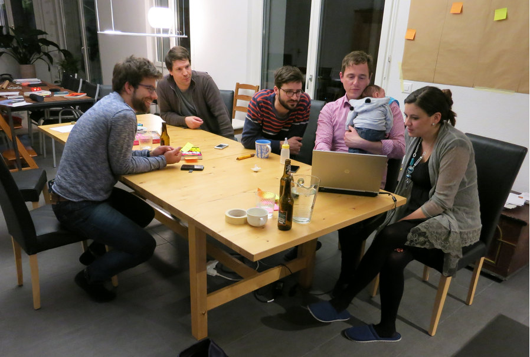

+++
title = "Eine absurde Idee: Gemeinsamständigkeit"
date = "2015-03-07"
description = "Wir hielten uns ganz an das Zitat von Albert Einstein «Wenn eine Idee zuerst nicht absurd erscheint, dann taugt sie nichts.» als wir uns zu einem Literatur- und Diskussionsabend trafen."
image = "literaturabend.jpg"
authors = [ "Matthias Tobler" ]
comments = "popupcoworking"
tags = [ "Inspiration", "Grundsätze" ]
+++

  Wir hielten uns ganz an das Zitat von Albert Einstein „Wenn eine Idee zuerst nicht absurd erscheint, dann taugt sie nichts.“ als wir uns zu einem Literatur- und Diskussionsabend trafen. Eine kleine, feine Runde von selbstständig Arbeitenden und Denkenden liess sich vom Buch “Thank God its Monday” von Dark Horse herausfordern.

Dark Horse ist eine Innovationsagentur aus Berlin, die von sich behauptet, dass sie die Arbeitswelt revolutionieren wird. In der von 30 (!!) jungen Leuten gegründeten Agentur gibt es Ideen-Sprints statt Meeting-Marathons, gemeinsame Entscheidungen ohne Chefs und einen Preis für den besten Fehler. Mit dem Buch “Thank God its Monday” wollen sie aufzeigen, wie eine Arbeitswelt aussieht, die ganz nach dem Geschmack der Generation Y ist.

## Selbständig aber bitte nicht nur selber und ständig

Ein paar ausgewählte Seiten aus dem Buch und ein Video-Portrait von Dark Horse machten uns schnell klar: viele der Erfahrungen von Dark Horse stimmen mit unseren Lebens- und Arbeitserfahrungen überein. Wir haben uns für die Selbständigkeit entschieden, aber nicht dafür, dass man alles selber und ständig machen muss. Wir fühlen uns nicht als heldenhafte Einzelkämpfer, welche im kleinen Kämmerchen einsam die to-do Listen abarbeiten. Wir möchten gerne fokussiert an unseren Aufgaben arbeiten, vermissen aber die Abwechslung und Vielfalt. Wir nennen uns zwar Selbständige, fühlen uns aber oft nicht so. Wir möchten uns ergänzen lassen, in Kooperation arbeiten, gemeinschaftliche Solidarität leben und die Sicherheit einer Community geniessen. Dark Horse nennt dies Gemeinsamständigkeit und löste es so, dass sie zusammen eine Firma gründeten (siehe auch Artikel zu [Coworking Space zusammen betreiben](/blog/coworking-space-zusammen-betreiben/) von Marco). Aber gibt es auch Wege wie diese Gemeinsamständigkeit von Selbständigen gelebt werden kann?

Viele Selbständige schliessen sich in Coworking-Spaces zusammen. Man teilt Ressourcen und Infrastruktur und erhält eine Community als Mehrwert dazu. Wir meinen, dass Community aber das Wesentliche ist. Könnte es sogar sein, dass echte Selbständigkeit und Selbstentfaltung erst durch verbindlich gelebte Community möglich sind? Im Vereinen der vermeintlichen Gegensätze Selbständigkeit und Community könnte das grösste Potenzial liegen.

## Das Potenzial der Gemeinsamständigkeit

Wir forderten uns gegenseitig heraus, das Undenkbare zu denken und das Absurde in Erwägung zu ziehen. Wie könnte maximale Gemeinsamständigkeit ausschauen? Wagen wir es, die einzelnen Firmen zwar im Privatbesitz zu lassen aber Löhne und den Gewinn (nach Rückstellungen) in einen gemeinsamen Topf zu werfen (siehe auch Artikel zu [Gemeinsamständigkeit](/blog/gemeinsamstaendigkeit/) von Marco)? Einen Topf, aus dem wiederum alle ihren Lohn erhalten. Was wären die Eckpfeiler und das Potenzial einer solchen Gemeinsamständigkeit? Hier ein paar Ideen:

* jeder kann selbständig arbeiten, ohne auf gemeinschaftliche Solidarität, starke Team-Kollaboration und Ergänzung verzichten zu müssen 
* erweiterte Willenskraft indem wir uns mit täglichen Stand-up Meetings gegenseitig helfen, das Leben diszipliniert zu planen und die Arbeit effizient zu gestalten
* eigenes Potenzial wird durch die Ressourcen der Community erweitert – bei Aufträgen können wir uns gegenseitig helfen ohne dass die Zeit abgerechnet werden muss
* wir stellen einander Talente, Netzwerk, Zeit und Dienstleistungen zur Verfügung und haben ein Interesse, dass es allen gut geht
* wir brainstormen gemeinsam an neuen Ideen für Projekte und Firmen und setzen diese auch gleich um 
* die Community kann eine Firma bei schwierigen Marktsituationen oder ein junges Start-up querfinanzieren
* eine Community mit Künstler, Handwerker und Unternehmer schafft Vielfalt und Abwechslung
* die Community organisiert sich ohne Hierarchie komplett selbstständig

## Wie, Warum oder Warum eigentlich nicht?

Der Abend war viel zu schnell vorbei. Viele Fragen nach dem Wie und Warum blieben unbeantwortet und sind es immer noch. Je länger wir darüber nachdachten, desto kleiner schien uns aber das Risiko, bei einem Versuch zu scheitern, als das Risiko, das Potenzial der Gemeinsamständigkeit zu verpassen.

Was denkt Ihr dazu? 

***

Buchempfehlung und Inspirationsquelle für diesen Post:

* [**Thank God it's Monday!**](http://www.thankgoditsmonday.de), Wie wir die Arbeitswelt revolutionieren, Dark Horse Innovation, 2014.
