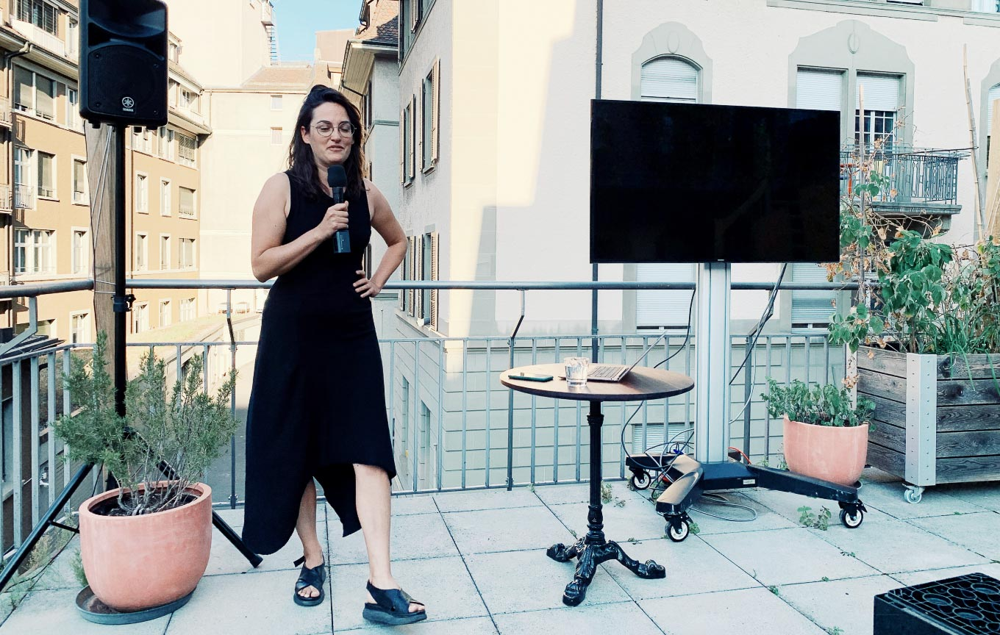
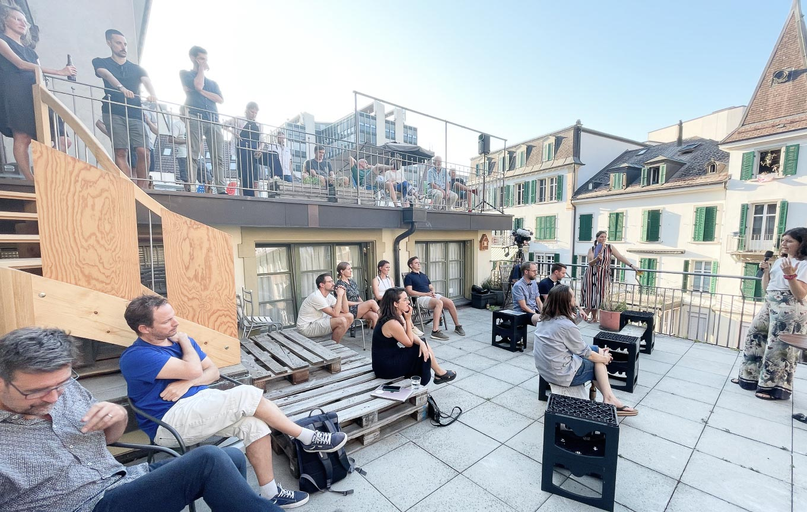
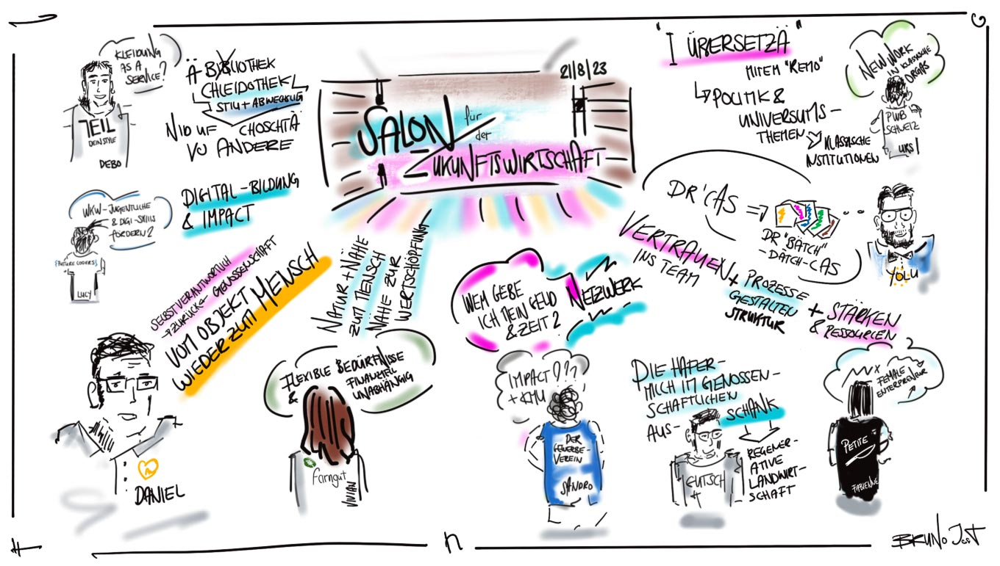

+++
title = "Auftakt des ersten «Salon für Zukunftswirtschaft»"
date = "2023-09-04"
draft = false
tags = ["wirtschaft"]
image = "salon_fuer_zukunftswirtschaft_effinger_1.jpg"
description = "Leichtfüssig und erfrischend – das ist unser Fazit vom ersten «Salon für Zukunftswirtschaft», den wir als Effinger Community mit Begeisterung organisiert haben. Unter einem klaren Himmel und auf zwei Terrassen trafen sich Unternehmer:innen aus Mode, IT, Gesundheit, Landwirtschaft, Bildung, Gastronomie, Beratung und weiteren Branchen, um zu erfahren, wie die Wirtschaft von morgen heute schon gestaltet wird. "
authors = ["Manuel Bürli"]
comments = true
+++
### Leichtfüssig und erfrischend – das ist unser Fazit vom ersten «Salon für Zukunftswirtschaft», den wir als Effinger Community mit Begeisterung organisiert haben. Unter einem klaren Himmel und auf zwei Terrassen trafen sich Unternehmer:innen aus Mode, IT, Gesundheit, Landwirtschaft, Bildung, Gastronomie, Beratung und weiteren Branchen, um zu erfahren, wie die Wirtschaft von morgen heute schon gestaltet wird.

\
Der Höhepunkt des Abends waren die inspirierenden «Lightning Talks». Insgesamt neun Unternehmer:innen zeigten in jeweils 5 Minuten auf, wie sie die Zukunft der Wirtschaft mitprägen. Beispielsweise präsentierte uns Lucy Jager von «FutureCoders», wie wir Jugendliche mit geringem Budget in digitalen Fähigkeiten fördern können. Marco Jakob von Yolu erklärte, wie Weiterbildung selbst organisiert werden kann, ohne auf einen akademischen Abschluss zu verzichten. Fabienne Mässerli von «Petit Couteau» hinterfragte, ob Unternehmen wirklich ein:e Chef:in brauchen. Daniel Flach von «Südland» wagte den Blick in ein neues Gesundheitswesen, in dem Patient:innen mitbestimmen. Debora Alder-Gasser von «Teil» teilte ihre Vision, wie Kleidung vom Wegwerfprodukt zu einem Service werden kann. Und viele weitere Beiträge.

## Die Idee des Salons

Unsere Vision für den «Salon für Zukunftswirtschaft» ist es, Ideenreichtum für eine lebensdienliche Wirtschaft zu wecken. Die Grundidee besteht darin, eine Bühne zu schaffen, auf der wir unser vielfältiges Ökosystem aus spannenden Geschäftsmodellen und Wirtschaftssystemen präsentieren können – ein Potpourri aus Kreislaufwirtschaft, Social Entrepreneurship, Commons, Selbstorganisation und des Community-Building. Unser Ziel ist es, Unternehmer:innen und Organisationen zusammenzubringen, damit sie sich austauschen und voneinander lernen können.

## Selbstorganisation

Eine der interessantesten Facetten des Salons war seine selbstorganisierte Natur. Domenica hatte die Idee, und einige engagierte Mitglieder aus der Effinger Community schlossen sich an. Mit Joni, Stefan, Domenica, Herr Bürli und Bruno bildeten wir ein Organisationsteam, das Aufgaben wie Technik, Catering, Kommunikation und Moderation gleichmäßig verteilte. Dank unserer bereits vorhandenen Infrastruktur im Effinger war es möglich, den Event mühelos und in vier Wochen auf die Beine zu stellen.

## Learnings & Ausblick

Als Organisationskomitee sind wir begeistert von der Resonanz auf den ersten «Salon für Zukunftswirtschaft». Die kurzen Lightning Talks haben den Abend perfekt begleitet. Für die Zukunft möchten wir den Kreis der Teilnehmer weiter öffnen und sicherstellen, dass es kein geschlossenes Netzwerk wird. Der nächste «Salon für Zukunftswirtschaft» ist bereits für nächsten Sommer angeplant, und wir sind offen für weitere Kooperationen mit Unternehmen, Coworking Spaces, Innovation-Labs und passenden Sponsoren. 

## Mehr Infos zum Salon?

Möchtest du den nächsten Salon nicht verpassen? Dann abonniere unseren Newsletter:\
[Newsletter](#mc-embedded-subscribe-form)

Für Beiträge, Kooperationen oder Spronsoring kannst du mit uns in Kontakt treten: \
manuel@effinger.ch

