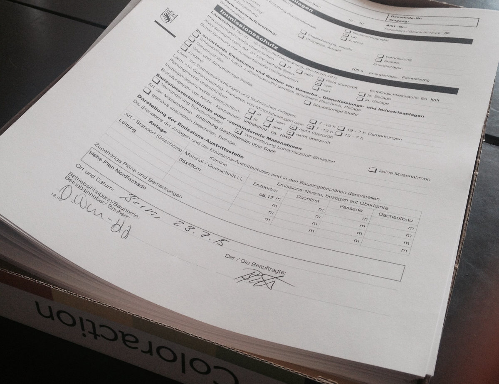

+++
title = "Baugesuch eingereicht"
date = "2015-08-03"
description = "Nach etlichen oder besser unzählbar vielen Telefonaten mit den Behörden, nach Abklärungen mit dem Architekt, den Eigentümern und sonstigen Beteiligten, haben wir heute endlich unser Baugesuch für die Effingerstrasse 10 eingereicht."
image = "baugesuch.jpg"
author = "Domenica Winkler"
comments = true
tags = [ "Location" ]
+++

  Nach etlichen oder besser unzählbar vielen Telefonaten mit den Behörden, nach Abklärungen mit dem Architekt, den Eigentümern und sonstigen Beteiligten, haben wir heute endlich unser Baugesuch für die Effingerstrasse 10 eingereicht.

Es ist die grösste und komplizierteste Hürde, die wir auf dem Weg an die Effingerstrasse nehmen müssen. Denn unser ganzes Vorhaben hängt daran, ob wir die entsprechenden Bewilligungen für die Gastronomie und die baulichen Massnahmen erhalten. Jetzt heisst es warten, warten, warten. Nach offiziellen Angaben dauert die Prüfung dieses Gesuches etwa drei Monate.

In der Zwischenzeit sitzen wir natürlich nicht tatenlos herum. Es gibt noch viel zu tun: 

* Getränke degustieren 
* Kaffee auswählen 
* Hygienekonzept schreiben 
* weiterhin mit den Behörden telefonieren 
* sich ums Innendesign kümmern 
* sich Gedanken über den Sinn des Lebens machen 
* über eine mögliche Form der Umsetzung unserer Grundsätze diskutieren 
* endlich einen Namen für unsere Projekt finden 
* Effingerstrasse besuchen und die Fortschritte bei der jetzigen Baustelle bestaunen

Und für mich heissts jetzt erst einmal: ab in die Ferien. Baugesuch vergessen, norwegischen Kaffee probieren und die Seele baumeln lassen.