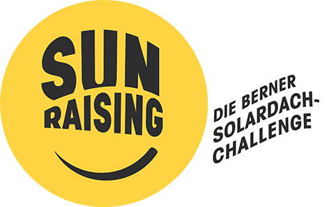
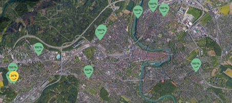

+++
title = "Berner Solarstrom für den Effinger"
date = "2019-10-19"
description = "Der Effinger finanziert 10m2 Solarpanels bei Sunraising. Damit wird der Coworkingspace Effinger Miteigentümer von einer Berner Solaranlage auf einem Dach in Bern-Bümpliz. Wir leisten damit einen direkten Beitrag an die Energiewende und für lokale Stromproduktion."
image = "solarstrom_01.jpg"
authors = [ "Andrea Burkhalter" ]
comments = true
tags = [ "Coworking", "Community" ]
+++

  Der Effinger finanziert 10m2 Solarpanels bei Sunraising. Damit wird der Coworkingspace Effinger Miteigentümer von einer Berner Solaranlage auf einem Dach in Bern-Bümpliz. Wir leisten damit einen direkten Beitrag an die Energiewende und für lokale Stromproduktion.

## Was heisst das?
Für die nächsten 20 Jahre werden dem Effinger jährlich 1'100 kWh Strom von der Stromrechnung gutbeschrieben. Das entspricht ca. 7.8% vom jährlichen Stromverbrauch vom EG und OG des Effinger Coworkingspaces. Der Grossteil des Bedarfs wird nach wie vor aus anderem Schweizer Naturstrom abgedeckt.

## Was ist Sunraising?

  

    Der gemeinnützige Verein baut und betreibt Solaranlagen auf Berner Dächern. Man kann sich als Privatperson oder Firma einkaufen, ohne ein eigenes Dach zu besitzen. Die genutzten Dächer gehören der Stadt Bern und die Anlagen werden jeweils mittels Crowdfunding vorfinanziert.
  

  

   
  

## Weshalb macht der Effinger mit?
Unsere Motivation besteht darin, ein Zeichen zu setzen für eine nachhaltige Stromproduktion und gleichzeitig eine Berner Bürgerinitiative zu unterstützen. 

## Was ist gut an Berner Solarstrom?
Der Strom wird lokal produziert – direkt wo er verwendet wird. Die Solaranlagen werden auf bestehenden Dächern montiert, was Platz und Transportwege spart. Die graue Energie für die Herstellung von Solarpanels wird innerhalb von 1-2 Jahren mit der Stromproduktion wettgemacht.

## Business-Label Bronze
Mit dem Kauf von 10 Panels wird der Effinger zum Business-Partner und erhält das Sunraising Bronze-Label.  Dieses Siegel kann in der Kommunikation verwendet werden.

**Weitere Infos zu Sunraising**    
https://sunraising.ch/    
https://www.sunraising.ch/business

