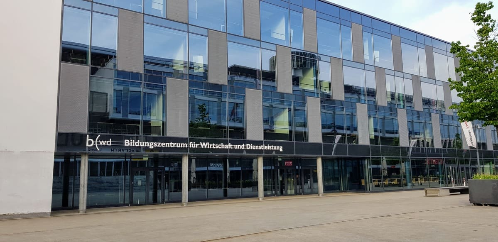
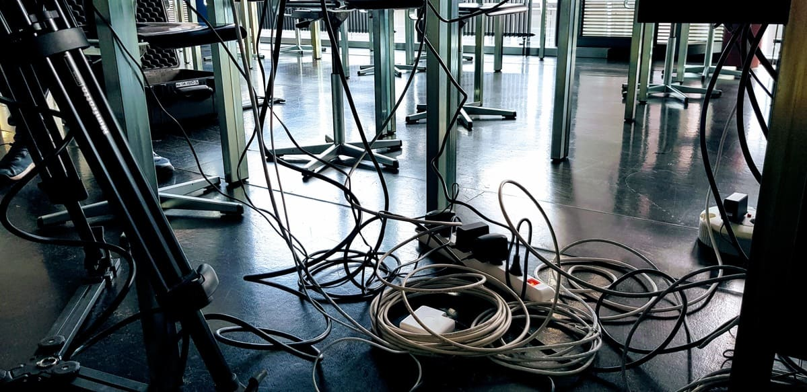
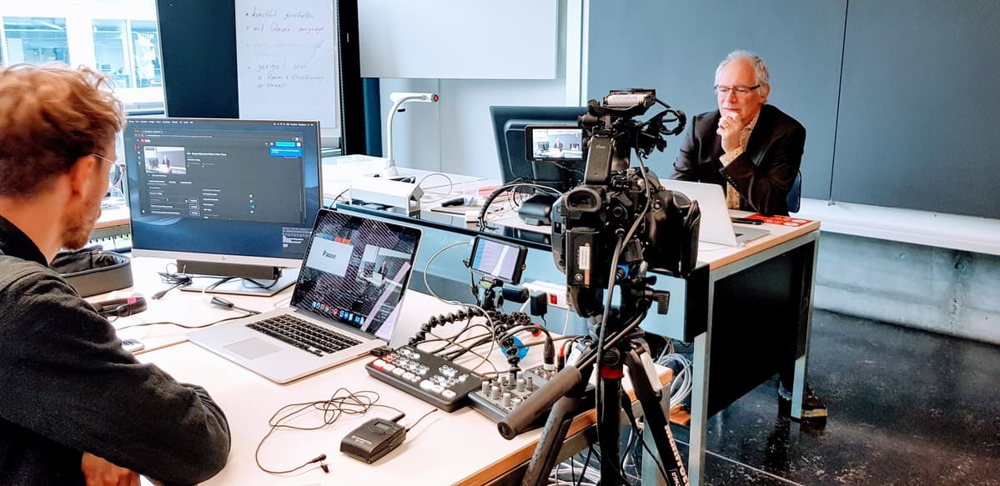
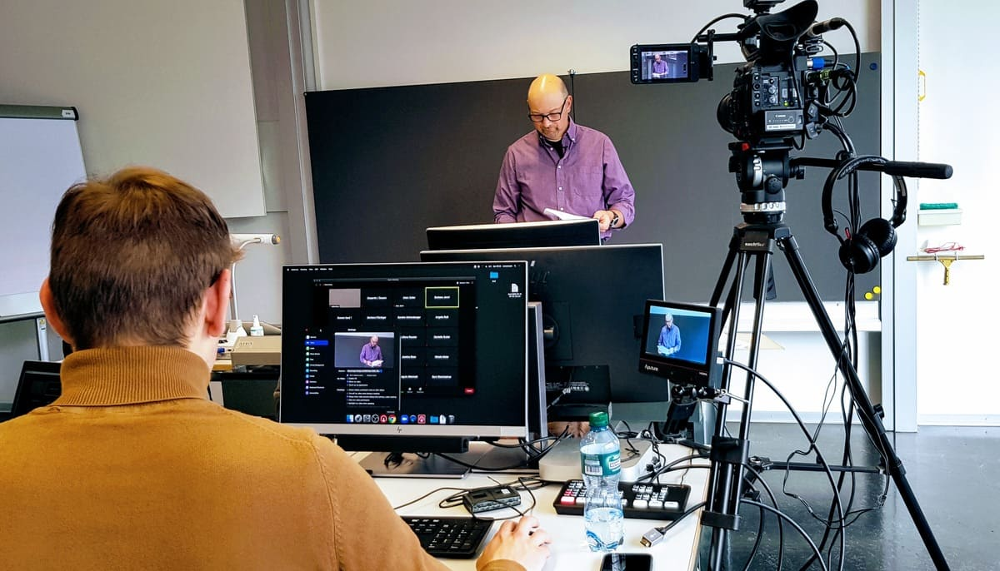
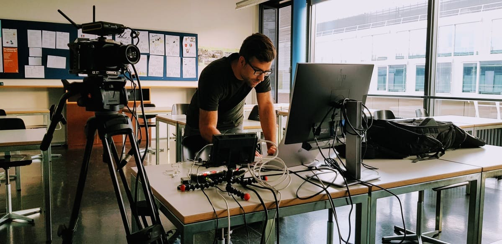
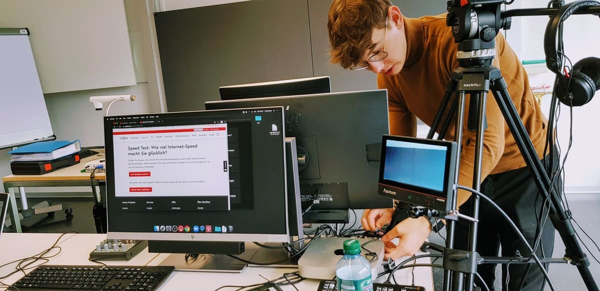
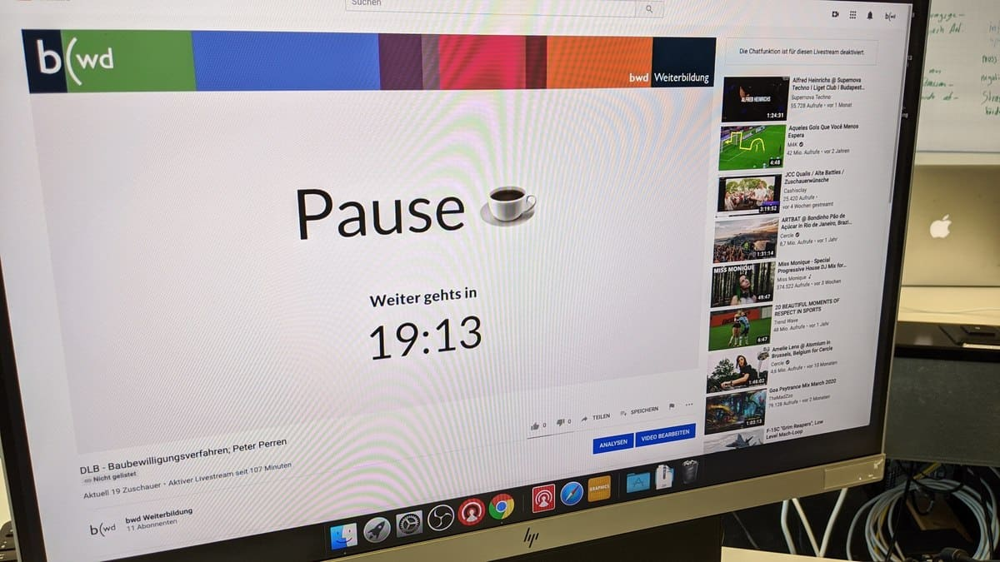
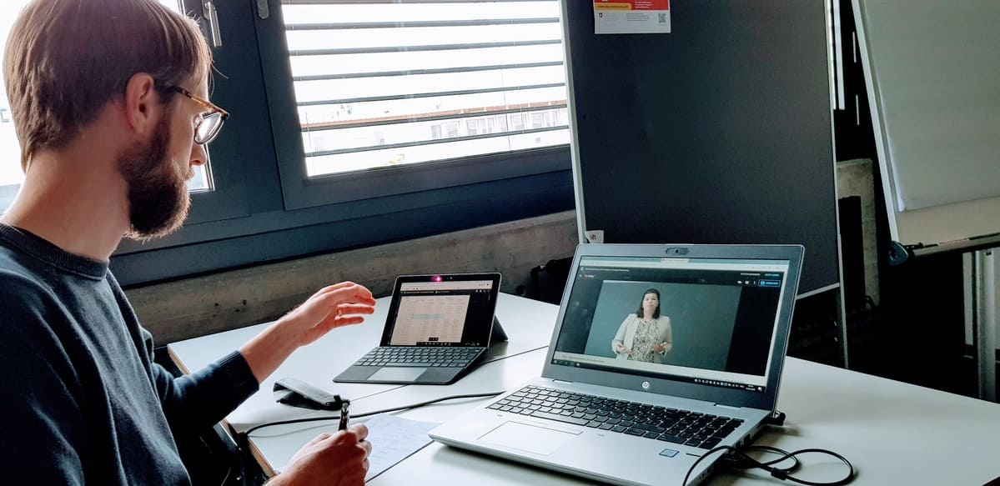
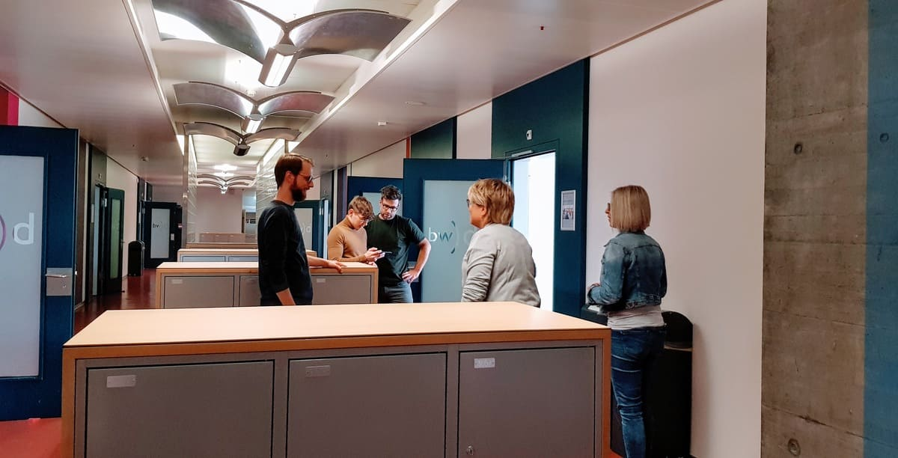
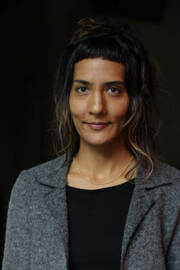

+++
title = "Bildung zu Corona Zeiten: Innovation statt Verzögerung"
date = "2020-05-27"
description = "Die Abteilung Weiterbildung am Bildungszentrum für Wirtschaft und Dienstleistung (bwd) entscheidet sich für Innovation statt Verzögerung und holt sich dafür professionelle Unterstützung. Diese erhält sie von einem Team aus dem Effinger Coworking Space."
image = "youtube-livestream-joni.jpg"
authors = [ "Sunita Asnani" ]
comments = true
tags = [ "Gemeinsamständig" ]
+++

Aufgrund der landesweiten Schulschliessung seit Mitte März standen etliche Bildungsinstitutionen in der Schweiz vor denselben Fragen: Für wie lange fällt der Präsenzunterricht aus? Müssen Prüfungen auf unbestimmte Zeit verschoben werden? Wie können Weiterbildungskurse und Ausbildungslehrgänge digital angeboten werden? 

Die Abteilung [Weiterbildung am Bildungszentrum für Wirtschaft und Dienstleistung (bwd)](https://bwdbern.ch/wb/gemeinden/) entschied sich für Innovation statt Verzögerung und holte sich dafür professionelle Unterstützung. Diese erhielt sie von einem Team aus dem Effinger Coworking Space.

Im Handumdrehen wurde ein massgeschneidertes Konzept für professionellen Fernunterricht für Erwachsene am bwd entwickelt. Nebst dem technischen Setup erhielten die Dozierenden des bwd didaktische Beratung und Support beim Moderieren. Das Resultat: die einjährigen Lehrgänge konnten trotz Lockdown wie geplant anfang Mai gestartet werden. Die Teilnehmenden waren froh, dass es weiterging, die Dozierenden motiviert und das Kursmanagement des bwd begeistert. Davon wollte ich mir ein Bild machen und besuchte das bwd an einem Samstagmorgen.

## Nicht lange grübeln

Am Eingang des geräumigen und entvölkerten bwd Gebäudes vis-à-vis vom Stadion Wankdorf empfängt mich Marco Jakob, Software Entwickler, Bildungsdesigner und Mitgründer des Effinger Coworking Space in Bern. Am bwd arbeitet er als Lehrkraft und Fachperson für digitale Themen. 

Die bwd Weiterbildung bietet branchenspezifische Weiterbildungen, Diplom- und Fachausweislehrgänge z.B. im Gemeindewesen, Zivilstandswesen, im Notariat- oder Advokaturbereich an. Die Dozierenden hier sind Experten aus der Praxis und unterrichten nur einige Halbtage pro Jahr. Dies bringt eine besondere Ausgangslage für das bwd: Es unterrichten in der Regel über dreissig verschiedene Dozierende innerhalb von einem Monat. 

Nachdem am 16. März abends die grosse Medienmitteilung des BAG die gesamte Schweiz auf den Kopf gestellt hat, wird Marco von Therese Jung-Bärtschi, der Leiterin bwd Weiterbildung, sowie den beiden Kursmanagerinnen Monika Kohler und Barbara Jenni kontaktiert mit der Frage, ob er ein Idee hätte, wie die Abteilung Weiterbildung im Gemeindebereich auf Fernunterricht umstellen könnte. Sie haben sich gegen das Warten und Zeit verlieren entschieden, sondern für ein schnelles Handeln.

Der nächste Lehrgang sollte innerhalb eines Monats beginnen. Marco holt seinen Kollegen, Filmemacher Jonathan Hess an Board. Dieser hat schon mit Livestreams gearbeitet:  «Die Idee von Marco für die bwd einen Distanzunterricht zu offerieren fand ich super. Das Livestream-Fieber packte mich gerade 1-2 Monate bevor uns das Corona-Fieber packte. Somit hatte ich schon einige Erfahrungen mit Livestreaming gemacht.»

Zusammen mit dem Weiterbildungsteam bwd entwickeln Jonathan und Marco innerhalb von wenigen Wochen ein Konzept: Die Dozierenden sollen keinen technischen Hürdenlauf hinter sich bringen. Sie sollen einfach in ihr Klassenzimmer kommen und sich auf das Unterrichten fokussieren können - alles andere wird für sie erledigt. 

## Starten, Testen, Entwickeln 

Marco, der auch Jungunternehmen in der Startphase begleitet, folgt dem Lean Startup Ansatz. Bei der Lean Startup Methode wird eine Geschäftsidee, ein Produkt oder eine Dienstleistung gestaltet und schnellstmöglich auf den Markt gebracht. Ziel ist es, aus dem Feedback der Kunden frühstmöglich Rückschlüsse für die weitere Entwicklung und ggf. Umgestaltung des Produkts ziehen zu können, um so Kosten und Zeit zu sparen. 

So wird jetzt auch dieses Projekt angegangen. «Wichtig ist, dass man allen Beteiligten richtig kommuniziert: Wir starten jetzt mal und schauen, was passiert, und wie man es weiterentwickeln kann», so Marco. «Wenn etwas nicht gut funktioniert, dann stellen wir um. Man muss agil bleiben.» Letzte Woche haben sie zum Beispiel getestet, ob man mit der Videokonferenz Plattform Zoom arbeiten könnte für Kurseinheiten, die verstärkt interaktiv gestaltet sind. Für den einen Kurs hat sich dies bewährt, da man z.B. Gruppenarbeiten in Zoom Untergruppen machen kann. Nun tastet sich das Team weiter und schaut, ob dies auch für andere Kurse ein geeignetes Format ist. Es ist von Vorteil, wenn mehrere Möglichkeiten und Ausweichoptionen zur Verfügung stehen, im Falle dass mal eines der Formate nicht gut funktioniert.

Hier gibt’s ein kleines Video mit Einblick in das gesamte Set up, gefilmt von Tavi Venzin:

  <iframe class="embed-responsive-item" src="https://www.youtube.com/embed/7BAKxVma9p8?rel=0" frameborder="0" allowfullscreen></iframe>

## Klassenzimmer als Livestream Event 

Ich werde nun in die drei bereits vorbereiteten Räume geführt, in denen heute Vormittag drei Kurse als Distanzunterricht übertragen werden sollen. Zwei Räume sind für den Unterricht als YouTube Livestream eingerichtet, der dritte für Unterricht als Videokonferenz auf Zoom. Ich sehe Kabel, Kameras, noch mehr Kabel, Bildschirme, noch mehr Bildschirme, Mikrofone, Laptops und Geräte, die ich noch nie gesehen habe. Jeder Raum sieht aus wie eine kleine Fernsehproduktion. In jedem Zimmer steht ein Team in den Startlöchern: Ein Dozent, ein Moderator, ein Kameramann. Der Dozent doziert. Der Moderator managed die Teilnehmenden. Dazu gehört u.a. die Links zu den Streamings verschicken, technische Fragen beantworten, den Teilnehmenden durch einen Chat die Möglichkeit geben, Fragen zu stellen und diese wiederum dem Dozierenden weiterleiten. Der Kameramann ist für die Einstellung der Kamera und der Bildschirme, das Hin- und Herschalten zwischen Kamera und Powerpoint sowie die gesamten Verbindungen und Datenübertragungen verantwortlich.

<strong>Zimmer 1: YouTube Livestream, Diplomlehrgang bernische BauverwalterInnen</strong> 
Dozent: Peter Perren, Thema «Baubewilligungsverfahren» 
Video: David Röthlisberger 
Moderation: Monika Gerber

<strong>Zimmer 2: Zoom Meeting, Diplomlehrgang bernische FinanzverwalterInnen</strong> 
Dozent: Markus Stoll, Thema «Finanzbuchhaltung» 
Video: Tavi Venzin 
Moderation: Barbara Jenni 

<strong>Zimmer 3: YouTube Livestream, Fachausweis bernische Gemeindefachfrau/mann</strong> 
Dozentin: Evelyne Suter, Thema «Obligationenrecht» 
Video: Jonathan Hess 
Moderation: Monika Kohler  

## Distanzunterricht einfach klasse

Es ist kurz vor Unterrichtsbeginn. Ich sitze mit Marco im Pausenzimmer. «Da warten jetzt über hundert Teilnehmende auf ihren Kurs. Wenn irgendwas schief läuft, können wir nicht einfach sagen sorry, heute haben wir technische Störungen», lacht er etwas nervös. Es ist heute das erste Mal, dass sie drei Kurse gleichzeitig streamen. Er ist als Supervisor und für technischen Support da.

Pünktlich um 08.30 Uhr geht der Unterricht in allen drei Zimmern los. Wir schauen in jedes der drei virtuellen Klassenzimmer rein. Ich bin beeindruckt. Es sieht alles hochprofessionell aus, die Aufnahmen wie aus dem Fernsehstudio. Es läuft alles wie am Schnürchen, die Teams sind eingespielt und jeder kann sich auf seine Rolle fokussieren. Ich denke an etliche chaotische Videokonferenzen, die ich in den letzten paar Wochen miterlebt habe. Webcams, die den Sprecher in den abenteuerlichsten Perspektiven zeigen, verwackelte Bilder, schlechte Auflösung, zahlreiche Unterbrechungen. Das hier ist kein Vergleich dazu. Die Dozenten erscheinen gelassen und souverän, als würden sie täglich so unterrichten. Sie haben zuvor durch Marco eine Schulung erhalten zum Unterrichten in der Cloud. Sie haben gelernt, dass sie in die Kamera schauen müssen, statt auf den Bildschirm. Oder dass sie sorgfältiger mit ihren Worten oder Beispielen umgehen müssen, wenn sie gefilmt werden. Sie wissen, wie sie die Vorteile des digitalen Unterrichts für sich nutzen und die Rhythmisierung zwischen Input und Übungen an die virtuelle Situation anpassen können.

Wurden die Dozierenden und Teilnehmenden erst gefragt, oder wurde der Wechsel auf das virtuelle Klassenzimmer durch das bwd beschlossen? Es wurde beschlossen, sagt Monika vom Kursmanagement, und das sei kein Problem. Im Gegenteil, man sei dankbar um den pragmatischen Ansatz. Die Dozierenden sind offen, sich auf das neue Format und das Abenteuer einzulassen. Einige sind zwar zuerst nervös, weil sie sich nicht vorstellen können, was da auf sie zukommt. Aber nach dem ersten Mal so unterrichten sagen die meisten, es sei einfacher gewesen als vorgestellt und habe Spass gemacht. Auch bei den Teilnehmenden gibt es keinen Widerstand. Sie sind froh, dass der Unterricht stattfinden kann.

## Zoom Glück gibt’s YouTube

Nach ungefähr 45 Minuten, gerade als Marco und ich uns so langsam entspannen, lässt uns die Meldung auffahren: es gibt Probleme im Zimmer 2, wo der Unterricht für diese Klasse zum ersten Mal auf Zoom stattfindet. Das Bild erscheint seit ein paar Minuten immer mehr verzögert und asynchron mit dem Ton. Nun braucht es Troubleshooting. Während der frühzeitig eingelegten Pause prüfen Marco und Tavi schnell die Internetverbindung, wechseln das Kabel aus, testen die Verbindung über einen Hotspot, ändern ein paar Einstellungen auf Zoom. Der Unterricht geht wieder weiter, muss jedoch schon bald wieder unterbrochen werden - immer noch das gleiche Problem. Kurzerhand entscheidet sich das Team, den Unterricht als YouTube Livestream fortzusetzen. Im Chat läuft’s heiss, Barbara stellt sicher, dass alle einen neuen Link erhalten. Schon nach einer Viertelstunde kann es wieder weitergehen. Diesmal mit Erfolg, der Stream funktioniert. Der Dozent Markus Stoll bleibt cool und ist trotz den Unterbrüchen rechtzeitig fertig mit seinem Kurs.

In den anderen Zimmern lief unterdessen alles reibungslos. Was war denn jetzt die Ursache der Störung in Zimmer 2? Das sei schwer zu beantworten, sagt Marco. Es könnte an der Internetleitung liegen, oder vielleicht gab es Wartungsarbeiten bei Zoom, oder die Leistung des Laptop Prozessors ist zu schwach. Die Technik ist also trotz Anwesenheit von Experten anfällig. Das ist die schlechte Nachricht. Die gute ist aber: Auf den Umgang mit dieser Unsicherheit kommt es an. Hier hat sich gezeigt, dass niemand die Ruhe verloren hat. Alle Beteiligten haben sich gemeinsam auf die Lösungssuche fokussiert - mit Erfolg. Die Teilnehmenden wurden jederzeit von Barbara betreut. «Man darf sie nicht im Regen stehen lassen», sagt sie später in der Pause. Und das hat sich bewährt. Keiner der Teilnehmenden hat sich während des Kurses ausgeklickt, trotz der Umstellung auf die alternative Streaming-Variante.

## Wo ist der Haken?

Das Filmteam blendet für die Pausen eine Uhr ein. Ich stelle mir die über hundert Teilnehmenden vor, die jetzt bei sich zu Hause Pause machen. Ob sie sich an die Vorteile davon schon gewöhnt haben? Oder wird der gemeinsame Austausch in den Pausen vermisst?

Im bwd versammeln sich unterdessen alle Anwesenden mit gebührendem Abstand im Pausenzimmer: Das Filmteam bestehend aus Jonathan Hess, Tavi Venzin und David Röthlisberger als Vertretung für Fabian Steiner. Supervisor und IT Support, Marco Jakob. Geschäftsführerin [Verband Bernisches Gemeindekader (BGK)](https://www.begem.ch/de/BGK-CCB) und stv. Geschäftsführerin vom [Verband Bernischer Gemeinden (VBG)](https://www.begem.ch/de/VBG-ACB), Monika Gerber. Kursmanagement bwd Weiterbildung, Monika Kohler & Barbara Jenni. Drei Dozierende, Peter Perren, Markus Stoll und Evelyne Suter.

Es wird Kaffee getrunken und munter geschwatzt.  Barbara und Monika erzählen, wie aktiv die Teilnehmenden in ihren Kursen gechattet haben. Einige Teilnehmende sind offenbar in dem digitalen Format aktiver als im Präsenzunterricht. Man traue sich einfach mehr, im Chat Fragen zu stellen, als im Präsenzunterricht, meint Monika Kohler. Bei Monika Gerber hingegen war wenig los im Chat. Gerade mal zwei Teilnehmer sind dem Chat beigetreten - und schrieben bisher noch kein Wort. Die drei Frau lachen: vielleicht ist das halt typisch Bauverwalter. 

Wo ist der Haken bei der ganzen Sache, frage ich Monika Gerber. Es gäbe zwei Haken, meint sie: Erstens, das Projekt kostet halt zusätzlich Zeit und Geld. Nebst den Ausgaben für den Auftrag an das Team aus dem Effinger, erhalten nämlich auch die Dozierenden eine höhere Entlöhnung für den zusätzlichen Aufwand. Das Kursmanagement oder auch sie selbst investieren viel Zeit für die Moderation der Kurse. Aber es habe sich voll gelohnt, meint Monika. Ein Abwarten und eine Anpassung der Stundenpläne wäre ja ebenfalls kostspielig und um einiges weniger erfreulich gewesen - darüber ist man sich einig am bwd. 
Der zweite Haken ist, dass die Teilnehmenden ohne den Präsenzunterricht weniger Beziehungen aufbauen untereinander. Beziehungen und Netzwerke seien aber auf dem Beruf, z.B. als Gemeindeschreiber zu anderen Gemeinden, extrem wichtig.

## Die ersten «Lessons learned»

Jonathan: «Live auf Sendung zu sein ist anspruchsvoll. Alle warten darauf, dass es los geht und plötzlich fällt etwas aus. Dann heisst es, flexibel zu bleiben. Man sollte für die Software, für Geräte und auch für die Internetleitung Alternativen parat haben. Idealerweise spielt man mit dem ganzen Team vorher ein paar Notfallszenarien durch, damit man für den Ernstfall gewappnet ist.»

Die Kursmanagerinnen sagen, es sei eine wertvolle Erfahrung, als Moderatorinnen mitten im Kursgeschehen zu stehen. Diesen Einblick hätten sie im Normalfall nicht. Das vertiefte Verständnis für die Arbeit der Dozierenden und Teilnehmenden helfe ihnen, ihre Dienstleistung im Kursmanagement zu optimieren.  «Die Dozierenden sind das höchste Gut unserer Bildungsinstitution», sagt Barbara. Man wolle ihnen möglichst das Leben vereinfachen. 
Wenn das nur alle Bildungsinstitutionen verstehen würden! Aus so einer Haltung resultiert nämlich genau das, was mir Barbara und Monika erzählen: Jeder zeigt sich hilfsbereit. Es herrscht ein guter Teamgeist und Zusammenhalt in ihrer Abteilung. 

## Was zeichnet eine gute Zusammenarbeit aus?

«Mich freut am meisten, wenn eine Zusammenarbeit wirklich eine Bereicherung ist. Wenn man weiss, man kann etwas abgeben, und die Kollegen machen ihre Arbeit gut», sagt Marco. In diesem Fall ist die Zusammenarbeit für ihn eine grosse Freude. Jede Partei geht über das hinaus, was man erwarten könnte. Das bwd Kursmanagement übernimmt alles Administrative vortrefflich, und stellt z.B. sicher, dass alle Teilnehmenden den richtigen Link haben. Das Filmteam wiederum testet alles zweimal statt nur einmal, und tüftelt zu Hause noch weiter mit den Geräten, um zu sehen, wie man es noch anders machen könnte. «So macht es eben Spass», meint Marco. «Wenn jeder mit der Haltung von Exzellenz kommt, entsteht Vertrauen und eine unkomplizierte Zusammenarbeit.»

Und wie erlebt das bwd die Zusammenarbeit mit dem Livestream Team? Es habe natürlich geholfen, dass sie Marco schon kannten, meint Monika Kohler. Das Vertrauen sei dadurch schon etabliert gewesen, auch gegenüber dem Filmteam. Die Zusammenarbeit sei angenehm und unkompliziert, das Team einfach toll.

## Die Grundzutaten für Resilienz

Ich trete aus dem Gebäude hinaus. Die Sonne scheint, die Menschen schlendern über den Wankdorf Center Platz, Skaters zeigen sich ihre neusten Tricks.

Mit einer feinen Quiche in der Effinger Kaffeebar beende ich meine Expedition. Ich schaue optimistisch aus dem Fenster. Unternehmenskulturen, die geprägt sind von gegenseitiger Wertschätzung, exzellenter Teamarbeit, Lösungsorientierung und Mut zum Experiment gehören zu den Siegern dieser Zeit. Sie sind die Grundzutaten für Resilienz.

---

*Sunita Asnani*

Künstlerin, Erwachsenenbildnerin, Religionssoziologin.\
Community Mitglied des Effinger Kaffeebar & Coworking Space - interessiert sich für interdisziplinäre Zusammenarbeit als Motor für Innovation sowie das Sichtbarmachen eben solcher Projekte.\
[www.sunitaasnani.com](https://www.sunitaasnani.com/)

