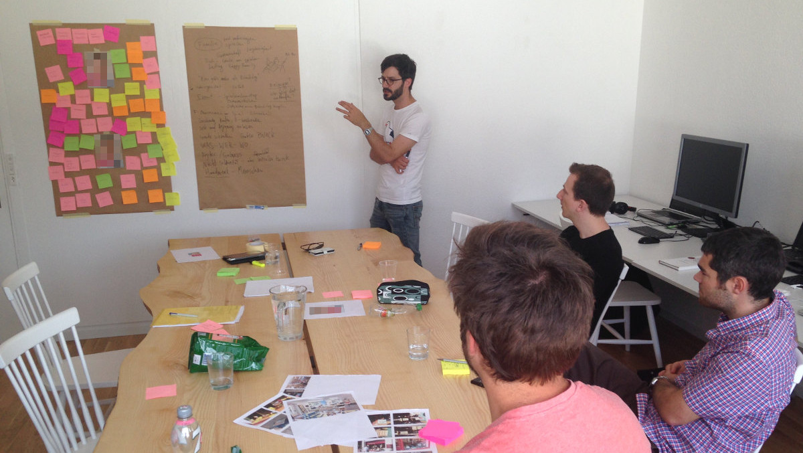
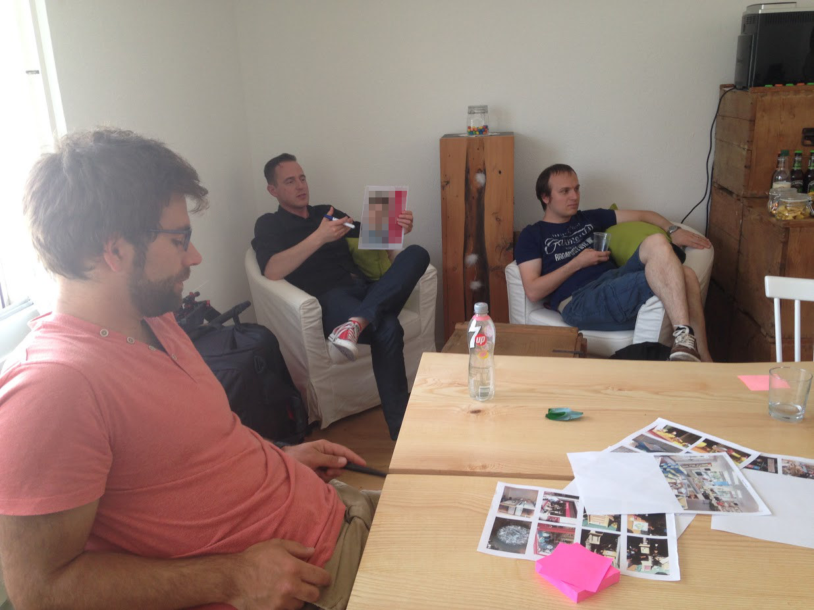
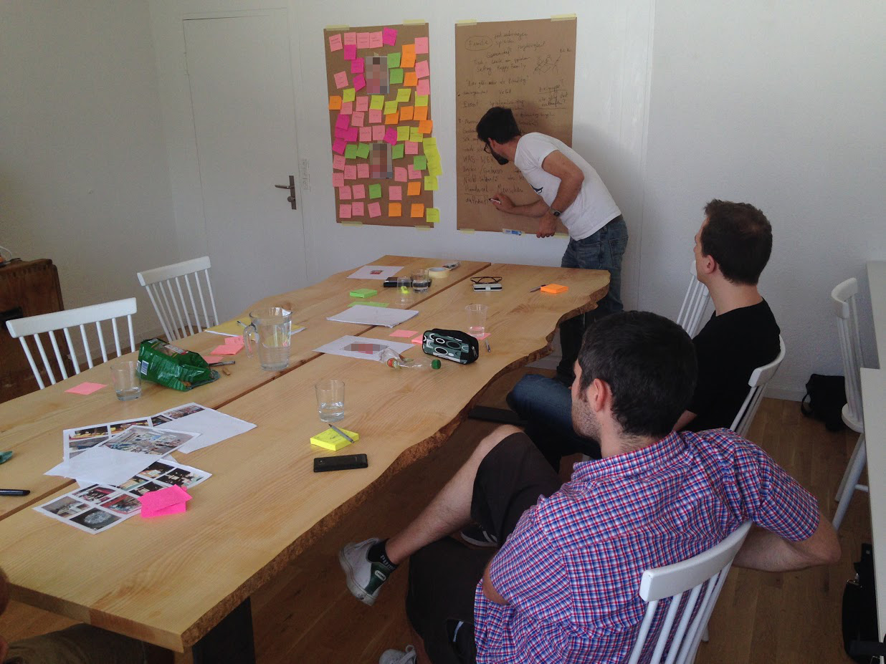

+++
title = "Brainstorming im ZeitRaum"
date = "2015-06-14"
description = "Um ein mehrjähriges Konzept für die Gestaltung einer Weihnachts- und Osterwerbung zu entwickeln, lud Matthias Leutwyler vergangene Woche alle Interessierten zu einem Brainstorming ein."
image = "brainstorming.jpg"
authors = [ "Adrian Däpp" ]
comments = true
tags = [ "Community" ]
+++

Um ein mehrjähriges Konzept für die Gestaltung einer Weihnachts- und Osterwerbung zu entwickeln, lud [Matthias Leutwyler](http://www.mattiasleutwyler.ch) vergangene Woche alle Interessierten zu einem Brainstorming ein. Unsere Community folgte dem Aufruf und so fanden sich sieben Leute im ZeitRaum, um gemeinsam Ideen zu sammeln.

Nachdem die Aufgabenstellung erläutert und der Auftraggeber vorgestellt wurde, tauchten wir In einer ersten Phase in die Bedeutung der Feiertage ein. Dabei schrieben wir alle Assoziationen dazu nieder und klebten sie für alle sichtbar auf. Diese Situationsanalyse ermöglichte uns, ein Verständnis für die Situation und die Anforderungen des Auftraggebers zu entwickeln. Bei der anschliessenden Lösungsentwicklung konnten deshalb Ideen aus einem breiten Kontext einbezogen werden. Dabei inspirierten wir uns gegenseitig und durch Kombinieren und Aufgreifen von bereits geäusserten Ideen entstanden wiederum neue.

Obwohl ich der einzige mit Erfahrung im Bereich Entwicklung von Marketingkonzepten war, entstanden dank unterschiedlicher Fachkompetenzen und Fähigkeiten innert kurzer Zeit gute Lösungsansätze. Ich bin überzeugt, dass genau diese Vielfalt eine so produktive und erfindungsreiche Atmosphäre hat entstehen lassen.

Das ganze Brainstorming fand im Rahmen unserer Initiative «Faktor 10» statt. Die Idee ist, dass wir 10% unserer Zeit ineinander investieren. Dieses Brainstorming war ein geniales «Faktor 10»-Projekt und die Rückmeldung von Matthias zu dieser Runde bestätigt uns: "Sehr wertvoll! Danke danke, und war auch sonst einfach inspirierend da zu sein, ihr seid super!"