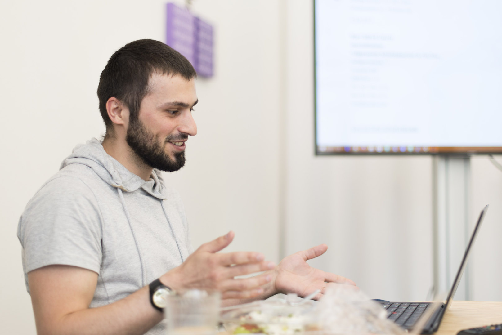

+++
title = "Brownbag: Inspirierender Austausch am Mittagstisch"
date = "2018-02-13"
description = "Als wäre der (all)tägliche Austausch im Effinger nicht schon genug anregend, gibt es seit Mitte letzen Jahres zusätzlich die Brownbags. Das sind stündige Happenings, bei denen sich Coworker und Interessierte treffen und zu einem im Voraus angekündeten Thema austauschen."
image = "brownbag_01.jpg"
author = "Manuel Bürli"
comments = true
tags = [ "Coworking" ]
+++

Als wäre der (all)tägliche Austausch im Effinger nicht schon genug anregend, gibt es seit Mitte letzen Jahres zusätzlich die Brownbags. Das sind stündige Happenings, bei denen sich Coworker und Interessierte treffen und zu einem im Voraus angekündeten Thema austauschen.

‚Wie vermarkte ich mich selber’, ‚Wie funktioniert Politwerbung‘ oder ‚Was ist ein Static Site Generator‘ – alles Themen zu denen in den vergangenen Monaten im Effinger ein Brownbag statt gefunden hat. Während die Teilnehmer ihr z’Mittag zu sich nehmen, hält eine Person zu einem bestimmten Thema einen Input. Anschliessend wird darüber diskutiert. Das gemeinsame Essen sorgt für eine lockere Atmosphäre, was gute Fragen hervorbringt.

Im Effinger geht viel ‚Know-How‘ ein und aus. Der Brownbag bietet die Möglichkeit Wissen weiterzugeben und andere daran teilhaben zu lassen. Dabei kommen oft auch unerwartete Themen und spannendes Hintergrundwissen zum Vorschein. Der Wert des Erfahrungsaustausches und die Verknüpfung von Themen und Menschen ist unbezahlbar.

## Wann findet der nächste Brownbag statt?

Das Programm wird auf der [Brownbag Website](https://www.effinger.ch/brownbag/) publiziert. Für [Community Mitglieder](https://www.effinger.ch/community/member-werden/) gibt es zusätzlich die Möglichkeit per Effinger Slack App im Channel #brownbag Infos zu erhalten. Die Brownbags finden mindestens einmal im Monat im ersten Obergeschoss des Effinger von 12 – 13 Uhr statt. Das Mittagessen bringt jeder selber mit. Eine Anmeldung ist erwünscht, aber nicht zwingend.

## Programm

Zum [Brownbag Programm](https://www.effinger.ch/brownbag/)

## Thema verpasst?

Neu gibts Videomittschnitte: Siehe [YouTube Playlist](https://www.youtube.com/channel/UCgGnRHU6W3577Ond0pN18rw/playlists)

## Wie alles begann

[Artikel über den Anfang der Brownbags im Effinger](https://herrbuerli.ch/community/brownbag/)

## Kontakt & Fragen 

Per Mail an [manuel@effinger.ch](mailto:manuel@effinger.ch)

*Manuel Bürli*
