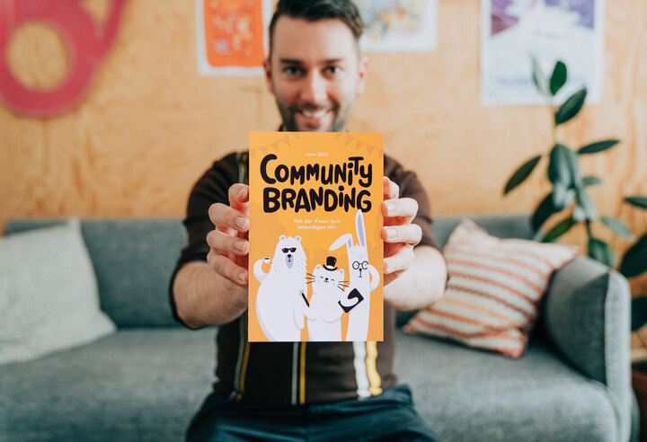

+++
title = "Das neue Community-Buch aus dem Effinger zu Selbstorganisation"
date = "2025-03-10"
draft = false
tags = [ "Community" ]
image = "herr_buerli_2024_19_720.jpg"
description = "Wie gestalten wir lebendige Communities, die Arbeit, Bildung und Wohnen neu denken? Ein neues Buch vom unserem Effianer Herr Bürli geht dieser Frage nach und macht Lust auf mehr Gemeinsamständigkeit."
authors = [ "Stefan Niederhauser"]
comments = false
+++

Wie gestalten wir lebendige Communities, die Arbeit, Bildung und Wohnen neu denken? Ein neues Buch vom unserem Effianer Herr Bürli geht dieser Frage nach und macht Lust auf mehr Gemeinsamständigkeit.

Als Herr Bürli vor einigen Jahren in den Effinger kam, suchte er eigentlich nur einen Platz zum Arbeiten. Was er fand, war eine bunte und inspirierende Community. Der Coworking Space mitten in Bern wurde nicht nur sein berufliches Zuhause, sondern auch der Ausgangspunkt für sein Buchprojekt – Community-Branding!

Im Buch nimmt er uns auf einem Spaziergang durch Bern mit und schaut bei Communities wie dem Effinger rein. Er geht der Frage nach, wie Selbstorganisation, Kollaboration und Gemeinwohl gelingen können. Dabei stösst er auf neue Wirtschaftsformen wie der Gemeinsamständigkeit, neuen Lernformen wie dem Colearning und Wohnbauinitiativen wie Urbane Dörfer. 

Das Buch macht Lust auf mehr community-basierte Initiativen. Es liefert Denkanstösse auf die grossen Fragen, die uns als Gesellschaft beschäftigen: Polarisierung, Konsum, Klimakrise, Entfremdung. Dabei macht es deutlich, dass wir unsere Zukunft gestalten können, wenn wir dies gemeinsam tun.

## Buch Online bestellen

<a class="btn btn-primary" href="https://communitybranding.ch/" target="_blank">communitybranding.ch</a>

## Weitere Links
- [Herr Bürli geht auf Buchtour](https://communitybranding.ch/anlaesse/)
- [Brownbag-Video](https://brownbag.effinger.ch/community-branding-von-der-vision-zum-lebendigen-wir)

## Autor

Herr Bürli gehört quasi zum [Effinger-Inventar](/community/#effianer). Als Teil der Effinger-Community tüftelt er hier an Marken, co-kreativen Prozessen und der Frage, was eine Community lebendig und resilient hält.