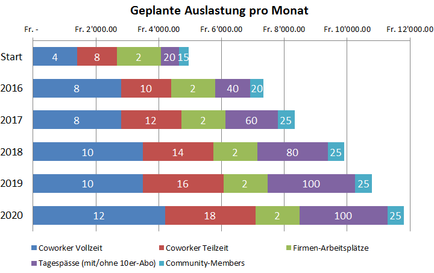
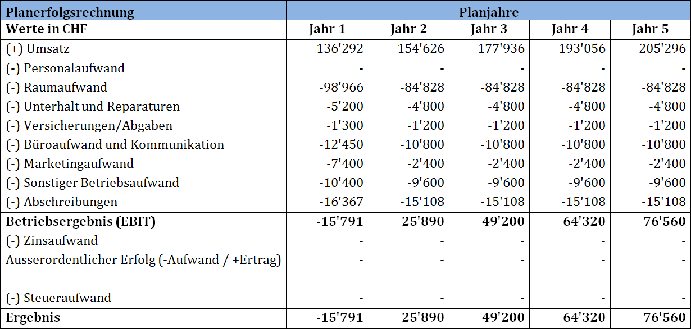
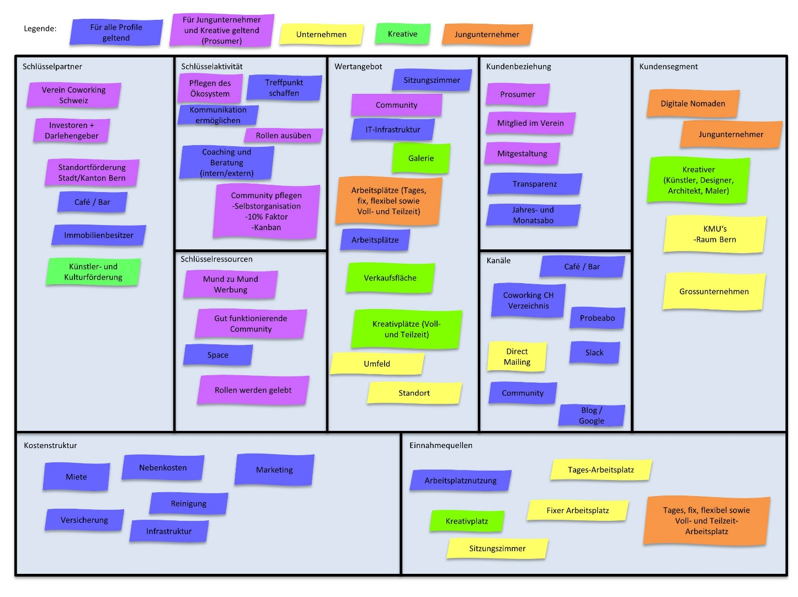

+++
title = "Wie viel kostet das? – Unser Businessplan"
date = "2015-11-12"
description = "«Wie viel kostet das?» Genau mit dieser Frage hat sich die Community ausgiebig beschäftigt. Dies wollen wir hier mit unserem Businessplan transparent offen legen."
image = "geplante-auslastung.png"
author = "Christoph Höschele"
comments = true
tags = [ "Coworking", "Finanzen" ]
+++

«Wie viel kostet das?» Genau mit dieser Frage hat sich die Community schon vor einiger Zeit ausgiebig beschäftigt.

Zum einen haben wir für den Effinger eine Produktepalette erstellt, welche möglichst auf die unterschiedlichen Bedürfnisse unserer Coworker zugeschnitten ist, zum andern haben wir uns natürlich auch um Investitionskosten und schlau klingende Sachen wie Cash-Flow, Business Model Canvas und Break-even gekümmert.

Und genau dies wollen wir hier transparent offen legen.

## Angebot

### Community Membership

Wir betonen immer wieder, dass unser zentrales Element die Menschen und unsere Beziehungen zueinander sind. Das ist das, was wir unsere *Effinger Community* nennen.

Jede Person, welche sich mit uns und unseren Grundsätzen identifiziert oder uns einfach unterstützen möchte, darf Teil dieser Community sein. Dies ist möglich, auch wenn du keinen Arbeitsplatz bei uns hast. Dazu haben wir die *Community Membership* eingeführt.

  

    

      
<h4 class="panel-title">Community Membership</h4>

      

        
Du erhältst Zugang zum <b>Effinger-Slack</b> (Online Chatraum und Forum). Hier erfährst du alles, was gerade läuft, kannst Fragen stellen, dich inspirieren lassen, Ideen teilen, tolle Leute treffen und direkt mit ihnen Kontakt aufnehmen (<a href="/blog/slack/">mehr Infos zu Slack</a>).

        
Du wirst eingeladen, als Member an Events zu kommen.

        
Im Effinger wird dir ein Member-Kaffee pro Monat offeriert.

        
Anders gesagt: Du bist Teil der "Effinger Community", bist jederzeit willkommen und erhältst ein Stück Heimat im Effinger.

        
<strong style="color:#333">CHF 25.- pro Monat oder CHF 250.- pro Jahr</strong>

      

    

  

&rarr; Wenn du *Community Member* werden möchtest, schreibe ein Mail an [christoph@effinger.ch](mailto:christoph@effinger.ch).

### Coworking

Für spontane und unverbindliche Coworker bieten wir *Tagespässe* und *10er-Abos* an. Wer regelmässig bei uns arbeiten oder sogar einen fixen Arbeitsplatz einrichten möchte, kann ein *Teilzeit- oder Vollzeit-Abo* lösen.

<table class="table table-bordered table-hover">
  <thead>
    <tr style="background-color: #f5f5f5">
      <th style="background-color: white; border-top: 1px solid white; border-left: 1px solid white; border-bottom: 1px solid #ddd"></th>
      <th><h4 style="margin: 0; font-size: 18px;">Tagespass</h4></th>
      <th><h4 style="margin: 0; font-size: 18px; white-space:nowrap;">10er-Abo</h4></th>
      <th><h4 style="margin: 0; font-size: 18px;">Teilzeit\*</h4></th>
      <th><h4 style="margin: 0; font-size: 18px;">Vollzeit\*</h4></th>
    </tr>
  </thead>
  <tbody>
    <tr>
      <th scope="row">Tage</th>
      <td>1 Tag</td>
      <td>10 Tage</td>
      <td>2 Tage pro Woche</td>
      <td>5 Tage pro Woche</td>
    </tr>
    <tr>
      <th scope="row">Arbeitsplatz</th>
      <td>Tisch</td>
      <td>Tisch</td>
      <td>Tisch oder Atelierplatz</td>
      <td>Tisch oder Atelierplatz</td>
    </tr>
    <tr>
      <th scope="row">Zugang</th>
      <td nowrap>Mo-Sa 7.00-17.00 Uhr</td>
      <td nowrap>Mo-Sa 7.00-17.00 Uhr</td>
      <td nowrap>Mo-Sa 7.00-23.00 Uhr</td>
      <td nowrap>Mo-Sa 7.00-23.00 Uhr</td>
    </tr>
    <tr>
      <th scope="row">WLAN / Drucker</th>
      <td>Ja</td>
      <td>Ja</td>
      <td>Ja</td>
      <td>Ja</td>
    </tr>
    <tr>
      <th scope="row">Bester Kaffee oder Tee</th>
      <td>1 pro Tag</td>
      <td>1 pro Tag</td>
      <td>2 pro Tag</td>
      <td>2 pro Tag</td>
    </tr>
    <tr>
      <th scope="row">Workshop-Räume</th>
      <td></td>
      <td></td>
      <td>Fair use</td>
      <td>Fair use</td>
    </tr>
    <tr>
      <th scope="row">Community Membership</th>
      <td></td>
      <td></td>
      <td>Inklusive</td>
      <td>Inklusive</td>
    </tr>
    <tr class="warning">
      <th scope="row">Preis</th>
      <td><strong>CHF 30</strong></td>
      <td><strong>CHF 270</strong></td>
      <td><strong>CHF 160 pro Monat</strong></td>
      <td><strong>CHF 350 pro Monat</strong></td>
    </tr>
  </tbody>
</table>

\* **Teilzeit/Vollzeit**: Damit wirst du Teil der Community und leistest einen finanziellen Beitrag, bist aber auch bereit einen Teil deiner wertvollen Zeit der Community zur Verfügung zu stellen. So wollen wir unsere Community und unsere Gemeinnützigkeit stärken und können zudem unsere Kosten im Zaum halten.

**Extras**

* **Versicherung**: Die Monatsabos beinhalten eine Sachversicherung
* **Schliessfächer**: CHF 25 pro Monat
* **Fixer Arbeitsplatz**: CHF 100 pro Monat (inkl. Schliessfach)

### Firmen-Arbeitsplatz

Wir bieten Firmen die Möglichkeiten, flexible Arbeitsplätze in einer kreativen und innovativen Umgebung zu mieten. Diese Arbeitsplätze sind übertragbar, können also von unterschiedlichen Mitarbeitern verwendet werden. Ein Firmen-Arbeitsplatz kostet CHF&nbsp;700.- pro Monat.

### Workshop-Räume

Workshop-Räume werden extern vermietet. Der Preis liegt bei ca. CHF 45.- für eine Stunde bis ca. CHF 150.- für einen halben Tag. Zusätzlich bestehen Catering-Möglichkeiten von der Kaffeebar (Früchtekorb, Gipfeli, Getränke, etc.).

### Atelier

Neben den klassischen Bürotisch-Arbeitsplätzen bieten wir in einem Atelier Raum für Kreative und Handwerker. Die Preise sind gleich wie beim Coworking. Falls du dich für das Atelier interessierst, melde dich am besten bei [graziella@effinger.ch](mailto:graziella@effinger.ch).

## Finanzbedarf

Der Space finanziert sich durch die Arbeits- und Kreativplatzmieten sowie die Einnahmen der Tagesgäste und weiteren Kunden. Der Investitionsbedarf beläuft sich auf CHF 140'000.-. Die Coworker beteiligen sich selbst mit rund CHF 40'000 zinslosen Darlehen.

## Geplante Auslastung

Wir planen bei der Eröffnung mit einem Kern von zwölf Voll- oder Teilzeit Coworkern (inkl. Atelier) zu starten. Aktuell sind bereits zehn Plätze verbindlich besetzt und für die zwei heissbegehrten aber noch offenen Plätze laufen Abklärungen. Aber keine Angst, daneben haben wir reichlich Platz für Tagesgäste und Coworker mit 10er-Abos. Ausserdem werden wir nach der Startphase weitere Voll- und Teilzeitplätze vergeben. Bis im Jahr 2020 streben wir 30 Coworker und eine stabile Auslastung des Spaces durch externe Firmen, 10er-Abos und Tagesgäste an.

Die folgende Grafik zeigt die durchschnittlich geplante Auslastung des Effingers pro Monat:

## Planerfolgsrechnung

Wenn du genau so zahlenaffin bist wie wir, kannst du dir diese Tabelle gerne antun. Ansonsten darfst du das Kapitel natürlich auch überspringen.

Die Planerfolgsrechnung für 2016 bis 2020 geht bei einer realistisch gerechneten Anzahl von Coworkern von einem leichten Verlust von CHF 15'791.- im ersten Jahr aus. Der Aufwand im ersten Jahr ist erheblich höher, da z.B. Marketingkosten anfallen und 14 Monatsmieten geleistet werden müssen. Bereits im 2. Jahr (2017) soll der Break-Even Punkt erreicht werden und im 5. Jahr sollte ein Gewinn von CHF 76'560.- resultieren.

Da wir als gemeinnütziger Verein fungieren und mit dem Effinger nicht aufs grosse/schnelle Geld aus sind, wird es bei uns nie einen solchen Jahresgewinn geben. Stattdessen werden wir mit zukünftigen Überschüssen Start-Ups unterstützen, Arbeitsplätze sponsern, Coaches finanzieren, öffentliche Events durchführen und allenfalls die Preise senken. Dies immer mit dem Gedanken zur Förderung und Unterstützung eines gut funktionierenden Ökosystems für Jungunternehmer.

Klingt fast zu gut um wahr zu sein? Stimmt! Auch wir sind alle sehr gespannt, wie wir in 3-5 Jahren auf diese Zahlen zurückblicken werden. 

## Business Modell Canvas

Der Business Canvas enthält zurzeit die drei Kundensegmente Jungunternehmer, Kreative und Unternehmen. Diesen haben wir aufgestellt, um uns selbst, aber auch unser Umfeld besser zu verstehen und möglichst verständlich visualisieren zu können.  Ja ich weiss, daran könnten wir noch arbeiten. Hilfst du uns?  

## Chancen und Risiken

Nebst dem Aufbau eines gut funktionierenden Ökosystems und dessen Community für Jungunternehmer liegen die Chancen vor allem im zukunftsorientierten Arbeitsethos und den definierten [Werten](/blog/grundsaetze/), welche aktiv gelebt werden sollen. Zudem ist der gefundene Standort an der Effingerstrasse 10 die perfekte Location für einen Coworking Space gepaart mit einer Kaffeebar.

Das Risiko betreffend der Lokalität sind aktuell vor allem Einsprachen beim Baugesuch. 

Als finanzielle Risiken werden die Kündigung der Immobilie und fehlende Kundschaft im Space erachtet. Zudem könnten Differenzen in der Community sowie beim Entscheidungsprozess entstehen. Auch das Nicht-Umsetzen der beschriebenen Werte, sowie hohe Fluktuationen sind Risiken, mit welchen die Community in Zukunft konfrontiert werden könnte.

Da wir nicht nur auf unser Glück zählen wollen, haben wir als Community entsprechende Massnahmen getroffen, um die Risiken mit entsprechenden Strukturen so weit als möglich zu senken. 

## Endlich fertig

Nach vielen weiteren Berechnungen, Analysen und Diskussionen in Form eines Businessplans wollen wir das Unterfangen mit gleichem Elan vorantreiben und realisieren.

Die Community setzt damit die Vision einer «Heimat für Jungunternehmer, Kreative und andere Weltveränderer» in die Tat um.

Unter folgendem Link kannst du den gesamten Businessplan der Effinger Coworking Community herunterladen.

<a href="https://github.com/makery/effinger.ch/releases/download/v2.0/businessplan-effinger-coworking-v2.2-2015-12-21.pdf" class="btn btn-warning"><i class="fa fa-download"></i>  Businessplan herunterladen</a>

Wir veröffentlichen den Businessplan unter der [Creative Commons Namensnennung Lizenz](http://creativecommons.org/licenses/by/4.0/), was heisst, dass du ihn für dich verwenden darfst unter der einzigen Bedingung, dass du unseren Namen nennst. Falls dir dieser Businessplan für dein eigenes Projekt geholfen hat, freuen wir uns natürlich, von dir zu hören.

Bei Fragen kannst du gerne unten Kommentare hinterlassen oder ein Mail schreiben an [christoph@effinger.ch](mailto:christoph@effinger.ch).
