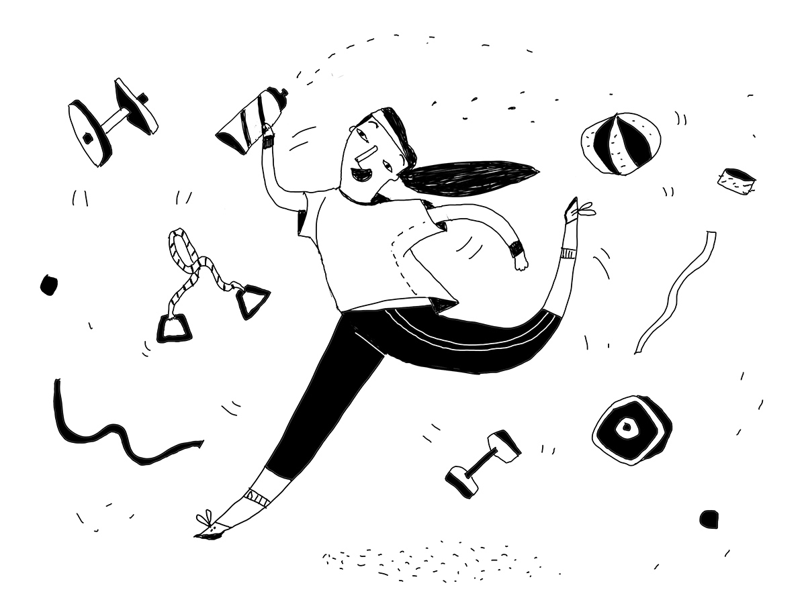

+++
title = "Co-Strampling: Das neue Sportabi-Angebot im Test"
date = "2017-10-28"
description = "Seit einigen Wochen läuft bei uns probeweise ein übertragbares Sportabi."
image = "effinger-fitness.jpg"
authors = [ "Claudine Etter" ]
comments = true
tags = [ "Coworking" ]
+++

Also ich muss ja mal sagen, das ist mal wieder eine tolle Idee, merci Marco!

Seit einigen Wochen läuft bei uns probeweise ein [übertragbares Sportabi für Effianer](/coworking/#preise).

Da hat man ja mit dem eingemieteten Firmenplatz eigentlich hier schon alles - tolle Leute, einen schönen, hellen Arbeitsplatz, ein gutes Netzwerk, gemeinsame Kafi- und Mittagspausen, Kopierer, Drucker, Versicherung, super Internet, eine wöchentliche Putzequipe UND JETZT AUCH NOCH DAS:

> Inklusive, wenn man „Effianer“ ist, gibt es nun das Strampel-Abi, ausgestellt vom [Fitness-Center](http://www.fitness-plus.ch/) direkt nebenan.

So nah, dass man angeblich in unserem Kellerabteil sogar den lockenden Spa- und Wellnessduft riechen kann. Ehrlich. Inklusive wäre demnach nicht nur das Strampeln, Gewichtheben und Aufderstelle-Rennen, sondern eben auch Wellnessangebote wie Massage, Sauna, Solarium und ein Ruheraum. Wer lieber in der Gruppe sportlich ist, für den gibt es zahlreiche Group-Fitness-Angebote.

Mittlerweile haben schon einige von uns die Sportpause in ihren Arbeitsalltag integriert und wir drücken die Daumen, dass das so bleibt - denn dann bleibt dieses Angebot auch weiterhin bestehen.

*Claudine Etter*
