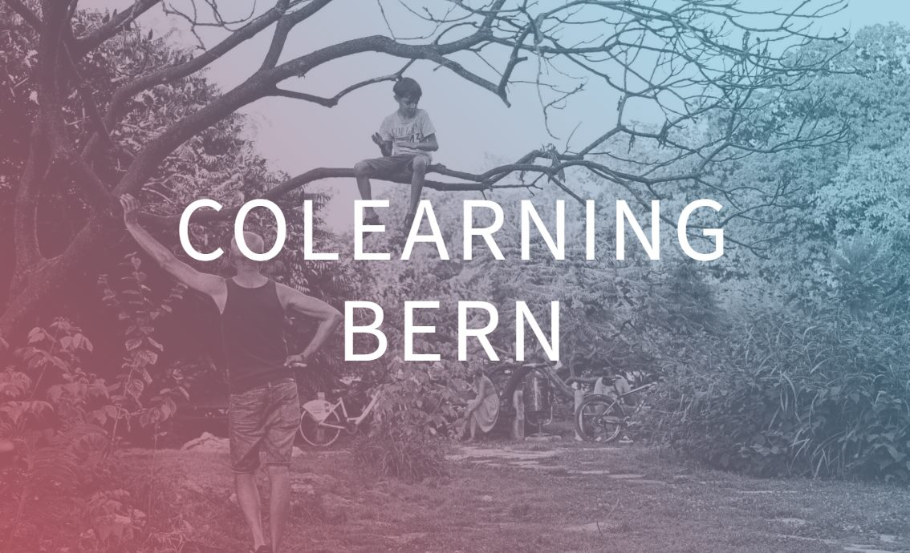
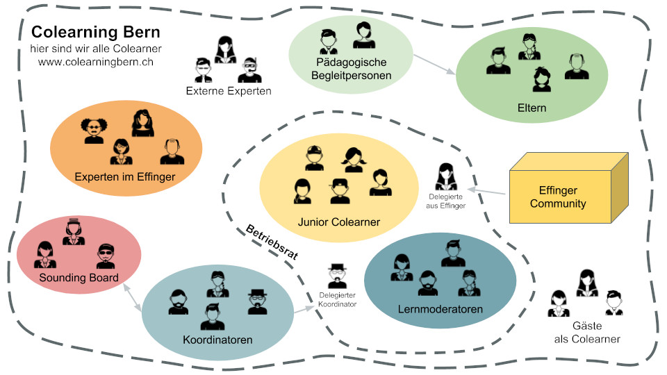

+++
title = "Colearning - die Oberstufe im Effinger"
date = "2019-04-15"
description = "Jugendliche ziehen im Effinger ein. Anstatt in der Schule, lernen Jugendliche im Coworking Space. Damit rückt die Welt der Jugendlichen näher zur Welt der Erwachsenen und das Lernen findet direkt im Leben und mitten in der Gesellschaft statt."
image = "colearning-bern.jpg"
author = "Marco Jakob"
comments = false
tags = [ "Colearning" ]
+++

Bildung und Vielfalt der Generationen sind wichtige Themen im Effinger. Mit Colearning Bern schaffen wir einen Ort, wo Jugendliche in der Mitte der Gesellschaft lernen können.

Ab August 2019 werden Jugendliche im Effinger einziehen. Anstatt eine herkömmliche Oberstufe zu besuchen, lernen sie im Effinger, zu Hause und an anderen Lernorten. Lernen soll vor möglichst nah am Leben geschehen.

> "Leben bildet. Manchmal auch Schule."

Wir schaffen zusammen mit den Jugendlichen ein lebendiges Lernumfeld und helfen mit, ihre Aktivitäten zu planen. Die Jugendlichen werden selber viel Verantwortung übernehmen für ihr Lernen. 

## Neue Arbeitsformen ermöglichen neue Lernformen

Durch die Digitalisierung ist ortsunabhängiges Arbeiten heute in vielen Berufen möglich. So sind Coworking Spaces entstanden, in denen eine sehr grosse Anzahl von unterschiedlichsten Berufen an einem Ort zusammen kommen.

Orte, wo Arbeit in dieser Vielfalt erlebt werden kann, hat es seit der Industrialisierung kaum gegeben. Die längste Zeit der Menschheitsgeschichte haben Kinder gelernt durch Beobachten und Nachmachen. Natürlich ist die meiste Arbeit heute abstrakter als das Jagen von Tieren oder das Sammeln von Beeren. Wir machen es Kindern aber auch nicht einfacher, wenn wir sie komplett von der Erwachsenenwelt abschirmen.

Wir sind überzeugt, dass ein Coworking Space wie der Effinger ein ideales Ökosystem ist für Jungendliche, um Beziehungen aufzubauen zu Erwachsenen und sie bei der Arbeit zu beobachten. Dies inspiriert und motiviert, selbst aktiv zu werden und so viel wie möglich zu lernen.

## Jeden Tag Zukunftstag

Die Berufswahl ist anspruchsvoller denn je. Wer weiss schon, wie der Alltag eines Interaction Designers, einer Mediamatikerin oder eines Data Analysts aussieht. Das können sich meistens weder die Eltern noch die Lehrpersonen vorstellen, geschweige denn die Kinder.

Was ein Lokführer tut, kann man sich dank dem Kinderbuch noch ausmalen. Leider gehören solche Berufe genau zu denen, die durch die Digitalisierung am stärksten verändert werden oder vielleicht ganz verschwinden. Man rechnet damit, dass in fünfzehn Jahren mehr als die Hälfte der Kinder einen Beruf lernen werden, den es heute noch gar nicht gibt (gemäss [Markus K. Reif](https://www.eco.de/presse/in-welchen-jobs-arbeiten-wir-2035/)).

Wenn die Kinder Glück haben, können sie das Mami oder den Papi am Zukunftstag zur Arbeit begleiten. Dann gilt aber meist ein Spezialprogramm, geschmückt mit Ballonen - also auch kein wirklicher Einblick in den Arbeitsalltag.

Eine mögliche Lösung ist, die Welt der Erwachsenen und die Welt der Kinder wieder näher zusammen zu bringen. Genau dies versuchen wir mit dem Colearning im Effinger.

> "Bei uns ist jeden Tag Zukunftstag."

Jugendliche können also während mehreren Jahren in duzende Jobs reinschnuppern und erleben die Erwachsenen während der Arbeit und in all ihren Emotionen: wie gehen sie mit Erfolg und Misserfolg um, wie mit Finanzen, wie verhalten sie sich in Veränderungen oder in Beziehungen mit anderen Erwachsenen.

Das Schnuppern ist gegenseitig: Die Erwachsenen erleben auch die Jugendlichen und sehen, in welchen Bereichen jemand Freude oder Talent zeigt. So kann schliesslich die erweiterte Community dafür sorgen, dass die Jugendlichen ihren idealen Ort für den Berufseinstig finden.

> "Wenn es ein ganzes Dorf braucht, um ein Kind aufzuziehen, dann sollte sich dies auch in der Art unserer Bildung widerspiegeln."

## Wie geht das?

Bei uns gibt es weder Lehrpersonen noch Unterricht. Es beteiligen sich ganz viele am Ökosystem des Lernens - eben fast ein ganzes Dorf.

  Das Ökosystem von Colearning Bern im Effinger 

Im Zentrum stehen die Jugendlichen, genannt "Junior Colearner". Sie nutzen an vier Vormittagen den Effinger als ihren Lernort. Während dieser Zeit steht ein/e Lernmoderator/in zur Verfügung und begleitet sie im selbstgesteuerten Lernen.

Nach einem gemeinsamen Start widmen sich die Colearner eigenen (Lern-)projekten oder begleiten einen Experten bei der Arbeit. Manchmal wird ein Colearner auch konkret bei der Arbeit mithelfen können oder eine Expertin nimmt sich speziell Zeit, um etwas aus ihrem Fachgebiet zu zeigen. 

Auch die Eltern haben eine wichtige Aufgabe. Sie sind gegenüber dem Kanton verantwortlich, dass der Lehrplan eingehalten wird. Dafür beobachten sie die Lernprozesse ihres Kindes im Colearning und zu Hause. Sie brauchen eine [Bewilligung für den Privatunterricht](https://www.erz.be.ch/erz/de/index/kindergarten_volksschule/kindergarten_volksschule/informationen_fuereltern/private_schulung.html) und werden unterstützt von den pädagogischen Begleitpersonen. Regelmässig wird mit der Lernstandserfassung von [Mirroco](https://www.mirroco.ch/) das Lernen reflektiert und für alle Beteiligten sichtbar gemacht.

Die Koordinator/innen behalten die längerfristige Ausrichtung im Blick und schaffen zusammen mit den Lernmoderator/innen ein sicheres Umfeld.

## Auf Augenhöhe

Auch wir Erwachsene verstehen uns als Colearner. So begegnen wir einander auf Augenhöhe und gehen gemeinsam und neugierig auf die Entdeckungsreisen des Lernens.

Obwohl wir überzeugt sind, dass wir ein stabiles Grundgerüst haben, lassen wir ganz bewusst viele konkrete Fragen offen. Das Colearning soll ein formbarer Ort sein, den vor allem die Colearner durch demokratische Mitbestimmung prägen können. Dabei werden hoffentlich viele Probleme auftreten, die es zu lösen gibt. Denn kreative Lösungen zu entwickeln, trauen wir ganz besonders den Jugendlichen zu.

## Sei dabei

Wir freuen uns sehr über die Bereicherung durch die nächste Generation, welche mit den Jugendlichen im Effinger Einzug hält. Während Erwachsene in einem Schulzimmer eher auffallen, ist es in einem Coworking Space kein Problem, dabei zu sein. Eltern, Experten, pädagogische Begleiter und auch Schulinspektoren sind herzlich eingeladen, ab Sommer im Colearning vorbei zu schauen, etwas zu trinken in der Kaffeebar oder als Coworker einen Tag neben den Junior Colearnern zu arbeiten.

## 5 Jugendliche und mehr?

Ab Sommer 2019 können wir Plätze anbieten für 5 Junior Colearner im Effinger. Interessierte Jugendliche können sich (und ihre Eltern) für einen Schnuppertag Anfang Juni anmelden über die [Website von Colearning Bern](https://www.colearningbern.ch/). Auf dieser Seite findet man auch das ausführliche Konzept und Kontaktangaben für Fragen. 

Uns ist bewusst, dass die 5 Plätze schnell vergeben sind. Wir sind überhaupt nicht die erste oder einzige Initiative für neue Bildungsformen. Wir schauen uns viel von anderen ab und möchten auch unseren Lernprozess als Colearning Bern wieder für andere [sichtbar machen](https://www.effinger.ch/grundsaetze/transparenz/). So können hoffentlich ganz viele weitere Lernorte von unseren Erfahrungen profitieren und mithelfen, etwas Schönes in der Bildung zu schaffen. Denn Bildung ist eine Aufgabe der ganzen Gesellschaft.

<a target="_blank" href="https://www.colearningbern.ch" class="btn btn-mod btn-border btn-round btn-medium">&rarr; colearningbern.ch</a>

_Marco Jakob, Mitinitiator zusammen mit Fredi Zumbrunn und Tom Bucher_