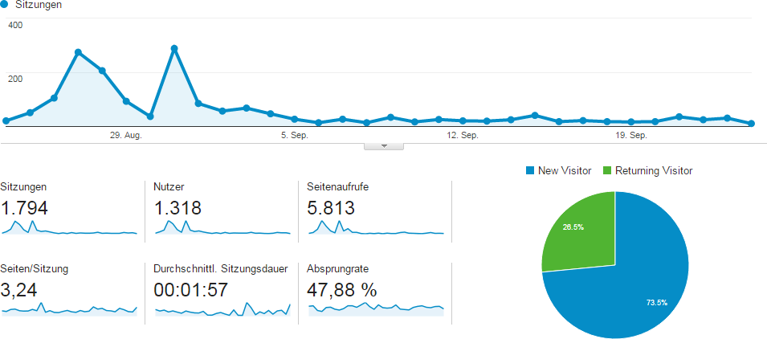
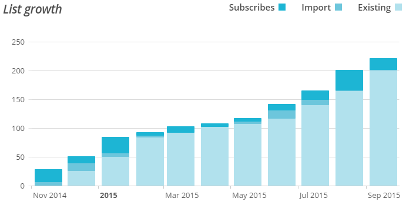

+++
title = "Die Community hinter dem Effinger"
date = "2015-09-24"
description = "Von Anfang an ging es uns darum, Menschen zusammenzubringen und eine Community aufzubauen. Deshalb haben wir uns aufgemacht, so viel Interessierte in den Aufbau zu involvieren, wie möglich."
image = "analytics.png"
authors = [ "Marco Jakob" ]
comments = true
tags = [ "Community" ]
+++

Von [Anfang an](/blog/how-the-heck/) ging es uns darum, Menschen zusammenzubringen und eine Community aufzubauen. Wir glauben daran, dass die guten Einfälle und Entscheidungen nicht von der Spitze einer hierarchischen Pyramide kommen. Deshalb haben wir uns aufgemacht, so viel Interessierte in den Aufbau zu involvieren, wie möglich.

## Schöne Dinge

Das grosse und offensichtliche Projekt ist der Aufbau der physischen Heimat vom Effinger, welche wir hoffentlich bald eröffnen können. Es geht aber um mehr, nämlich darum, eine Kultur zu fördern, in der **schöne Dinge möglich werden**, die vorher unmöglich schienen.

"Schöne Dinge" tönt recht allgemein, doch es geht um die Momente, wo sich etwas einfach schön und gut anfühlt: Lust und Freude an der Arbeit, ein Handwerk, das mit Leidenschaft ausgeübt wird, bei der Entstehung von Kunst dabei sein, die Gemeinschaft unter Freunden geniessen, eine verknortzte Beziehung klären, ein Funkeln in den Augen eines Kunden zu sehen, vom Kunden grosszügig bezahlt zu werden, auf etwas Unnötiges zu verzichten, die Schönheit der Natur geniessen, diese Schönheit zu erhalten und zu fördern, einen Menschen zu sehen, der wirklich sich selbst ist, usw.

  
[…] wir werden in eine Trennung hineingeboren und lernen, uns von unserem tieferen Wesen, von anderen Menschen und dem Leben um uns herum getrennt zu fühlen. Die Traditionen sagen uns, dass unsere tiefste Bestimmung im Leben darin besteht, unsere Ganzheit wiederzufinden, in uns und unserer Verbundenheit mit der äusseren Welt. Aussergewöhnliche Dinge werden möglich, wenn wir es wagen, unser ganzes Selbst in unserer Arbeit zum Ausdruck zu bringen. Jedes Mal, wenn wir einen Teil von uns zurücklassen, dann schneiden wir uns von einem Teil unseres Potenzials, unserer Kreativität und Energie ab.

  <footer>Frederic Laloux in <cite title="Reinventing Organizations, Deutsche Ausgabe, S. 144">Reinventing Organizations</cite></footer>

## Erweiterte Community

Rund um den Aufbau vom Effinger und um das Leben und Arbeiten nach solchen [Grundsätzen](/grundsaetze/) hat sich ein Netzwerk von Personen gebildet. Dieses Netzwerk nennen wir unsere **erweiterte Community**. Wie viele sich dazu zählen, wissen wir nicht.

Wir merken einfach, wie das Interesse da ist, entweder durch persönliche Kontakte, Mailanfragen, Anfragen von Medien und ein paar Statistiken.

### Besuche auf der Internetseite

Diese Grafik zeigt die Besucher auf [effinger.ch](/) im letzten Monat. Die erste Spitze ist die Veröffentlichung des [Bund Artikels](http://www.derbund.ch/bern/stadt/der-filmemacher-arbeitet-neben-dem-tshirtdesigner/story/27208890), die zweite das Erscheinen in [Ron Orp](http://www.ronorp.net/bern/inspiration/archiv/newsletter/6e14e48cbf0137fd874efd0952cc544b#content273838). Beides haben wir nicht selber initiiert.

### Newsletter und Social Media

Aktuell haben 222 Personen unseren [Newsletter](https://eepurl.com/bw3j3H) abonniert.

Weitere Kanäle, über die man Neuigkeiten erfahren kann sind [Facebook](https://www.facebook.com/effingerbern) und [Twitter](https://twitter.com/effingerbern). Im Moment gibt es natürlich nicht täglich etwas zu berichten. Es wird aber immer mehr werden.

## (Engere) Community

Zur engeren Community zählen wir alle, welche mit einer Rolle Verantwortung übernehmen. Zurzeit sind dies **elf Personen**. Nächste Woche werden am Community-Treffen wieder ca. drei Personen dazu kommen. Alle aktuellen Rollenträger mit den entsprechenden Rollen sind auf der [über uns Seite](/community/) aufgeführt (Update: im Moment sind die Rollen nicht mehr drauf).

## Als Mieter und Gastgeber von Anfang an dabei sein

Für den Betrieb des Coworking Spaces haben wir vor gut zwei Monaten einen Verein gegründet. Aufgenommen in den Verein werden alle, welche einen Arbeitsplatz im Monats-Abo mieten.

Ein Teilzeit-Abo (2 Tage pro Woche) kostet CHF 160.-, ein Vollzeit-Abo CHF 350.- im Monat. Das können wir recht günstig anbieten, da wir als Verein niemanden anstellen und nicht gewinnorientiert sind. Dafür wird von den Vereinsmitgliedern erwartet, dass sie ungefähr 9,424777 (oder 3π) Prozent ihrer Zeit in die Community, ineinander oder in den Betrieb des Spaces investieren. Sie sind sozusagen die Gastgeber vom Space.
Für den Start **limitieren wir diese Plätze auf 12 Personen**, damit wir eine stabile und zuverlässige Gruppe für den Betrieb haben. 10 Personen haben bereits zugesagt. Melde dich unbedingt bald, falls du von Anfang an dabei sein und mitprägen möchtest.

## Wow

Ich bin echt begeistert über all die positiven Reaktionen und die genialen Leute, die ihre Hilfe anbieten, mitmachen und sich engagieren. Und ich freue mich darauf, neben und mit euch zu arbeiten, am Mittag einen Salat mit euch zu essen oder bei Feierabend in den Erinnernungen an die herausfordernde aber schöne Aufbauzeit zu schwelgen.
