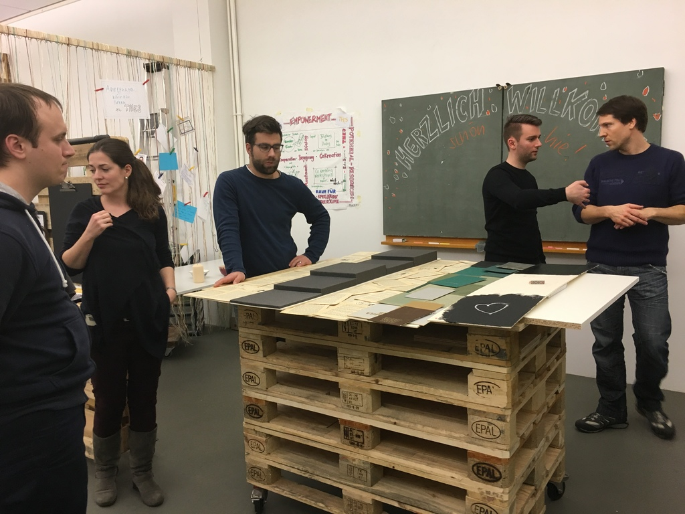

+++
title = "Community Treffen als «Dugnad»"
date = "2017-02-01"
description = "Im Januar hatten wir als Effinger-Community unser erstes Community-Treffen in diesem Jahr. Und gleich haben wir etwas Neues ausprobiert. Unser Community-Treffen hat als «dugnad» stattgefunden."
image = "community_januar_dugnad.jpg"
author = "Urs Vögeli"
comments = true
tags = [ "Community" ]
+++

Im Januar hatten wir als Effinger-Community unser erstes Community-Treffen in diesem Jahr. Und gleich haben wir etwas Neues ausprobiert. Unser Community-Treffen hat als «dugnad» stattgefunden.

Hanne aus Norwegen hat uns diese Form des Zusammentreffens nähergebracht. «dugnad» ist ein norwegischer Begriff und meint eine Form der Freiwilligenarbeit, die als Gemeinschaft verrichtet wird. Das Wort steht zudem grundsätzlich dafür, gemeinsam ganz praktisch für eine bessere Community zu arbeiten. Das passt sehr gut zu uns und soll unsere Treffen mehr dahin prägen, dass wir an diesem Abend konkret an Projekten arbeiten. Jeder ist willkommen, Projekte und Anliegen jeglicher Art mit Bezug zum Effinger in die Community zu bringen. Die Leute entscheiden dann, an welchen Projekten gearbeitet wird. Das Ziel ist, dass wir weniger Traktanden abarbeiten und weniger diskutieren, sondern gleich zum Handeln übergehen. Dieses erste Treffen war daher ein voller Erfolg! Es wurden beispielsweise Prototypen für das neue Bücherregal in der Lounge erstellt oder erste Interviews für unseren Blog durchgeführt.

Das Community-Treffen findet jeden Monat statt ([Community Treffen](/events/)). Effianer und Community-Member, sowie interessierte Gäste sind eingeladen, hier mit uns zusammen an einer immer besseren Effinger-Community zu arbeiten.
