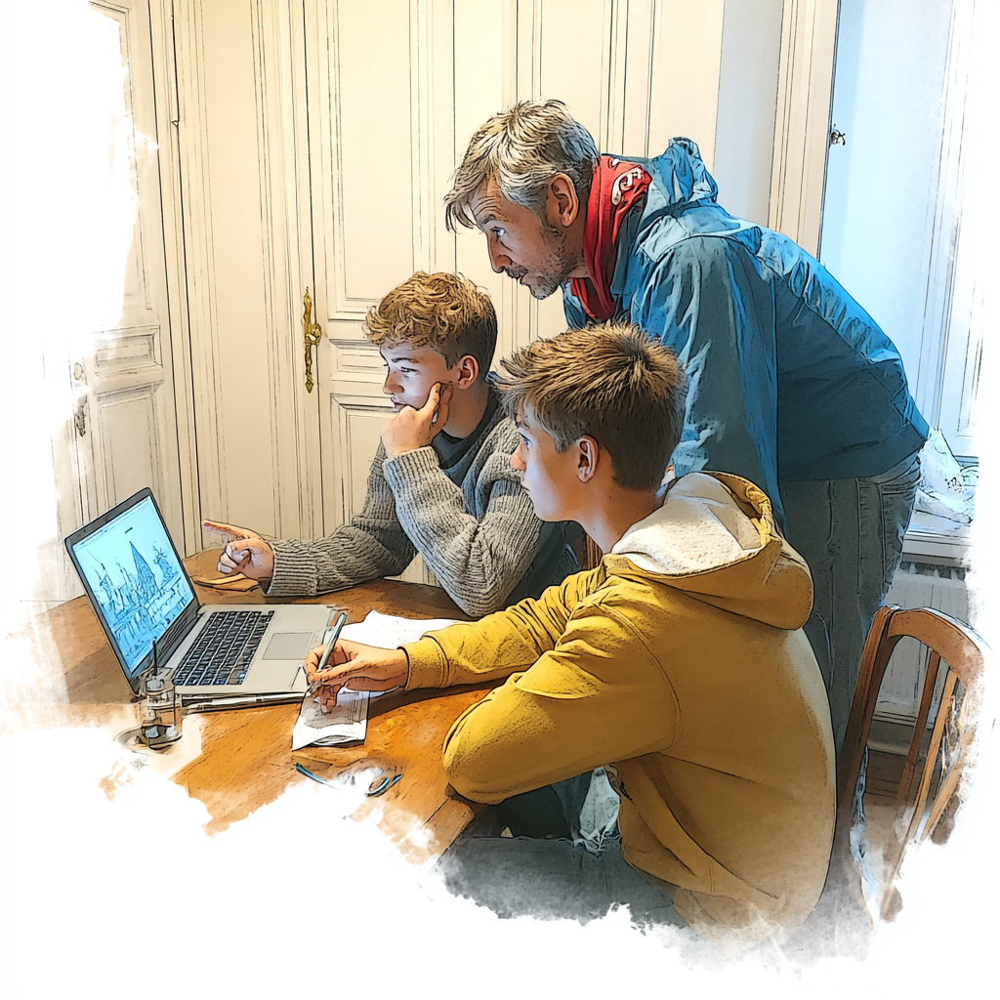

+++
title = "Coworking & Colearning Space Effinger (Teil 1)"
date = "2025-08-21"
description = "Dieser Blog gibt in drei Teilen Einblick in die Geschichte des Colearnings im Coworking Space Effinger."
image = "colearning1.png"
authors = [ "Fredi Zumbrunn" ]
comments = true
tags = [ "Colearning", "Coworking" ]
+++

Dieser Blog gibt in drei Teilen Einblick in die Geschichte des Colearnings im Coworking Space Effinger. Viel Vergnügen!

## Der Effinger - ein Lern- und Arbeitsort für Jugendliche und Erwachsene

Wer an einem gewöhnlichen Tag durch den Effinger spaziert, wird auf den ersten Blick keinen Unterschied erkennen: Menschen sitzen an Tischen, arbeiten an Laptops, diskutieren, trinken Kaffee. Coworker:innen eben – so scheint es. Und doch ist hier längst mehr im Gange. Denn zwischen all den Menschen, die im Effinger arbeiten, entwickeln, organisieren und vernetzen, befinden sich auch Lernende. Jugendliche wie Erwachsene. Sie arbeiten nicht in separaten Räumen, sondern mittendrin. Sie bringen eigene Fragen mit, eigene Themen, eigene Energie. Sie lernen – eigenständig, gemeinsam, begleitet, forschend. Und sie tun das nicht am Rand, sondern als Teil der Community.

Wenn wir die Arbeits- und die Lernwelt wirklich verbinden wollen, braucht es genau solche Orte. Orte, die durchlässig sind. In denen Lernen und Arbeiten nicht mehr als Gegensätze erscheinen, sondern als zwei Ausdrucksformen eines aktiven, selbstbestimmten Lebens.

Mit Colearning Bern ist im Effinger ein solcher Ort entstanden – und er entwickelt sich weiter.

Von Anfang an ging es uns nicht nur darum, neue Bildungskonzepte zu entwerfen oder über das Schulsystem zu diskutieren. Es ging – und geht – um etwas anderes: ein anderes Verständnis von Lernen zu leben. Nicht nur darüber zu reden. Nicht darauf zu warten, dass jemand erlaubt, genehmigt oder vorgibt, wie es gehen könnte. Sondern anzufangen. Räume zu schaffen. Menschen einzuladen. Strukturen zu lockern. Beziehungen zu ermöglichen.

Wir haben es einfach getan. Und: Wir tun es immer noch. Wir lernen noch.

Colearner Christoph Schmitt hat dazu eine wunderbare Dokumentation erstellt. Im Gespräch mit jugendlichen und erwachsenen Colearner:innen lotet er aus, was Colearning ausmacht, was Colearning will, welche Erfahrungen gemacht werden und wie sich diese Art von Lernen vom traditionellen Lernen (in Schulen) unterscheidet. Er schreibt dazu: 
"Was gibt's denn noch, wenn Schule immer weniger funktioniert – ausser Plan B? Richtig: C wie Colearning. Wir zeigen euch, was in der Schweiz möglich ist an Innovation, und zwar dort, wo sie händeringend gesucht wird: an den Schnittstellen von Lernen, Leben und Arbeiten."

[Schau rein! Colearning: Lernen, wie es dir und mir entspricht](https://www.youtube.com/watch?v=AL2oeRTsnYA&t=2571s)

Was wir auf unserem weiteren Weg alles erkundet, ausprobiert und umgesetzt, also gelernt haben, könnt ihr in zwei weiteren Folgen dieses Blogs lesen. 

Colearning lebt davon, Menschen aller Generationen in ihrem Lernen zu verbinden. So suchen wir immer wieder Erwachsene, die bereits Teil der Effinger Arbeits- und Lernwelt sind - oder es gerne werden möchten - und die sich gerne auch fürs Lernen engagieren würden. Sei das nun als Lernende:r mit einem Projekt, oder als Mentor:in oder Expert:in für Projekte von anderen Colearner:innen. Melde dich bei uns, lass es uns wissen, wenn du dich angesprochen fühlst oder du Fragen hast. 

[info@colearningbern.ch](mailto:info@colearningbern.ch)