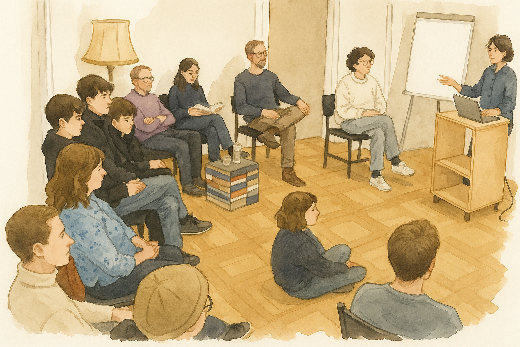
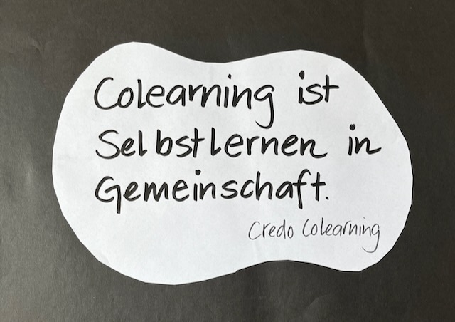

+++
title = "Coworking & Colearning Space Effinger (Teil 3)"
date = 2025-09-05T10:00:00Z
publishDate = 2025-09-05T08:00:00Z
description = "Dieser Blog gibt in drei Teilen Einblick in die Geschichte des Colearnings im Coworking Space Effinger."
draft = false
image = "image5.png"
authors = [ "Fredi Zumbrunn" ]
comments = true
tags = [ "Colearning", "Coworking" ]
+++

**Coworking und Colearning – eine Verbindung mit Zukunft**

Bild: Marco Jakob  / KI \- generiert

Dass [**Colearning im Effinger**](https://www.colearningbern.ch/) zuhause ist, ist kein Zufall. Es ist das Ergebnis eines offenen Raums – und einer offenen Community. Und eine Einladung an Menschen, Veränderung anzugehen. Der Effinger ist mehr als ein Ort zum Arbeiten. Der Coworking Space ist ein Möglichkeitsraum, in dem Menschen aus unterschiedlichen Lebens- und Arbeitswelten zusammenkommen, Verantwortung übernehmen, neue Formen des Zusammenlebens und Zusammenarbeitens erproben.

Ohne diesen Ort, ohne diese Kultur, gäbe es Colearning Bern und die daraus erwachsenen Angebote nicht. Die Offenheit des Hauses, das Vertrauen ins Ausprobieren, die Neugier gegenüber Neuem – all das hat uns getragen, herausgefordert und ermutigt, eigene Wege im Lernen zu gehen. Heute wachsen Coworking und Colearning im Effinger ganz selbstverständlich zusammen. Arbeit und Lernen begegnen sich auf Augenhöhe. Menschen arbeiten an beruflichen Projekten – und entdecken daneben Lernfragen, Entwicklungswünsche, geteilte Neugier. Lernen wird hier nicht organisiert – es wird gelebt. Nicht zusätzlich, sondern mittendrin.

Der Effinger zeigt: Wenn Raum, Haltung und Gemeinschaft zusammenspielen, dann wird Lernen wieder Teil des Alltags. Und das ist vielleicht das Wertvollste, was ein solcher Ort bieten kann.

Collage: Fredi Zumbrunn

**Colearning als Kultur und Netzwerk**

Inzwischen ist aus der lokalen Initiative Colearning Bern ein wachsendes Netzwerk geworden. Um der Entwicklung einen sanften Rahmen zu geben, haben wir [Colearning.org](http://Colearning.org) ins Leben gerufen – nicht als starres Dach, sondern als verbindende Klammer. Was uns vereint, ist nicht ein gemeinsames Curriculum, sondern eine geteilte Haltung gegenüber dem Lernen – offen, menschenzentriert, selbstverantwortlich.

Colearning.org verbindet Projekte, Orte und Menschen, die das Lernen neu denken und vor allem neu leben wollen. Es lädt Initiativen ein, Teil dieses Kulturwandels zu sein – ohne strenge Vorgaben, im Austausch und in der Co-Konstruktion. Wir sind laufend im Gespräch mit Menschen, die ähnliche Ideen anstossen oder bereits erste Schritte gehen. Wir lernen miteinander. Und voneinander. Beiläufig. 

Ein besonders spannendes Projekt entsteht derzeit mit der [Wohnbaugenossenschaft Urbane Dörfer im Webergut in Zollikofen](https://www.urbanedoerfer.ch/), die das Lernen bewusst in den Alltag einer neuen, gemeinschaftlich organisierten Siedlung integrieren möchte – nicht als Zusatz, sondern als integraler Pfad persönlicher und kollektiver Entwicklung. Dazu entstehen Projekte in der Ostschweiz. Eine Art Colearning-Akademie soll in ein [Kulturlabor](https://kulturlabor.sh/) integriert werden. Oder ein Colearner lädt Menschen aus der Organisation Schule auf einen gemeinsamen Lernweg ein.  Mit der angebotenen [KI Colearning Journey](https://learnflow.city/%E2%9D%93-22-haufig-gestellte-fragen-faq-zur-ki-colearning-journey/) sollen Menschen die Veränderungen durch KI im Bildungsbereich erkunden können. Colearning ist auch zu finden im Angebot [dusse dihei](https://www.dussedihei.ch/), das auf wunderbare Weise gemeinsames Lernen, Naturerfahrung und innere Entwicklung miteinander verbindet. 

**Eine Einladung**

Auch Colearning Bern, der Ursprung der ganzen Entwicklung, ist kein exklusiver Kreis. Kein fertiges System. Kein Ort, an dem man nur zuschauen darf. Es ist ein Raum, der entsteht, weil Menschen ihn mit Leben füllen – mit ihren Fragen, ihrem Mut und ihrer Bereitschaft, Neues zu versuchen. Menschen, die schon länger dabei sein, junge und ältere, Menschen, die sich in einer tollen Atmosphäre mit ihrem Lernen beschäftigen wollen. 

Wenn du Lust hast, selbst wieder ins Lernen zu kommen, mit eigenen Themen, in deinem Rhythmus, im Dialog mit anderen – dann bist du bei uns genau richtig.

Du kannst ein eigenes Projekt verfolgen.  
Du kannst deine Erfahrungen teilen.  
Du kannst andere begleiten – Jugendliche oder Erwachsene.  
Du kannst einfach mal reinschnuppern.

Zum Beispiel bei unseren [Schatzhebungstreffen](https://www.effinger.ch/events/), die in regelmässigen Abständen stattfinden. Hier kannst du eigene Lernerfahrungen teilen, dich inspirieren lassen und andere Lernwege kennenlernen – ganz ohne Vorwissen oder Verpflichtung.

**Denn Lernen endet nicht mit der Schule. Es beginnt dort, wo du es wieder zu deinem eigenen machst.**

Komm vorbei. Schau rein. Mach mit.

Wir freuen uns auf dich.

[info@colearning.org](mailto:info@colearning.org)
