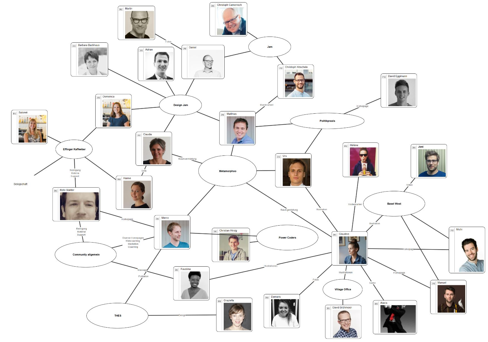

+++
title = "Coworking = Kollaboration"
date = "2017-11-16"
description = "Der Effinger ist auch ein Ort wo eben co-gewörkt wird. Der Effinger bedeutet vor allem auch Gemeinschaft und Zusammenarbeit. Es sind in den letzten eineinhalb Jahren diverse Kollaborationen entstanden. In unterschiedlicher und vielfältiger Zusammenstellung haben sich Leute für gemeinsame kleine und grosse Projekte zusammengefunden."
image = "kollaborationen.jpg"
authors = [ "Urs Vögeli" ]
comments = true
tags = [ "Coworking" ]
+++

Der Effinger ist nicht nur einfach unser fantastisches Gebäude und die grossartige Infrastruktur, die wir uns hier als Heimat aufgebaut haben. Nein. Der Effinger ist auch ein Ort wo eben co-gewörkt wird. Der Effinger bedeutet vor allem auch Gemeinschaft und Zusammenarbeit. Es sind in den letzten eineinhalb Jahren diverse Kollaborationen entstanden. In unterschiedlicher und vielfältiger Zusammenstellung haben sich Leute für gemeinsame kleine und grosse Projekte zusammengefunden.

Coworking heisst eben nicht einfach jeder arbeitet nur für sich und wir teilen uns lediglich die Infrastruktur. Coworking heisst auch und insbesondere Zusammenarbeit und Kollaboration. Hier siehst du eine wohl immer noch unvollständige Bestandesaufnahme unseres Beziehungsgeflechts (Stand Sommer 2017):

Anfang 2017 ist beispielsweise mit einem ganzen Team der [Service Design Jam Bern](/blog/service-design-jam-2017/) im Effinger zustande gekommen. Unsere [Illustratorin Claudine](http://www.atelier-c.ch/) konnte für ganz verschiedene Unternehmen und Projekte im Effinger bereits tätig sein. Faustina hat sich mit ihrem [Massageangebot](http://www.3-bewegt.ch/) etabliert. Das Unternehmerische soll hier seinen Platz haben. Es sollen auch Aufträge und bezahlte Zusammenarbeiten entstehen, so dass sich Leute mit einer Tätigkeit selbständig machen können oder sogar ein Unternehmen gründen. Toll ist natürlich auch der Erfolg unserer [Kaffeebar](/kaffeebar/), welche als eigenständige GmbH mit etlichen Angestellten ein eigenes Startup ist und in Bern schon eine feste und bewährte Gastronomiegrösse darstellt. Aber auch beispielsweise die Metamorphoo GmbH von Matthias, Marco und mir wurde im Effinger erst dieses Jahr richtig operativ. Wir bewirtschaften einerseits das Effinger-OG und haben andererseits in Zusammenarbeit mit diversen Dozenten und David Eggimann die Weiterbildung [PolitikPraxis](https://www.politikpraxis.ch/) für Milizpolitiker aufgegleist und sind im August 2017 gestartet.

Es gäbe noch viel zu erzählen über das Zusammenfinden von Filmemachern und Kommunikationsagenturen, über Flüchtlingsprojekte, eine Bildungscommunity, Berater, Fotografen, Gamedesigner, Architekten und Künstler im Effinger. Die Gemeinschaft und die Vielfalt an Kollaborationen bilden das Herz unserer Community. Erlebe es einfach selber und komm vorbei.

*Urs Vögeli*
