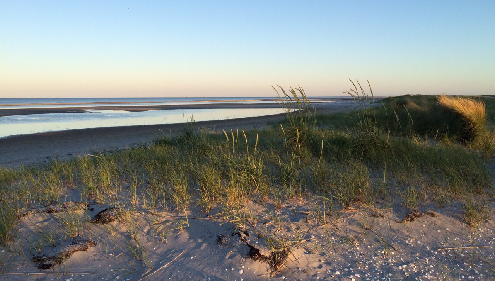

+++
title = "Daheim tut sich was"
date = "2015-06-13"
description = "Seit einer Woche geniesse ich Ferien. Nicht lassen kann ich es, mehrmals täglich die Slack-App anzutippen um zu sehen was 'back home' geschieht! Und da läuft nämlich ganz schön was..."
image = "daenemark.jpg"
author = "Salome Hostettler"
comments = true
tags = [ "Community" ]
+++

  Seit einer Woche geniesse ich Ferien. Nicht lassen kann ich es, mehrmals täglich die Slack-App anzutippen um zu sehen was "back home" geschieht! Und da läuft nämlich ganz schön was...

## Grundsatzdokument

Während den letzten Wochen entstand das Werk *Grundsätze v0.1*. In diesem Dokument haben Marco und Matthias unter Mithilfe und Kommentaren der ganzen Community viele der Ideen, Gedanken und Diskussionen zusammengefasst und auf Papier gebracht, welche in den letzten Monaten entstanden sind. Eine nicht ganz einfache Aufgabe, all das irgendwie auf den Punkt zu bringen, was von verschiedensten Quellen inspiriert und auch mit persönlichen Färbungen in all unseren Köpfen rumturnte... aber die beiden haben dies mit Enthusiasmus und Leidenschaft angepackt eine wahre Meisterleistung vollbracht: 30 Seiten, die sich ab jetzt weiterentwickeln können. Das Dokument zeigt einerseits einen grossen Teil unserer Story bis zum heutigen Standpunkt auf. Andererseits dienen die Grundsätze der Richtungsgebung und Zielüberprüfung unserer Aktivitäten und Laufrichtungen, da wir auf hierarchische Organisationsformen verzichten. Danke vielviel Mals Marco und Matthias für eure wertvolle Investition!!! 

An einem Community-Treffem wurde dann das Dokument noch einmal eingehend diskutiert und wird im Moment entsprechend überarbeitet. 

## Organisationsdokument

An besagtem Treffen wurden die Teile im Dokument, welche organisatorisch oder strukturelle Themen abdecken, in ein separates Dokument *Organisation* ausgelagert. Dieses zweite - kürzere - Werk ermöglicht uns, dass wir ab sofort handlungsfähig sind und klärt, wer bei uns wie Entscheide fällen kann. 

Beide Dokumente sind - versehen mit schon etwas höheren Versionsnummerierungen - momentan bei uns auf Slack verfügbar. Wenn es dich interessiert und du momentan noch nicht auf Slack dabei bist, melde dich. Wir ermöglichen dir gerne auch Einblick in unsere Werke!

Schlag auf Schlag ging's dann damit weiter, dass jede/r der Community sich mit Rollen vorschlagen konnte, für deren Ausfüllung er/sie sich gerne verpflichtet. Dabei gingen die banalsten mit den kreativsten Rollenvorschlägen einher: von der ZeitRaum-Buchführenden über die nicht wegzudenkende die-im-ZeitRaum-Arbeitenden-mit-Süssem-Versorgende, die Innendekorateure, den Transparenzbegeisterer bis hin zum Alten Hasen. Und dies ist nur mal eine kleine Auswahl aus den Vorschläge, die im Vorfeld zum Meeting eingebracht wurden. Bestimmt sind gestern Abend noch viele bereichernde und vielfältige Rollen vergeben worden.

## Mitprägen

Mich begeistert extrem, dass in diesen Prozessen der letzten Wochen alle aus der Community mitprägen durften. Und dies in dem Mass, wie für jede Person grad richtig und möglich war. Niemand wurde gepusht, sich mehr einzubringen, als er von sich aus tat. Niemand hatte das Gefühl, übergangen worden zu sein. Niemand musste sich einem halbbefriedigenden Konsens fügen oder wurde durch eine mächtigere Chefposition oder eine demokratische Mehrheit überstimmt. Jeder konnte soviel Verantwortung übernehmen, wie es ihm gefällt und konnte sich für Rollen vorschlagen, die seinen Leidenschaften und Talenten entsprechen. Einfach genial! 

So, ich schliesse meine Berichterstattung hier mal ab... und warte schon gespannt auf das Beschlussprotokoll des gestrigen Community-Treffens, welches ich mir dann, auf dem Terrässchen mit Seaview vor unserem dänischen Ferienhäuschen, zu Gemüte führen kann.

## ZeitRaum?

PS: Wer sich während dem Lesen gefragt hat, was zum Geier denn der *ZeitRaum* sei? Auch dies einer der via Slack soziokratisch gefällten Entscheide: Unser kleiner Coworking Space an der Aarbergergasse heisst nun *ZeitRaum*.

Der Name **ZeitRaum** drückt für uns Folgendes aus:

* Es ist Raum für Entfaltung, Innovation, Arbeit und Leben.
* Es ist ein Raum auf Zeit, denn diesen Winter werden wir in den grösseren Raum an der Effingerstrasse ziehen.
* Es ist ein Raum für Zeit, man nimmt sich Zeit füreinander, investiert ineinander.
* Der Name drückt aus, dass man für unterschiedliche Zeiträume hier arbeiten kann.
* Die Community ist unabhängig von Raum und Zeit. Man kann sich dazu zählen, auch wenn man im Moment nicht an diesem Ort sein kann. Community geht über Zeit und Raum hinaus.
