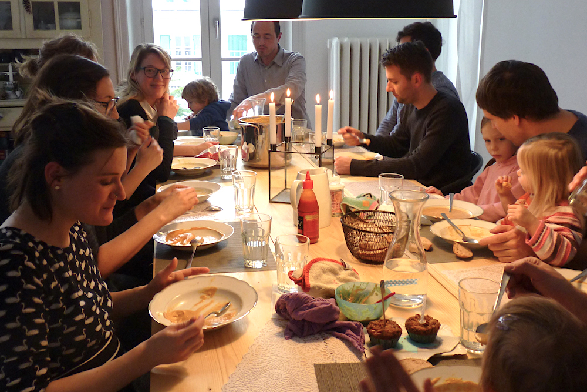
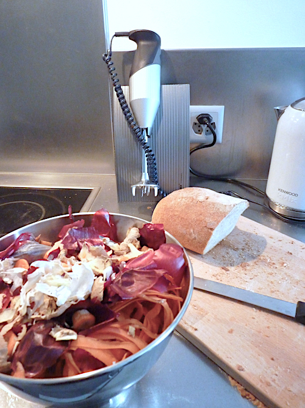

+++
title = "Das Salz in der Suppe oder wie wir Community leben"
date = "2017-02-06"
description = "Was gibt es schöneres, als – nach einem strengen und arbeitsamen Vormittag - an einen reich gedeckten Tisch sitzen zu dürfen und gemeinsam, mit wunderbaren, spannenden Coworkern zu speisen."
image = "Zmittag_2_OG_b.jpg"
authors = [ "Claudine Etter" ]
comments = true
tags = [ "Coworking", "Community" ]
+++

  Was gibt es schöneres, als – nach einem strengen und arbeitsamen Vormittag - an einen reich gedeckten Tisch sitzen zu dürfen und gemeinsam, mit wunderbaren, spannenden Coworkern zu speisen.

Und das noch in der gemütlichen Wohnatmosphäre der Coliving-Wohnung im 2. OG (direkt über den Coworking-Spaces). Als würde man - für einen Moment - dem emsigen Treiben im Effinger entschweben und auf Wolke Sieben picknicken.

Neue Mitschweber jederzeit willkommen!

