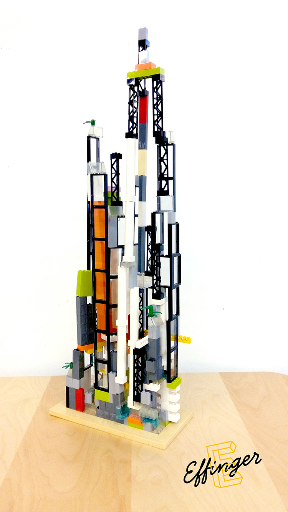

+++
title = "Der Vielfalt-Turm"
date = "2017-06-12"
description = "Dieser Turm symbolisiert den ehrenamtlichen Einsatz unserer Community in den letzten zwei Monaten. Jeder, der 45 Minuten Zeit in den Betrieb, in eine Rolle oder für ein andere Community-Mitglied investiert hat, durfte einen LEGO-Stein verbauen."
image = "legoturm-thumb.jpg"
authors = [ "Urs Vögeli" ]
comments = true
tags = [ "Community", "Coworking" ]
+++

Dieser Turm symbolisiert den ehrenamtlichen Einsatz unserer Community. Jeder, der 45 Minuten Zeit für den Betrieb des Effingers, das Ausfüllen einer Rolle für die Community oder einfach für ein anderes Community-Mitglied investiert hat, konnte innert 2 Monaten jeweils seinen bestimmten LEGO-Stein verbauen. Damit wird unser Engagement füreinander und für das Gesamtprojekt sichtbar.

Ausserdem zeigt der Turm auf, wie vielfältig und unterschiedlich wir sind. Jeder hat eine andere Rolle im ganzen Gebäude. Manche schiessen hoch, andere legen Fundament, wiederum andere schmücken aus oder sind einfach transparent. So hat jeder seinen Platz hier im Effinger und soll zur Geltung kommen. Ziel unsere Community ist, dass jeder so sein kann, wie er wirklich ist. Am Schluss steht ein ausgefallenes, aber symbolträchtiges Gebäude: eben halt unser Effinger.

