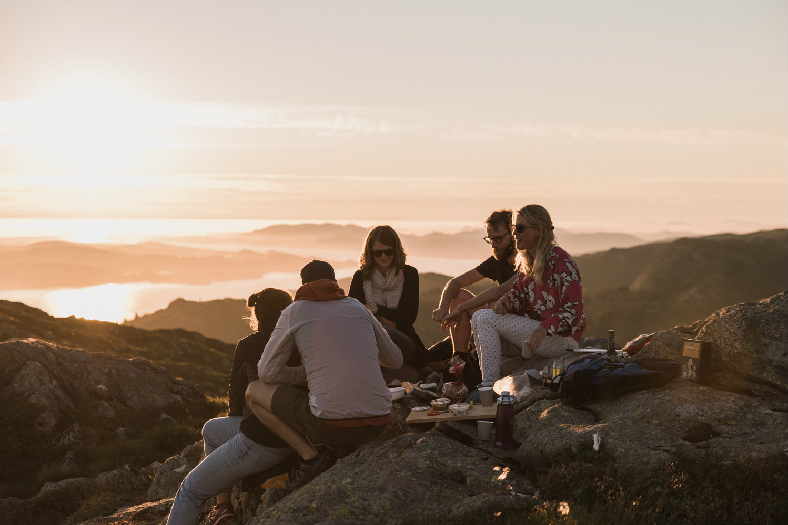

+++
title = "Effianer auf Wanderschaft"
date = "2018-09-06"
description = "Was soll man tun, wenn man eine längere Zeit im Effinger aktiv war, man sich aber eine Weile auf etwas anderes fokussieren möchte? Trotzdem möchte man den Effinger als Heimat behalten und vielleicht später wieder stärker aktiv sein vor Ort. Kann man weiterziehen, ohne zu gehen?"
image = "wanderschaft.jpg"
authors = [ "Marco Jakob" ]
comments = true
tags = [ "Community", "Effianer" ]
+++

  Besuch bei den Effinger-Coworkerinnen Hanne und Marion in ihrer Heimat Norwegen | Foto <a href="http://www.dmrsbrgr.com/">Damaris Berger</a>

Was soll man tun, wenn man eine längere Zeit im Effinger aktiv war, man aber irgendwann merkt, dass man sich eine Weile auf etwas anderes fokussieren möchte? Trotzdem möchte man den Effinger als Heimat behalten und vielleicht später wieder stärker aktiv sein vor Ort.

So geht es mir im Moment. Angetrieben von der Idee für die Kombination aus Kaffeebar & Coworking haben Domenica, Salome, Matthias und ich [vor 4 Jahren](/geschichte/) zum ersten How-the-Heck-Abend eingeladen. Ich war zuerst noch vorsichtig. Weil es mich aber so richtig gepackt hat, bin ich viel tiefer eingetaucht, als ich mir das vorher überhaupt hätte vorstellen können. Es war eine fantastische Reise und ich habe viele Freunde und Heimat gefunden. Jetzt ist etwas Neues dran.

## Weiterziehen, ohne zu gehen

Aber wie soll ein solcher Wechsel aussehen? Fast alle wissen, was passiert, wenn man eine Arbeitsstelle beendet oder eine Organisation verlässt: Man verspricht sich, öfter mal vorbei zu schauen, wobei jeder weiss, dass das unwahrscheinlich ist. Die meisten Organisationen haben ganz klare Grenzen. Entweder man ist drinnen oder draussen. Etwas dazwischen gibt es nicht.

Wir haben als Community nach Mitgliedschaftsformen gesucht, wo die Grenzen nicht so klar sind, damit fliessende Übergänge möglich werden - ein möglichst organisches Ökosystem. Manchmal ist uns das gelungen, oft aber auch nicht. Zwei Effianer kümmern sich aktuell darum, Lücken zu schliessen im Weg, wie man zur Community dazukommen kann (Onboarding).

Was Organisationen viel zu wenig planen, ist, wie Mitglieder wieder aus dem Kern herausfinden oder die Organisation verlassen können. Ich bin überzeugt, dass Organisationen, die den Ausgang klar definieren und Mitglieder auf gute Art weiterziehen lassen, mehr Leute anziehen, die dazukommen. Eine grosse Türe am Ausgang braucht Mut, macht aber den Eingang attraktiv.

Das Schönste wäre, wenn man weiterziehen könnte, ohne wirklich zu gehen. Wie schon oft, versuchen wir hier etwas Gegensätzliches zu kombinieren. So haben wir einen neuen Status eingeführt: **"Effianer auf Wanderschaft"**.

## Was sind "Effianer auf Wanderschaft"?

“Effianer auf Wanderschaft” sind Effianer, die etwas persönlich oder beruflich verändern und für eine bestimmte Zeit die Effianer-Rolle nicht ausüben.

Spätestens nach einem Jahr berichten sie von ihren Erlebnissen und tragen so ihre Erfahrung zurück in den Effinger. Sie können jederzeit wieder in den Status als Effianer wechseln.

Effianer auf Wanderschaft haben keine Verpflichtung, vor Ort zu sein. Sie sind aber frei, als Coworker im Effinger zu arbeiten. Auch vom Zeitinvestment in die Community, ineinander und den Betrieb sind sie frei. Wenn es aber drauf ankommt, können sie im Effinger beigezogen werden (z.B. bei Schwierigkeiten oder Krisen). Und mit dem Status “Effianer auf Wanderschaft” drücken sie die Verbundenheit mit dem Effinger aus.

---

## Meine Wanderschaft

Hier sind ein paar Fragen, die in den letzten Monaten gestellt wurden, seit wir angefangen haben, über dieses Thema zu reden.

### Wann beginnt meine Wanderschaft?

Beginn ist September 2018. Ich werde spätestens im September 2019 z.B. in einem [Brownbag](/brownbag/) am Mittag über die gemachten Erfahrungen berichten. Dann können wir gerne zusammen im Gespräch eine Standortbestimmung machen für den weiteren Weg (ob ich z.B. weiter wandere oder wieder als Effianer aktiv bin vor Ort).

### Was mache ich während der Wanderschaft?

Ich fahre ähnlich weiter mit Arbeit aus Leidenschaft in Programmieren, Bildung, Beratung von Communities und diversen Projekten in [Gemeinsamständigkeit](https://www.gemeinsamstaendig.ch/). Ich möchte noch etwas lokaler in Belp aktiv sein, werde aber sicher auch als Coworker und engagiertes Community-Mitglied im Effinger sein.

### Warum überhaupt?

Nach über 4 Jahren, seit dem Start von Vision und Community, merke ich, dass es mir nicht mehr gut geht, wenn ich im Effinger genau gleich weiterfahre. Mir fehlt etwas die Energie. Das hat bestimmt zu tun mit der intensiven Zeit in den letzten Jahren, aber auch damit, dass in der aktuellen Phase andere Fähigkeiten wichtig sind als die, die meinen Stärken entsprechen.

### Bist du frustriert?

Ganz im Gegenteil! Klar, es war sehr intensiv und sehr viel Arbeit. Ich versuchte mich dabei immer an einem Satz zu orientieren, den ich sinngemäss von [Christoph Schmitt](https://www.bildungsdesign.ch/) übernommen habe:

> Wenn Community entstehen soll, geht es nicht um "Geben & Nehmen" sondern um "Geben & Empfangen". 

Ich durfte auf so vielen Ebenen enorm viel empfangen in dieser Zeit. Das Wertvollste für mich sind sicher die vielen Beziehungen, das, was wir zusammen lernen durften und die Glücksmomente, wenn Träume tatsächlich wahr werden. Obwohl das Meiste in einen nicht-gewinnorientierten Verein geflossen ist, durfte ich auch finanziell profitieren: Das Effinger-Netzwerk und die gegenseitige Unterstützung hat mir ermöglicht, in der Selbständigkeit oder eben [Gemeinsamständigkeit](/blog/gemeinsamstaendigkeit/) Fuss zu fassen.

### Welche Vorbereitungen treffe ich?

Da wir im Effinger keine klassischen "Stellen" und "Hierarchien" haben, ging es während den letzten Monaten lediglich darum zu schauen, welche meiner Effinger-Rollen weitergeführt werden sollen und falls ja, von wem. Es gibt also keine "Nachfolge", sondern verschiedene Leute aus der Community werden sich um Dinge kümmern, die ich bisher gemacht habe. Man wird feststellen, dass vieles ganz anders gemacht werden kann.

### Und das Wandern?

Ich möchte die Zeit gerade nutzen, um etwas in meinem Wochenablauf zu ändern. Ich plane, jeweils an Sonntagen auf Pilgerwegen unterwegs zu sein. Ich werde ankünden, wo ich gerade bin und freuen mich sehr über Begleitung! Unter [gehpause.ch](https://www.gehpause.ch) findest du die Tage, an denen ich unterwegs bin.

<a target="_blank" href="https://www.gehpause.ch" class="btn btn-mod btn-border btn-round btn-medium">&rarr; Gehpause.ch</a>

*Marco Jakob*
