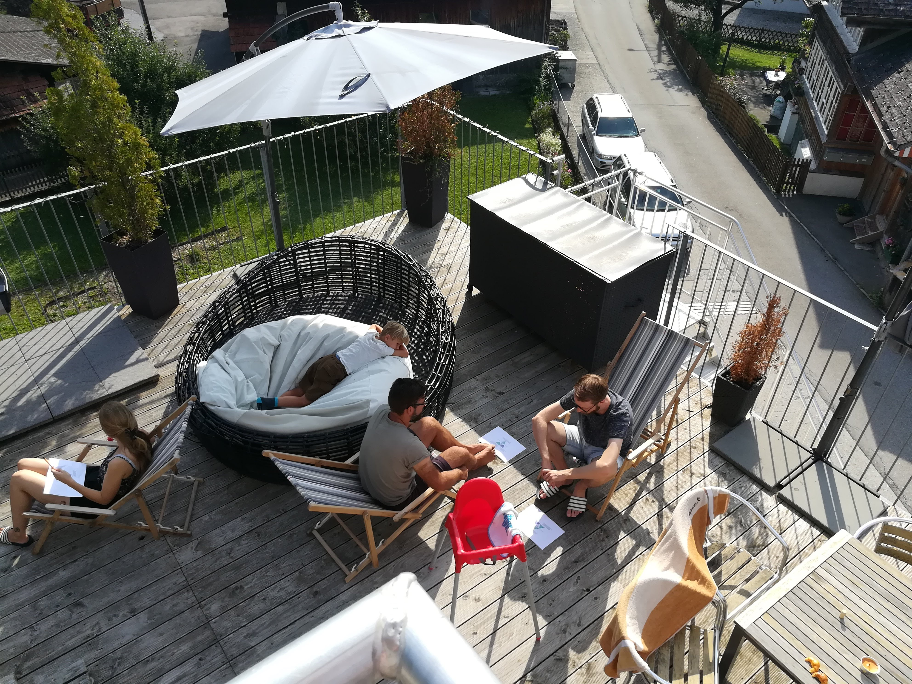
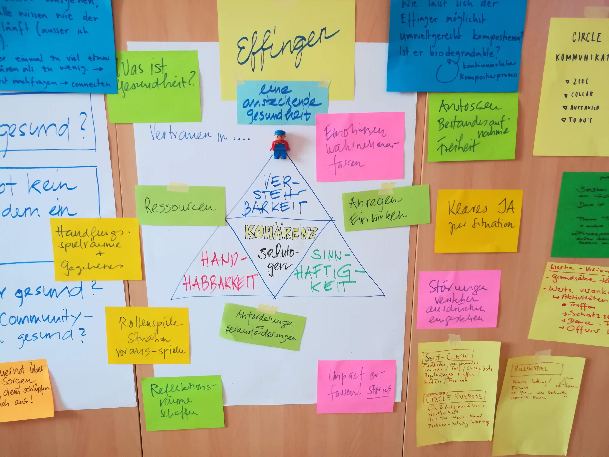

+++
title = "Effianer-Wochenende 2019"
date = "2019-11-20"
description = "Letztes Wochenende im August. Boltigen im Simmental. Es ist Freitag späterer Nachmittag. Das Teamhaus, gleich an der vielbefahrenen Hauptstrasse gelegen, bekommt Leben. Effianer des für die Organisation verantwortlichen Circles gehen daran, Vorkehrungen zu treffen, damit die bald Eintreffenden sich rasch einrichten können."
image = "chillin.jpg"
authors = [ "Fredi Zumbrunn" ]
comments = true
tags = [ "Community" ]
+++

  Letztes Wochenende im August. Boltigen im Simmental. Es ist Freitag späterer Nachmittag. Das Teamhaus, gleich an der vielbefahrenen Hauptstrasse gelegen, bekommt Leben. Effianer des für die Organisation verantwortlichen Circles gehen daran, Vorkehrungen zu treffen, damit die bald Eintreffenden sich rasch einrichten können.

Letztes Wochenende im August. Boltigen im Simmental. 

Es ist Freitag späterer Nachmittag. Das Teamhaus, gleich an der vielbefahrenen Hauptstrasse gelegen, bekommt Leben. Effianer des für die Organisation verantwortlichen Circles gehen daran, Vorkehrungen zu treffen, damit die bald Eintreffenden sich rasch einrichten können.

Es ist das zweite Mal, dass ein solches Wochenende stattfindet.

Nachdem im letzten Jahr die Grundsätze der Effinger-Community im Zentrum standen, geht es dieses Jahr um eine ansteckende Gesundheit. Und zwar um die des Effingers. Was brauche ich, was brauchen wir als Community und im Coworking Space, damit wir zufrieden und gesund bleiben.

Für dieses Thema ist der Samstagvormittag reserviert.

Langsam füllt sich das Haus. Die Effianer sind nicht nur eine Familie, sie kommen auch mit Familie. So schwirren schon bald fast so viele Kinder wie Erwachsene im Haus herum. Auch beim gemeinsamen Gestalten des Aufenthalts wird schnell deutlich, wie die Community funktioniert. Man hilft sich, übernimmt Verantwortung in seiner Aufgabe. Und alles mit viel Wohlwollen und Humor. So herrscht bald eine lockere und anregende Stimmung.

Das gemeinsame Grillieren, die vielen Gespräche und das schichtweise Einsitzen im Whirlpool dauern bis tief in die Nacht hinein.

Oft höre ich die Frage, ob es denn nötig sei, sich mit sich und der Organisation zu befassen, wenn doch alles gut läuft. Gerade darum! könnte man dann sagen. Es ist eben wichtig, die gefühlte Gesundheit nicht als selbstverständlich zu nehmen. Gesundheit ist kein Zustand, sondern ein Prozess, wird dann einer der Leitsätze sein, mit denen wir uns am Samstag befassen.

Der Effinger, eine ansteckende Gesundheit, ist der etwas provozierende Titel. Um Salutogenese soll es gehen. Schnell wird klar, dass dieser Ansatz des Gesundbleibens gut in die Effingerkultur hineinpasst. Wir wollen nicht Krankheit verhindern, sondern Gesundheit fördern. Und wenn Gesundheit, die meine und die der Organisation, mehr sein soll, als die Abwesenheit von Krankheit, sind wir gefordert, uns für uns selber und für die Community Möglichkeiten und Wege auszudenken, wie das Gesundbleiben optimal gestaltet werden kann.

In einem ersten Schritt befassen wir uns mit unseren ganz persönlichen Erfahrungen. Auf diese Weise werden die Aspekte Handhabbarkeit, Verstehbarkeit und Sinnhaftigkeit etwas konkreter und griffiger.

In einem zweiten Schritt geht es dann darum, diese ersten Erkenntnisse auf die Organisation Effinger zu übertragen und zu erforschen, in welcher Form unsere Zusammenarbeit etwas zu einer ansteckenden Gesundheit beiträgt. In den Circles wird die aktuelle Situation besprochen und zum Abschluss stellen wir einander vor, was wir in unserem Verantwortungsbereich zu unternehmen gedenken, um ein gesundes Klima fördern zu können.

Die Wanderung am Nachmittag bietet schliesslich Gelegenheit, Erkenntnisse zu vertiefen und im Gehen den einen oder anderen Gedanken auch über das Gesundbleiben hinaus auszutauschen. Dass der Abend dann auch noch Gelegenheit bietet, das Gefährt, mit dem Claudine und ihr Freund nun auf „Wanderschaft" fahren wollen, genauestens zu inspizieren, rundet einen anregenden Tag ab.

Im Check-out am Sonntag wird dann noch einmal deutlich, dass sich der Effinger weiterentwickeln will und das Interesse besteht, die im Workshop beschriebenen Handlungsvorsätze möglichst zeitnah aufzunehmen, umzusetzen und in der Gruppe auszutauschen und zu festigen.

Mit dem Gefühl, einander auch in Zukunft in positiver Weise anstecken und unterstützen zu können, räumen wir gegen Mittag das Haus und machen uns auf den Heimweg.

