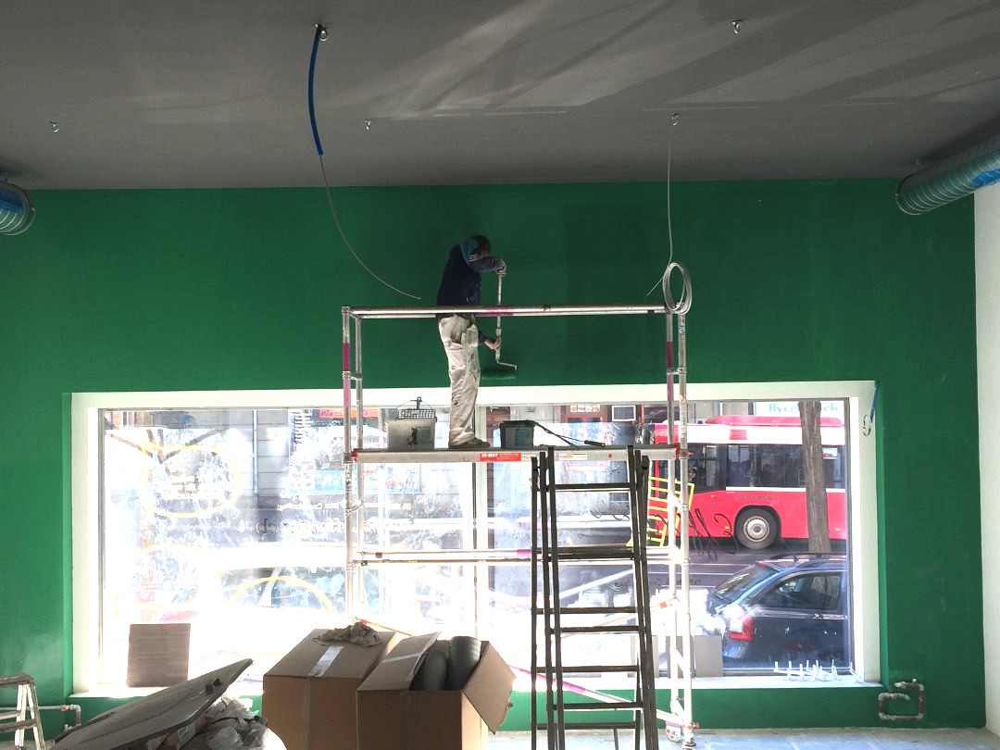
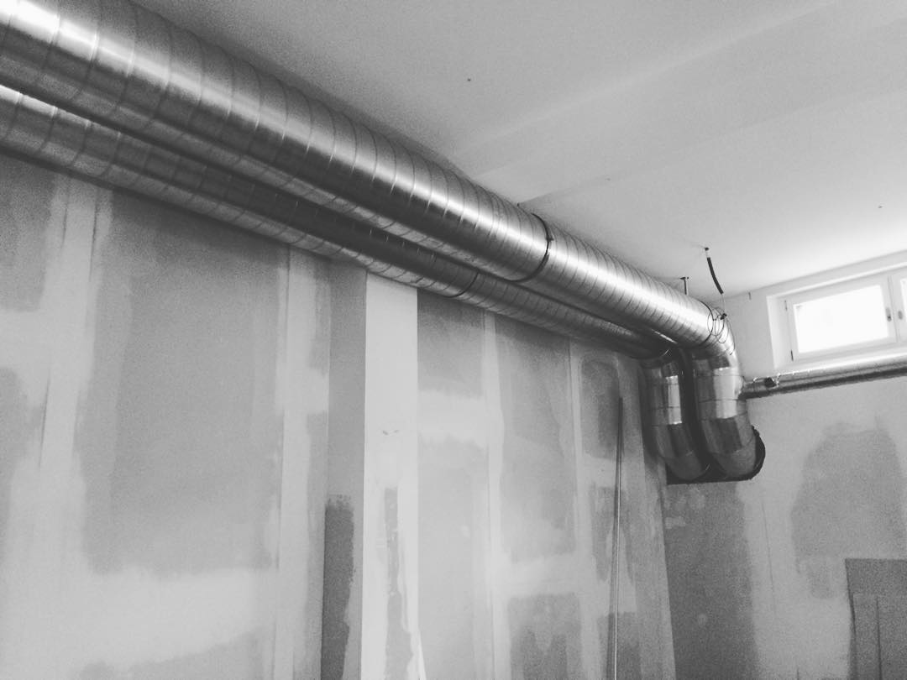
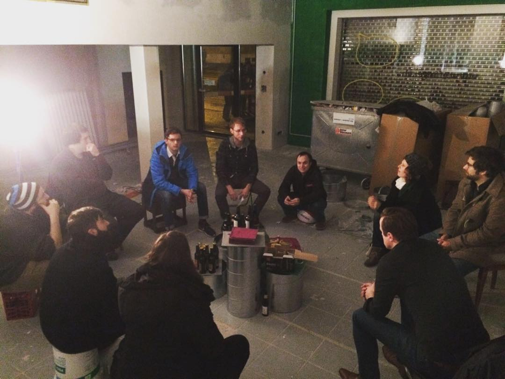
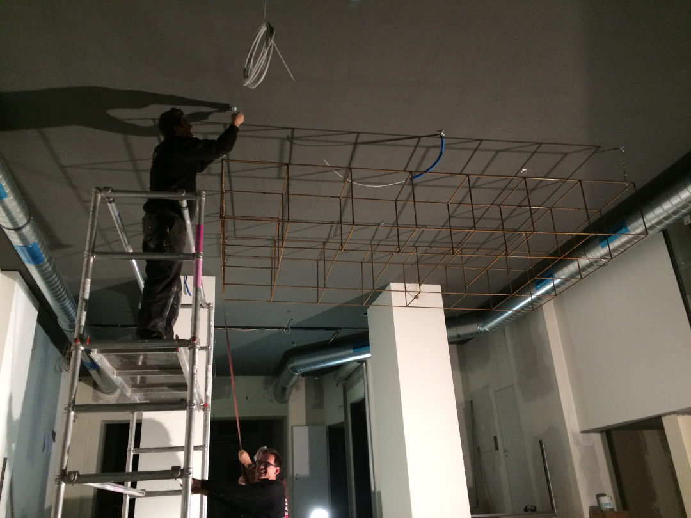
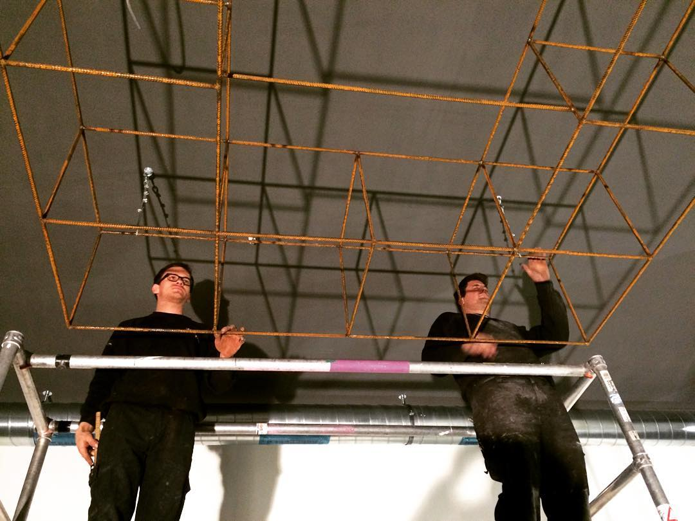
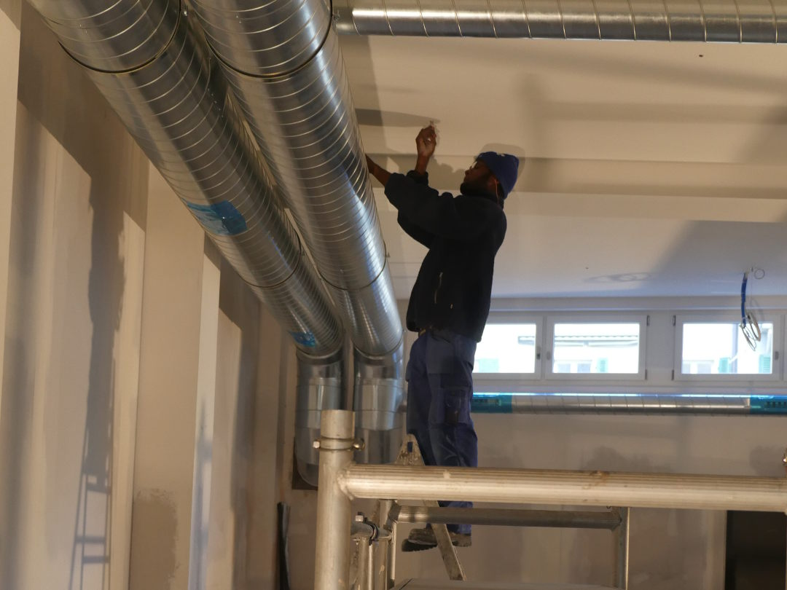
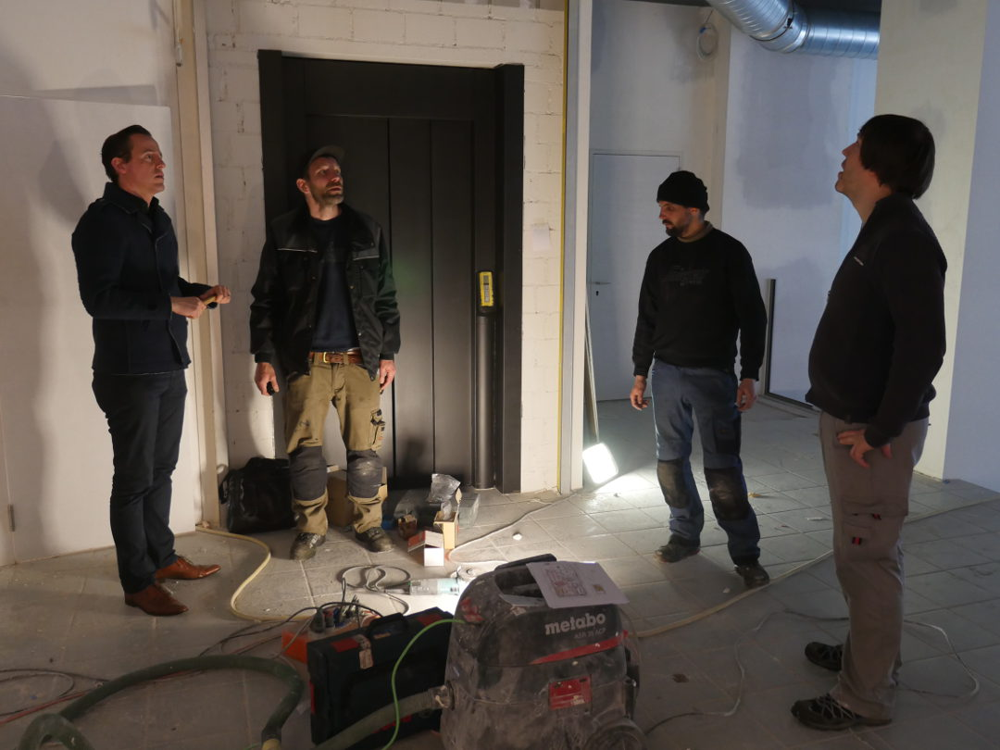
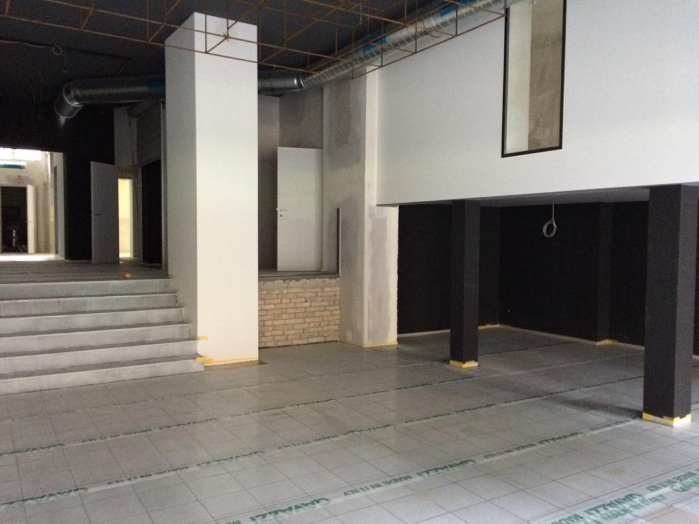

+++
title = "Der Effinger eröffnet im März!"
date = "2016-02-16"
description = "Das Jahr ist noch jung und rund um den Effinger ist schon so viel passiert. Auf jeden Fall könnt ihr euch den Samstag, 19. März in der Agenda eintragen. Dann feiern wir nämlich Eröffnung im Effinger."
image = "bau-01.jpg"
authors = [ "Marco Jakob" ]
comments = true
tags = [ "Location", "Finanzen" ]
+++

Das Jahr ist noch jung und rund um den Effinger ist schon so viel passiert, dass ich gar nicht weiss, wo ich beginnen soll. Auf jeden Fall könnt ihr euch den Samstag, 19. März in der Agenda eintragen. Dann feiern wir Eröffnung im Effinger.

Nun mal der Reihe nach...

## Crowdfunding

Am 1. Januar sind wir mit einer Crowdfunding-Kampagne ins Jahr gestartet. Und es war [ein voller Erfolg](/blog/crowdfunding-erfolgreich/).

## Finanzierung gesichert

In [einem früheren Blogeintrag](/blog/warten-auf-den-parkplatz/#stand-finanzierung) hat Domenica über unsere Suche nach Darlehen geschrieben. Die CHF 240'000 für die Kaffeebar und die CHF 140'000 für den Coworking Space sind gesichert! Wir sind sehr froh, dass wir dieses Kapitel abschliessen können und uns wieder voll anderen Sachen widmen können.

## Baustelle

Auf der Baustelle ist richtig was los. Es sind eine Menge Leute am Werk: Bodenleger, Sanitäre, Maurer, Elektriker, Maler, Lüftungs- und Lampenspezialisten, Küchenbauer, Möbeldesigner, Metallbauer, Architekten, Planer, Innendesigner, Illustratoren und noch ein paar mehr. Man kann sich vorstellen, dass die Koordination so einiges zu tun gibt. Matthias und Domenica werden nach dieser intensiven Aufgabe wohl nicht so bald ein weiteres Bauprojekt anpacken...

Hier sind ein paar Impressionen:

  

    
  

  

    
  

  

    
  

  

    
  

  

    
  

  

    
  

  

    
  

  

    
  

  

    
  

  

    
  

Die Parkplatz-Behörde hat übrigens entschieden, dass der Parkplatz vor dem Effinger nicht einfach so aufgelöst werden darf und wir uns für CHF 8'700 rauskaufen müssten. Allerdings, und das ist das Beste, erhalten wir einen Rabatt von CHF 8'700 (?!?). Das heisst, wir bezahlen doch nix.

## Eröffnungsfest

Da nun die Frage wegen dem Parkplatz geklärt ist, können wir den Termin für die Eröffnung festlegen.

  

    <iframe class="embed-responsive-item" src="https://www.youtube.com/embed/0U2lfzknW38?rel=0" frameborder="0" allowfullscreen></iframe>
  

Das **Eröffnungsfest wird am Samstag, 19. März 2016** stattfinden. Schon ab dem 16. März sind wir für euch da. Details zur Eröffung und zum Fest werden noch folgen. Wenn ihr die Infos nicht verpassen wollt, schreibt ihr euch am besten für den [Newsletter](https://eepurl.com/bw3j3H) ein.

Wow, sind wir aufgeregt. Wir freuen uns enorm, bald mit euch zu feiern, zu trinken, speisen und coworken.