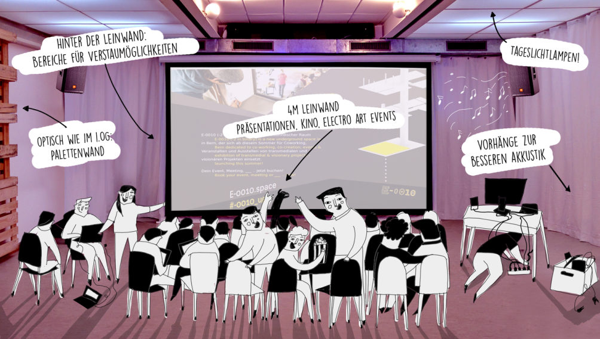
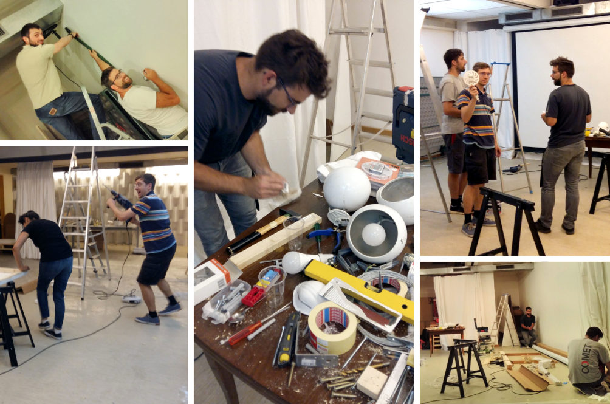

+++
title = "Effinger Goes Underground"
date = "2017-06-20"
description = "Hier tut sich was, in den Tiefen des Effingers! Da verschwinden täglich, mit Holzlatten und Werkzeugkasten bepackte Effianer im Untergeschoss, und tauchen erst spät Abends wieder an der Oberfläche auf, mit farbigen Händen, Holzspänen zwischen den Schnürsenkeln und einem müden aber zufriedenen Grinsen."
image = "effinger-ug.jpg"
authors = [ "Claudine Etter" ]
comments = true
tags = [ "Coworking", "Einrichtung" ]
+++

Da verschwinden täglich, mit Holzlatten und Werkzeugkasten bepackte Effianer im Untergeschoss, und tauchen erst spät Abends wieder an der Oberfläche auf, mit farbigen Händen, Holzspänen zwischen den Schnürsenkeln und einem müden aber zufriedenen Grinsen. Hier tut sich was, in den Tiefen des Effingers!

Wer sich einmal nach unten traut, der kann schon Einiges erahnen. Aus einem schlichten Lagerraum von 94m2 Fläche entsteht seit einigen Wochen langsam ein richtiger Multimedia-Saal mit 4m-Leinwand, Beamer, Soundanlage, einem Bereich für fixe Arbeitsplätze und viel freiem Raum für eine flexible und schnelle Umnutzung: Einerseits soll die Fläche und Infrastruktur für grössere Meetings und Events, andererseits für Coworker im Bereich Hard- und Software-Projekte genutzt werden. Als zusätzliche Option würde sich die Vermietung an Vereine und regelmässige Nutzer anbieten, die von der geräumigen Fläche und Einrichtung profitieren könnten.

Schwerpunkt und Anliegen von Joni und Oleg, den beiden Initianten der Underground-Idee, ist jedoch die Vielfalt von Effinger um den zukunftsträchtigen und weitreichenden Bereich der Elektro- und Computertechnologie zu erweitern.

> „Hier in Bern fehlt ein Treffpunkt für Personen aus der Programmierer- und kreativen Computerszene, der zugleich für ihre Bedürfnisse gut eingerichtet ist und bahnhofsnahe liegt. Wir wollen eine Möglichkeit zur Entwicklung für solche Meetups und Coworking-Plätze bieten.“

Eine Art Labor also, in dem man gleichgesinnte Software- und Hardware-Tüftler trifft, an seinen eigenen Projekten arbeiten kann, Unterstützung findet und Tipps austauscht, sich zu neuen Projekten zusammenfindet, sich über die neusten Entwicklungen austauscht, seine Werke präsentieren kann... Im EG und OG findet man zudem Experten, welche die angedachten Arbeiten vermarkten, visualisieren und bewerben können. Unter Jonathans toller Decken-Konstruktion mit Tageslichtlampen würde es sich sogar bei Tag und Nacht in einer angenehmen Arbeitsathmosphäre arbeiten lassen. Also, wer Interesse hat, der soll sich gleich für Infos oder eine Führung bei [Oleg](mailto:oleg@effinger.ch) oder [Joni](mailto:jonathan@effinger.ch) melden!

Bereits diese Woche wurde der Raum für ein Meeting für 40 Personen mit Leinwandpräsentation gebucht, noch bevor dieser überhaupt ganz fertig war. Schon am 23. Juni wird unten zudem das [„We are Cinema“](/events/100130/), das Virtual Reality- Kino statt finden (es hat noch ein paar Tickets frei - also am besten sofort [hier reservieren](/events/100130/)). Bald wird auch ein Meetup aus der Programmierszene über die Bühne gehen und sicher auch den Weg hier auf den Effinger-Blog finden. Wer also einen Event durchführen möchte oder für seinen Verein, Gruppe etc. noch einen inspirierenden Raum sucht, bitte [hier direkt anfragen](/raeume/)!

In den Tiefen des Effingers brodeln also die Ideen. Kaum zu glauben, denn so unsicht- und unscheinbar das UG im Effinger doch für die meisten ist, so aktiv wird es von einigen wunderbaren Personen mit Leben und Ideen gefüllt. Herzlich Willkommen, ihr Untergrundhelden, wir sind gespannt auf eure Geschichten!
