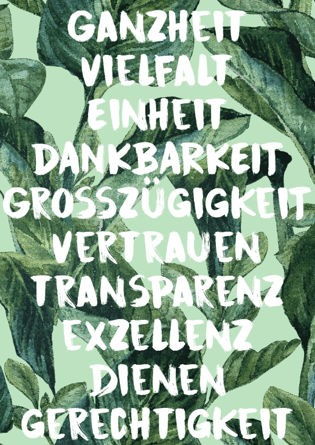

+++
title = "Effinger Identität und Entscheidungsfindung – Teil II"
date = "2017-04-14"
description = "Wenn wir die 10 Effinger Grundsätze auf 4 Kernprinzipien zusammenfassen und dazu jeweils noch ein paar passende Leitsätze auswählen, dann könnte dies z.B. wie folgt aussehen."
image = "image2.png"
author = "Werner Schuller"
comments = true
tags = [ "Community", "Grundsätze" ]
publishdate = "2017-04-14"
+++
   
<small>Effinger Grundsätze</small>

<a href="/grundsaetze/" class="btn btn-mod btn-medium btn-round">&rarr; zu den Grundsätzen</a>

## Komprimierung der Grundsätze

  Wenn wir die 10 Effinger Grundsätze auf 4 Kernprinzipien zusammenfassen und dazu jeweils noch ein paar passende Leitsätze auswählen, dann könnte dies z.B. wie folgt aussehen.

### 1. **Sicherheit** (durch Verschiedenheit): Vielfalt & Einheit

(entsprechend den Grundsätzen Ganzheit, Vielfalt und Einheit)

- Wir schaffen eine Heimat, damit wir werden können, was wir sind   
- Wir leben Einheit in Vielfalt und nicht Konformität   

### 2. **Kooperation** (durch Verbundenheit): Vertrauen & Wertschätzung

(entsprechend den Grundsätzen Dankbarkeit, Grosszügigkeit und Vertrauen)

- Wir zeigen Wertschätzung gegenüber den Personen, die für unser Leben eine Grundlage gelegt haben (Eltern, Mentoren, Freunde, etc.)   
- Wir setzen auf Vertrauen anstatt auf Kontrolle   

### 3. **Fairness** (durch Offenheit): Transparenz & Ehrlichkeit

(entsprechend dem Grundsatz Transparenz)

- Wir wählen standardmässig die Transparenz   
- Wir äussern ehrlich unsere Gedanken   

### 4. **Hingabe** (durch Achtsamkeit): Exzellenz & Nachhaltigkeit

(entsprechend den Grundsätzen Exzellenz, Dienen und Gerechtigkeit)

- Wir streben nach dem höchsten Standard anstatt uns zu entschuldigen, indem wir uns mit anderen vergleichen   
- Wir betrachten Dienen als den Wesenszug echten Unternehmertums   
- Wir wollen Spuren hinterlassen – aber mit möglichst kleinem ökologischem Fussabdruck   

Da mir für die Entscheidungsfindung und Beurteilung noch etwas in Richtung Know-how fehlte, habe ich ein zusätzliches Prinzip „Wissen“ hinzugefügt:

### 5. Neu: **Wissen** (durch Hinterfragen): Ursprung & Wirkung

- Wir schauen auf die Herkunft von Dingen und die Geschichte von Beziehungen.   
- Wir versuchen im Handeln und unseren Entscheidungen Vorbild zu sein.   
- Wo möglich, bevorzugen wir das, was bereits mit unserer Identifikation übereinstimmt.   
- Wo Gewohnheiten unseren Prinzipien wiedersprechen, versuchen wir diese zu ändern.   

## 5 Kernbegriffe

So haben wir jetzt folgende 5 Kernbegriffe:

1. Sicherheit (durch Verschiedenheit)   
2. Kooperation (durch Verbundenheit)   
3. Fairness (durch Offenheit)   
4. Hingabe (durch Achtsamkeit)   
5. Wissen (durch Hinterfragen)   

<a href="/blog/effinger-identitaet-und-entscheidugnsfindung-i/" class="btn btn-mod btn-medium btn-round">Teil I</a>

Fortsetzung folgt…
