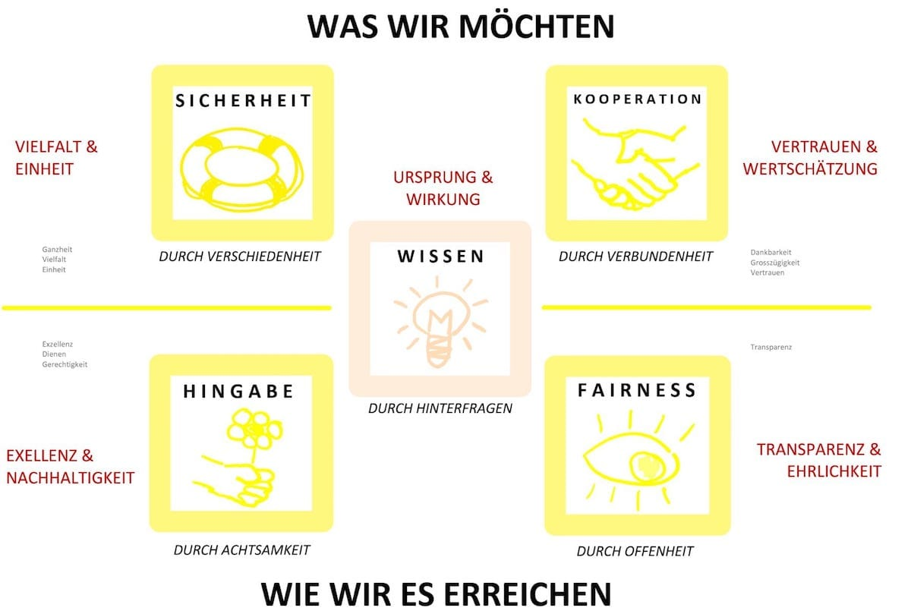

+++
title = "Effinger Identität und Entscheidungsfindung – Teil III"
date = "2017-04-21"
description = "Zu den Kernbegriffen sind hier nun ein paar Beispiel-Fragen definiert. Zur Veranschaulichung wird einerseits gefragt, ob „damit“ der gewünschte Effekt erreicht wird, anderseits aber auch darauf hingewiesen, wo mögliche Fallstricke lauern."
image = "image3.jpeg"
authors = [ "Werner Schuller" ]
comments = true
tags = [ "Community", "Grundsätze" ]

publishdate = "2017-04-21"
+++
   
<small>Zusammenfassung der Grundprinzipien</small>

<a href="/grundsaetze/" class="btn btn-mod btn-medium btn-round">&rarr; zu den Grundsätzen</a>

## Kernfragen für Entscheidungen

  Zu den Kernbegriffen sind hier nun ein paar Beispiel-Fragen definiert. Zur Veranschaulichung wird einerseits gefragt, ob „damit“ der gewünschte Effekt erreicht wird, anderseits aber auch darauf hingewiesen, wo mögliche Fallstricke lauern:

### 1. Sicherheit: Erhalten wir die Vielfalt?

- Stärkt die Entscheidung die Sicherheit und Verlässlichkeit der Gemeinschaft? Bleibt die Vielfalt gewahrt? Keine Abgrenzung auf Kosten anderer!   

### 2. Kooperation: Schenken wir Vertrauen?

- Hilft die Entscheidung uns UND anderen? Ist (gegenseitiges) Vertrauen die Basis? Ist der „Bauch“ auch einverstanden? Keine einseitigen Vorteile und falschen Versprechungen!   

### 3. Fairness: Kommunizieren wir offen?

- Darf diese Entscheidung mit allen geteilt und weitererzählt werden? Keine „kleinen“ Geheimnisse (das bleibt unter uns), ausser die Privatsphäre ist betroffen!   

### 4. Hingabe: Sind wir achtsam und mitfühlend?

- Ist es die beste Entscheidung für uns, unsere Nachkommen, unsere Erde und ihre Lebewesen? Stehen das Schöne, die Bescheidenheit und die Freude (an der Freude anderer) im Vordergrund? Keine „faulen“ Entscheide (wegen fehlender Abklärungen oder blinder Flecken)!

### 5. Wissen: Sind wir kritisch und hinterfragend?

- Treffen wir die Entscheidung aus Gewohnheit und Tradition, welche aber vielleicht gar nicht mehr unseren Prinzipen entsprechen? Sind wir genügend informiert? Vertrauen wir unserer Intuition, unserem Bauchgefühl und geben wir ihm genügend Raum und Wichtigkeit? Würden wir privat anders entscheiden? Sind wir vorbildlich? Keine Ausnahmen für uns selber, bei dem, was wir von anderen fordern!

## Identifikation
Die Kernbegriffe zielen in erster Linie auf die Formulierung einer Identität, also darauf hin, wie wir uns selber sehen.

Aus diesen Kernbegriffen lassen sich **2 Ziele** (wir möchten Sicherheit und Kooperation) und **2 Handlungsweisen**, also wie wir diese erreichen möchten (durch Fairness und Hingabe) und ein übergeordnetes Prinzip (Wissen) formulieren, welches uns bei der richtigen Entscheidung helfen soll.

Hier deshalb zuerst der zusammenfassende Leitsatz, welcher das Grundsätzliche der Community beschreibt und wie dieses umgesetzt werden soll. Der Weg zum Erreichen eines Zieles ist dabei genauso wichtig wie das Ziel selber!

*„Wir möchten Verschiedenheit und Verbundenheit durch Offenheit und Achtsamkeit erreichen. Durch ständiges Hinterfragen stellen wir sicher, dass Neues genügend Raum erhält.“*

## Entscheidungsfindung
Daraus kann nun ein Satz gebildet werden, welcher als Entscheidungshilfe für möglichst viele Situationen anwendbar sein sollte:

*„Bei unseren Entscheidungen versuchen wir durch Offenheit und Achtsamkeit, Verschiedenheit und Verbundenheit zu erreichen. Durch ständiges Hinterfragen möchten wir Beispiel und Vorbild sein“*

Dabei ist die **Methode** (Offenheit und Achtsamkeit) ebenso wichtig, wie das damit erreichte **Ziel** (Verschiedenheit und Verbundenheit). Ein Ziel, welches mit Offenheit und Achtsamkeit erreicht wurde, ist viel wertvoller, als das gleiche Ziel, welches durch „konventionelle Methoden“ (wie reines Konkurrenz-, Effizienz- und Kosten-Denken) zu Stande kam!  

<a href="/blog/effinger-identitaet-und-entscheidugnsfindung-i/" class="btn btn-mod btn-medium btn-round">Teil I</a>
<a href="/blog/effinger-identitaet-und-entscheidugnsfindung-ii/" class="btn btn-mod btn-medium btn-round">Teil II</a>
