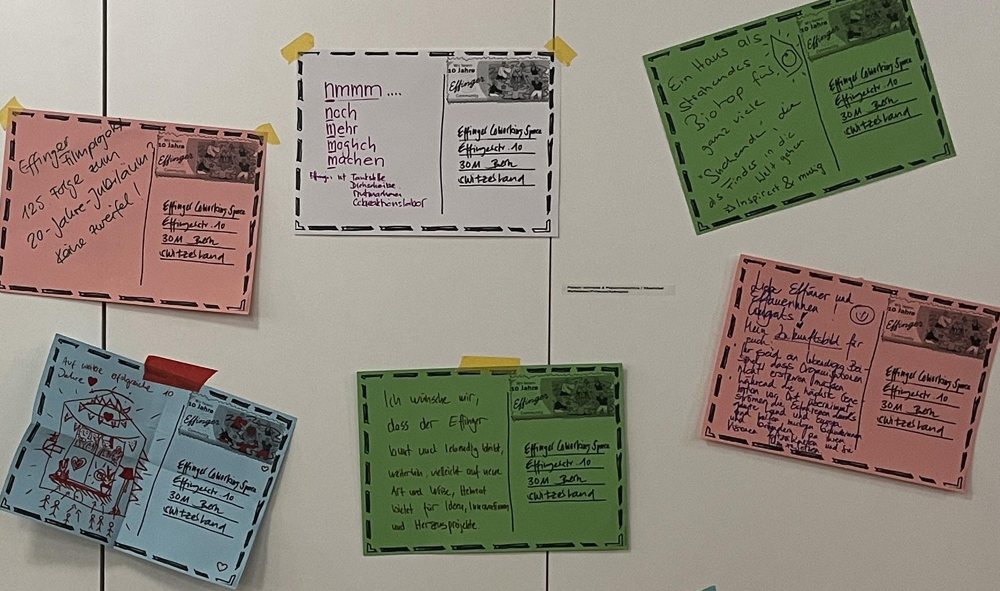
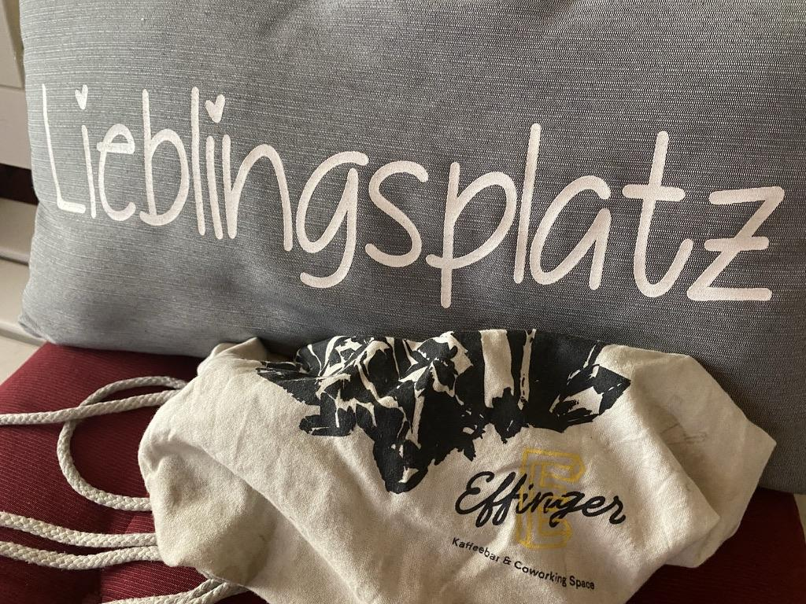

+++
title = "Effinger - mehr Spielfeld als Institution"
date = 2026-05-04T10:00:00Z
publishDate = 2026-04-05T08:00:00Z
description = "Dieser Blog gibt in drei Teilen Einblick in die Geschichte des Colearnings im Coworking Space Effinger."
draft = false
image = "image2.jpeg"
authors = [ "Fredi Zumbrunn" ]
comments = true
tags = [ "Community", "Coworking", "Colearning", "Grundsätze" ]
+++

*Postkartengrüsse in die Zukunft, aufgegeben am grossen Wiedersehensfest, am 6. März 2026*

## 10 Jahre Effinger – ein Haus voller Ideen

Auch der Effinger selbst war mal eine Idee:

**Wäre es nicht schön, einen Ort zu haben, an dem Menschen nicht nur gerne arbeiten und sich begegnen, sondern ihn auch gemeinschaftlich gestalten und führen?
Kein klassisches Büro.** 

Kein steriler Arbeitsplatz.
Kein Ort, an dem jede Minute durchgetaktet ist.
Sondern ein Raum mitten in der Stadt, der offen ist für Menschen mit ihren Ideen, für Gespräche und Begegnungen. Der in geteilter Verantwortung organisiert und geführt ist.

## Effinger - Raum für Möglichkeiten

Mit dieser Vorstellung haben wir vor zehn Jahren angefangen. Ohne grossen Masterplan, ohne fertiges Konzept. Aber mit der Überzeugung, dass sich so ein Ort entwickeln kann, wenn Menschen ihn gemeinsam gestalten.

Heute – zehn Jahre später – wissen wir: Es geht. Und der Effinger entwickelt sich weiter. Auch wenn nicht alle Ideen erfolgreich umgesetzt werden, auch wenn Schwierigkeiten auftauchen, die die Existenz in Frage stellen.

Wer eine Weile hier verbringt, merkt schnell, dass sich der Rhythmus eines solchen Ortes nicht exakt planen lässt. Am Morgen ist es ruhig. In der Regel. Menschen kommen an, richten sich ein, beginnen zu arbeiten. Gegen zehn Uhr zieht es die ersten Richtung 2.OG, in die Küche. Unsere “Stadtwohnig” ist der Communityboden. Kaffeepause. Baristas, oft im Effinger lernende und arbeitende Jugendliche, servieren frischen Kaffee aus unserer tollen Adrianos-Maschine. Man kennt sich, manchmal auch noch nicht. Coworker:innen und Coleraner:innen setzen sich an den grossen Tisch, bevölkern die Terrasse im Sommer. Stimmen überall. Ein Lachen, eine Frage, eine Diskussion. Schon sind wieder Menschen ins Gespräch vertieft. Und das kann auch mal länger dauern. 

Auch mittags ist es lebendig. Die Wohnküche füllt sich. Jemand schneidet Gemüse, jemand rührt in einer Pfanne. Jemand wirft die Mikrowelle an und erzählt dabei von einem Projekt, das gerade nicht so recht vorwärts kommt. Zweimal pro Woche wird hier sogar gemeinsam gekocht. Die Kochgruppe ist am Werk. Entstanden ist die Idee aus dem einfachen Gedanken: Wenn wir sowieso hier sind, können wir doch auch zusammen kochen und essen.

So wachsen über die Zeit Gewohnheiten, Rituale, Beziehungen. Es entsteht Gemeinschaft. 

## Effinger - Austausch in entspannter Atmosphäre

Wer in den Effinger kommt, kann die Atmosphäre spüren. Art of Hosting! Effingerlike. Einfach sein. Viele sagen, dass sie sich hier sofort wohl fühlen. Umso schöner. Was man weniger sieht, ist das, was dahintersteckt.

Der Effinger ist Community und Unternehmen zugleich. Attraktive Räume mitten in der Stadt müssen jedoch gestaltet, gepflegt und seriös gehostet werden. Sie kosten Geld, das erwirtschaftet werden muss. So etwas kann funktionieren, wenn Menschen Verantwortung übernehmen. Füreinander. Miteinander. Wenn Geben und Empfangen einigermassen im Einklang sind. Wenn Menschen bereit sind, Dinge zusammenzuhalten, sich einzugeben, Konflikte zu klären, Raum zu geben, Ideen nicht nur zu kreieren, sondern sie auch umzusetzen. Oft ohne grosses Budget. 

## Effinger - wenn Ideen kommen und bleiben

Klar. Der Effinger ist Arbeitsort. Aber auch Lernort? Ein Jugendlicher, Sohn eines Coworkers, sucht einen Platz, um in Ruhe an seinem Buch zu schreiben. Kein Klassenzimmer, keine Schule, einfach ein Tisch, ein paar Stunden Zeit und die Möglichkeit, konzentriert zu arbeiten. Zu lernen. Andere suchen einen Lernort, der nicht vom Leben trennt. Einen Ort, an dem Lernen nicht hinter Schulmauern stattfindet, sondern mitten im Leben – zwischen Menschen, die arbeiten, Projekte entwickeln, Ideen austauschen. Zwischen den Arbeitstischen entstehen Gespräche. Fragen tauchen auf. Erfahrungen werden geteilt. Jemand erklärt etwas, jemand zeigt eine neue Perspektive, jemand anderes hört zu und denkt weiter.

Ein neues Angebot ist entstanden. Wie viele andere vorher und nachher. Aus dem Coworking Space heraus. Die Arbeits- und die Lernwelt verbinden sich. Wir nennen es Colearning: Selbstbestimmtes Lernen in Gemeinschaft – mitten im Leben. 

## Effinger - Wurzeln und Flügel

Anfang März haben wir Wiedersehen gefeiert und Hallo gesagt. Mit vielen lieben Menschen, die in all den Jahren eine Wegstrecke mitgegangen und dann weitergezogen sind. Oder ganz neu Teil der Community sind. Oder als Freundin oder Partner nahe am Effinger sind. Alle waren willkommen und haben mitgeholfen, unserem Jubiläumsjahr mit ihrem Dabeisein zum Start entsprechend Schub zu geben.

 

Und das Feiern geht weiter. Zehn Jahre Effinger, Zehn Monate diverse Aktivitäten. Mal dies, mal das. Auf der Website und auf Slack werden wir laufend darüber informieren.

***Wurzeln sind wichtig - Flügel auch!***

Nach zehn Jahren stellt sich uns die Frage: Wie bleibt ein solcher Ort lebendig? Institutionen geben Stabilität. Sie sorgen dafür, dass Dinge funktionieren. Aber sie können mit der Zeit auch träg, zu eingespielt werden. Wie pflegen wir die Lebendigkeit? Wie bleiben wir "flügge"?

Aus der Mitte der Community ist folgender Leitsatz für die Zukunft entstanden:

***Wir wollen mehr Spielfeld sein als Institution.***

Ein Spielfeld ist ein Ort, wo Menschen etwas ausprobieren dürfen. Ein Ort, wo Ideen entstehen und getestet werden. Ein Ort, wo höchstens die Tore stehen. Alles andere ist in Bewegung. Meistens.

### Effinger - Haus der Möglichkeiten

> “Wenn man nicht weiss, welchen Hafen man ansteuert, ist kein Wind der richtige.” Seneca

Der Effinger ist ein Ort, der sich selbst verändern darf und muss. Gut geölt heisst noch lange nicht gut gealtert. Gerade auch eine soziokratisch orientierte Organisationsstruktur verlangt nach geeigneter Überprüfung. Entwicklungen müssen reflektiert, Entscheidungen hinterfragt werden. Was bedeutet “Einheit” für uns? Grundsätze wie “Vertrauen”, “Vielfalt” oder "Transparenz"müssen immer wieder diskutiert werden. Genügen unsere Vertrauensinstrumente (fair use zum Beispiel), um aufwändige Kontrollstrukturen, wenn überhaupt, lediglich punktuell und ganz bewusst einsetzen zu müssen? Jüngste Erfahrungen lassen uns hier vorsichtiger werden. Enttäuschungen können heilsam sein, wenn man daraus die richtigen Schlüsse zieht.

Unser Geschäftsmodell steht. Für den Moment. Doch, was kommt noch? Welche Zukunftsbilder haben wir? Wer sind die Menschen, die in den nächsten Monaten, Jahren in den Effinger kommen werden? Nicht nur um zu arbeiten oder zu lernen. Nein. Auch um sich mit spannenden Menschen zu verbinden, die Offenheit und Bereitschaft zeigen, aus Fehlern zu lernen und anzupacken, um noch Unbekanntes zu entdecken. Um das Haus und seine Community weiter zu bringen. Es wäre schade und eine verpasste Chance, in einmal zukuftsorientierten Strukturen zu verharren. Sie sind heute das Gestern, im besten Fall die befriedigend funktionierende Gegenwart. Das Morgen darf jedoch neu gestaltet werden. Immer. Auch radikal. Gemeinsam.

Bleiben wir im Spiel. Nutzen wir den Spielraum, die Spielfreude und die Chancen, die sich bieten. Erhalten wir uns die Möglichkeit, handeln zu können. Achten wir auf Lebendigkeit und Resonanz und meiden wir weiterhin die Falle von Überstrukturierung und gängelnder Steuerung. Üben und pflegen wir Vertrauen. Und Zutrauen bleibt starke Kraft in einer Community, die auf das Engagement jeder und jedes Einzelnen zählt.

Erschaffen wir Neues, Bewahren wir Bewährtes. Balance ist wichtig. Und lassen wir uns darauf ein. Denn: Auf einem Spielfeld und in einem spannenden Spiel entstehen laufend Situationen, die niemand geplant hat. Sie sind Geschenk und Gelegenheit, bewusst Neues zu wagen und kreativ Bekanntes zu pflegen.

 