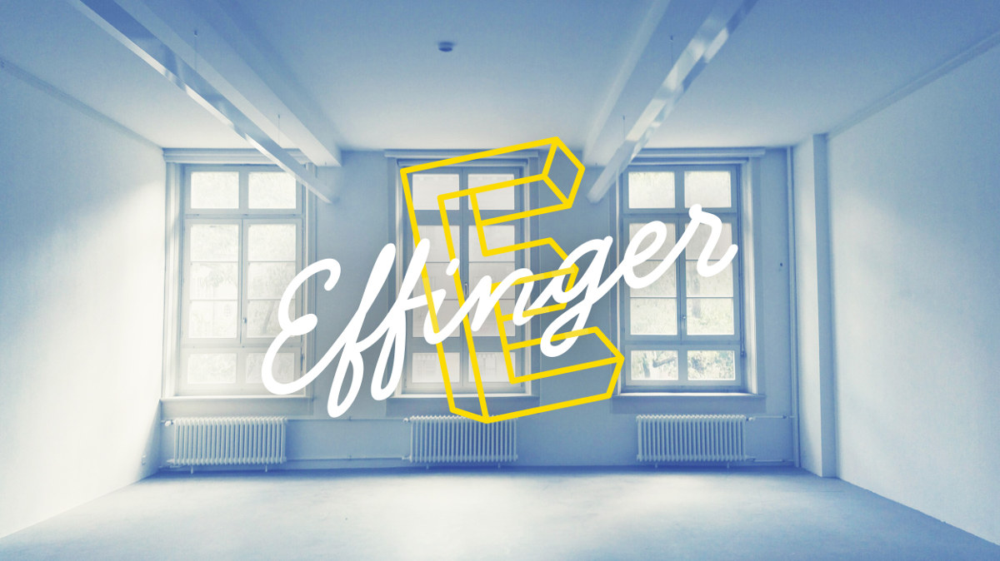

+++
title = "Der Effinger wächst in den ersten Stock"
date = "2016-09-06"
description = "Weil der Effinger all die Leute mit ihren Ideen und der grossen Vielfalt kaum fassen kann, erweitern wir unsere Räume ab Oktober in den ersten Stock. Es sind wunderschöne und hohe Räume. Wir freuen uns darauf wie kleine Kinder."
image = "effinger-1og.jpg"
author = "Marco Jakob"
comments = true
tags = [ "Location" ]
+++

  Weil der Effinger all die Leute mit ihren Ideen und der grossen Vielfalt kaum fassen kann, erweitern wir unsere Räume ab Oktober in den ersten Stock. Es sind wunderschöne und hohe Räume. Wir freuen uns darauf wie kleine Kinder.

Bereits bei der Eröffnung Ende März haben unsere Vermieter erwähnt, dass bald die Räume im ersten Stock frei werden könnten. Langsam, langsam - dachten wir. Im Trubel der ersten Wochen war unsere Aufmerksamkeit voll auf den reibungslosen Betrieb im Erdgeschoss gerichtet. Nur wenige Monate später erhielten wir schliesslich eine konkrete Anfrage. Es zeichnete sich bereits ab, dass wir eine gute Auslastung erreichen könnten, aber der Zeitpunkt für Wachstum schien immer noch etwas sportlich.

Schliesslich entschieden wir uns, dass wir es wagen wollten und machten uns auf die Suche nach möglichen Partnern, die mit uns in die 222m2 einziehen. Matthias und ich haben vorgeschlagen, dass wir die Verantwortung für den Betrieb und generell für die Koordination und Pflege des Ökosystems im ersten Stock übernehmen würden. Damit wird die Community entlastet und wir können ein Geschäftsmodell entwickeln, damit wir uns für unsere Arbeit einen Lohn auszahlen können. Inzwischen sind weitere Personen aus der Community dazugestossen, die in unterschiedlichen Rollen beim Aufbau und Betrieb mithelfen.

## Das Ökosystem im ersten Stock

Im ersten Stock soll ein Ökosystem (altgriechisch oikós 'Haus' und sýstema, das 'Zusammengestellte', das 'Verbundene') entstehen. Das Ziel ist, dass unterschiedliche Initiativen in den Bereichen Unternehmertum, Bildung und Wohnen im Ökosystem eingepflanzt werden können. Hier sind die bisher bekannten Eckpunkte für die Nutzung im ersten Stock:

### Wachstumsmöglichkeit für Coworking

Damit die Effinger Coworker weiter wachsen können und es eine Verflechtung zwischen dem Erdgeschoss und dem ersten Stock gibt, werden rund acht Arbeitsplätze der Community zur Verfügung stehen.

### Verein RaumBildung

Ein wichtiger Partner im ersten Stock ist das Projekt vom neu gegründeten [Verein RaumBildung](http://www.raumbildung.ch/). Sie schaffen einen Ort für Bildungsinteressierte. Es soll Raum entstehen, wo Bildung neu gedacht werden kann und man sich motiviert, entsprechend zu handeln. Wir freuen uns sehr darauf, dass mit Bildung ein ganz neuer und wichtiger Bereich im Effinger einzieht (ist mir als Lehrer ein Herzensanliegen). Das Zusammentreffen und Verbinden von Leuten aus Bildung, Coworking und Unternehmertum wird eine enorme Bereicherung für alle Seiten.

Weitere Informationen gibt es auf der [Webseite von RaumBildung](http://www.raumbildung.ch/). Schreibt euch unbedingt ein für ihren Newsletter, damit ihr keine Infos verpasst.

### Firmenarbeitsplätze

Im ersten Stock haben wir Platz für ganze Firmen-Teams, was im Erdgeschoss bisher eher schwierig war.

### Startups

Wir werden Arbeitsplätze anbieten spezifisch für Startups. Damit Gründer ihre Businessidee erfolgreich umsetzen können, braucht es Menschen, die an ihre Träume glauben und es braucht eine Community, die ihnen hilft, ihre Träume umzusetzen. Das erste Startup im Effinger ist die Effinger Kaffeebar GmbH von Salome und Domenica. Am besten fragst du bei ihnen mal nach, wie eine Community von Menschen zum Erfolg beitragen kann.

### Meeting- und Workshopräume

Im Erdgeschoss vermieten wir bereits einen Sitzungsraum für kreative Treffen. Alle Wände und die Decke sind beschreibbar und zum Teil magnetisch. Wir haben etliche Anfragen für grössere Gruppen, für welche dieser Raum zu klein ist. Im ersten Stock wird es nun grössere Sitzungszimmer haben.

Zudem statten wir derzeit einen Raum mit Materialien für [Design Thinking](https://de.wikipedia.org/wiki/Design_Thinking) und [Lego Serious Play](https://de.wikipedia.org/wiki/Lego_Serious_Play) aus. Damit können Innovationsworkshops durchgeführt werden, bei denen Teams direkt an ersten Prototypen arbeiten, damit sie auf diese Weise neue Einblicke in das Potenzial ihrer Ideen erhalten können. Auch das Atelier und die Werkstatt im Erdgeschoss können die Weiterarbeit an Prototypen aktiv unterstützen.

### Veranstaltungen

Je nach Einrichtung werden auch Events durchgeführt werden können.

## Start im Oktober

Im Oktober geht es los! Wir halten dich auf dem Laufenden über Feste, Projekte und Events im ersten Stock per [Newsletter](http://eepurl.com/bw3j3H), [Facebook](https://www.facebook.com/effingerbern) oder [Instagram](https://www.instagram.com/effingerbern/). Wenn du näher dran sein, uns unterstützen oder irgendwo mitmachen möchtest, dann wirst du am besten [Community Member](/ueber/#community). Oder du löst im Oktober einfach mal einen [Tagespass](/coworking/#preise) und arbeitest einen Tag im ersten Stock. Wir würden uns freuen!
