+++
title = "Ein Besuch in Norwegen"
date = "2018-09-28"
description = "Diesen Sommer ist eine kleine Delegation aus dem Effinger nach Norwegen gereist. Marion und Hanne, zwei Effinger-Coworkerinnen, die nun in ihre Heimat im Norden zurückgekehrt sind, hatten ein super Programm zusammengestellt."
image = "8_Mitternachtssonne.jpg"
author = "Isabel Jakob"
comments = true
tags = [ "Community" ]
+++

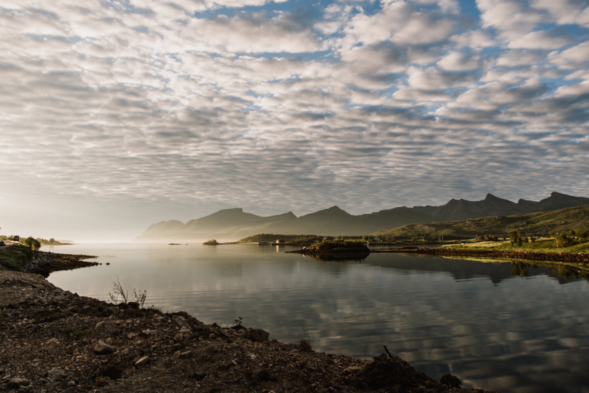

  Nördlich des Polarkreises wird es im Sommer nie ganz dunkel: hier haben wir 23 Uhr | Foto <a href="http://www.dmrsbrgr.com/">Damaris Berger</a>

Diesen Sommer ist eine kleine Delegation aus dem Effinger nach Norwegen gereist.

Marion und Hanne, zwei Effinger-Coworkerinnen, die nun in ihre Heimat im Norden zurückgekehrt sind, hatten für uns ein super Programm zusammengestellt. Zuerst ging es in die Städte Oslo und Bergen, mit einer tollen Panorama-Zugfahrt dazwischen, die uns durch das gebirgige Hochland führte. Das Wetter war überdurchschnittlich sonnig und warm, so dass es fast ein wenig Überwindung brauchte, in Bergen eines oder mehrere der vier Kunstmuseen KODE zu besuchen! Später zog es uns weiter in den Norden auf die Insel Senja.

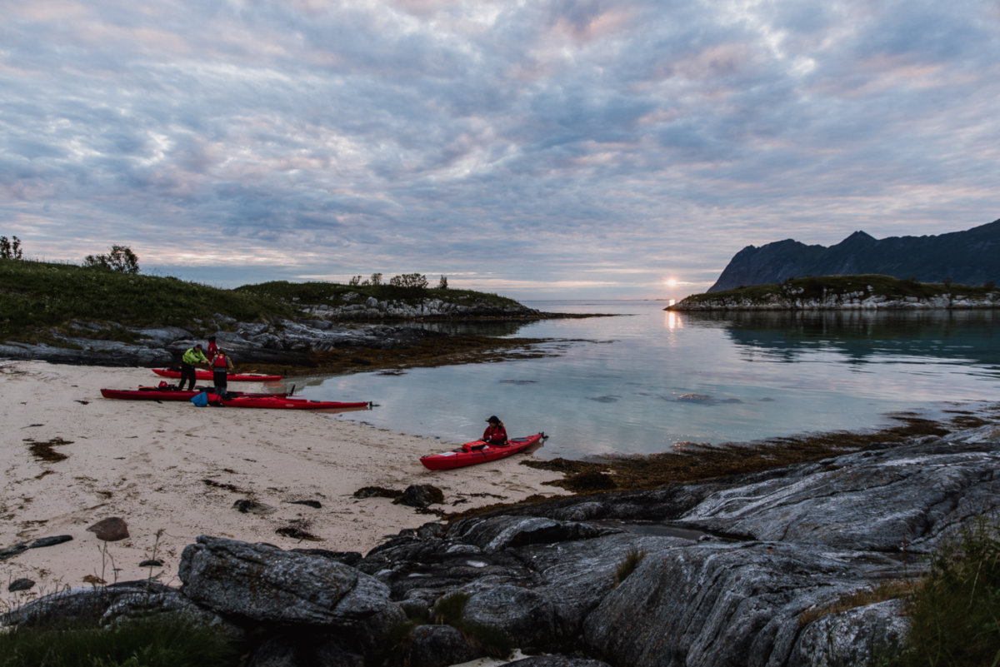

  Kajak-Ausflug mit Mitternachtssonne

Höhepunkte waren ein abendliches Sonnenuntergangs-Picknick auf dem Ulriken, dem "Gurten" der Stadt Bergen, wie Hanne erklärte, und später eine Mitternachtssonnen-Kajaktour nördlich des Polarkreises, die fast unwirklich schön war. Oder war jemand von Euch schon mal in einem vierstündigen „Sonnenuntergang“ auf dem Wasser unterwegs zwischen vielen kleinen Inseln, im glasklaren, türkisgrünen Wasser, umgeben von gezackten Bergspitzen? Ja, das dachten wir schon. Über die zahlreichen Mücken beim mitternächtlichen Dessert auf einer kleinen Insel kann man da schon hinwegsehen.

Ansonsten war die Reise gespickt mit Begegnungen mit Rentieren, Elchen, vielen Seen und Fjorden, feinem selbstgekochtem Essen, einigen (leckeren!) Varianten von Porridge, und für Marco und mich einer abenteuerlichen und ungeplant 8 1/2-stündigen Wanderung bei Gewitter, durch Sumpf und Geröllfelder, mit einem schmerzenden Fuss und ganz ohne Natelempfang, so dass sich der andere Gruppenteil schon ordentlich Sorgen machte. Selten war ich so froh, wieder heil beim Auto angekommen zu sein! Marion, Camille und Damaris hatten unterdessen den Berg Kvænan bestiegen, was zwar nicht weniger gefährlich gewesen war, aber ein bisschen weniger lang dauerte... :-)

An dieser Stelle ein riesiges Dankeschön an Marion und Hanne! Wir geben zu, uns ein klein wenig in Euer Land verliebt zu haben…

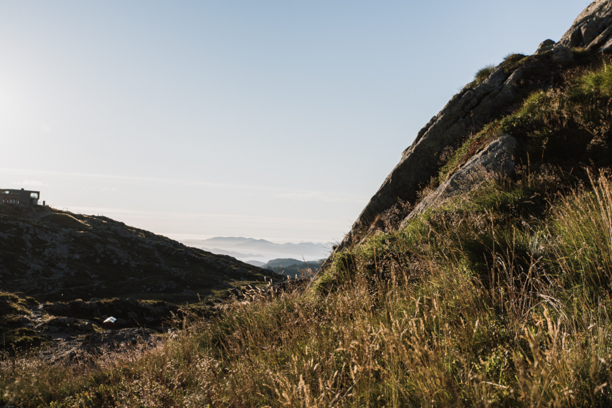

  Auf dem Ulriken

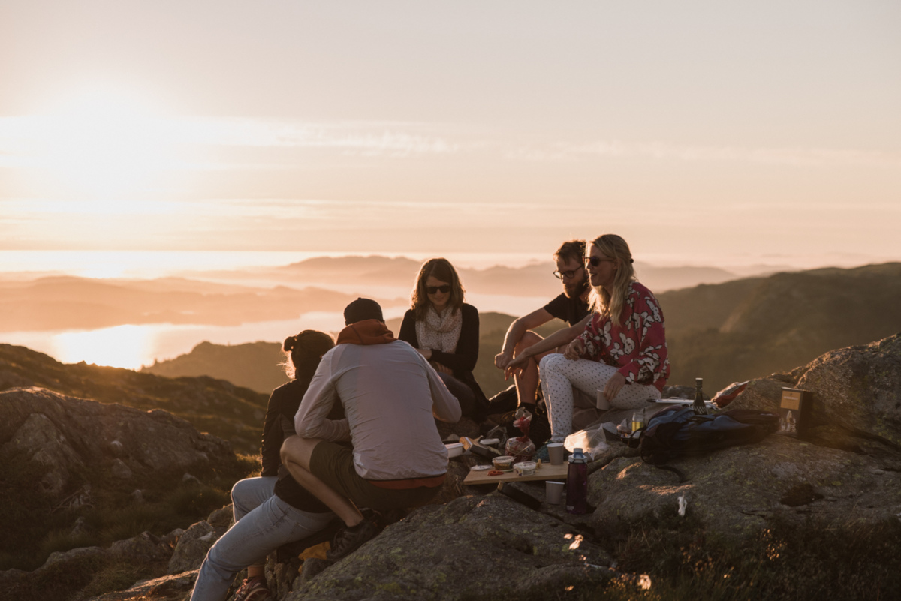

  Abendliches Picknick auf dem Ulriken

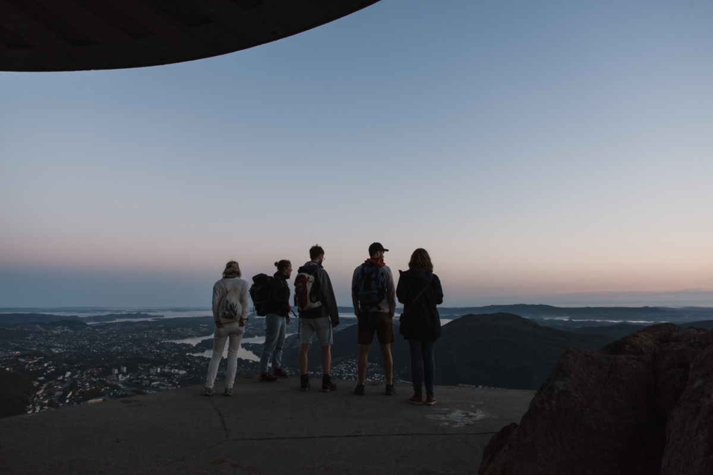

  Bereit für den Rückweg

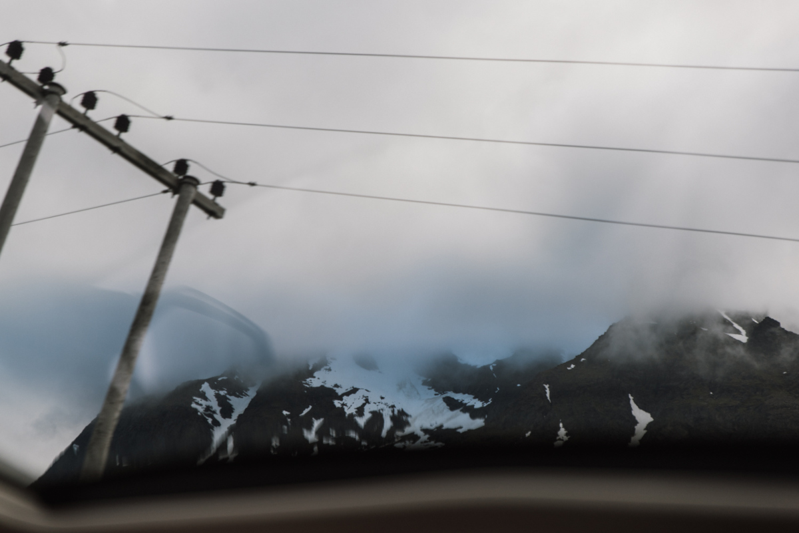

  Autofahrt in der Umgebung von Lyngen

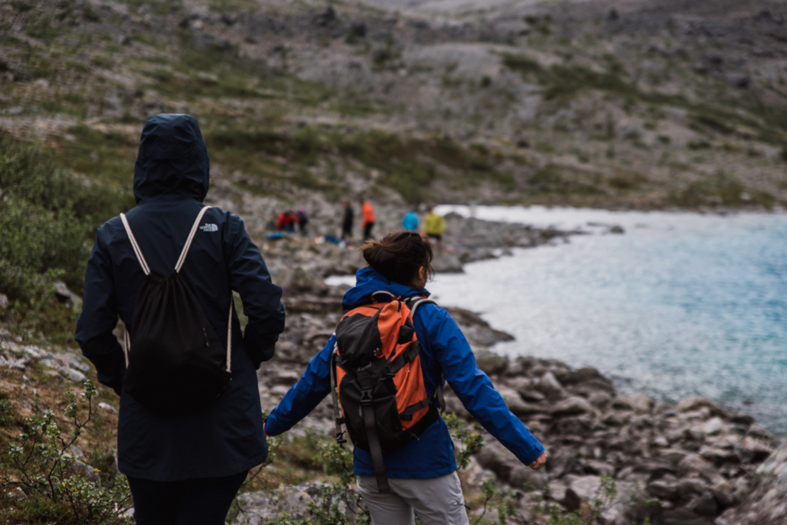

  Am blauesten See Norwegens: Blåvatnet

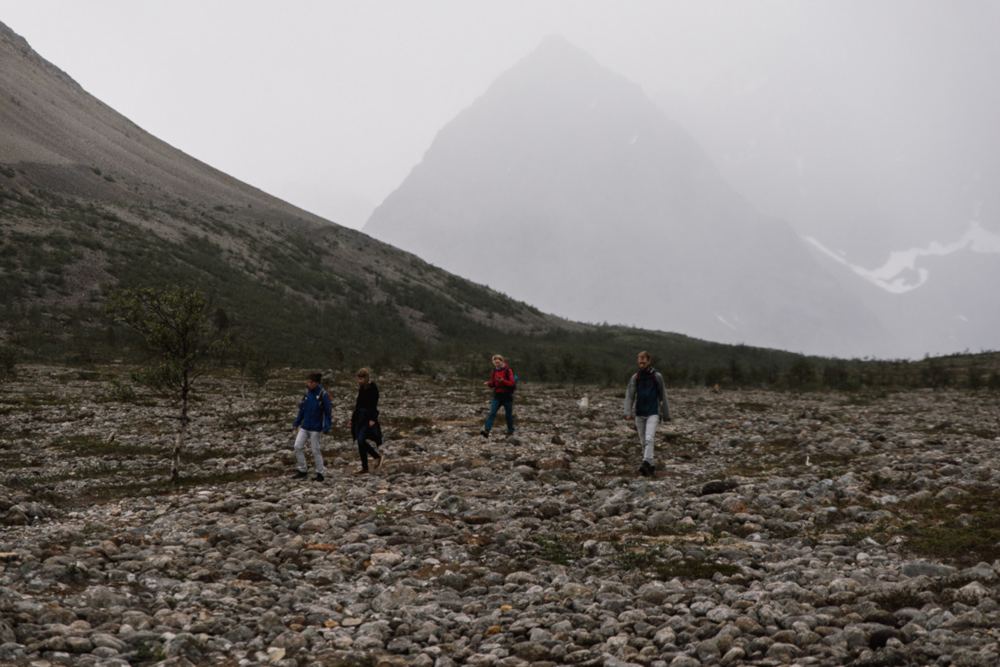

  Autofahrt in der Umgebung von Lyngen

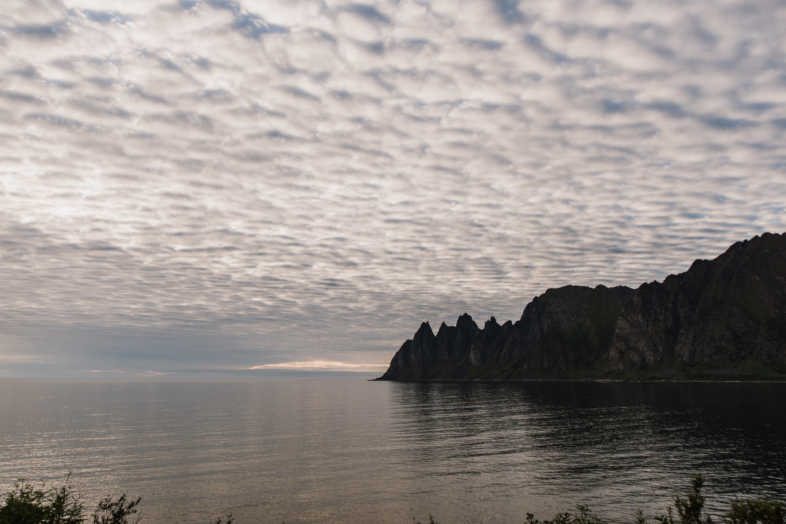

  Blick auf gezackte Bergen um 01.00 Uhr

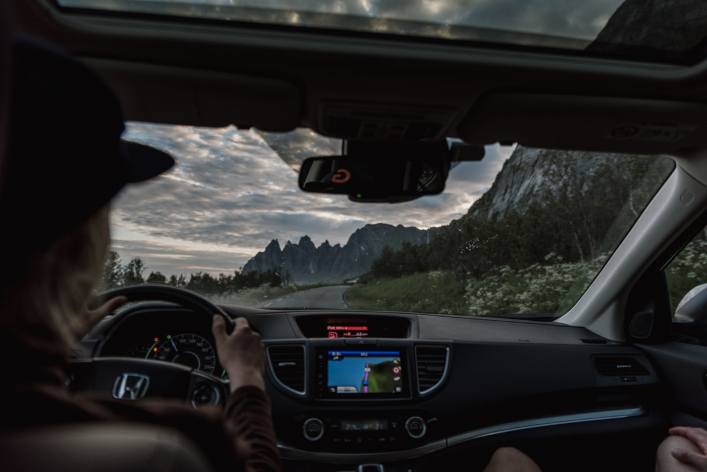

  Heimweg vom Kajakausflug um 03.00 Uhr

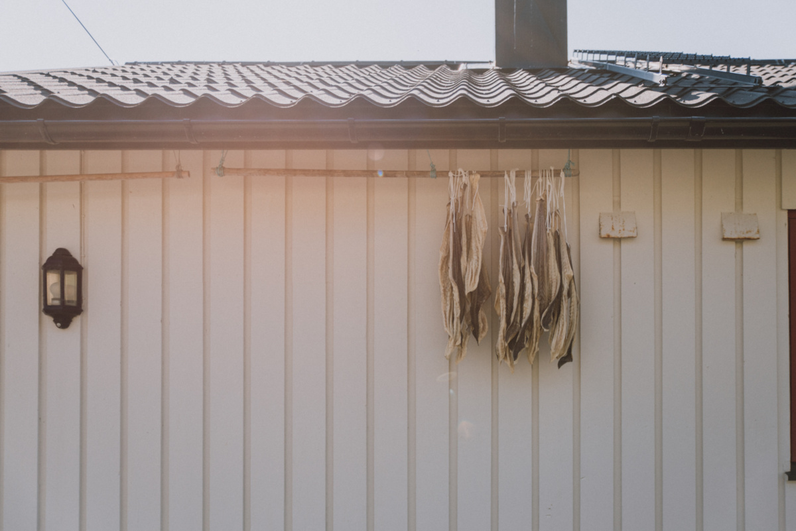

  Zum Trocknen aufgehängte Fische in Husøy

  Husøy

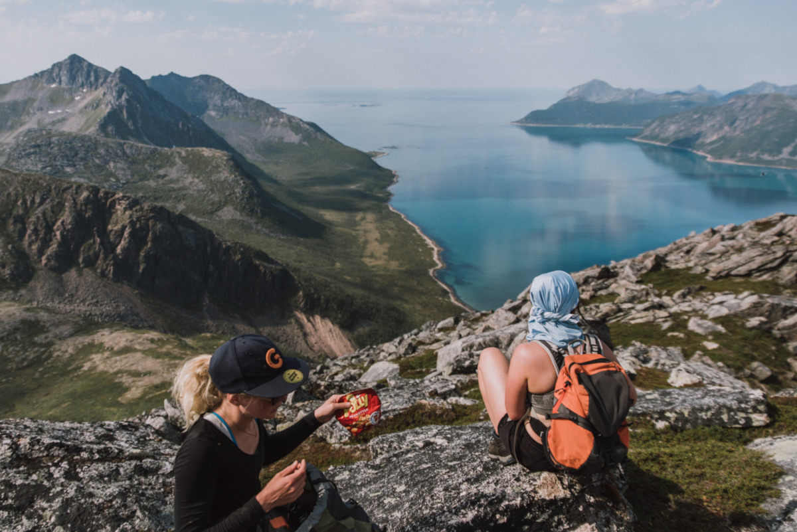

  Kleine Pause auf dem Kvænan

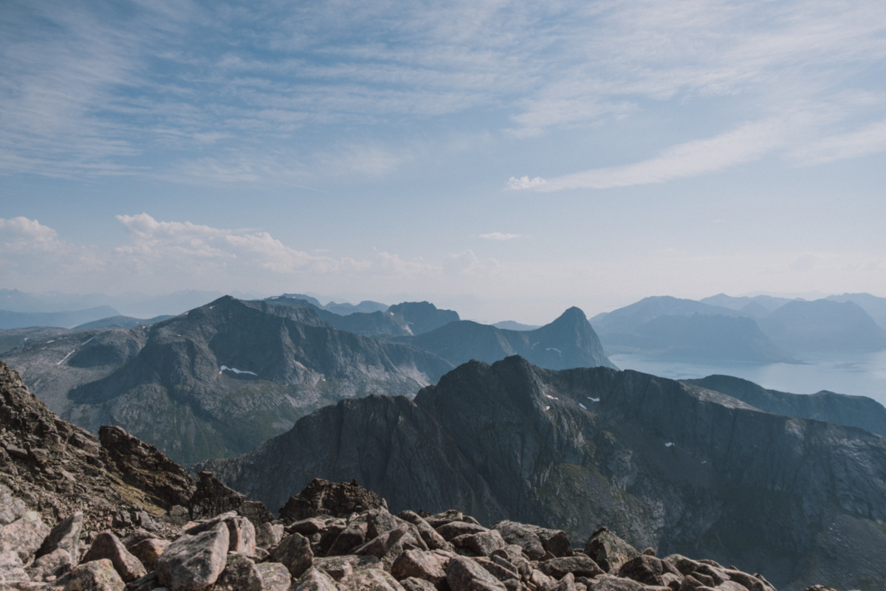

  Aussicht vom Kvænan

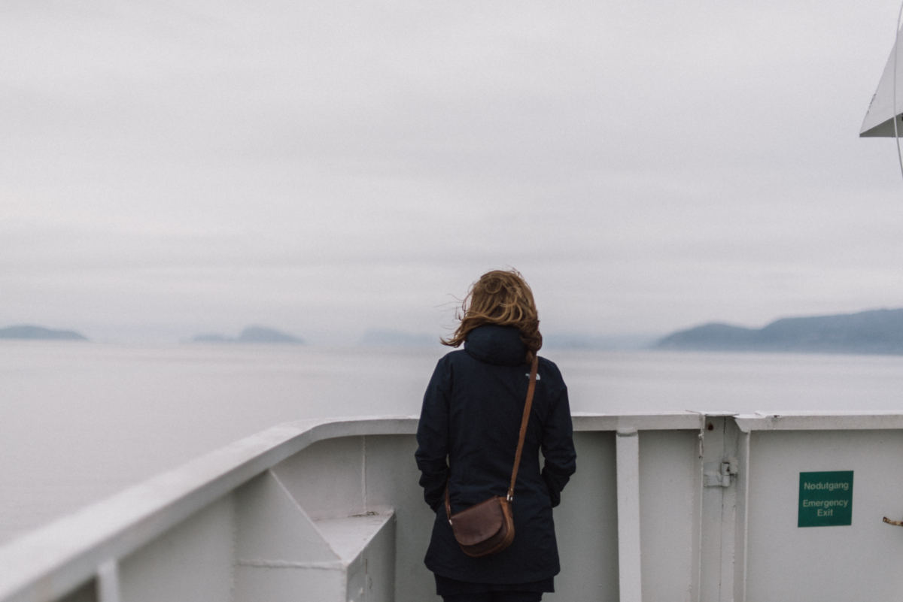

  Auf der Fähre

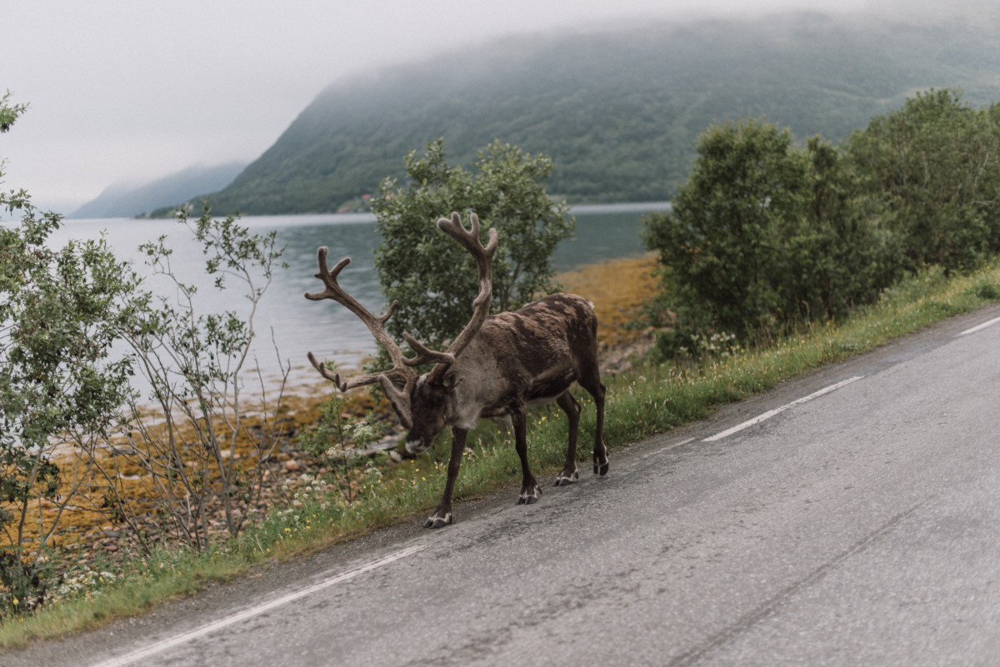

  Rentiere wirken erstaunlich tapsig mit ihren grossen Füssen, dünnen Beinen und dem überdimensionierten Geweih!

Fotos: [Damaris Berger](http://www.dmrsbrgr.com/)
