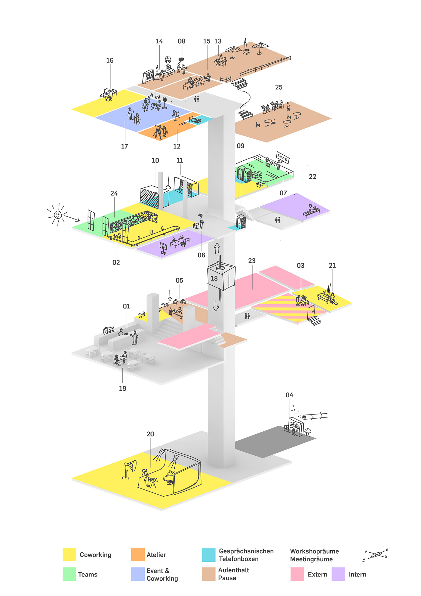

+++
title = "Ein Effinger-Tag im 2022"
date = "2022-03-21"
draft = false
tags = [ "Coworking", "Community", "Colearning", "Kaffeebar", "Kunst" ]
image = "effinger-visualisierung.jpg"
description = "Wie sieht eigentlich ein normaler Tag im Effinger aus? Tauch mit uns ein und erleb einen ganz normalen Effinger Tag."
authors = ["Fabian Steiner", "Domenica Hitz" ]
comments = true
+++

Wie sieht eigentlich ein normaler Tag im Effinger aus? Wie viele Leute sind vor Ort, wo arbeiten sie und an was? Tauch mit uns ein und erleb einen ganz normalen Effinger Tag.

Donnerstag Morgen, 7.15h

**Martina** kommt an ‘ihrem’ Effinger Tag gerne immer früh, dann ist es noch ruhig und gemütlich. Sie kommt über die Kaffeebar in den Effinger. An der Bar wird sie von **Nico** begrüsst, er fragt bei ihr nach, ob ihre Entwürfe von letzter Woche heute fertig werden würden `(01)`. Martina hofft es. Mit dem Lift erreicht sie den 1. Stock, in der Coworking Zone hat sie noch freie Platzwahl. Heute wählt sie den Fensterplatz, die Frühlingssonne scheint schon fast herein `(02)`.

Kopfhörer aufsetzen und los gehts.

Am selben Tag, 7.30h **Martin** kommt übers Atelier in den Effinger, sein Lieblingsplatz zum Arbeiten ist hier `(03)`. Die Atmosphäre in diesem kreativen Raum hilft ihm beim Arbeiten, auch wenn es heute ‘nur’ die Buchhaltung seiner Einzelfirma ist und nicht wirklich kreatives Arbeiten, so ist er doch gerne hier.

Bevor er allerdings sein Laptop aufklappt, holt er sich an der Kaffeebar noch ein Espresso. Ohne Koffein kommt er eh nicht in die Gänge, deshalb ‘Coffee first’.

An der Kaffeebar trifft er auf **Hannes**. Er bespricht grad mit **Nico** an der Bar, ob er heute wieder den Kaffeesatz am Ende des Tages abholen kann - im Keller des Effingers werden nämlich seit neustem Edelpilze auf Kaffeesatz gezüchtet `(04)`. **Martin** ist passionierter Pilzler und möchte von **Hugo** alles über die Pilzfarm im 2. UG wissen. Sie verabreden sich für eine kleine Führung nach der 10h-Kaffeepause.

Kurz vor 8 kommt **Remo**, im Schlepptau hat er seine kleine Tochter **Marie**. Er ist heute Tageshost und richtet sich seinen Arbeitsplatz in der Lounge ein `(05)`, aus dem Atelier holt er die Bastelsachen für Marie: Papier, Leim, eine Schere und Klebeband und **Marie** ist für ein paar Stunden beschäftigt. **Remo** arbeitet nicht an eigenen Projekten sondern ist für den Coworking Space die erste Ansprechsperson: begrüsst neue Tagesgäste, hilft bei Druckproblemen `(06)` und lädt die Leute um 10h zur gemeinsamen Kaffeepause ein.

Pünktlich um 8h kommen die 4 Mädels eines Berner Food Startup. Ihre neuen Team Arbeitsplätze sind im 1. Stock `(07)`. Sie haben sich angewöhnt die ersten 30min ihre Mails zu checken, die dringendsten Anfragen zu bearbeiten und sich dann zu einem 1. gemeinsamen Kaffee in der Küche im 2. OG zu treffen, um den Tag zu besprechen und gemeinsame Termine zu koordinieren `(08)`.

Als sie um 9.15h an ihre Team Arbeitsplätze zurück kehren, ist die Coworking Zone im 1. OG mittlerweile gut belegt. Emsiges, aber stilles Treiben, einzelne Coworkerinnen sitzen in den Telefonkabinen `(09)` oder in 2er Meetings in den Nischen `(10)`.

Ins Auge stechen die 3 Jugendlichen, die hier zusammen in einer Nische sitzen `(11)`. Sie diskutieren angeregt über die Finanzen ihres Lernunternehmens: die Pilzfarm Bern. Nicht nur theoretisch irgendwelches Wissen vermittelt bekommen, sondern selber aktiv die Lerninhalte gestalten, das ist das Hauptanliegen des Projekts ‘Colearning’ im Effinger. Die Lebenswelt von Jugendlichen und Erwachsenen zusammenbringen und gemeinsam immer wieder Neues lernen. Der Effinger ist der perfekte Ort dafür. In der 10h-Kaffeepause erzählt **Meril** von seinem Schnuppertag als Winzer am Bielersee, **Paula** ist in den letzten Korrekturen ihres ersten Fantasy Romans und berichtet von ihren Schwierigkeiten einen guten Abschluss für ihre Geschichte zu finden und **John** bereitet sich auf die Aufnahmeprüfung fürs Gymnasium vor.

**Nicole** kommt am liebsten um 10h in den Effinger, dann treffen sich nämlich alle Coworker\*innen zum gemeinsamen Kaffee in der Lounge, am liebsten startet sie ihren kreativen Tag mit einer Tasse Chai Latte mit Hafermilch in einer geselligen Runde. Der Austausch, die neuen Ideen und Gesichter inspirieren sie dann für ihr weiteres Arbeiten im 2. OG im Künstler*innen Atelier `(12)`. Endlich hat sie einen physischen Raum für ihre Kunst gefunden, aber auch eine Heimat für ihre Ideen und ihre Tun. Hier trifft sie auf andere Menschen, die sich mit Kunst beschäftigen, auf ganz vielfältige Weise. Besonders freut sie sich auf das Kunstzmittag das heute wieder stattfindet. Das Wetter ist frühlingshaft und sie treffen sich auf der Terrasse zum gemeinsamen Essen `(13)`. **Yolanda** hat für alle gekocht, in der grossen Küche im 2. OG ist das neu möglich: Mexikanische Reispfanne mit Joghurt und Minze `(14)`.

In der Küche trifft man zur Mittagszeit **Daniel** an. Er bringt jeweils sein eigenes Essen mit, die anderen staunen immer wieder über seine ausgefallenen Kreationen, die er am Abend vorkocht. Vielleicht könnte **Daniel** mal das Kunstzmittag kulinarisch verwöhnen.

**Daniel** arbeite am besten am Morgen, seine produktive Zeit ist dann. Er lässt sich durch nichts ablenken, die 10h Kaffeepause schwänzt er meistens, aber beim gemeinsamen Mittagessen ist er immer dabei. Der letzte, der noch am Tisch sitzt nach dem Mittagessen ist **Daniel** `(15)`. Wenn alle anderen schon wieder arbeiten, gönnt er sich ein Espresso in aller Ruhe.

Am Nachmittag wirds Zeit für die Eule **Jasmin**. Am frühen Morgen ist sie nicht mit 10 Pferden aus dem Bett zu bringen, aber sobald der Nachmittag anbricht, kommen ihre produktiven Stunden. An der Kaffeebar holt sie sich ein Matcha Latte und richtet dann ihren Arbeitsplatz im 2. OG ein `(16)`. Um optimal arbeiten zu können, braucht sie das kreative Chaos auf dem Tisch. Das ist ruckzuck hergestellt und schon gehts los. Heute gibts noch ein ‘Bier um 4’, Feierabend Bier trinken mit anderen Coworker*innen. Mal schauen, vielleicht ist sie dann bereit für eine erste Pause. Oder sie zieht grad durch bis zum Wohnzimmerkonzert, das heute im 2. OG stattfinden wird `(17)`. Bis dann spätestens möchte sie die letzten Korrekturen an ihrem Text abgeschlossen haben.

Auch **Lisa** kommt erst am späteren Nachmittag in den Effinger, sie hatte bis jetzt Termine bei Kund*innen. Etwas müde wartet sie in der Lounge auf **Stefan**. Sie wollen schauen, ob sie gemeinsam ein Kundenprojekt machen können, die benötigen Skills könnten sie zusammen gut abdecken. Erst kürzlich haben sich die zwei im Effinger kennengelernt und gemerkt, dass sie gut zusammenarbeiten können. Jetzt haben sie bereits den zweiten gemeinsamen Kunden. Mal schauen, ob es auch diesmal grad wieder so gut passt.

Um 19h treffen die 2 Musikerinnen - **Ava** und **Serpil** - fürs Wohnzimmerkonzert ein. Obwohl es ein unplugged Konzert ist, haben sie doch noch jede Menge Kabel und Technik dabei. Zum Glück gibt es einen Lift `(18)`, mit dem das Material in das 2.OG transportiert werden kann. Nach dem Einrichten essen die beiden noch Znacht in der Kaffeebar, die um diese Zeit gut gefüllt ist. Zum Glück wurde ein Tisch für die beiden reserviert `(19)`.

Um 20.30h dann startet das kleine Konzert, das in einem gut gefüllten Wohnzimmer in gemütlicher Atmosphäre einen schönen Abend verspricht. Um 23.10 verlassen **Mohamed** und **Julia** die Kaffeebar, ihre Schicht ist vorbei, alles ist aufgeräumt und wieder bereit gemacht für den nächsten Tag. Ein letzter Rundgang, ob alle Türen geschlossen sind, ob das Licht überall gelöscht wurde und die Stühle draussen angekettet sind.

Und so geht ein weiterer Tag im Effinger zu Ende.

### Was sonst noch so im Effinger geschieht

* `(20)` Peter und Rosalie streamen ein Podiumsgespräch im Filmstudio
* `(21)` In der Schreinerei zimmert Lukas ein neues Gestell
* `(22)` Maggie bietet jeden Donnerstag Nachmittag Massagen an
* `(23)` Jim Knopf Eisenbahnen AG mietet heute das Aquarium und wird als externer Gast vom Raumhost Sascha betreut
* `(24)` Hier ist das Team „Twister Web“ sesshaft und hat ihre Nische nach ihren Bedürfnissen eingerichtet
* `(25)` Roberto pflückt die letzten Himbeeren vom Hochbeet
