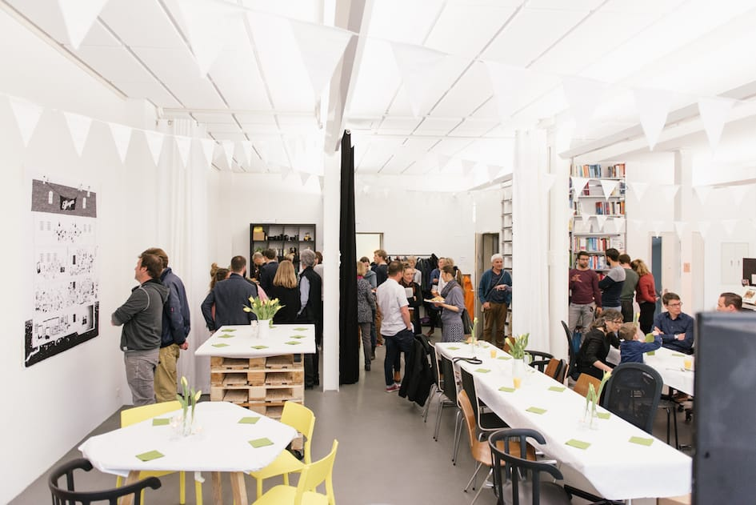
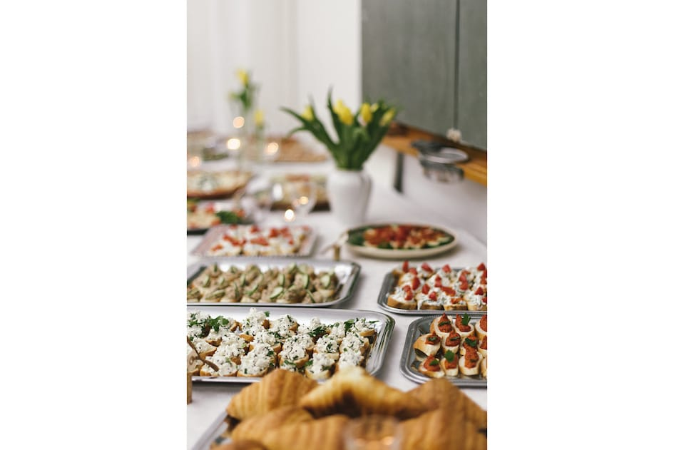
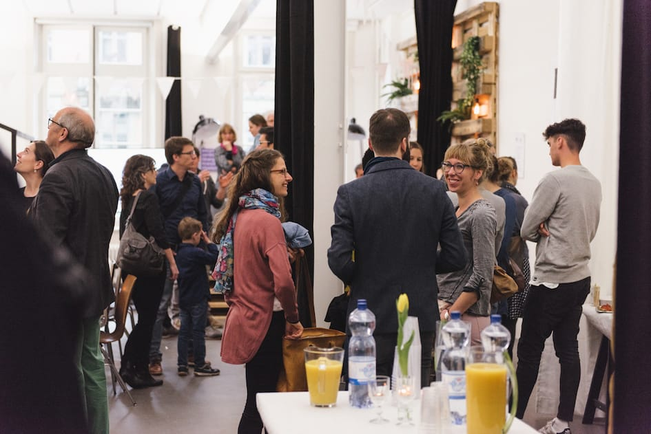
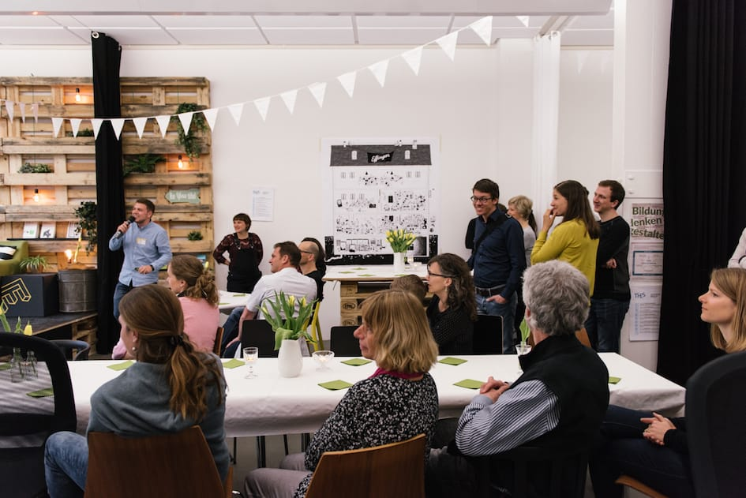
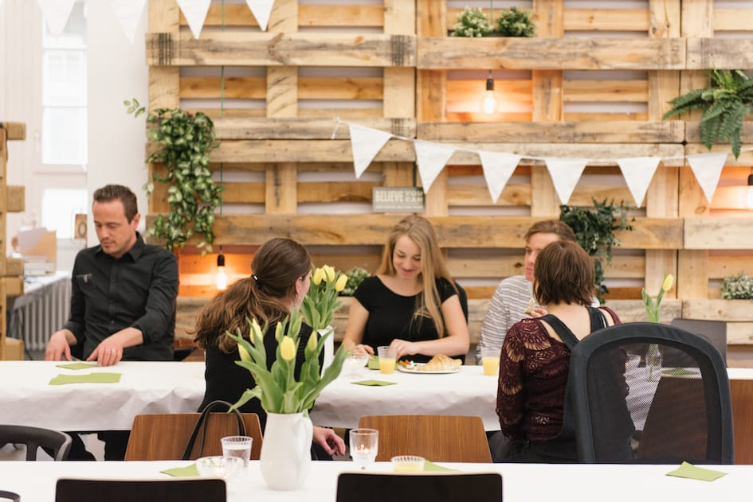
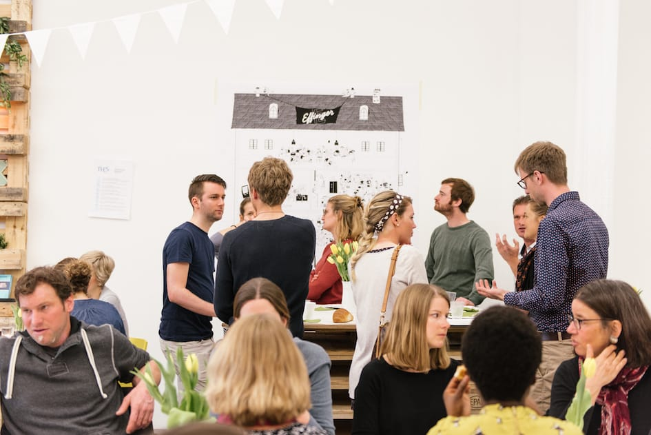
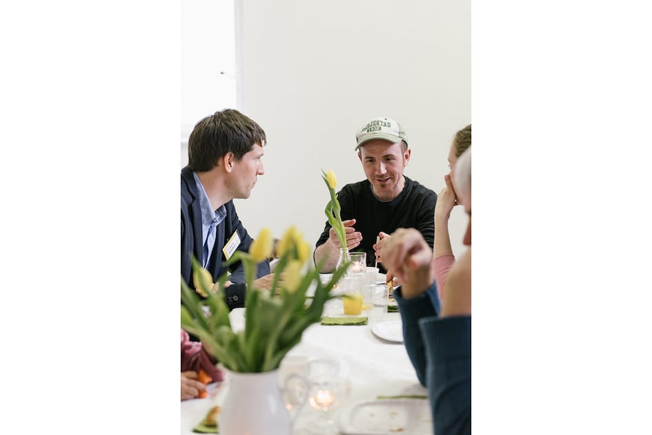
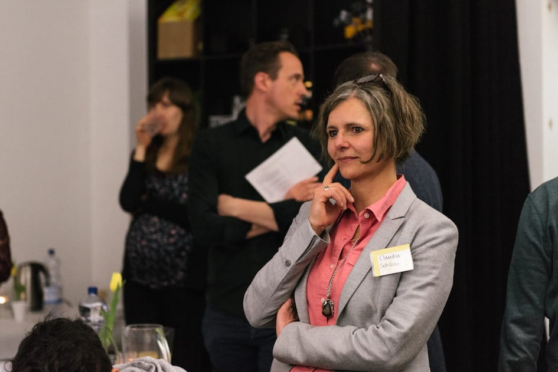

+++
title = "Ein Jahr Effinger"
date = "2017-05-21"
description = "Schön war es mit euch zu feiern und in Erinnerungen schwelgen. Wunderbar war es anzusehen, wie auch unser Jubiläumsfest die Vielfalt verkörpert hat, die im Effinger im letzten Jahr entstanden ist."
image = "thumb.jpg"
authors = [ "Urs Vögeli" ]
comments = true
tags = [ "Location", "Community", "Unterhaltung" ]
+++

  <iframe width="560" height="315" src="https://www.youtube.com/embed/Z3kyv0BdIvM?rel=0&amp;controls=0&amp;showinfo=0" frameborder="0" allowfullscreen></iframe>

  Schön war es mit euch zu feiern und in Erinnerungen schwelgen. Wunderbar war es anzusehen, wie auch unser Jubiläumsfest die Vielfalt verkörpert hat, die im Effinger im letzten Jahr entstanden ist.

Ob du als Stamm- oder Gelegenheitsgast in der Kaffeebar oder als Coworker, Colearner oder Communitymember bei uns warst, spielte für uns keine Rolle. Wir sind einfach enorm dankbar für die grosse Unterstützung, die wir erfahren durften und dankbar für die Geschenke und Gratulationen, die wir entgegennehmen durften.

Umso mehr war es auch unser Anliegen, euch allen etwas zurückzugeben. Es freut uns, dass unsere 2für1-Getränkaktion angekommen ist und unser Jubiläumskonzert mit Patrick Bishop am Freitagabend gut besucht war. Nebenbei haben auch noch Führungen durch den Effinger und ein Wettbewerb stattgefunden. Das Interesse am Effinger und an unserem Projekt ist ungebrochen gross und deshalb haben wir auch gerne allen Interessierten unseren Effinger gerne vorgestellt.

Der Abschluss unseres Jubiläums war dann der Memberbrunch am Samstagvormittag. Unterstützer, Freunde, Familie und Coworker wurden zu einem orientalischen Brunch eingeladen, denn ohne diese Personen wäre der Effinger nicht Realität geworden. Wir haben dabei alte Bilder der Baustelle bestaunt und auch das Jetzt genossen. Vieles ist entstanden und gewachsen in diesem Jahr, so dass man es jedoch kaum in Worte und Bilder fassen kann. So hat uns zum Schluss am meisten das Geschenk von Illustratorin Claudine Etter an die Community gefreut. Mit ihrer frischen Art hat sie ein 1,6 mal 1,4 Meter grosses Wimmelbild vom Effinger gezeichnet. Wer den Effinger nur ein bisschen kennt, wird darauf einige lustige Szenen und bekannte Effianer entdecken.

Herzlichen Dank an alle, die dieses Jubiläumsfest und unseren Effinger möglich gemacht haben!

  

    
  

  

    
  

  

    
  

  

    
  

  

    
  

  

    
  

  

    
  

  

    
  

<small>
  *<i class="fa fa-pencil" aria-hidden="true"></i> Urs Vögeli, <i class="fa fa-camera" aria-hidden="true"></i> [Damaris Berger](http://www.dmrsbrgr.com/), <i class="fa fa-video-camera" aria-hidden="true"></i> [Jonathan Hess](http://www.movingwater.ch/)*
</small>
