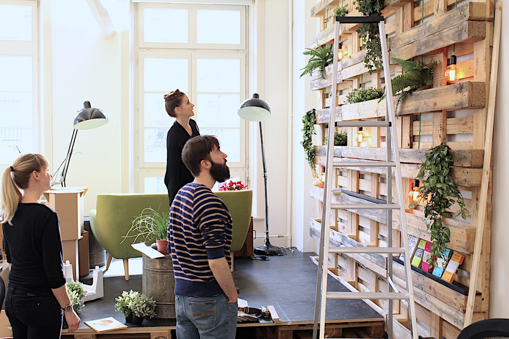
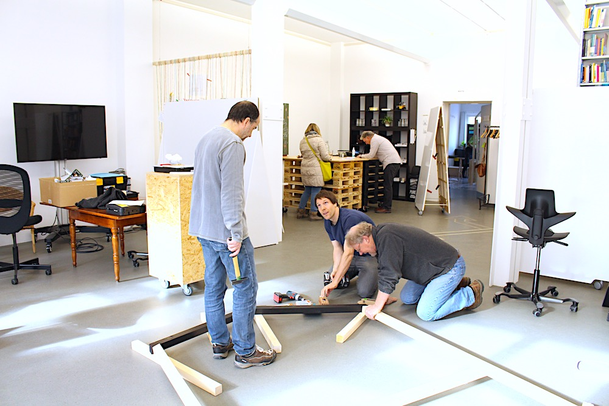
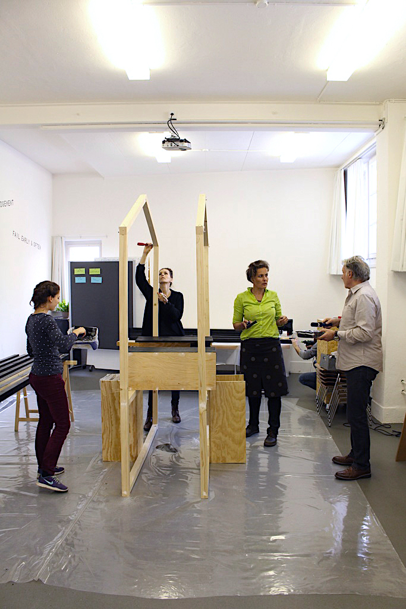

+++
title = "Ein Samstag im Effinger: 1. OG"
date = "2017-02-17"
description = "Wer sich in letzter Zeit an einem Samstag per Zufall ins 1.OG verirrt hätte, der hätte eine ganz emsige Werkel-Truppe antreffen können."
image = "1og_wand.jpg"
authors = [ "Claudine Etter" ]
comments = true
tags = [ "Coworking", "Community" ]
+++

  Wer sich in letzter Zeit an einem Samstag per Zufall ins 1.OG verirrt hätte, der hätte eine ganz emsige Werkel-Truppe antreffen können.

Bestückt mit Bohr- und Nähmaschinen, Pinseln, Spachtel, Kabeln und einem kleinen Urwald aus Plastik, wurde am Ambiente und der ganzen 1.OG Optik gefeilt und gezimmert. Hier ein grosses Merci an die Samstags-Helden, welche dazu beitrugen, dass die Coworking- sowie fixen Arbeitsplätze immer mehr zu einer Arbeits- und Wohlfühloase heranwachsen.

