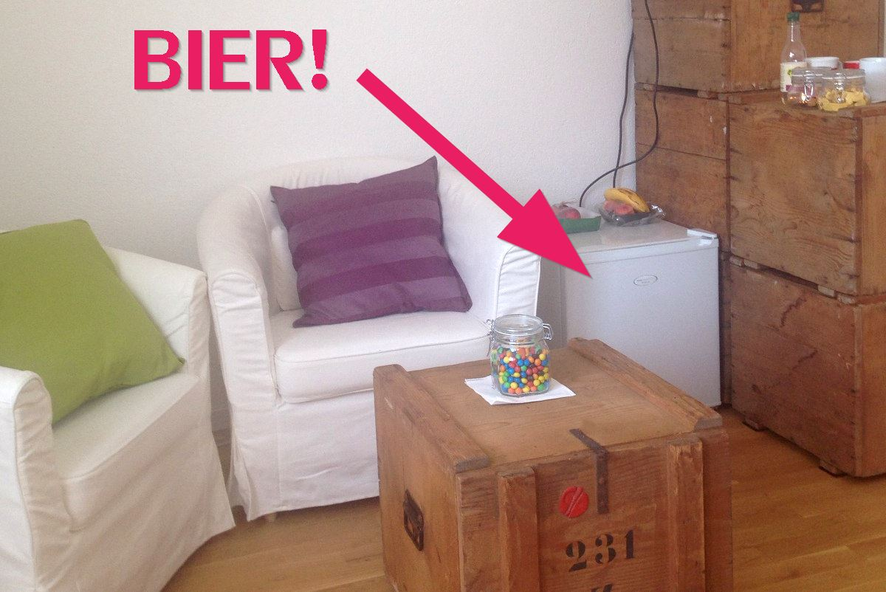
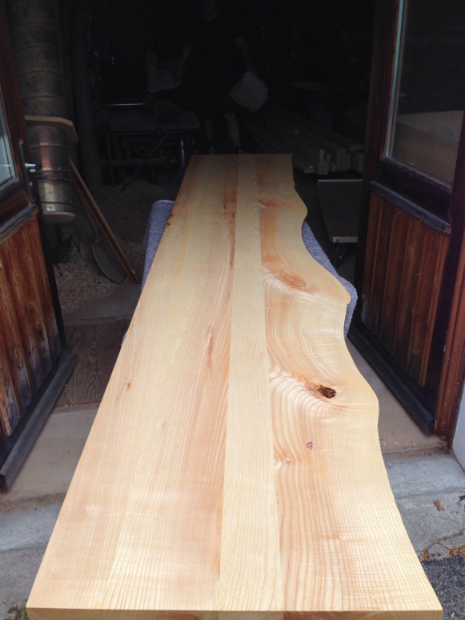
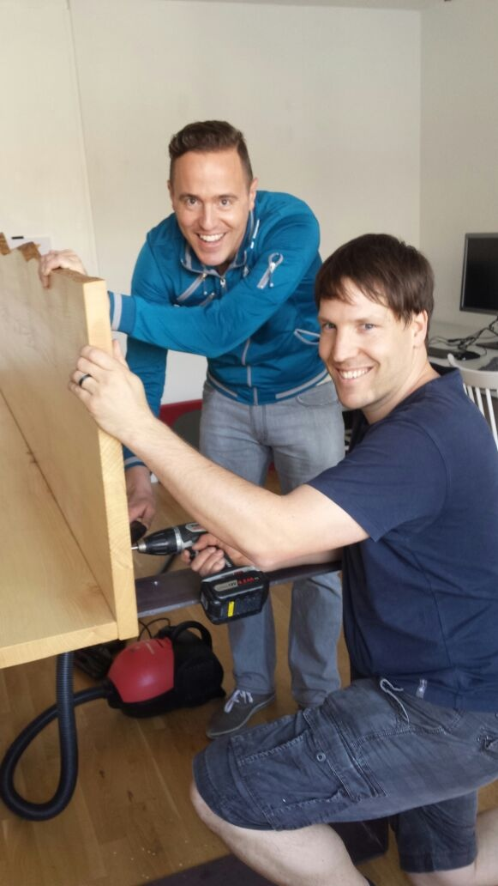
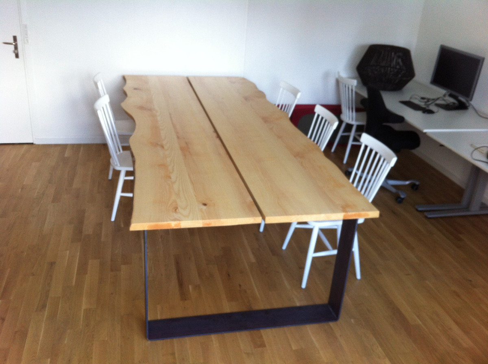

+++
title = "Ein Tisch aus Meisterhand und endlich kühles Bier"
date = "2015-06-14"
description = "Ich hatte die Hoffnung schon fast aufgegeben, dann meldete sich plötzlich der Rolf, er hätte da evtl. was..."
image = "bier.jpg"
author = "Marco Jakob"
comments = true
tags = [ "Coworking" ]
+++

Ich hatte die Hoffnung schon fast aufgegeben und dann meldete sich plötzlich der Rolf:

> Habt ihr einen Kühlschrank? Hätte da evtl. was...

Rolf ist super. Er betreibt selber einen Coworking Space an der Herrengasse in Bern und versteht somit, was in einem solchen Space nicht fehlen darf. Herzlichen Dank für den Kühlschrank!

*Übrigens, falls du noch einen coolen Arbeitsplatz suchst: Bei Rolf hat es gerade noch einen kleinen Raum frei zur alleinigen Benutzung. Er ist geeignet für ca. 2 Arbeitsplätze und kostet CHF 500.- pro Monat. Mehr [Infos auf Tutti](http://www.tutti.ch/bern/bern/immobilien/gewerbeobjekte/mietangebote/raum-in-altstadt-bern-naehe-zytglogge_6453691.htm).*

## Der Tisch

Mein nächster Held ist definitiv Timon! Er hat einen drei Meter langen Tisch geschreinert.

So sieht eine der beiden Tischplatten aus:

Die Montage in unserem *Coworking ZeitRaum* an der Aarbergergasse:

Und hier das fertige Meisterwerk:

Die Lücke in der Mitte ist dazu gedacht, dass die Coworker das Laptopkabel praktisch versorgen können. 

## Ab jetzt geöffnet

Designer-Tisch und kühles Bier sind nun schon zwei Gründe, warum du unbedingt mal vorbei schauen solltest. Wir sind jetzt offiziell geöffnet. Entweder kommst du zum Arbeiten oder auch einfach so vorbei auf einen Drink auf der Terrasse.

Auf der [neuen Seite "Space"](/space/) findest du alle Informationen zu unserem *Coworking ZeitRaum* an der Aarbergergasse.

Schreib doch kurz ein Mail, bevor du vorbei kommst, damit wir uns auch sicher nicht verpassen.

<i class="fa fa-beer"></i> Bis bald...

