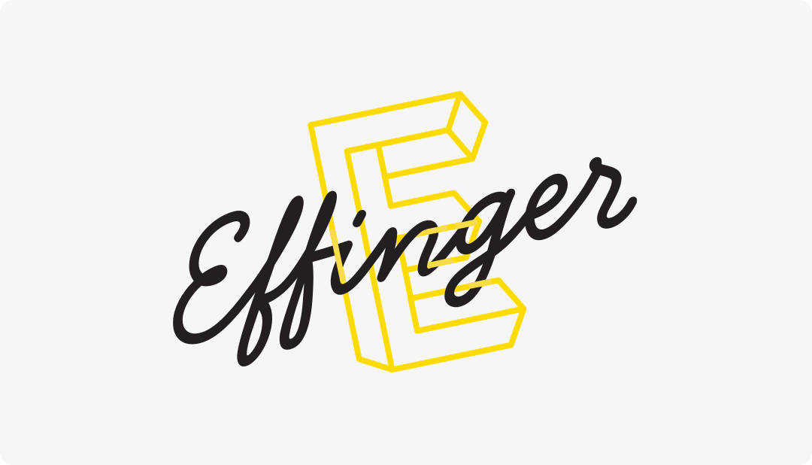

+++
title = "Zusammenführung von Verein und Kaffeebar"
date = "2025-02-14"
draft = false
tags = [ "Community" ]
image = "effinger_entscheid_2025.png"
description = "Die Effinger Community beschliesst, die Kaffeebar in die Vereinsstruktur zu integrieren."
authors = [ "Markus Roos"]
comments = false
+++

Die Effinger Community beschliesst, die Kaffeebar in die Vereinsstruktur zu integrieren.

Der Effinger hat am Community-Treffen vom 12.2.2025 nach intensiven Diskussionen ein Upgrade der Strukturen beschlossen. Dem Entscheid ist ein längerer, vielschichtiger Konflikt vorausgegangen, der trotz verschiedener Initiativen nicht gelöst werden konnte.

Die Struktur soll so angepasst werden, dass im Effinger alles unter einer Einheit läuft. Der Verein (Coworking Community Bern) ist bereits der Hauptmieter der Liegenschaft an der Effingerstrasse 10. Der Untermietvertrag mit der Effinger Kaffeebar GmbH wird aufgelöst. Der Verein führt anschliessend die gesamte Fläche im Erdgeschoss selbst. Dafür wird ein neues Gesamtkonzept entwickelt. 

Das Upgrade steht aber vor allem für Aufbruch. Das Ziel ist es, das Ganze zu wahren und was heute getrennt ist zusammenzuführen. Administrative und gastgeberische Vereinfachungen, gemeinsamer Gestaltungs- und Kreativraum, Einbindung von Angestellten in die Community sind angestrebte Vorteile dieser Zusammenführung. Der Aufbau, die interne Konfliktaufarbeitung und entsprechende Learnings für die Organisation, sowie die Anpassung der Strukturen werden nun auch Zeit benötigen. Menschen, die an der gemeinsamen Vision des Effingers mitarbeiten und mit Freude und Kraft gestalten wollen, sind herzlich eingeladen. 

  <section class="page-section bg-gray mb-20 pt-40 pb-10">
    

      <figure class="text-center">
        <blockquote class="blockquote">
          
Wir sind eine innovative, kreative Community mit einem gemeinsamen Coworking Space und Kaffeebar in Bern. Wir sind eine Heimat für Jungunternehmer, Kreative und andere Weltveränderer, die einander helfen, ihre Ideen in Firmen, Innovationen und soziale Aktionen umzusetzen.

        </blockquote>
        <figcaption class="blockquote-footer">Effinger Vision, 2015</figcaption>
      </figure>
    

  </section>

Nach bald 10 Jahren Effinger Kaffeebar und Coworking Space (10-Jahres-Jubiläum im 2026) wollen wir Raum schaffen für frische Ideen. Aus diesem Grund haben wir uns Ende 2024 zwei Leitsätze gesetzt für das Jahr 2025:

- “Mehr Spielplatz sein und weniger Institution.”
- “Eine lebendige Community ist uns wichtiger als im Jahresrhythmus steigende Umsätze.”

Unter der Leitung eines neuen Circles wird im Frühling 2025 ein Konzept erarbeitet für die Bespielung des gesamten Effinger-Erdgeschosses. Es wird zudem ein Upgrade für das Gesamtprojekt Effinger nach 10 Jahren nötig sein. Die erweiterte Community und das aktuelle Kaffeebar-Team werden zur Mitwirkung am Konzept eingeladen.
