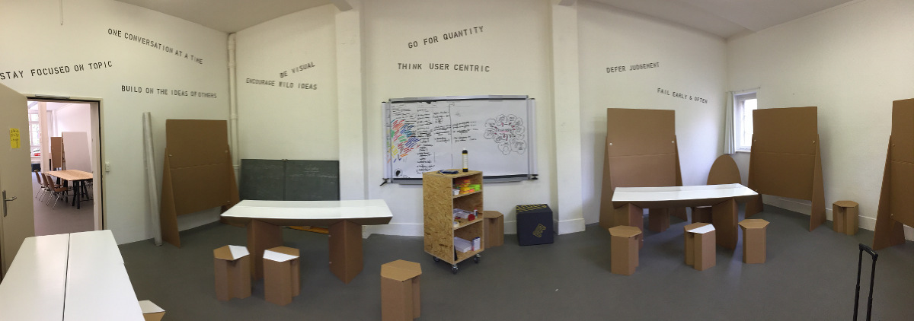
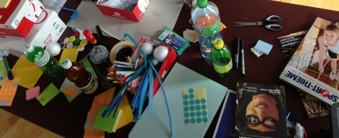
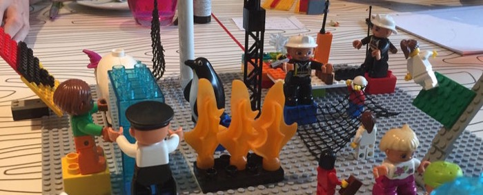
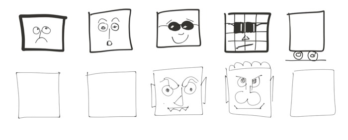
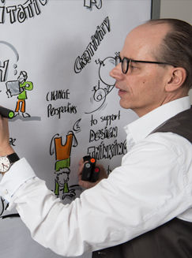

+++
title = "Eröffnung 1. Obergeschoss"
date = "2016-10-21"
description = "Seit Anfang Oktober gibt es den Effinger auf drei Geschossen. In den letzten vier Wochen haben viele von uns mit viel Elan das 1. Obergeschoss mit über 220m2 eingerichtet. Nun laden wir euch zu einer Kostprobe der neuen Räume und der Workshops ein."
image = "design-thinking-raum.jpg"
authors = [ "Daniel Osterwalder" ]
comments = true
tags = [ "Location", "Workshops" ]
+++

  Seit Anfang Oktober gibt es den Effinger auf drei Geschossen. In den letzten vier Wochen haben viele von uns mit viel Elan das 1. Obergeschoss mit über 220m2 eingerichtet. Nun laden wir euch zu einer Kostprobe der neuen Räume und der Workshops ein.

Am **Freitag, 28. Oktober 2016 von 15 bis 18 Uhr** öffnet der Effinger die Türen des 1. Obergeschosses. Neben Rundgängen durch die Räume erhalten die Besucher/innen einen kleinen Vorgeschmack auf die Workshops, welche ab 2017 im Effinger stattfinden werden. Daniel Osterwalder (mehr Infos zu seiner Person ganz unten oder auf [Daniels Website](http://www.visualdynamics.ch/design-thinking-innovation-und-changemanagement/facilitation/)) gibt jeweils eine praktische Einführung in folgende Workshops:

> &gt; Eröffnung und Mini-Workshops am Freitag, 28. Oktober ab 15 Uhr

## Mini-Workshop Design Thinking (15.00 Uhr)

Du kennst das: Da kommen deine Kolleginnen und Kollegen und erzählen begeistert davon, wie es war, mit wenigen Materialien einfache und erste Prototypen von ganz neuen Ideen zu entwerfen. Design Thinking oder Human Centered Design arbeitet genau damit: Rasch und ideenreich, phantasievoll und sehr auf Fehler aus entwickeln wir einfache erste Lösungen, die wir mit unseren Kunden oder Stakeholdern testen. Passt es, funktioniert das, was ich mir überlegt habe? "Go for quantity", "encourage wild ideas" oder "defer judgement" sind dabei nicht einfach coole Slogans, sondern eine neue, andere Denke und Grundhaltung, offen und agil in die Welt zu blicken. Du wirst in unserem kurzen amuse-bouche Workshop vielleicht schon vom Virus der Kreativität heimgesucht und dir wünschen, davon noch mehr zu bekommen!

## Mini-Workshop LEGO® SERIOUS PLAY® (16.00 Uhr)

Du hast vom Power und dem Zauber der LEGO® SERIOUS PLAY®-Methoden und -Materialien gehört und willst dies kennenlernen, weil du davon überzeugt bist, dass wir Dinge ganz neu denken, wenn wir dies mit der Hand tun. Und schliesslich begeistert es dich immer wieder, wenn jemand eine Story so erzählt, dass allen alles wie Schuppen vor den Augen fällt.
Dann bist du hier richtig! Denn wir bauen unsere Ideen und möglichen Konzepte und erzählen einander dann auch gleich die Story, die dahintersteckt. Und da du dein Modell mit vielen LEGO® SERIOUS PLAY®-Bricks aufgebaut hast, kannst du damit deine Story gleich auch ganz anders erzählen, nämlich bunt, überraschend, rund und zauberhaft. Wir werden in diesem amuse-bouche Workshop gleich in die Arbeit mit den berühmten Bricks eintauchen und du wirst dann wissen, was dich im 2017 beim dreitägigen Training erwartet.

## Mini-Workshop Visualisieren (17.00 Uhr)

Auf unterhaltsame und abwechslungsreiche Weise entdeckst du rasch einige Fertigkeiten dafür, mit wenigen Strichen, einfachen Grundfiguren, mit wenig Farbe und einem schönen Titel Visualisierungen zu erstellen, wovon du bisher nur geträumt hast.
Gut, du sagst jetzt: Hilfe, ich kann nicht zeichnen – wie soll das gehen! Sei versichert: Du tauchst rasch in Bilderwelten ein und findest Wege, komplexe Geschichten mit wenigen Strichen aufs Blatt zu zaubern.

Was nimmst du mit? Einen ersten Eindruck, was im 2017 in unseren Visualisierungsworkshops im Effinger so alles abgeht!

## Du bist eingeladen

Komm einfach vorbei. Eintritt frei. Limitierte Plätze. Wir freuen uns auf dich.

---

### *Daniel Osterwalder*

  

    

    
    

  

  

    

     <em>Daniel Osterwalder ist Gründer und Facilitator bei der in der Schweiz ansässigen <a href="http://www.visualdynamics.ch/">Osterwalder & Stadler GmbH</a> und arbeitet als Design Thinker, Change Facilitator, Lego Serious Play Facilitator und Graphic Recorder. Daniel Osterwalder begleitet seit rund 15 Jahren Organisationen in Veränderungsgeschichten zu Themen wie Excellence, Wissensorganisation, Qualitätsentwicklung, Changemanagement und Lernen. Dabei stehen so unterschiedliche Schwerpunkte wie Visionen, Strategieentwicklung, Geschäftsmodellierung, Personalentwicklung, Problemlösung, Prototyping für Leadership, Stadt- und Quartierentwicklung oder schlicht die gänzliche Neuentdeckung innovativer Ausbildungs- und Weiterbildungsansätze im Brennpunkt.</em>
     

   

 

