+++
title = "Der erste Monat im Effinger"
date = "2016-04-22"
description = "Seit der Eröffnung des Effingers ist nun ein Monat vergangen. Langsam kehrt etwas Ruhe ein und ich kann mir die Zeit nehmen, auf diese erste Etappe zurückzublicken."
image = "eroeffnung.jpg"
authors = [ "Marco Jakob" ]
comments = true
tags = [ "Coworking", "Kaffeebar", "Community" ]
+++

Seit der Eröffnung des Effingers ist nun ein Monat vergangen. Langsam kehrt etwas Ruhe ein und ich kann mir die Zeit nehmen, auf diese erste Etappe zurückzublicken.

## Eröffnungsfeier

Was für ein Tag! Von früh bis spät kamen viele, ja ganz viele Leute im Effinger vorbei und haben mit uns gefeiert. Wir konnten einfach nur staunen und haben versucht, möglichst viele Personen persönlich zu begrüssen und sie durch die Räumlichkeiten zu führen.

  

    
  

  

    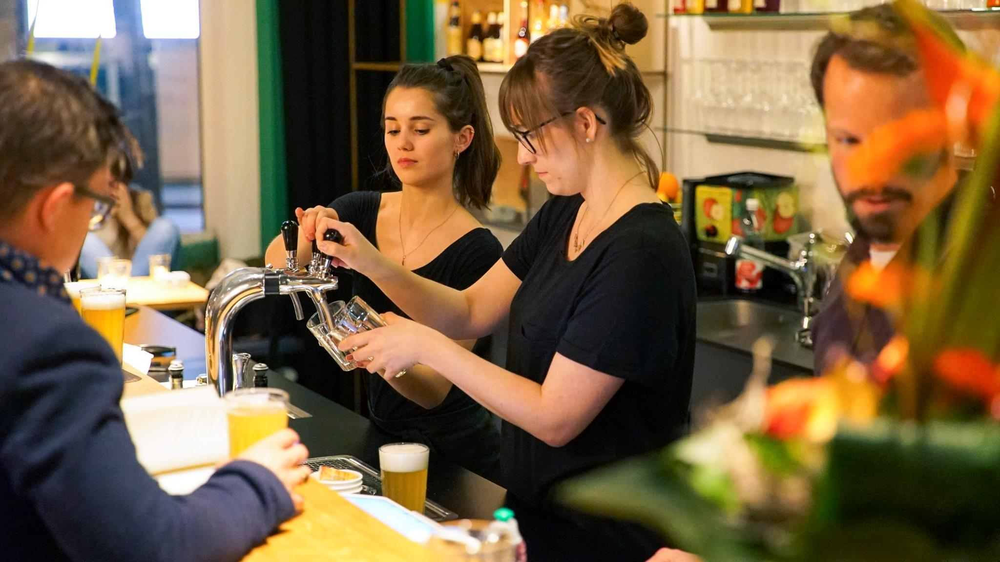
  

  

    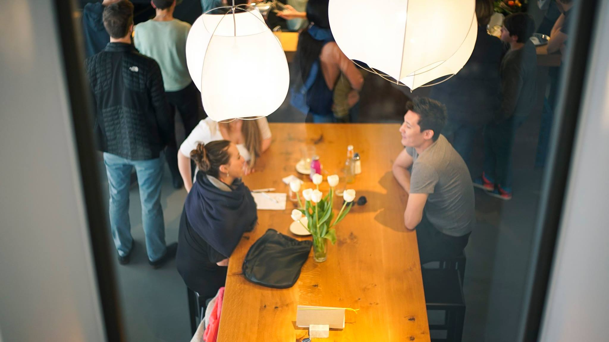
  

  

    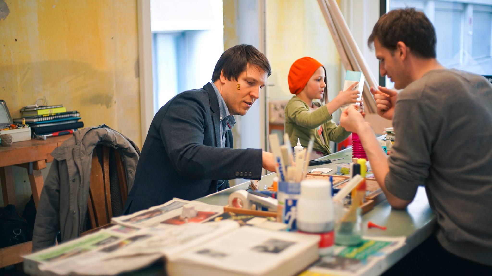
  

  

    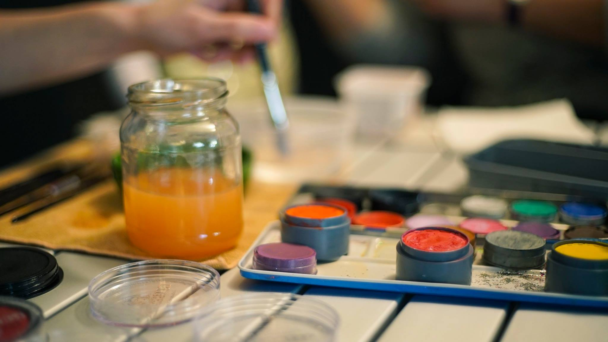
  

  

    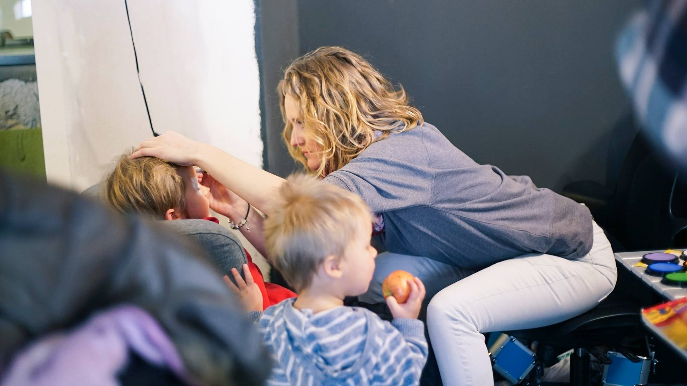
  

  

    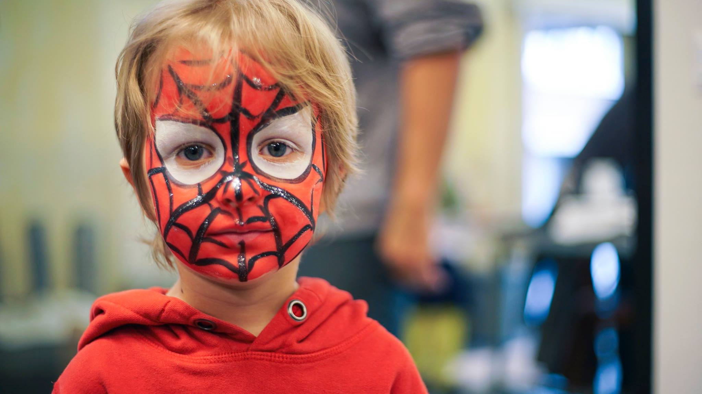
  

  

    
  

  

    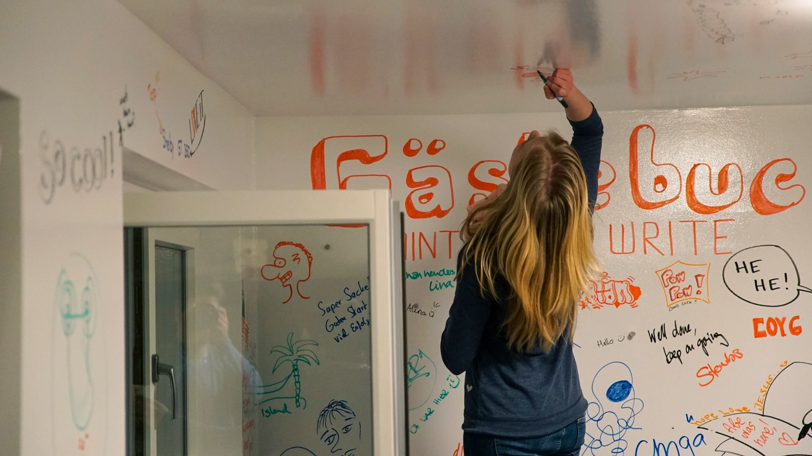
  

  

    
  

  

    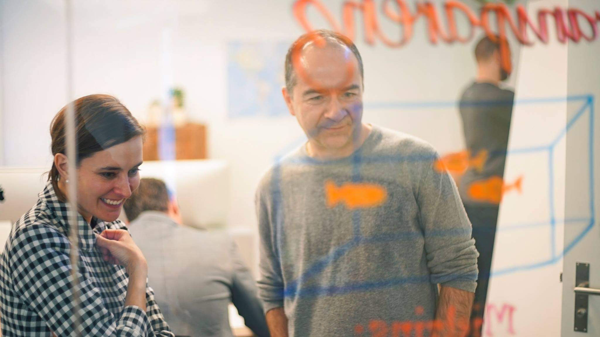
  

  

    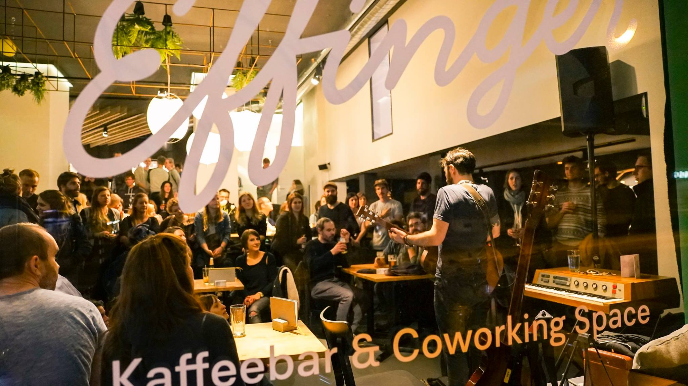
  

  

    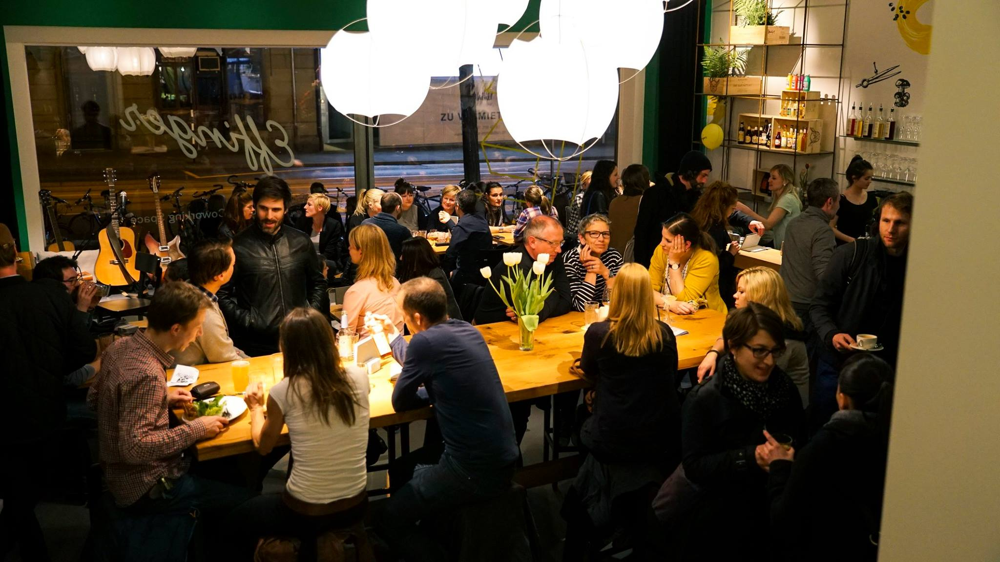
  

  

    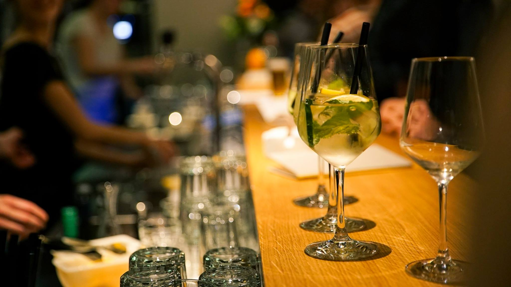
  

  

    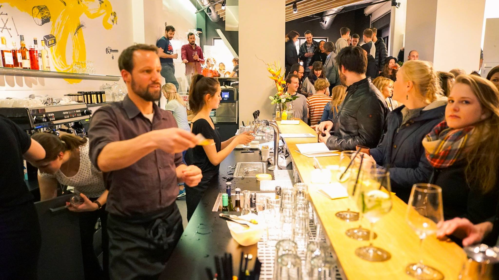
  

  

    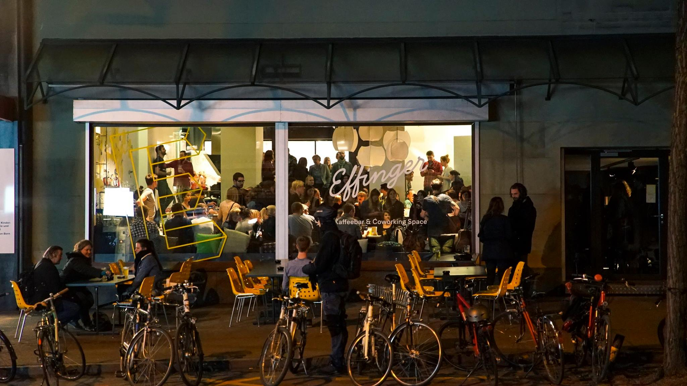
  

## Überwältigt und dankbar

Die Community und alle, die irgendwie zum Gelingen vom Effinger beitragen, sind inzwischen so viele Leute, dass es eine grosse Herausforderung oder fast unmöglich ist, allen die Wertschätzung für ihren Beitrag zu zeigen. Trotzdem bemühen wir uns, [Dankbarkeit](/grundsaetze/dankbarkeit/) zu leben. Inzwischen fühlt sich unsere Organisation immer "organischer" an (im Gegensatz zu "hierarchisch"), so dass an ganz unterschiedlichen Ecken plötzlich Neues hervorspriesst. Genauso braucht es uns als ganze Community, um Engagement von Einzelnen überhaupt zu sehen und Dankbarkeit auszudrücken.

Es sei hier einfach nochmals gesagt: **Herzlichen Dank!** Danke, dass du Teil vom Effinger-Abenteuer bist, dass du mitverfolgst, mitfinanzierst, mithilfst, mitleidest und dich mit uns freust.

## Wie es läuft

Wie viele Personen mitfiebern, merkt man auch an der Frage "Wie läuft's?", die uns immer wieder gestellt wird. Man kann sicher sagen, dass die [Kaffeebar](/kaffeebar/) sehr gut besucht ist. Wir wussten zuerst nicht, ob das die Eröffnungsneugier ist. Aber die Besucherzahlen bleiben auch nach einem Monat konstant hoch. Yeah!

Mit den Besuchen im [Coworking](/coworking/#coworking) können wir auch zufrieden sein. Fast jeden Tag kommen neue Leute vorbei, um Coworking im Effinger auszuprobieren. Viele lösen dann ein Zehnerabo. Auf mehrfachen Wunsch haben wir eingeführt, dass die Zehnerabos auch halbtageweise à 4 Stunden aufgebraucht werden dürfen. Jeder Coworker ist selber dafür verantwortlich, das Zehnerabo zu holen und die Tage abzustreichen. Da üben wir uns in gegenseitigem [Vertrauen](/grundsaetze/vertrauen/).

Ich bin fasziniert davon, wie in unserem [Atelier](/coworking/#atelier) und bald auch in der Werkstatt immer mehr Kunstwerke entstehen. Es zeigt sich langsam, wie der gemeinsame Raum durch Kreative genutzt werden kann. Da sie mehr Material brauchen als Laptop-Arbeiter, werden sie ihre Sachen je in einem Rollkorpus verstauen, den man auch mit dem Lift in den Keller fahren kann. Wenn jemand Interesse hat an einem kreativen Arbeitsplatz im Atelier oder in der Werkstatt - jetzt wäre ein guter Moment, um sich zu melden (z.B. bei Graziella). Es hat noch Plätze frei, aber die könnten dann auch recht schnell weg sein.

Der [Workshopraum](/coworking/#workshopraum) mit der flexiblen Einrichtung und den beschreibbaren Wänden wurde bereits von etlichen externen Firmen gemietet. Erste Events wurden im [Atelier](/coworking/#atelier) und der Lounge durchgeführt. Beim Hosten von Events sind wir noch am Ausprobieren, was funktioniert und für uns vom Aufwand her machbar ist.

## Wie es *wirklich* läuft

Das war jetzt die etwas oberflächliche Antwort auf die Frage, wie es läuft. Natürlich ist es wichtig, dass die Räume ausgelastet sind, damit wir auch die Miete bezahlen können (übrigens werden wir die genauen Finanzzahlen auf der Website veröffentlichen, sobald wir mit dem April Daten vom ersten ganzen Monat haben).

Doch beim Coworking geht es nicht in erster Linie um das "Teilen von Arbeitsplatz". Also auch nicht zuerst um "Sharing Economy", obwohl Journalisten im Moment diesen [Aspekt](http://www.derbund.ch/bern/nachrichten/Das-Buero-ist-auch-ein-Kaffeehaus-/story/29110609) [stark](http://www.bernerzeitung.ch/wirtschaft/wie-das-teilen-von-wohnungen-und-bueros-in-der-schweiz-einzug-haelt/story/15225745) [betonen](http://www.srf.ch/news/regional/bern-freiburg-wallis/coworking-mehr-als-ein-hippes-gemeinschaftsbuero).

Die meisten Coworker arbeiten nicht hier, weil sie sonst keinen Arbeitsplatz hätten. Wir könnten überall arbeiten: zu Hause am Küchentisch, in einer Bibliothek, im Zug, im Café oder im Büro einer Firma. Wir sind aus anderen Gründen hier (am besten fragst du bei einzelnen mal nach). Ein Hauptgrund ist, dass man sich an vielen Orten isoliert fühlt. Wir wählen ganz bewusst den Coworking Space, da wir hier inspirierter und produktiver arbeiten können, und weil wir hier nicht alleine sind, sondern unter Leuten, die ähnliche Kämpfe und Freuden durchleben wie wir. Es geht also um Community und nicht in erster Linie um den geteilten Arbeitsplatz.

Nun wird die Frage, wie es läuft, schon etwas komplizierter. Man müsste nämlich fragen, **wie es uns als Community geht**: Wie steht es um die Beziehungen? Wie laufen die einzelnen Unternehmen und Projekte der Coworker? Wie hoch ist die Arbeitsbelastung für den Betrieb des Effingers? Wie viel Zeit bleibt z.B. noch für Ping-Pong spielen und Erholung?

Einen Ping-Pong Tisch erhalten wir dieses Wochenende - das ist schon vielversprechend und ich freue mich riesig! Die anderen Fragen kann ich nicht so schnell beantworten. Da kommst du am besten vorbei zum Mittagessen oder zum Coworken und sprichst uns direkt darauf an.
