+++
title = "Die Evolution der Community-Treffen"
date = "2017-08-30"
description = "Wir haben uns über die letzten drei Jahre rund ein Mal pro Monat als Community getroffen. Natürlich hiess es zu Beginn noch nicht Community-Treffen und auch sonst haben sich diese Treffen stark gewandelt. Schauen wir zurück, wie sich unsere Treffen verändert haben und blicken auch vorwärts, wie sie sich in Zukunft weiterentwickeln könnten."
image = "2017-03-virtual-reality.jpg"
author = "Marco Jakob"
comments = true
tags = [ "Community" ]
+++

Wir haben uns über die letzten drei Jahre rund ein Mal pro Monat als Community getroffen. Natürlich hiess es zu Beginn noch nicht Community-Treffen und auch sonst haben sich diese Treffen stark gewandelt. Schauen wir zurück, wie sich unsere Treffen verändert haben und blicken auch vorwärts, wie sie sich in Zukunft weiterentwickeln könnten.

## How-the-Heck Abende

Ganz zu Beginn (Ende 2014 / Anfang 2015) luden wir ein zu How-the-Heck Abenden. Wir waren ziemlich nervös am [ersten Abend](/blog/how-the-heck/) und überrascht, dass gleich 30 Personen aufgetaucht sind, um sich die Frage zu stellen, wie denn etwas Neues in Bern entstehen könnte.

Diese Abende waren vor allem als Workshops organisiert. Alle Möglichkeiten standen offen und es gab vor allem viel zu Diskutieren.

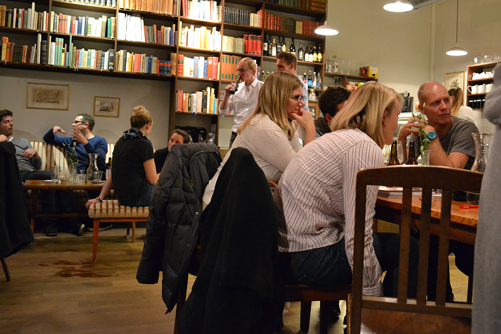

  Erster How-the-Heck Abend im <a href="http://www.apfelgold.ch">Apfelgold</a>.

Zwischen How-the-Heck Abenden und öffentlichem [Pop-up Coworking](/blog/erstes-popup-coworking/) gab es natürlich etliche Treffen als frühes Team im kleinen Rahmen.

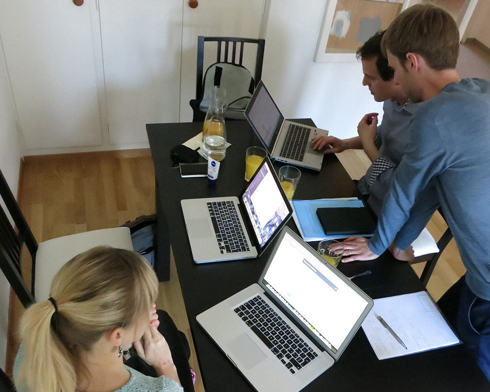

  Teamtreffen in der Wohnung von Salome.

## Erste Community-Treffen

Im Frühling 2015 begannen wir langsam von Community-Treffen zu sprechen. Diese waren klein und fanden meist mit rund 5 - 8 Personen statt.

In dieser Zeit entwickelten wir die Idee, dass wir doch den [Coworking Space zusammen betreiben und soziokratisch entscheiden](/blog/coworking-space-zusammen-betreiben/) könnten. Dies haben wir schliesslich ziemlich genau so umgesetzt. Verrückte Ideen wie [einen gemeinsamen Geldtopf](/blog/gemeinsamstaendigkeit/) oder die [Gemeinsamständigkeit](/blog/absurde-idee-gemeinsamstaendigkeit/) sorgten für kontroverse Diskussionen. Einzelne Aspekte davon haben wir tatsächlich umgesetzt, aber es gibt bestimmt noch viel Potenzial in diesem Bereich.

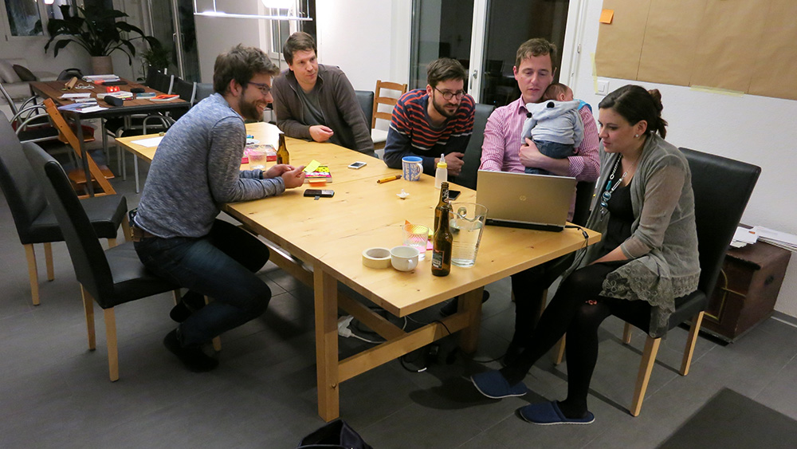

  Austauschabend über inspirierende Literatur.

## Regelmässige Treffen in der Aarbergergasse

Ab Mai 2015 hat das ständige Umherziehen ein Ende: Wir mieten ein [kleines Büro an der Aarbergergasse](/blog/aarbergergasse-es-geht-los/). Das Schmuckstück mit toller Terrasse nennen wir *ZeitRaum*, da wir ja nicht für immer in den 25m2 bleiben wollen.

Jetzt merken alle, dass es uns ernst ist und die Community-Treffen wachsen auf über 10 Personen an. Manchmal wird es richtig eng im ZeitRaum. In dieser Zeit schreiben wir intensiv an unseren [Grundsätze](/blog/grundsaetze/), diskutieren darüber an den Community-Treffen und formalisieren unsere [Organisationsstruktur](/blog/organisation/).

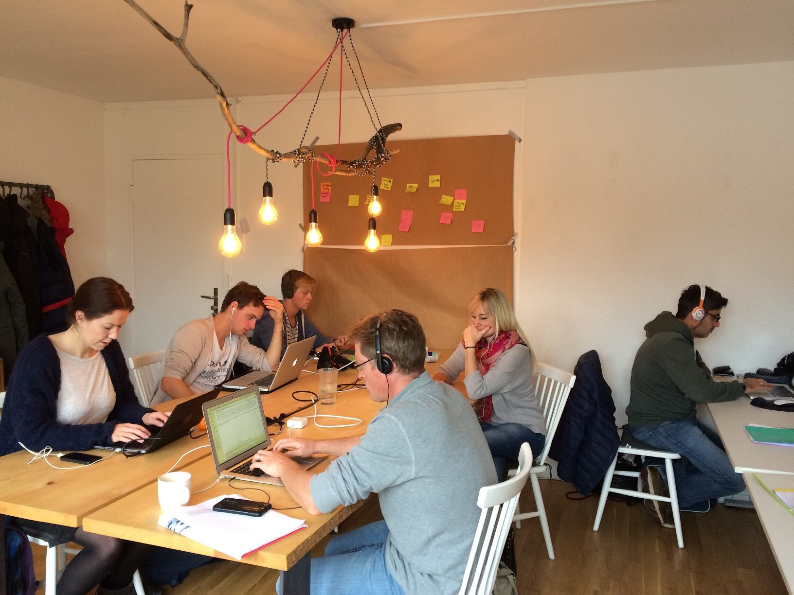

  In unserem "ZeitRaum" Coworking Spaceli an der Aarbergergasse.

## Alle werden Vereinsmitglieder

Die Community-Treffen Ende 2015 und Anfang 2016 sind sehr intensiv, aber auch voller Euphorie. Seit der Zusage für das Gebäude an der Effingerstrasse gibt es viel zu entscheiden und einen massiven Berg voll Arbeit. Einige kommen dazu und helfen mit.

Diese Treffen haben drei Teile:

1. Ein Intro (kann irgendwas sein zur Einstimmung)
2. Ein langer Mittelteil mit vielen Traktanden
3. Ein Nach-Treffen jeweils zu einem unserer Grundsätze

Damit wir überhaupt Verträge unterschreiben konnten, haben wir einen Verein gegründet. Somit sind die Community-Treffen auch gleich unsere Vereinsversammlungen. Wir sind aber zuerst zurückhaltend, um Leute in den Verein aufzunehmen und beschränken die Mitgliedschaft auf "Coworker mit Monatsabo". Alle anderen Community-Member sind keine Vereinsmitglieder und können zwar mitprägen, jedoch formell nicht mitentscheiden.

Anfang März 2016 - noch grad vor der Eröffnung des Effingers - entscheiden wir, dass alle Community-Member automatisch auch Vereinsmitglieder sind und setzen damit ein Zeichen, dass sie eingeladen sind, mit zu prägen. Unser Ringen mit dieser Frage ist beschrieben in einem Blogartikel über die [Community-Membership](/blog/community-membership/).

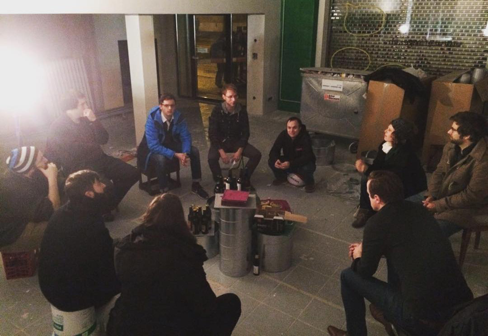

  Community-Treffen auf der Effinger Baustelle.

## Viel Aufbauarbeit

Die Monate nach der Eröffnung im März 2016 waren geprägt durch sehr viel Aufbauarbeit. Es gab an den Community-Treffen immer eine Fülle von Traktanden und es drehte sich sehr viel um den Effinger als Gebäude und dessen Betrieb.

Es war so viel los, dass kaum jemand auf die Idee kam, auch mal ein Foto <i class="fa fa-camera"></i> zu machen von diesen Community-Treffen. Eines der wenigen, das ich gefunden habe, ist ein spezieller Abend im Mai 2016, wo wir darüber diskutierten, was wir mit dem uns angebotenen ersten Stock anfangen könnten.

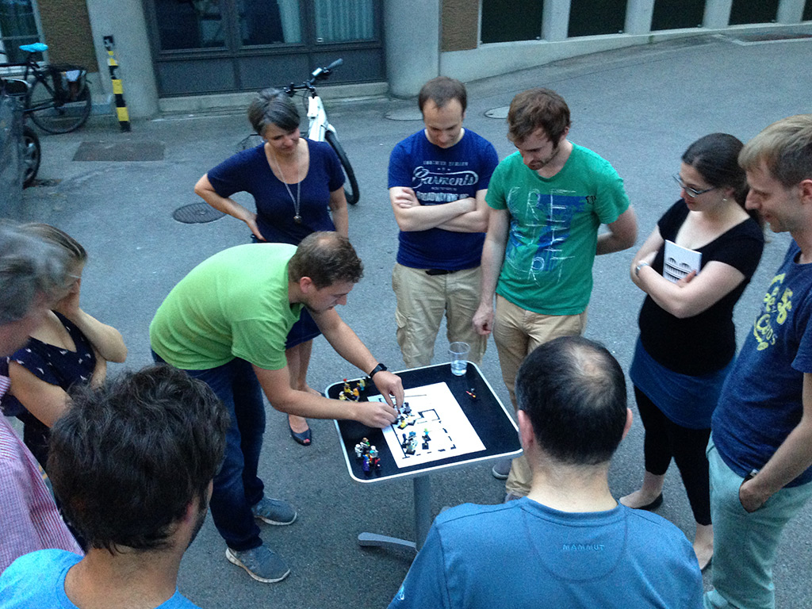

  Workshop zur Nutzung des ersten Obergeschosses im Effinger.

## Es wird ruhiger

Erst Ende 2016 und Anfang 2017 wird es langsam etwas ruhiger. Die Aufgaben und Abläufe im Effinger sind klarer und wir kommen sogar dazu, zwischendurch auch mal zu feiern - wie hier beim Community-Treffen im Advent.

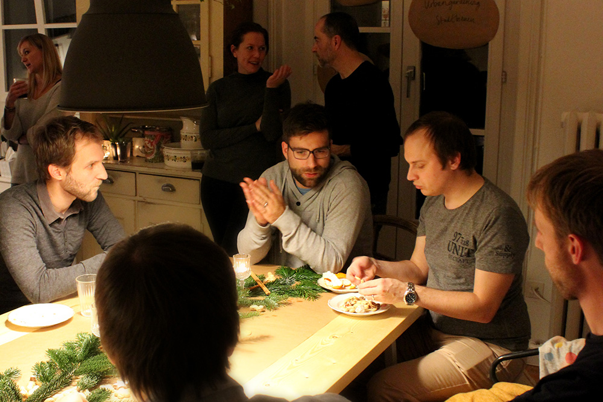

  Apéro beim Community-Treffen im Advent 2016 - in der gemeinsam genutzten Wohnung im 2. OG.

## Mehr Handeln, weniger Diskutieren

Die Community-Treffen gehen öfter etwas länger und fühlen sich immer mehr an wie konventionelle Generalversammlungen eines Vereins. Es wird viel diskutiert in der grösseren Runde. Damit wir schneller zum Handeln übergehen können, [stellen wir die Treffen komplett um](/blog/community-treffen-als-dugnad/).

Wir lassen uns inspirieren vom norwegischen ["Dugnad"](https://en.wikipedia.org/wiki/Communal_work#Norway). Dies ist ein Wort für ein Treffen der Nachbarschaft, wo man gemeinsam einen Arbeitseinsatz tätigt und nachher zusammen gegessen und gefeiert.

Im Sinne des "Dugnad" kann seit Januar 2017 jeder am Community-Treffen eine Abendaktivität vorschlagen. Die Leute entscheiden dann, bei welchen Projekten sie sich anschliessen wollen. Am Abend selber wird eine Stunde in Gruppen daran gearbeitet und im Anschluss werden die Ergebnisse einander vorgestellt.

Nur noch grosse Entscheide werden im Plenum [soziokratisch](/organisation/soziokratie/) gefällt. Alles andere wird im [Beratungsprozess](/organisation/) entschieden.

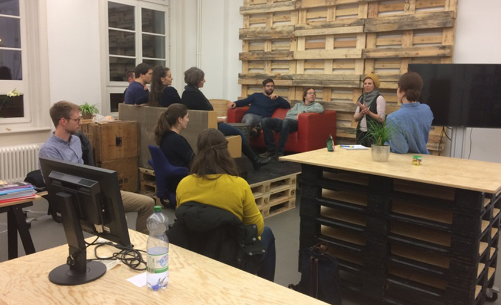

  Das erste Community-Treffen im "Dugnad" Stil. Hanne aus Norwegen erklärt den "Dugnadsånd" - den Geist, sich gemeinsam für eine bessere Community einzusetzen.

## Kleinere Treffen

Im Frühling 2017 werden die Community-Treffen etwas kleiner. Ausser an der offiziellen Generalversammlung sind wir weniger als 10 Personen. Warum ist schwierig zu sagen, aber ich denke, dass nach einem ersten Jahr die Aufbaueuphorie etwas verflogen ist und wir etwas müde geworden sind.

Bei dieser Grösse ist die Aufteilung in kleinere Gruppen manchmal schwierig.

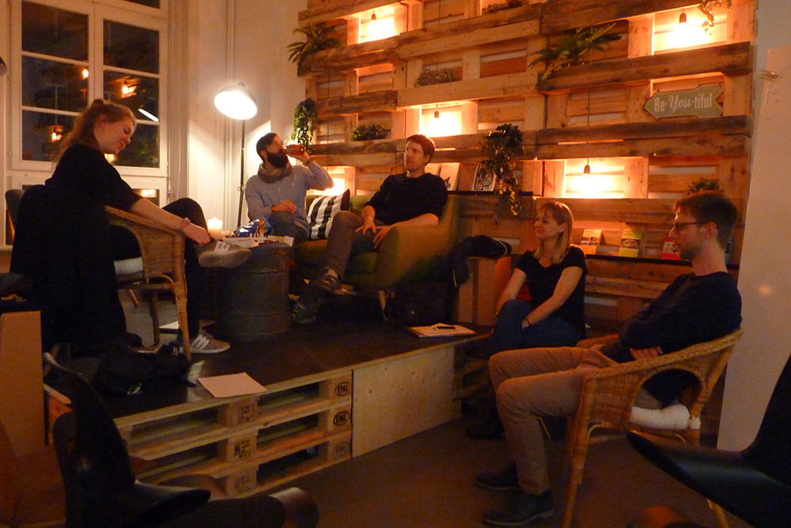

  Community-Treffen gemütlich und klein.

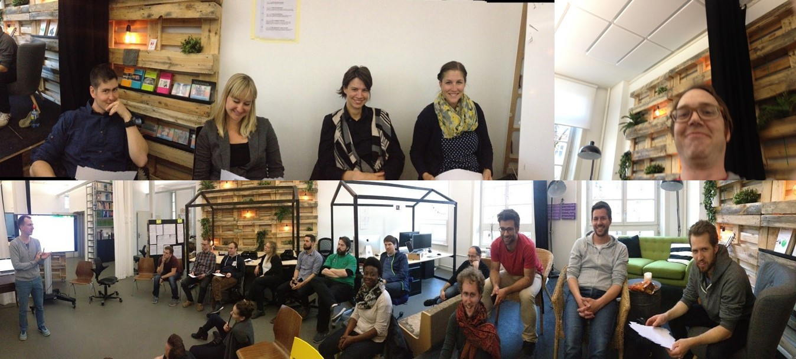

  Die jährliche, offizielle Generalversammlung - integriert in das Community-Treffen.

## Neu: Community-Treffen als Plattform

Wir möchten die Community-Treffen ein weiteres Mal weiterentwickeln. **Es soll weniger um den Effinger gehen und wieder mehr um das, was eigentlich im Namen steht, um die Community.**

So bieten wir die Treffen an als Plattform, wo Leute ihre Projekte vorstellen können. Als Community nehmen wir uns dann eine Stunde Zeit, um in Gruppen eine Idee vorwärts zu bringen oder konkret an Projekten mitzuarbeiten.

Wenn du also ein Projekt oder eine Idee hast, informiere kurz einen [Effianer](/ueber/) darüber und komm damit an das nächste [Treffen](/events/). Und es braucht Leute, die sich gerne für eine Stunde in ein Projekt vertiefen, motivierendes Feedback geben und damit mithelfen, dass tolle Ideen zur Umsetzunge gelangen können. Alle, natürlich auch Nicht-Member, sind herzlich willkommen.

Wir treffen uns jeweils am 1. Donnerstag im Monat im Effinger. Ab 18.00 Uhr zum gemeinsamen Essen (jeder bringt sein eigenes Essen mit) und ab 19.00 Uhr zum offiziellen Treffen im 1. OG. Frag einfach im Coworking oder in der Kaffeebar, falls du dich mit den Räumlickkeiten nicht auskennst. Alle Daten für die Communitytreffen findest du in unserem [Kalender](/events/). Anmeldung ist keine erforderlich.

## Die Zukunft

Wie sich unsere Community-Treffen in Zukunft entwickeln werden, wissen wir nicht. Aber was wir wissen, ist, dass sie sich bestimmt ändern werden! Neue Ideen sind schon da, wie zum Beispiel, dass wir ein Potluck-Essen fest integrieren könnten. Wir freuen uns darauf, zu lernen und neugierig neue Formen zu entdecken.

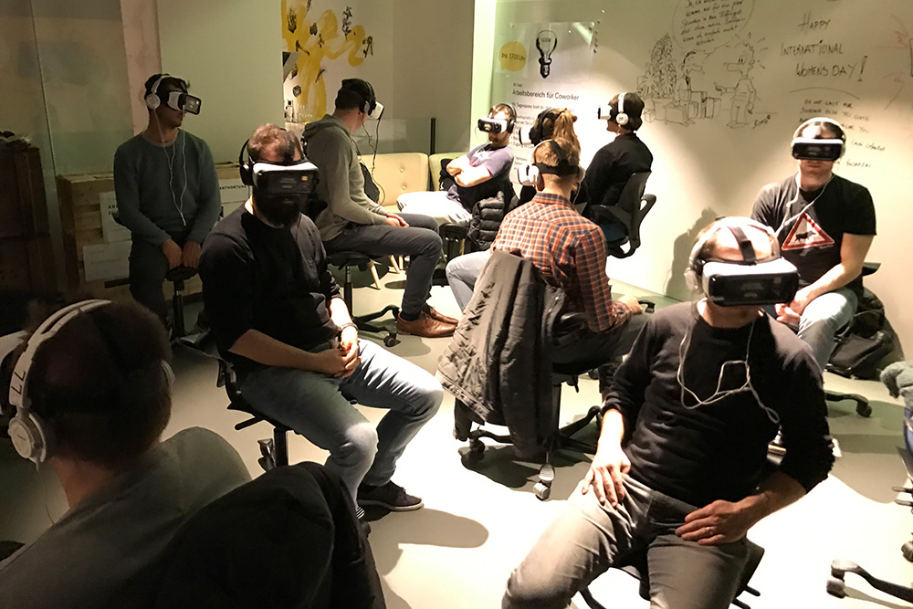

  Welche Form von Community-Treffen bringt wohl die Zukunft?

