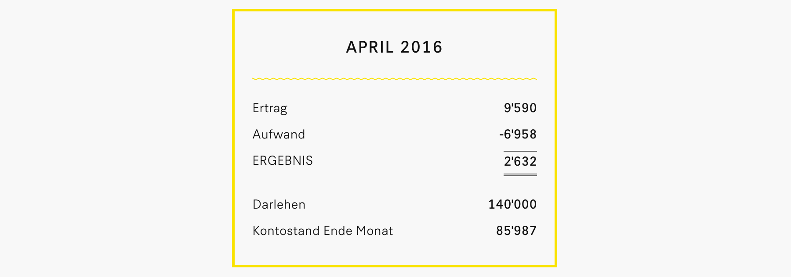
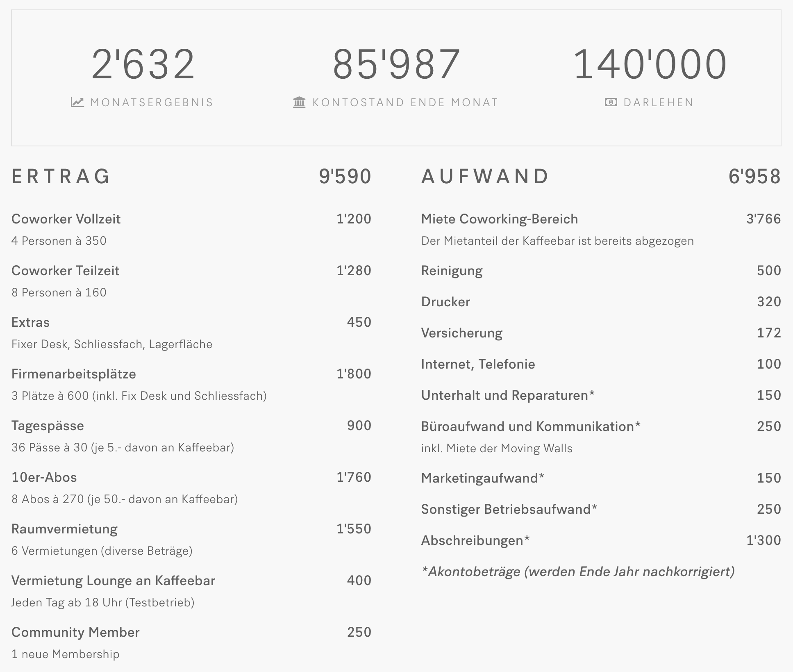

+++
title = "Finanzen der Effinger Coworking Community"
date = "2016-05-09"
description = "Mit Spannung haben wir die Finanzzahlen aus dem ersten Monat im Coworking Space erwartet. Im Vorfeld hatten wir natürlich Pläne geschmiedet. Ob sich die Realität an unsere Pläne hält? Dieser Frage gehen wir nach, obwohl es nach 6 Wochen Betrieb natürlich immer noch sehr früh ist."
image = "finanzen-april-2016.png"
author = "Marco Jakob"
comments = true
tags = [ "Finanzen", "Coworking", "Community" ]
+++

Mit Spannung haben wir die Finanzzahlen aus dem ersten Monat im Coworking Space erwartet. Im Vorfeld hatten wir natürlich Pläne geschmiedet (den <a href="/blog/businessplan/">Businessplan findest du hier</a>). Ob sich die Realität an unsere Pläne hält? Dieser Frage gehen wir nach, obwohl es nach 6 Wochen Betrieb natürlich immer noch sehr früh ist.

Die Finanzzahlen sind wichtig, zuerst für die Effianer, die für den Betrieb des Coworking Spaces verantwortlich sind und auch für die Community Member, die Mitglied sind im *Verein Coworking Community Bern*. Aber auch Darlehensgeber, Unterstützer beim Crowdfunding, unsere Vermieter und Leute, die einfach unser Projekt mitverfolgen, könnten sich für diese Zahlen interessieren.

Wenn wir schon von [Transparenz](/grundsaetze/transparenz/) reden, dann stellt sich die Frage:

> "Warum machen wir unsere Finanzzahlen nicht gleich für alle zugänglich?"

Das haben wir nun umgesetzt und auf der Website eine neue Rubrik [Finanzen](/finanzen/) eingefügt (zu finden im Menu "Community").

## Finanzen des Vereins Coworking Community Bern

Als "Verein Coworking Community Bern" betreiben wir den Coworking-Bereich im Effinger und sind Mieter für das Gebäude. Die Effinger Kaffeebar GmbH ist Untermieterin vom Verein.

Unter folgenden Links findest du unsere aktuellen Finanzzahlen. Es gibt eine Jahresübersicht und für jeden Monat eine Seite mit Detailinformationen.

<a href="/finanzen/" class="btn btn-mod btn-medium btn-round mb-10">&rarr; Jahresübersicht 2016</a> <a href="/finanzen/verein-coworking-community-bern/2016-04/" class="btn btn-mod btn-medium btn-round mb-10">&rarr; Detailansicht April 2016</a>

### Detailansicht April 2016

### Erklärungen zu den Zahlen

Finanzzahlen aufbereiten und darstellen, dass sie aussagekräftig sind und von Nicht-Buchhaltern verstanden werden, ist gar nicht so einfach. Wir haben uns entschieden, dass wir für jeden Monat eine Art Erfolgsrechnung (Aufwände und Erträge) aufstellen und diese ergänzen mit den wichtigsten Zahlen aus der Bilanz (Kontostand und Darlehen).

* **Ertrag**. Auf der Ertragsseite werden für jeden Monat die Einkünfte aus Coworking-Arbeitsplätzen, Raumvermietungen und Memberships erfasst. Die monatlichen Beträge der Vollzeit- und Teilzeit-Coworker fliessen direkt auf unser Postkonto. Alle anderen Erträge werden über die Kasse der Kaffeebar abgewickelt und können aus dem Kassensystem übernommen werden.
* **Aufwand**. Die Aufwände sind eine Art Akonto-Rechnung. Die tatsächlichen Aufwände würden jeden Monat stark schwanken - je nach dem, wann eine Rechnung grad eintrifft. Deshalb treffen wir Annahmen für das ganze Jahr und teilen diese auf die 12 Monate auf. Spätestens beim Jahresabschluss werden diese Beträge nachkorrigiert.
* **Ergebnis**. Das Monatsergebnis ist Ertrag minus Aufwand. Also entweder ein Gewinn oder ein Verlust.
* **Kontostand**. Der Kontostand ist der Stand auf unserem Postkonto per Ende Monat. Da wir in den Anfangsmonaten etliche Rechnungen für den Umbau bezahlen, wird dieser noch sprunghaft abnehmen. Die Investitionen für den Umbau sind in den monatlichen Aufwänden nicht ersichtlich, ausser in den Abschreibungen. Die meisten Investitionen schreiben wir über fünf Jahre ab.
* **Darlehen**. Die Darlehen setzen sich zusammen aus internen Darlehensgebern (Vereinsmitglieder) von rund CHF 65'000 und externen Darlehensgebern von rund CHF 75'000. Die externen Darlehen haben eine Mindestlaufzeit von drei bis fünf Jahre.

### Erste Einschätzungen

Wenn die Aufwandsschätzungen auch nur annähernd stimmen, können wir bereits im ersten vollen Monat mit den Einnahmen unsere Ausgaben decken. Das ist natürlich genial und äusserst aussergewöhnlich für ein Startup. Ein Grund für den guten Start liegt bestimmt darin, dass wir schon fast zwei Jahre vor der Eröffnung angefangen haben, Leute zu involvieren und eine Community aufzubauen. Als wir schliesslich ein Gebäude fanden und den Vormietvertrag unterschreiben konnten, hatten wir schon ungefähr zehn verbindliche Zusagen von Coworkern für einen Teil- oder Vollzeitarbeitsplatz.

Ein Startmonat ist alleine noch nicht aussagekräftig. Erst die nächsten Monate werden zeigen, ob wir eine gute Auslastung der Coworking-Arbeitsplätze und viele externe Vermietungen des Workshopraumes halten können. Auch möchten wir das Angebot für Community Member erweitern, damit wir weiter als Netzwerk wachsen können. In der Aufbauphase waren wir etwas zurückhaltend mit der Aufnahme neuer Effianer, da wir in der hektischen Zeit als Gruppe etwas Stabilität brauchten. Nun werden wir den Kreis bald wieder öffnen und möchten aus den zahlreichen Coworkern, welche mit Zehnerabos bei uns arbeiten, weitere Effianer finden, die das Projekt "Effinger" mittragen.

In der Einleitung hatte ich den Businessplan angesprochen. Ich möchte mich für den Moment noch zurückhalten mit allzu frühen Schlüssen. Zu einem späteren Zeitpunkt werden wir ausführlicher darüber schreiben, wo wir mit unseren Annahmen daneben geliegen haben.

Wenn du aber bereits jetzt die aktuellen Zahlen mit dem [Businessplan](/blog/businessplan/) vergleichen möchtest, ein paar Hinweise: Im Jahr 1 im Businessplan wurde mit 14 Monaten gerechnet. Im Raumaufwand ist noch die Miete der Kaffeebar enthalten, d.h. die Jahresmiete des Coworking-Bereiches ist nur rund die Hälfte, CHF 44'897. Die Annahmen für "Unterhalt und Reparatur", "Büroaufwand" und "Sonstiger Betriebsaufwand" haben wir stark nach unten korrigiert.

Somit lasse ich die Zahlen im Moment für sich sprechen. Aber ich würde mich sehr freuen über Reaktionen darauf - zum Beispiel als Kommentare unten am Blogeintrag.

## Warum transparente Finanzzahlen?

Viele interessieren sich dafür, wie es bei uns läuft. Das Interesse gilt natürlich auch den Finanzzahlen, obwohl sich die meisten nicht getrauen, danach zu fragen. Wenn wir dann alle Zahlen inklusive Kontostand präsentieren, sind die meisten erstaunt. Warum machen wir das also? Hier ein paar Gründe:

* **Ermöglicht Entscheidungen**. In traditionell-hierarchischen Strukturen sind wichtige Informationen meist nur für die Spitze der Pyramide zugänglich. Damit gibt es eine Machtkonzentration. Damit alle Personen in unserer Community gemäss [Selbstorganisation](/organisation/) Entscheidungen fällen können, müssen Informationen für alle zugänglich sein.
* **Ermutigt zum Mitmachen**. Transparenz ermöglicht, dass auch Leute ausserhalb unserer Community mitbekommen, was läuft und vielleicht auch, was nicht so gut läuft. Jeder kann Lücken entdecken und erhält die Gelegenheit, etwas beizutragen.
* **Ist befreiend**. Etwas geheim zu halten ist anstrengend und oft unnötig. Transparenz ist befreiend. Irgendwann wird das meiste sowieso in irgend einer Form sichtbar werden. Warum also nicht gleich darüber sprechen?
* **Schafft Vertrauen**. Kunden, Investoren und Community Member sehen, wofür ihre finanziellen Beiträge verwendet werden. Dies bringt Klarheit und ermöglicht Vertrauen.
* **Schützt**. Es entsteht ein gewollter Druck, Dinge korrekt zu machen und alle Beteiligten gerecht zu behandeln.
* **Ermöglicht Lernen**. Wir sehen Fehler als Chancen und erzählen einander davon. Dies ermöglicht Lernen. Und warum sollten wir dies alles für uns behalten und nicht auch anderen zur Verfügung stellen?
* **Ist auch aufwändig**. Ja, es bedeutet einen gewissen Aufwand, die Zahlen in eine übersichtliche und aussagekräftige Form zu bringen. Aber es lohnt sich, oder nicht?

## Ausblick

Die Zahlen, die im Moment auf der [Finanzseite](/finanzen/) veröffentlicht werden, sind von unserem "Verein Coworking Community Bern". Es wäre natürlich toll, wenn wir allgemein mehr über Finanzen reden würden, nicht nur über die vom Verein. Viele in unserer Community sind selbständig und haben eigene Unternehmen. Die Struktur der Website ist so vorbereitet, dass in Zukunft auch Leute aus der Community ihre Zahlen veröffentlichen können, wenn sie dies möchten.

Zum Abschluss möchte ich dich **herzlich einladen, in die Diskussion mit ein zu steigen**: Wie interpretierst du die veröffentlichten Zahlen? Was ist deine Meinung zur Transparenz?
