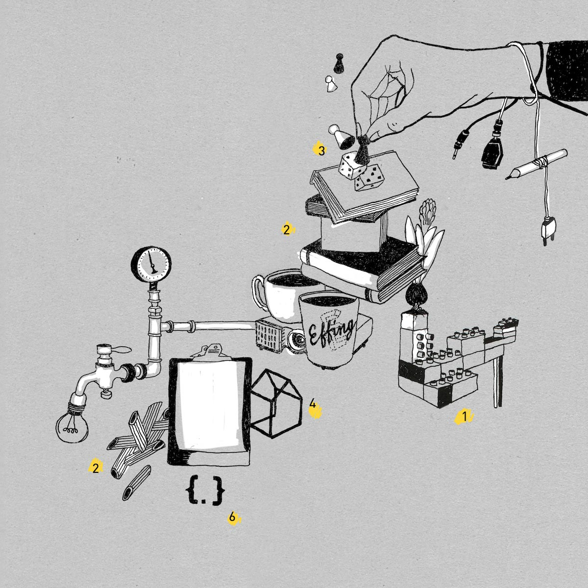

+++
title = "Flashback-Februar"
date = "2017-03-01"
description = "Monatsrückblick für Eilige. Der Effinger wächst an allen Ecken und Enden, täglich ergeben sich neue Projekte und Ideen, manchmal eine Herausforderung, alles im Blick zu behalten. Daher hier auf einen Blick, den Monatsrückblick!"
image = "Effinger_Flashback_Februar_2017_teaser.jpg"
author = "Claudine Etter"
comments = true
tags = [ "Coworking", "Community" ]
+++

  Monatsrückblick für Eilige. Der Effinger wächst an allen Ecken und Enden, täglich ergeben sich neue Projekte und Ideen, manchmal eine Herausforderung, alles im Blick zu behalten. Daher hier auf einen Blick, den Monatsrückblick!

1. LEGO?!
https://www.effinger.ch/blog/lego-und-pi-quadrat-prozent/

2. SALZ IN DER SUPPE
https://www.effinger.ch/blog/das-salz-in-der-suppe/

3. GAMES OF EFFINGER
https://www.effinger.ch/blog/spieleabend-im-effinger/

4. HÄUSLE BAUEN
https://www.effinger.ch/blog/ein-samstag-im-effinger/

5. «DUGNAD»
https://www.effinger.ch/blog/community-treffen-als-dugnad/

6. POWERCODERS
http://www.bernerzeitung.ch/region/kanton-bern/itloesung-fuer-fluechtlinge/story/29590976
