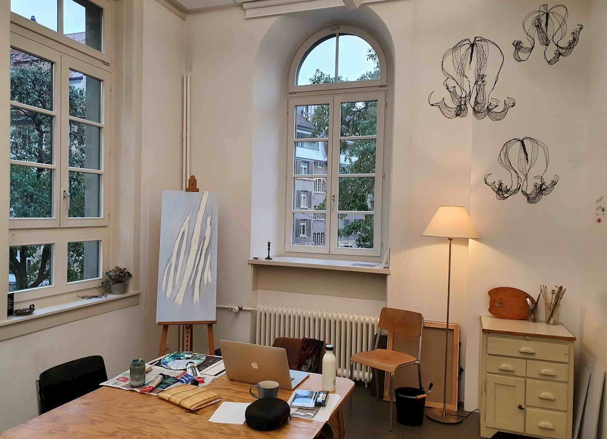
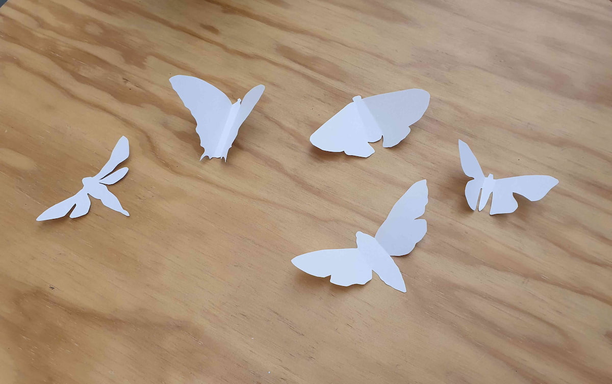

+++
title = "Ganz viel Kunst im Effinger"
date = "2020-12-07"
draft = false
tags = ["Atelier", "Kunst"]
image = "malen.jpg"
description = "Seit Oktober vernetzen sich die Kunstschaffenden im Effinger. Ob Tanz, Musik oder Bild – die Funken der Inspiration sprühten sofort!"
authors = ["Anicia Kohler"]
comments = true
+++

Seit Oktober vernetzen sich die Kunstschaffenden im Effinger. Ob Tanz, Musik oder Bild – die Funken der Inspiration sprühten sofort!

Im Coworking tummeln sich alle möglichen Leute. Von der Programmiererin bis zum Texter, vom Gamedesigner bis zur Philosophin. Und natürlich fühlen sich auch Künstler*innen in einem so vielfältigen Umfeld wohl. 

Bei uns im Coworking Space Effinger in Bern zum Beispiel gibt es deshalb nicht nur Computerarbeitsplätze und eine Schreinerwerkstatt – sondern auch ein Atelier. Grundsätzlich wird dort gemalt und skizziert, aber hie und da finden auch Sitzungen darin statt. So dass Coworker*innen Besprechungen mit ihrer Kundschaft manchmal zwischen Staffelei und Installationen abhalten. Der ungewohnte Dekor sorgt dabei schon mal für ganz neue Ideen!

Der Zauber des Coworkens liegt ja ganz klar darin, dass sich Professionelle unterschiedlichster Berufe treffen, sich austauschen und voneinander profitieren können. Vier im Effinger angesiedelte Künstler*innen haben entschieden, diesen Austausch miteinander – auf die Kunst bezogen – zu institutionalisieren. **Wir glauben, dass wir viel voneinander lernen können. Wir möchten einander Fragen stellen, unsere Arbeiten vorstellen, und uns gegenseitig inspirieren.** Deshalb treffen wir uns seit Ende Oktober alle zwei Wochen zu einem „Kunstzmittag“. Dabei stellen wir uns eine neue Arbeit vor, die in den letzten Tagen entstanden ist – oft genau auf diesen Termin des „Kunstzmittags“ hin!

Zur Gruppe gehören bisher:

[Isabel Jakob](https://www.aufzurkunst.ch/) – bildende Künstlerin\
[Sarah Hinni](https://www.sarah-hinni.ch/) – bildende Künstlerin und Fotografin\
[Sunita Asnani](https://www.sunitaasnani.com/) – Tanzschaffende\
[Anicia Kohler](https://www.aniciakohler.ch/) – Komponistin und Pianistin\
Joana Hermes – Tänzerin, Praktikantin bei Sunita

Vorerst tun wir dies unter uns und digital. Wir halten die Ergebnisse unseres Austauschs in unserem Blog auf der Website [www.kunstimcoworking.ch](https://www.kunstimcoworking.ch/) fest. Und können uns aber gut vorstellen, dass wir im nächsten Jahr den Rahmen öffnen, Ausstellungen und Performances und öffentliche Austauschrunden organisieren könnten. Da sind einige Ideen im Raum! Wir sind alle schon ganz beflügelt von unseren ersten Treffen. 

Zwei Beispiele dafür:

Ganz unkompliziert haben Sunita und Joana in den letzten Wochen ein ebenso unkompliziert entstandenes Stück Musik von mir für eine Bewegungsstudie verwendet:

<iframe src="https://player.vimeo.com/video/478719654" width="640" height="360" frameborder="0" allow="autoplay; fullscreen" allowfullscreen></iframe>

<a href="https://vimeo.com/478719654">stripes</a> von <a href="https://vimeo.com/sunitaasnani">Sunita Asnani</a>

Und Isabel und ich haben nach einem kurzen Gesprächsexkurs über Schmetterlinge ein paar Wochen später erstaunt festgestellt, dass er sich bei beiden irgendwie festgekrallt hat: 

**So bei Isabel**

(siehe [www.aufzurkunst.ch/posts/umweltthemen/](https://www.aufzurkunst.ch/posts/umweltthemen/))

**und so bei mir:**

<iframe src="https://www.facebook.com/plugins/video.php?height=322&href=https%3A%2F%2Fwww.facebook.com%2Fanicia.rutti%2Fvideos%2F3588736837831313%2F&show_text=false&width=560" width="560" height="322" style="border:none;overflow:hidden" scrolling="no" frameborder="0" allowfullscreen="true" allow="autoplay; clipboard-write; encrypted-media; picture-in-picture; web-share" allowFullScreen="true"></iframe>

(siehe [www.aniciakohler.ch/2020/11/26/24-things-with-wings/](https://www.aniciakohler.ch/2020/11/26/24-things-with-wings/))

Wir freuen uns über Fragen zum Kunstzmittag und zu unserer Arbeit übrigens genauso wie über Inputs dazu, wie die Kunst sich am, im und rund um einen Coworking Space zeigen und sichtbar machen könnte. Auf bald!

Zu finden sind wir und unsere Arbeiten hier: [www.kunstimcoworking.ch](https://www.kunstimcoworking.ch/)