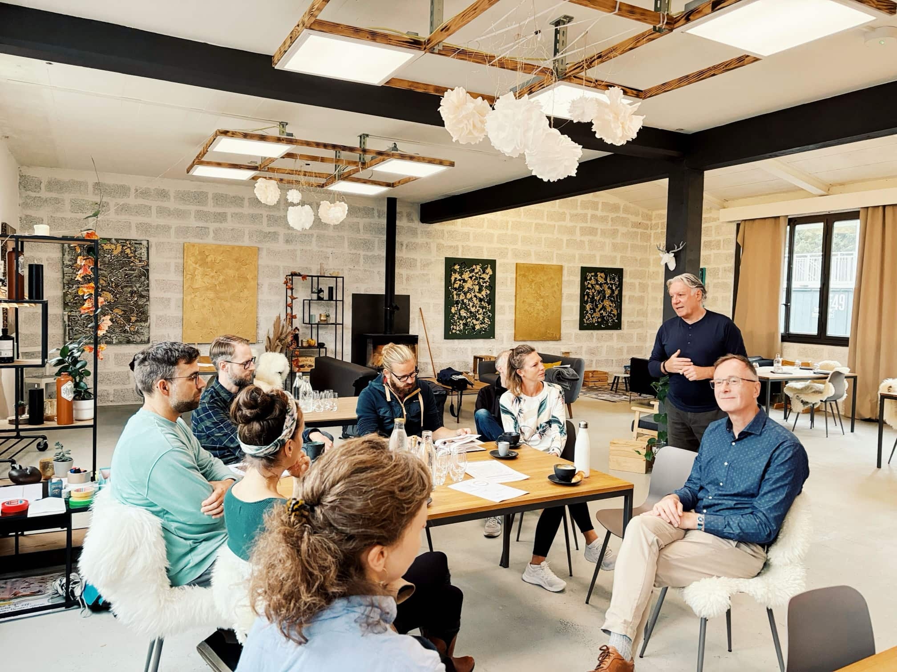

+++
title = "Gemeinsamständigkeit im Effinger"
date = "2025-05-13"
draft = false
tags = [ "Community" ]
image = "gemeinsamstaendig.jpg"
description = "Bei Coworking geht es um mehr als einen Arbeitsplatz. Es geht auch um neue Formen der Zusammenarbeit und Kollaboration..."
authors = [ "Urs Vögeli"]
comments = false
+++

Bei Coworking geht es um mehr als einen Arbeitsplatz. Es geht auch um neue Formen der Zusammenarbeit und Kollaboration. So ist in den letzten Jahren im Effinger der [Begriff Gemeinsamständigkeit](https://www.matthiastobler.ch/blog-post/gemeinsamstandig-was-bisher-geschah) entstanden. Viele Personen, die hier arbeiten sind von der juristischen Form her als Firma selbständig. Da sie hier aber kollaborativ arbeiten und eben auch gemeinsame Projekte und Zusammenarbeit entstehen, sind sie vernetzt und nicht alleine. Daher ist die Wortkombination gemeinsamständig entstanden. Aktuell wird wieder einmal in Arbeitsgruppen im Effinger an solchen Ideen und Projekten getüftelt. Dabei ist das Bedürfnis entstanden, einmal transparent zu machen, was in den letzten Jahren unter dem Label «Gemeinständigkeit» alles zu Stande gekommen ist. Die Aufzählung ist nicht abschliessend, gerne dürfen Ergänzungen und weitere Beispiel in der Kommentarspalte erwähnt werden.

# Effinger Services

Während Corona gab es bereits einen Effort, unsere vielfältigen Skills und neue Formen von Dienstleistungen im Effinger abzubilden. Dabei ist die [Landingpage Effinger Services](https://www.effinger.ch/services/) entstanden.

<cite>Der Effinger bietet neu sein kreatives und unternehmerisches Know-how und Erfahrung mit interdisziplinären Teams als Service an.</cite>

<cite>Wir leben das Querdenken, Quersehen, Querhandeln mit der Entwicklung von neuen Methoden und Dienstleistungen, die der perfekte Motor für deine Kollaboration und Innovation werden können.</cite>

Dies ist unsere Ambition und die zahlreichen Personen und Angebote sind Abbild unseres bunten Ökosystems.

# Konkrete Projekte und unterschiedliche Verbünde

Inzwischen haben sich aber im und um den Effinger auch Gruppen gebildet, die für spezifische Bereiche ihre Dienstleistungen zusammengefasst haben, ganz im Sinn von Gemeinsamständigkeit.
Da ist zum Beispiel [UserResearch Schweiz](https://userresearch.ch) mit Manuel Bürli, Anicia Kohler und Fabienne Stoll:

<cite>Wir finden heraus, was Ihre Kund*innen wollen. Und helfen Unternehmen, das Kundenerlebnis zu verbessern.</cite>

Unter dem Label [urbane reformer:innen](https://www.urbanereformer.ch) ist in Zusammenhang mit [Urbane Dörfer](https://www.urbanedoerfer.ch) mit Andrea Burkhalter, Matthias Tobler und Tobias Grimm ein Kollektiv entstanden im Bereich Areal-, Quartier- und Stadtentwicklung:

<cite>Fluktuation, Leerstand und unbelebte Räume können überwunden werden. Wir unterstützen Sie mit Prozessbegleitung und Sozialraumplanung.</cite>

Und mit [Yolu](https://www.yolu.ch) ist im Effinger ein Lernbetriebsverbund gegründet worden für Bildung, Digitales & Film. Marco Jakob, Joris Schwarzenbach, Jonathan Hess, Joscha Tschanz und Maël Duwan bieten nicht nur ein Web- und Podcaststudio an, sondern haben eine grosse Vision:

<cite>Wir schaffen gemeinschaftliche Lern- und Arbeitsräume zur persönlichen und beruflichen Entfaltung. Wir fördern unternehmerisches Denken und nachhaltiges Handeln, vernetzen Ausbildungsbetriebe und teilen Wissen offen – für eine zukunftsfähige, regenerative und solidarische Gesellschaft.</cite>

# Aneinander denken und einander einbeziehen

Einige grössere Zusammenarbeitsprojekte im Netzwerk sind in den letzten Jahren jedoch Einzelfall-basiert entstanden. Dabei hat eine Firma oder Personen einen Auftrag, bei dem sie aus unserem Ökosystem zahlreiche andere Personen und Dienstleistungen einbezieht. So etwa geschehen 2020 und 2021 als wir mit meiner [Firma PWB Schweiz](https://www.embedded-strategy.ch) einen grossen Auftrag der Armee/Gruppe Verteidigung hatten, wo wir einerseits spezifisches Knowhow dazunehmen konnten (z.B. [Kunstbasierte Fascilitation mit Sunita Asnani](https://www.cultural-diversity.ch/sunita-asnani) oder Filmemacher wie Jonathan Hess und Oliver Schären) oder rasch skalieren mussten etwa im Bereich Miro mit David Eggimann und Benjamin Ammann oder Eventmanagement. In diesem Zusammenhang ist unter anderem auch [dieses Video über den Effinger](https/youtu.be/fMXqGOOurVY) entstanden. Oder für einen anderen Auftrag das Video zu [Gender Dimensions in Peacebuilding](https://www.youtube.com/watch?v=9YJxhwL7QtU). So oder in ähnlichem Rahmen gab es zahlreiche Projekte in den letzten Jahren, weil wir eine Kultur pflegen, wo wir aneinander denken und einander einbeziehen.
