+++
title = "How-the-Heck Treffen"
date = "2014-11-27"
description = "Ziemlich gespannt und ein bisschen nervös warteten wir im Apfelgold auf die rund dreissig Nasen, die sich für den How-the-heck Abend angemeldet hatten."
image = "how-the-heck.jpg"
author = "Salome Hostettler"
comments = true
tags = [ "Community" ]
+++

Ziemlich gespannt und ein bisschen nervös warteten wir im [Apfelgold](http://www.apfelgold.ch) auf die rund dreissig Nasen, die sich für den *How-the-heck* Abend angemeldet hatten. Wie dieser Abend wohl verlaufen würden? Und dann kamen sie, die Kreativen, Innovativen, Socialreformers und History Makers und man merkte schon bald, dass auch sie gespannt waren, was der Abend wohl bringen würde. 

Nach einem Einstiegs-Speech über den Vergleich zwischen Orientierungslauf und American Football, war allen klar, dass das wohl ein inspirierender Abend werden würde. Im anschliessenden gemeinsamen Brainstorming rauchten dann die Köpfe und tolle Ideen wurden entwickelt, gewälzt und durchdacht. Toll, wenn so viele kreative Menschen zusammen spannen. Im Plenum wurden dann einige Highlights präsentiert.

Bei angeregten Gesprächen, visionärem Ideenaustausch und Networking klang der Abend aus. Wir freuen uns schon auf den nächsten!

## Ein paar Impressionen

  

    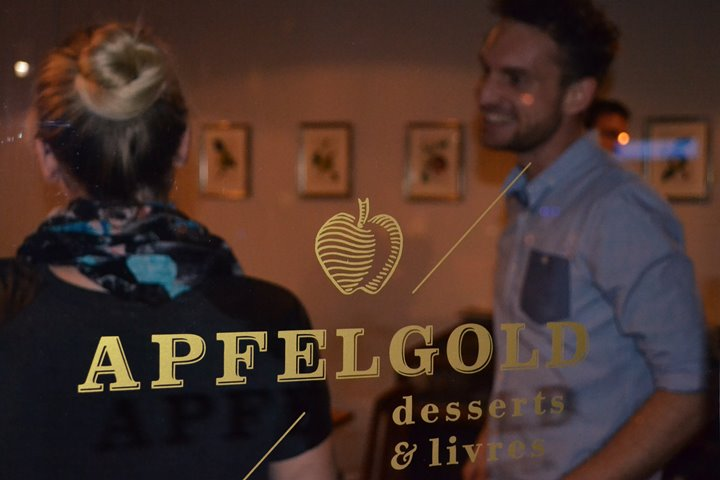
  

  

    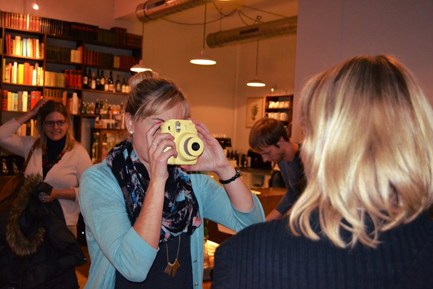
  

  

    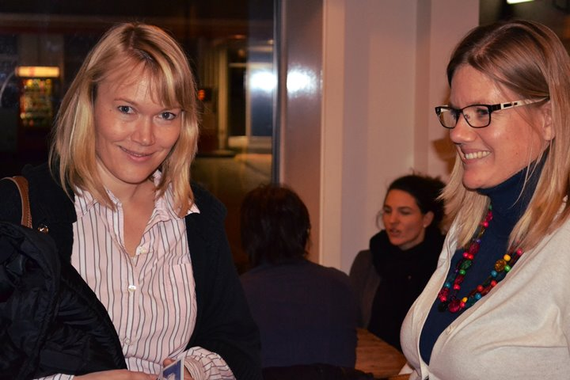
  

  

    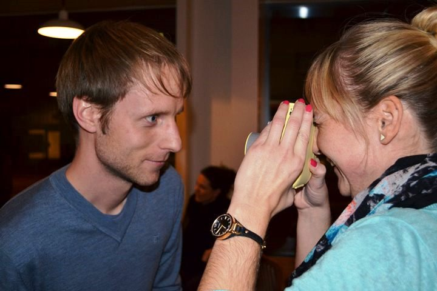
  

  

    
  

  

    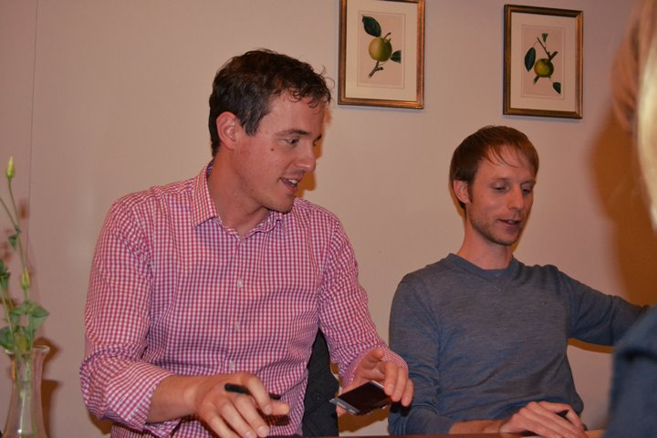
  

  

    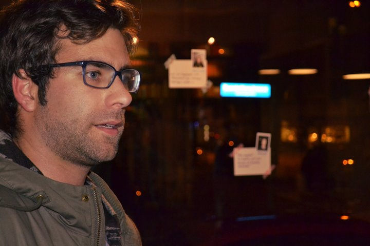
  

  

    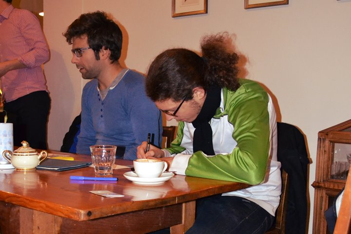
  

  

    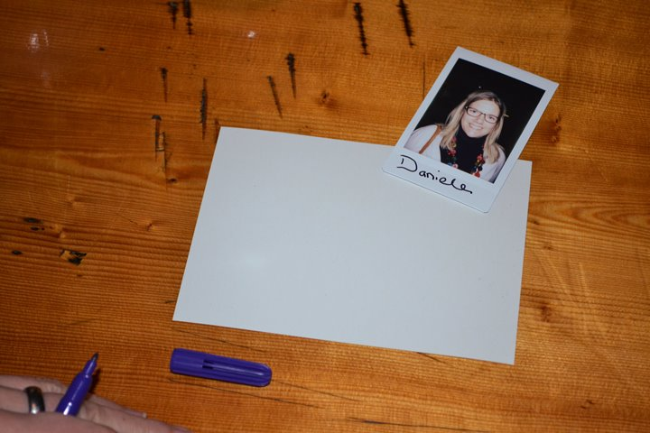
  

  

    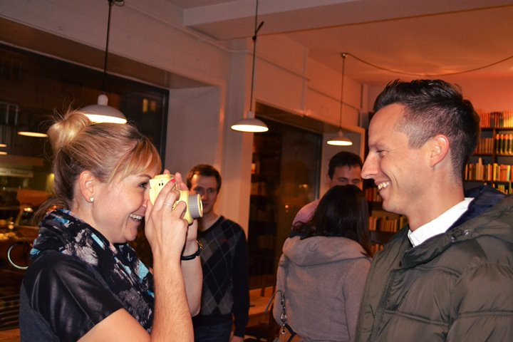
  

  

    
  

  

    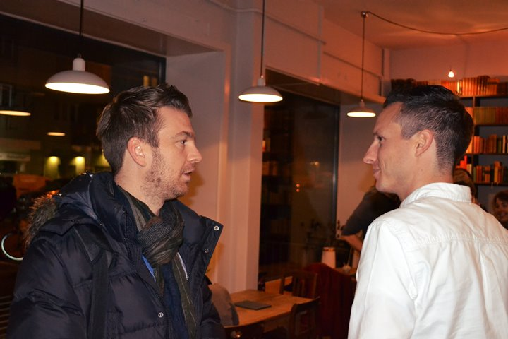
  

  

    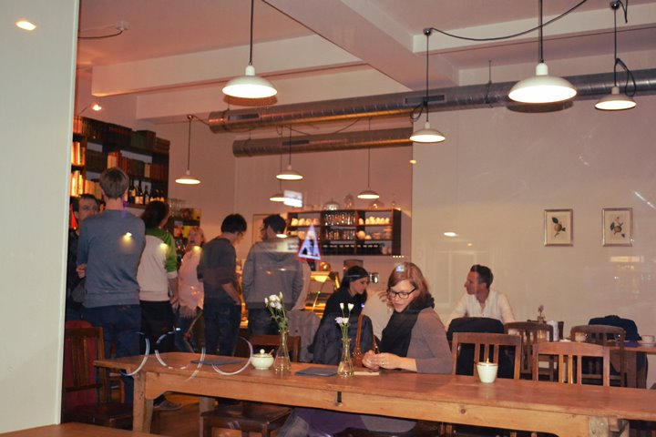
  

  

    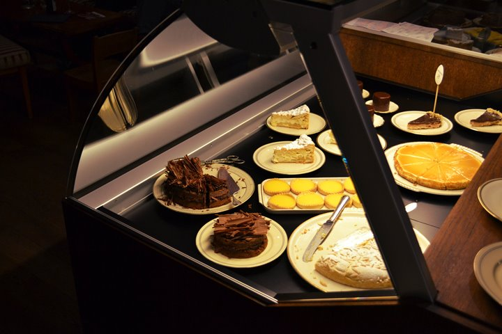
  

  

    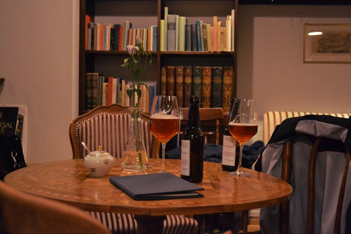
  

  

    
  

  

    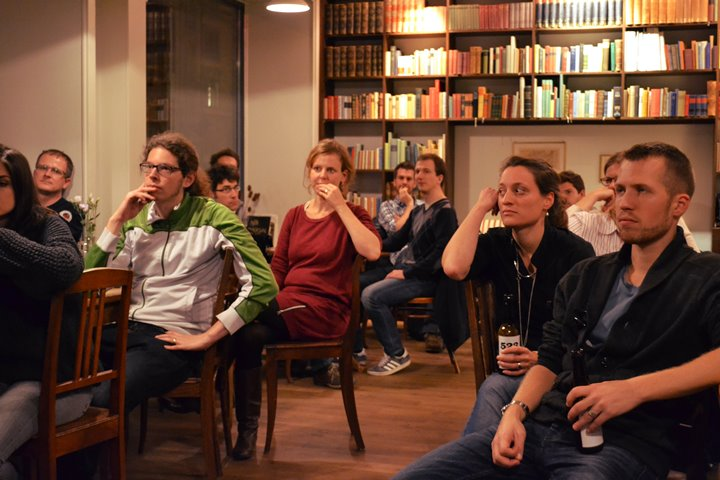
  

  

    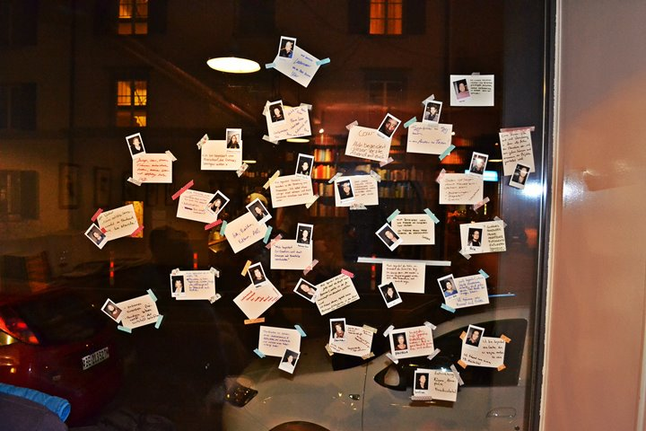
  

  

    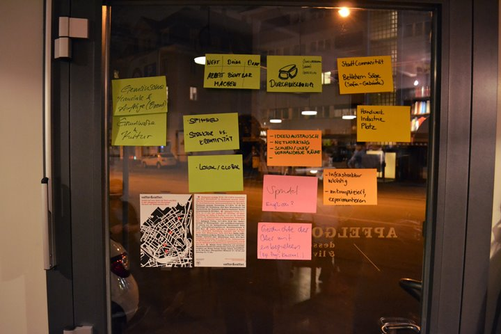
  

  

    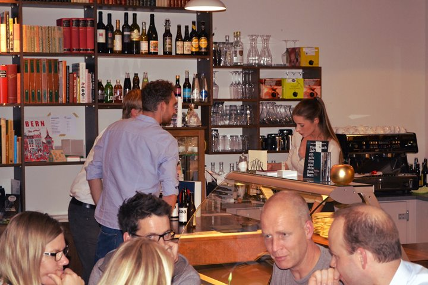
  

  

    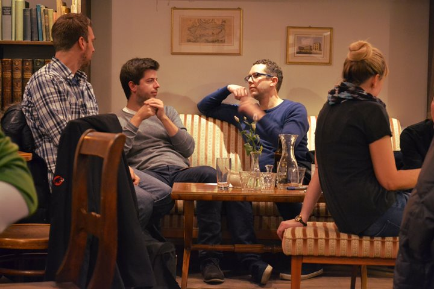
  

  

    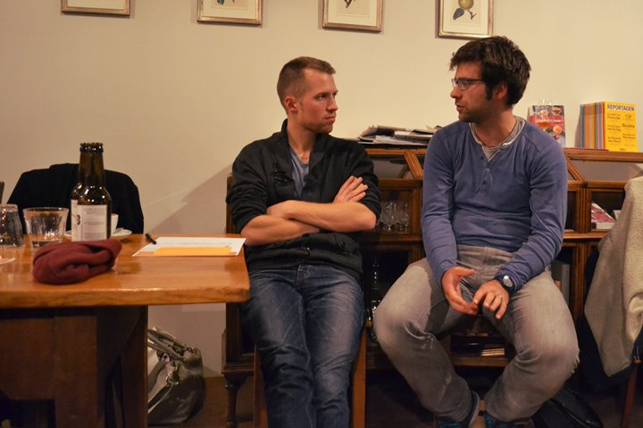
  

  

    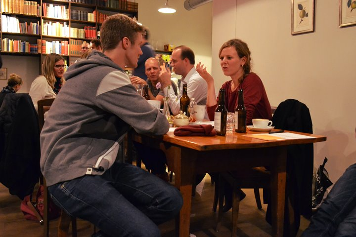
  

  

    
  

  

    
  

## Diskussionsergebnisse

*Hier werden mal alle Vorschläge ungefiltert präsentiert. Wir werden mit diesen weiterarbeiten.*

Über folgende Dinge wurde in den einzelnen Gruppen diskutiert:

### Modul: Pop-up Coworking

Einig war man sich in der Diskussion, dass eine gute Infrastruktur Pflicht ist für ein Pop-up Coworking Event. Zentral für diese Events sind der Ideenaustausch, während gemeinsamen Pausen, Mittagessen, Feierabendbier und das Networking. Dies ist ja sowieso ein Hauptanliegen der Coworking Idee.

Wichtig ist eine unkomplizierte Organisation dieser Events, am einfachsten ist es wohl die Homepage [www.popupcoworking.ch](http://www.popupcoworking.ch) als Informationsplattform zu nutzen. 

Mögliche Orte könnten nebst Cafés Sitzungszimmer in Firmengebäuden und Unis sein. Der Raum sollte keine Miete kosten.

### Modul: Investieren in andere

#### Grundwerte

Braucht es verbindliche Werte für die Community? Vorgeschlagen wurde, dass die Initianten Grundwerte definieren, die dann für die Community gelten. Diese Grundwerte könnten Themen wie Verbindlichkeit, sich in andere investieren, gemeinsame Zeit usw. regeln.

#### Sich unterstützen

Wie könnte die gegenseitige Hilfe konkret aussehen? Vorgeschlagen wurde ein Ort, wo jeder eintragen kann, an was er grad arbeitet. Wenn man dann "leere" Zeit hat, kann man sich dort informieren, wem man seine Hilfe am sinnvollsten anbieten könnte. Grundgedanke dabei ist, dass man nicht um Hilfe bitten muss, sondern dass Hilfe angeboten wird. 

Es sollte klar definiert werden zwischen *Community Work* füreinander (=gratis, z.B. 10% der Zeit über ein Jahr verteilt) und *Mandate* füreinander (=bezahlt).

#### Gute Durchmischung der Community

Die Community sollte nicht nur aus Jungunternehmern bestehen, sondern ebenfalls "Ideologen" (Menschen, die ihre Arbeitskraft gratis zur Verfügung stellen) und "Seniors" (Menschen, die ihr Fachwissen in Form von Coaching zur Verfügung stellen)

#### Gemeinsame Projekte fördern

Um die Community aufzubauen, wäre es wohl wichtig, gemeinsam an Projekten zu arbeiten.

Für solche Community-Projekte könnte z.B. 1 Tag pro Monat reserviert werden, wo die ganze Community für ein Mitglied arbeitet. Und/oder man organisiert z.B. 4 Mal pro Jahr Projekte für die Nachbarschaft. 

#### Gemeinsam als Firma auftreten

Als Coworking Community eine juristische Person bilden und Aufträge reinholen (Branding wäre dann die Community). Einen Pool von Personen aufbauen, die in ihrer Firma/NGO nicht 100% ausgelastet sind und die von den Firmen/NGO punktuell angestellt werden können für spezifische Tasks.

#### Wöchentliche Brown Bags

Über Mittag präsentiert ein Mitglied eine Problematik, neue Ideen oder ein neues Produkt und die anderen geben Feedback. Eine Community braucht auch gemeinsame Momente, nicht nur eine gemeinsame Website und Lokale.

### Modul: Location für Coworking & Café/Bar

Die angedachten 300m2 seien wohl zu klein für alle Ideen, die man gerne umsetzen würde. Zum Beispiel wären verschiedene Werkstätten toll. Diverse Vorschläge für mögliche konkrete Locations wurden zusammengetragen. 

Nach der Diskussion war klar, dass die Suche nach einer passenden Location wohl eine knifflige Sache werden wird. Weiterhin sind wir um Vorschläge froh. 

### Modul: Name für Coworking & Café/Bar

Soll der Namen Englisch oder Deutsch sein? Schön wäre es, wenn der Namen zum Ort passen würde, wie zum Beispiel der Sattler, Kreissaal oder Progr.

Zudem sollte der Name etwas über den Inhalt aussagen; ein konkreter Vorschlag war «Sprudel», was man mit prickelnd, lebendig verbinden kann. Zudem wäre es eine Verbindung zwischen dem Café/Bar Bereich (Getränke) und dem Coworking (sprudelnde Ideen). 
