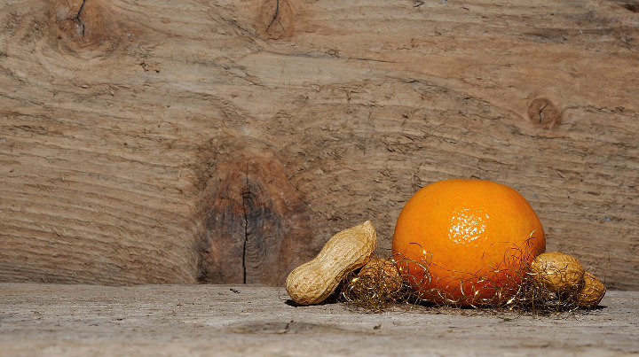
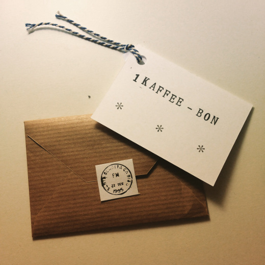

+++
title = "Jingle Bells: nächstes Jahr wird alles einfacher"
date = "2014-12-20"
description = "Der Countdown läuft: noch 4 Tage bis Heilig Abend. Ich kann nicht anders sagen: Bern ist überfüllt mit total gestressten, kopf- und planlosen Menschen."
image = "mandarin.jpg"
authors = [ "Domenica Winkler" ]
comments = true
tags = [ "Unterhaltung" ]
+++

Der Countdown läuft: noch 4 Tage bis Heilig Abend. Ich kann nicht anders sagen: Bern ist überfüllt mit total gestressten, kopf- und planlosen Menschen, die gehetzt von einem zum anderen Geschäft rasen, um noch Weihnachtsgeschenke zu kaufen. Ich wartete gestern 10 Minuten am Loebeggen und die Gesprächsfetzen, die ich aufschnappte, handelten nur von  (un)passenden Geschenken, gewaltigem Stress und nervigen Familienzusammenkünften.

Ich hab meine Geschenke zwar schon länger zusammen, aber auch ich musste einige Überlegungen anstellen, bis ich für alle das Passende gefunden hatte. 

Good News: nächstes Jahr wird alles einfacher. Alle Freunde, Familienmitglieder und Bekannte werden mit Gutscheinen für unser Café/Bar oder mit einem Hotdesk Platz für eine Woche/Monat/Jahr (kommt das aufs Budget drauf an) beschenkt. Das gute an den Gutscheinen wird sein, dass alle meine Freunde dann zu mir kommen und ich ihnen den besten Kaffee der Stadt servieren kann. Das wäre dann eine klassische win-win Situation. Wunderbar. Entspannte Weihnachten 2015 kann kommen. 

