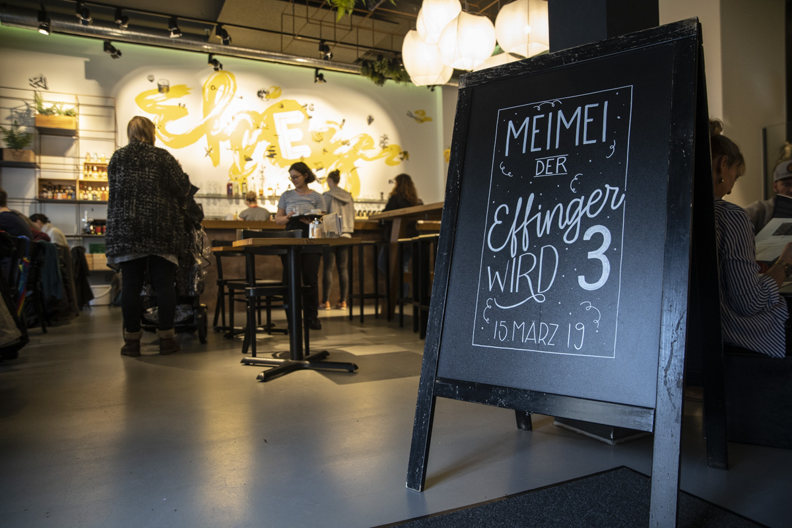
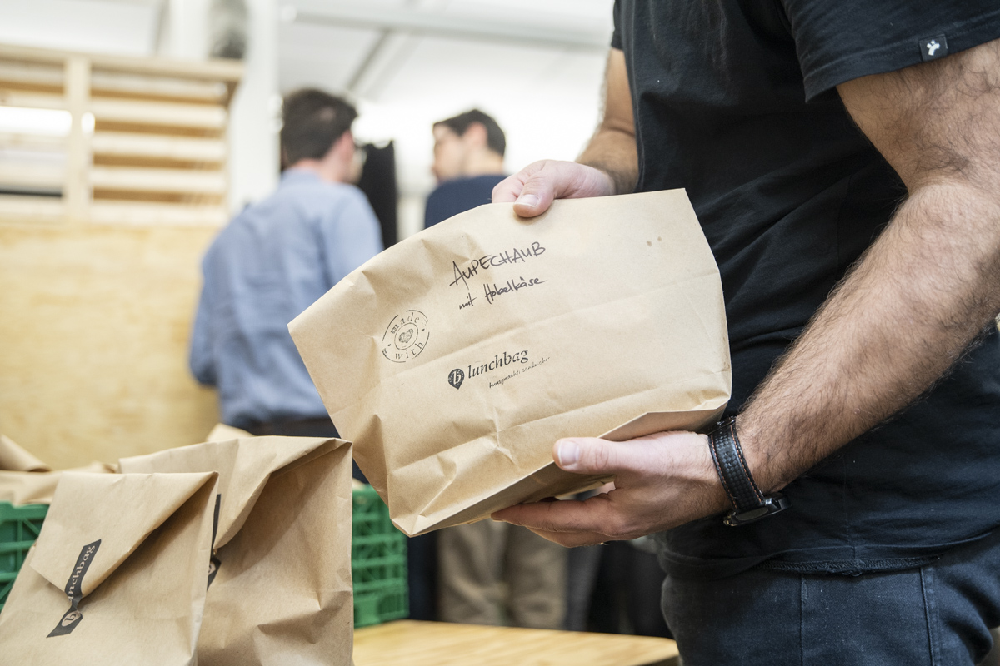
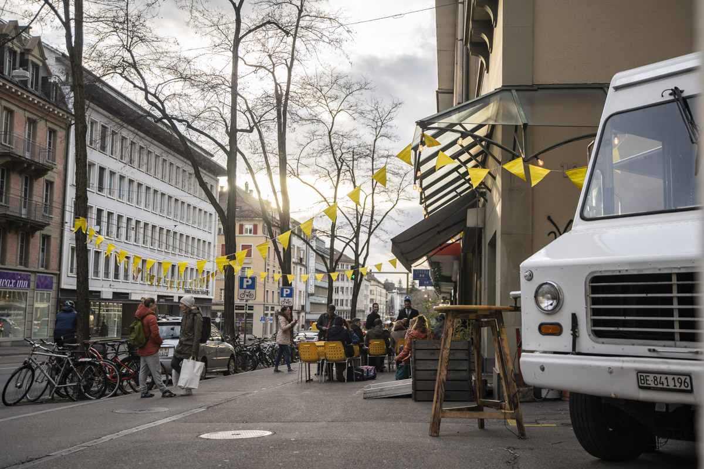
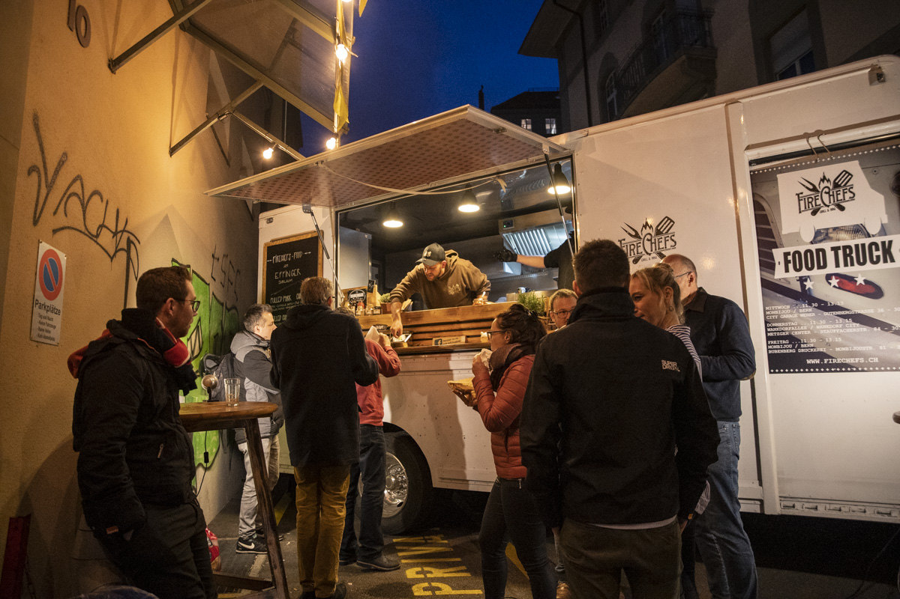
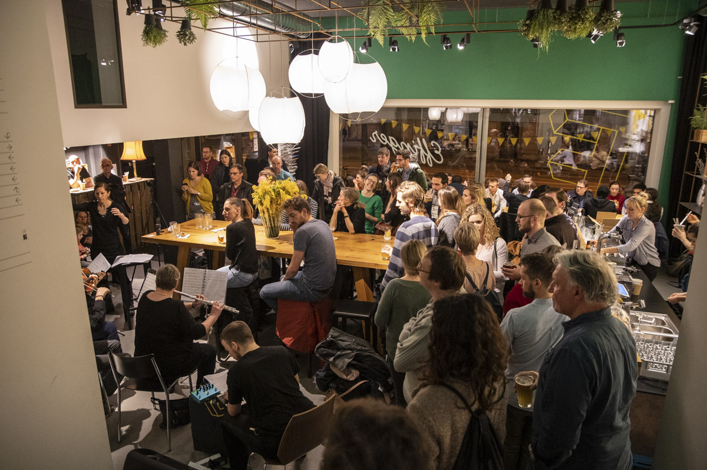
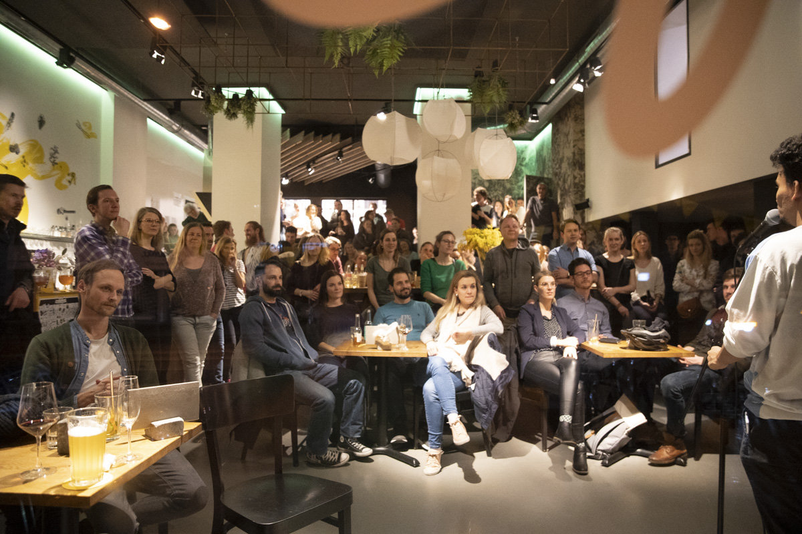

+++
title = "Jubiläumsfest – der Ausbruch in Bildern"
date = "2019-04-20"
description = "Unser dreijähriges Jubiläum haben wir am 15. März 2019 gebührend gefeiert. Eindrücke von einem unvergesslichen Tag."
image = "_A7_7078.jpg"
author = "Corinne Roth"
comments = true
tags = [ "Community" ]
+++

Unser dreijähriges Jubiläum haben wir am 15. März 2019 gebührend gefeiert. Eindrücke von einem unvergesslichen Tag.

Verpackungsversprechen und Inhalt stimmen bekanntlich oft nicht überein – denken wir an Fertigmenüs, bei denen das Auge nur auf dem Karton mitisst, an beeindruckende Visitenkarten aus der halbgaren Businesswelt oder – der Klassiker – Haarwuchsmittel. Es gibt aber auch Fälle, in denen der Inhalt die Erwartungen übertrifft. Genau so ein Fall ist der Effinger: Stellt sich bescheiden als Kaffeebar und Coworking Space vor, ist aber eigentlich ein aktiver Vulkan. Glaubst du nicht? Dann warst du am 15. März nicht im Effinger. Da ist er nämlich wieder einmal z Grächtem ausgebrochen – mit Pop-Up-Orchester, Film-Workshop, Lego-Werkstatt, Instagram-Kurs, Game-Avataren, Weindegustation, Achtsamkeitstraining, Poetry Slam, Food Truck und vielem mehr. Wir schwelgen mit Euch in Erinnerungen und freuen uns insgeheim schon heute auf’s nächste Jahr!

  

    
  

  

    
  

  

    
  

  

    
  

  

    
  

  

    
  

  

    
  

  

    
  

  

    
  

  

    
  

  

    
  

  

    
  

  

    
  

  

    
  

  

    
  

  

    
  

  

    
  

  

    
  

