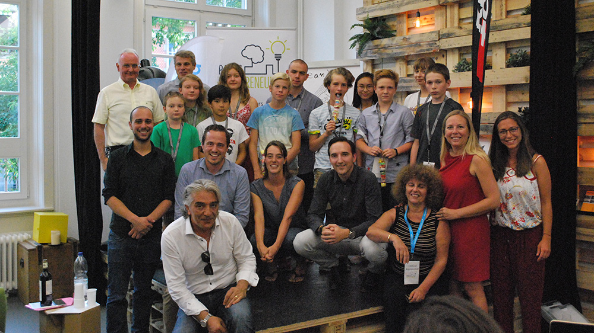

+++
title = "Junior Startup Day"
date = "2017-08-28"
description = "Wir hatten am letzten Samstag den Junior Startup Day im Effinger. Es war beeindruckend, wie die Junior Teams innert 3.5 Stunden Ideen generiert, Businessideen entwickelt, auf der Strasse mit Kunden gesprochen und dann vor einer Jury präsentiert haben."
image = "junior-startup-day.jpg"
author = "Matthias Tobler"
comments = true
tags = [ "Workshops" ]
+++

Wir hatten am letzten Samstag den Junior Startup Day im Effinger. Es war für die Involvierten ein super Erlebnis und die Jugendlichen haben tolle Ideen entwickelt. Es war wirklich beeindruckend, wie die Junior Teams innert 3.5 Stunden Ideen generiert, Businessideen entwickelt, auf der Strasse mit Kunden gesprochen und dann vor einer Jury präsentiert haben!

[be-advanced](http://be-advanced.ch) realisierte zusammen mit dem Schweizer Programm [Innov-Entrepreneurs / Graines d'Entrepreneurs](https://www.grainesentrepreneurs.ch/) und dem Effinger den ersten [Junior Startup Day in Bern](http://be-advanced.ch/startupday/).

Ziel war es, dass unter der Anleitung von Trainern und Unternehmern die Jungen die ersten Schritte ins Unternehmertum erleben konnten. Brainstorming mit den Coaches, Kunden befragen, eine Value Proposition (Wertversprechen) erarbeiten, daraus ein Angebot entwickeln und zum Schluss in einem Pitch der Jury präsentieren, war fester Bestandteil des Events.
