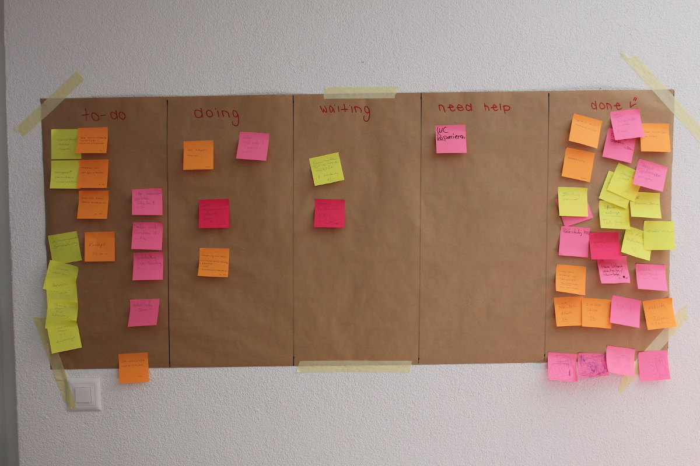

+++
title = "Kanban"
date = "2015-02-27"
description = "Die Coworking Woche spuckt ihre ersten konkreten Ergebnisse aus, Freude herrscht. Am gestrigen «How-the-heck»-Abend diskutierten wir die Frage, welche konkreten Schritte und Umsetzungsmöglichkeiten anstehen."
image = "kanban.jpg"
author = "Domenica Winkler"
comments = true
tags = [ "Coworking" ]
+++

  Die Coworking Woche spuckt ihre ersten konkreten Ergebnisse aus, Freude herrscht. Am gestrigen «How-the-heck»-Abend diskutierten wir die Frage, welche konkreten Schritte und Umsetzungsmöglichkeiten anstehen.

Eine erste Idee: tägliche, Community-übergreifende Kanban-Videokonferenzen. Kanban was? Kanban ist japanisch und heisst so viel wie «Karte», «Tafel». Es ist ein Tool zur Visualisierung des Arbeitsprozesses. Auf einer Tafel mit den Spalten «to do», «doing», «waiting», «need help» und «done» lassen sich die alltäglichen Aufgaben strukturieren und priorisieren.

Auf post-it Zettel werden alle Tasks aufgeschrieben und den verschiedenen Spalten zugeordnet:

* **to do**: «Diese Tasks möchte ich heute erledigen.»
* **doing**: «An diesem Task arbeite ich gerade.»
* **waiting**: «Ich habe meinen Teil erledigt, warte aber auf Antwort, um weiterarbeiten zu können.»
* **need help**: «Ich brauche Hilfe, um den Task zu erledigen.» 
* **done**: «Der Task ist erledigt.»

Mit Hilfe von Kanban ist es möglich, seine eigenen Aufgaben besser zu ordnen und zu strukturieren. Gleichzeitig gibt es einem die Möglichkeit am Arbeitsprozess der Teammitglieder teilzunehmen. Dies wiederum hilft dabei, sich gegenseitig zu helfen und zu unterstützen. Gemeinsam können Erfolge gefeiert, aber auch Schwierigkeiten beseitigt werden.

Wir haben in dieser Coworking Woche mithilfe von Kanban gearbeitet und waren ganz begeistert. So kam die Idee, dass man diese morgendlichen Kanban-Meetings auch über diese Woche hinaus veranstalten sollte. Wir starten nun am Montag, 2. März, 8.30 Uhr das Experiment per Video Chat gemeinsam zu «kanbanen». Dies wird über den Kommunikationskanal [«Slack»](/blog/slack/) geschehen. 

Bist du an deinen Homeoffice Tagen zu wenig produktiv, verlierst du dich in den einzelnen Aufgaben und kommst nie dazu, deine To-do Liste abzuarbeiten? Dann ist Kanban genau das Richtige für dich. Bei den morgendlichen Meetings per Videochat stellst du kurz deine Tasks vor, erfährst wo die anderen dran sind und wirst dabei motiviert, deine Aufgaben anzupacken. Damit kann der produktive Homeoffice Tag beginnen.

Möchtest du gerne Kanban kennenlernen und an den morgendlichen Meetings dabei sein? Dann meld dich bei Matthias oder Marco.