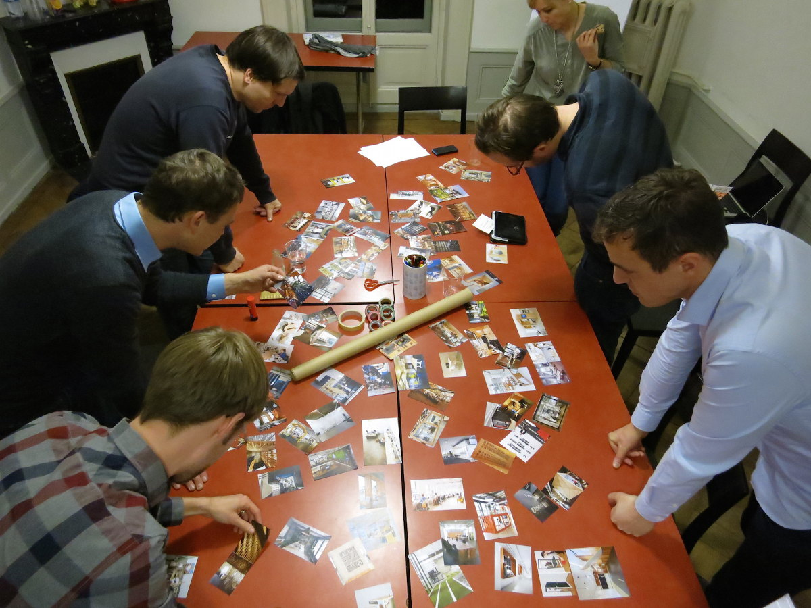
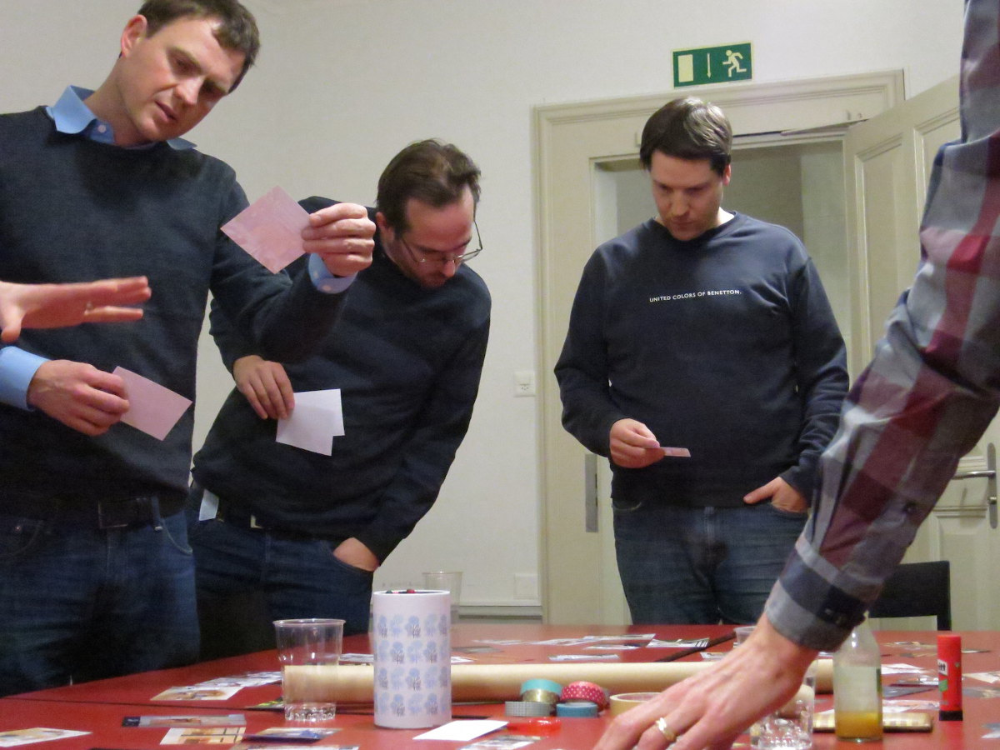
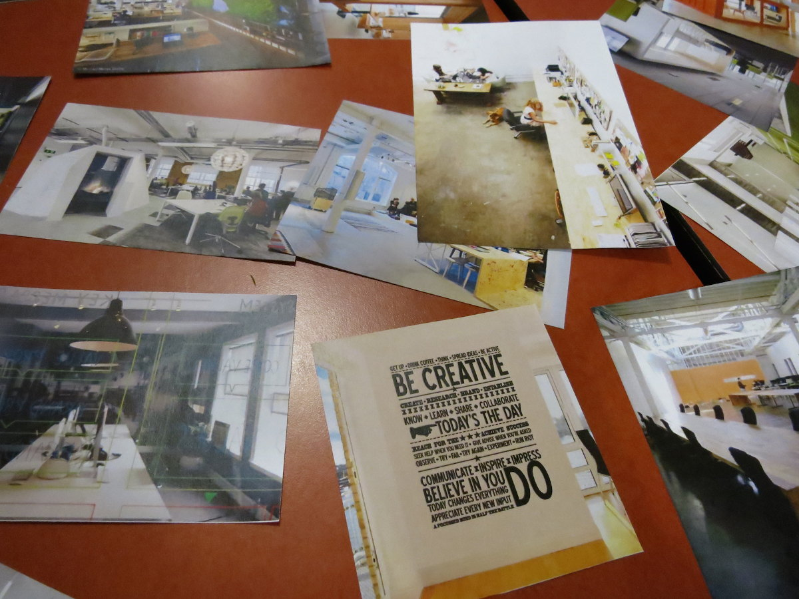
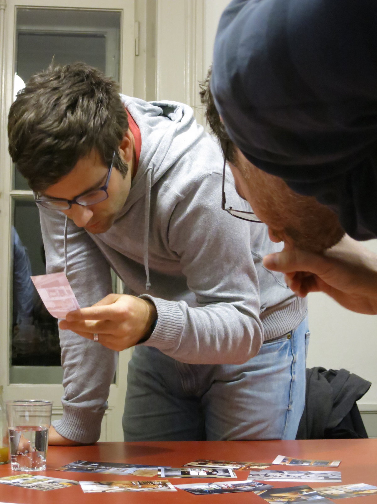
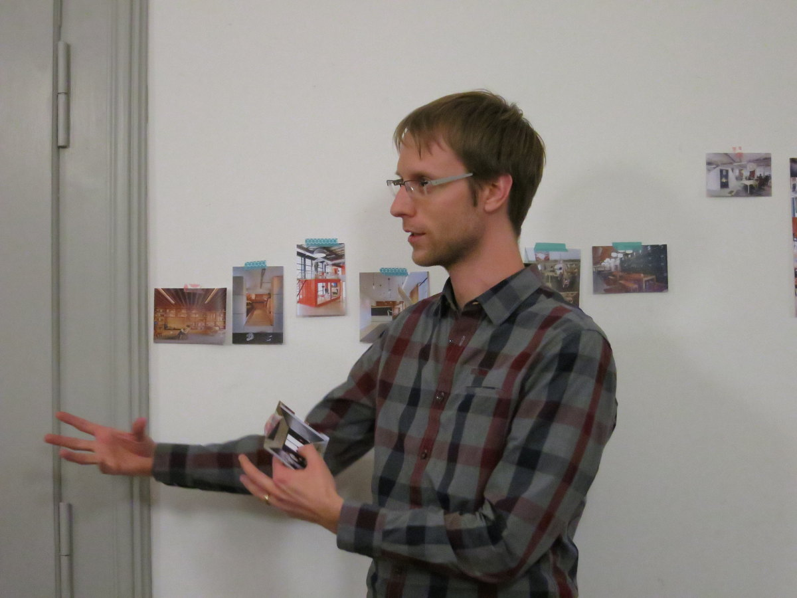

+++
title = "Klein aber sehr fein"
date = "2015-01-30"
description = "Knapp zwei Monate nach unserem ersten «How-the-heck»-Abend luden wir zur zweiten Ausgabe ein. Nachdem im November 2014 über dreissig Personen kamen, hatten sich dieses Mal nur zwei angemeldet. Wir waren etwas enttäuscht und erstaunt, aber auch gespannt, wie der Abend im kleinen Kreise werden würde. Als dann noch zwei Gäste spontan vorbei schauten, waren wir mit dem  Organisationsteam insgesamt acht Personen."
image = "klein-aber-sehr-fein.jpg"
author = "Domenica Winkler"
comments = "popupcoworking"
tags = [ "Community" ]
+++

Knapp zwei Monate nach unserem ersten «How-the-heck»-Abend luden wir zur zweiten Ausgabe ein. Nachdem im November 2014 über dreissig Personen kamen, hatten sich dieses Mal nur zwei angemeldet. Wir waren etwas enttäuscht und erstaunt, aber auch gespannt, wie der Abend im kleinen Kreise werden würde. Als dann noch zwei Gäste spontan vorbei schauten, waren wir mit dem  Organisationsteam insgesamt acht Personen.

Eingeladen haben wir, um die beiden Themen «Innendesign» und «Coworking Woche» zu diskutieren. Für die nötige Inspiration zum Thema Inneneinrichtung sorgten etwa 50 Bilder, von Coworking Spaces auf der ganzen Welt. Jeder hat nun Bilder ausgelesen, die ihn inspirieren und ansprechen. In der anschliessenden Diskussion versuchten wir die Bilder in Gruppen zu ordnen, um klarer darüber zu werden, welche Bereiche in unserem Coworking Space vorhanden sein müssen:

* Fokusräume und Sitzungszimmer
* Arbeitsbereich
* Übergangsbereich (zwischen Café/Bar und Arbeitsbereich)
* Hotdesk Socialbereich/Küche 
* (nice to have: Bibliothek)

Jeder dieser Bereiche hat eine andere Funktion und muss anders eingerichtet werden. Wir hatten die wildesten Ideen, wie das aussehen könnte. Für den nötigen «Fun Faktor» im Büro gabs Ideen von «einer Sauna mittem im Raum» bis zu «einem Zufallsgenerator für das Küchenämtchen». Es war eine lustige, fröhliche, aber auch sehr aufschlussreiche Diskussion. Es wurde klarer, welche Bereiche nötig sind, welche wir bei genügend Platz und Finanzen gern hätten und was die Funktion dieser einzelnen Bereiche sein sollte.

Nachdem wir unserer kreative Energie schon etwas verschossen hatte, machten wir uns noch an die Grobplanung der Coworking Woche vom 23.-27. Februar 2015. Während des Tages wird vorallem gearbeitet, da gabs nicht viel zum Planen. Aber die Abende möchten wir gerne etwas gestalten, mit verschiedenen Angeboten. So haben wir nun einen Filmabend, einen Diskussionsabend über alternative Arbeitsformen (eine Art Literaturclub), eine Grillparty, einen weitern «How-the-heck»-Abend und ein Konzert geplant. Alle Infos dazu findet ihr unter «Events» auf dieser Homepage.

Es hat sich an diesem Abend gezeigt, dass man auch im kleinen aber sehr feinen Rahmen Ideen entwickeln, Diskussionen anreissen und Neues lernen kann.

