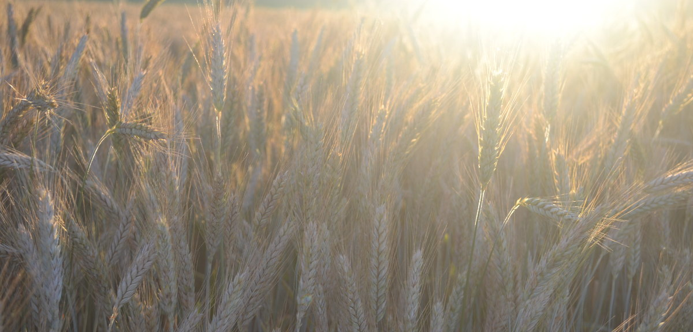

+++
title = "Von Konkurrenz, Knappheit und Überfluss"
date = "2016-09-05"
description = "In den letzten Wochen wurde ich immer wieder darauf angesprochen, ob die anderen Coworking Spaces denn eine Konkurrenz für den Effinger seien. Wie gehen wir damit um? Wie kommen wir von einem Knappheits-Denken in eine Überfluss-Mentalität?"
image = "kornfeld.jpg"
author = "Marco Jakob"
comments = true
tags = [ "Community", "Grundsätze" ]
+++

  Bild: Isabel Jakob

Die Migros hat in der [Welle7 einen Coworking Space](https://www.welle7.ch/de/workspace) eröffnet und im Oktober wird der [Impact Hub in Bern](http://bern.impacthub.net/) seine Türen öffnen. In den letzten Wochen wurde ich immer wieder darauf angesprochen, ob die anderen Coworking Spaces denn eine Konkurrenz für den Effinger seien und wie wir damit umgehen. Diese Frage wird meist mit leichten Sorgenfalten auf der Stirn gestellt: “Hoffentlich hat es dann noch genug für euch.”

Ich wusste, wie ich darauf reagieren wollte. Ich sagte, dass ich nicht gerne von “Konkurrenz” spreche und ich mich darauf konzentrieren möchte, andere zu unterstützen, die in eine ähnliche Richtung gehen, anstatt sie zu bekämpfen. Das habe ich auch versucht, wenn es eine Gelegenheit dazu gab. Ich dachte, dass ich damit nach unserem [Grundsatz der Grosszügigkeit](/grundsaetze/grosszuegigkeit/) handeln würde. “Wir haben eine Überfluss-Mentalität” und “wir freuen uns mit an Erfolgen von anderen”, sind zwei der Leitsätze, die dort stehen.

Soweit die Grundsätze auf Papier und meine persönliche Entscheidung im Kopf. Leider muss ich eingestehen, dass mein Herz da nicht ganz mitgemacht hat. Ich habe mir vor einigen Wochen die Gebäude angeschaut, in denen die Coworking Spaces entstehen. Ich sah die wunderschönen Räume, die super Ideen von tollen Teams, von denen ich einige Personen persönlich kenne und schätze. Aber bei diesen Führungen habe ich mich dabei ertappt, wie ich ständig überlegte, welche Auswirkungen dies auf unser Coworking-Angebot haben könnte. Dann kam auch bei mir die Angst: “Hat es denn noch genug für uns?”. Und vorbei war es damit, dass ich mich mit ihrem Erfolg freuen könnte. Im Gegenteil. Ein Misserfolg schien mir plötzlich willkommen. Aber das würde ich natürlich nie laut sagen.

Dann ging ich in die Ferien und las ein Buch, das mich sehr inspiriert hat: “The Active Life - A Spirituality of Work, Creativity, and Caring” von Parker J. Palmer.

Palmer sucht in alten Gedichten und Geschichten nach Weisheiten für unser aktives und geschäftiges Leben. In einer Geschichte geht es im Besonderen um “Überfluss und Knappheit”. Die Geschichte stammt aus der Bibel. Ich erzähle sie hier in eigenen Worten:

*Ein weiser Lehrer sagte zu seinen engsten Schülern: “Kommt, wir gehen an einen einsamen Ort, wo wir allein sind und ihr euch ein wenig ausruhen könnt.” Denn es war ein ständiges Kommen und Gehen, sodass sie nicht einmal Zeit zum Essen fanden. Sie fuhren also mit einem Boot an einen einsamen Ort, um allein zu sein. Aber man beobachtete sie bei der Abfahrt, und vielen war klar, wohin sie wollten. Da kamen die Leute aus allen umliegenden Ortschaften angelaufen und waren so auf dem Landweg noch vor ihnen dort.*

*Als der weise Lehrer aus dem Boot stieg und die vielen Menschen sah, ergriff ihn tiefes Mitgefühl. Er nahm sich darum viel Zeit, sie zu lehren. Es wurde spät, und seine Schüler kamen zu ihm und sagten: “Wir sind hier an einem einsamen Ort, und es ist schon spät. Schick die Leute fort, dann können sie in die umliegenden Dörfer gehen und sich etwas zu essen kaufen.” Der Lehrer erwiderte: “Gebt ihr ihnen zu essen!” Da sagten sie zu ihm: “Sollen wir hingehen und für zweihundert Denare Brot kaufen und ihnen zu essen geben?” - “Wie viele Brote habt ihr?”, fragte er zurück. “Geht und seht nach!” Sie taten es, kamen wieder zu ihm und sagten: “Fünf, und zwei Fische.” Da wies der Lehrer sie an, dafür zu sorgen, dass die Leute sich alle gruppenweise ins Gras setzten. Als sie sich in Gruppen zu hundert und zu fünfzig gelagert hatten, nahm er die fünf Brote und die zwei Fische, blickte zum Himmel auf und dankte. Dann brach er die Brote und gab sie seinen Schülern, damit diese sie an die Menge verteilten. Auch die zwei Fische liess er unter alle verteilen. Alle assen sich satt. Als man anschliessend die Reste einsammelte, waren es zwölf Körbe mit Brot und Fischen. Etwa fünftausend Personen hatten an der Mahlzeit teilgenommen.   
(in Anlehnung an Markus 6)*

## Knappheits-Mentalität

Sehr viel hängt davon ab, ob wir davon ausgehen, dass wir in einer Welt des Mangels oder in einer Welt des Überflusses leben. Hat es genug? Sind grundlegende Dinge wie Essen, ein Dach über dem Kopf oder auch Gefühle wie wertvoll und geliebt zu sein, in einer ausreichenden Fülle vorhanden? Oder leben wir in einer Welt, in der diese Ressourcen knapp sind und wir darum schauen müssen, dass wir schneller und stärker sind als andere und uns möglichst viel davon aneignen können? Unsere Handlungen sind geprägt davon, wie wir diese Fragen für uns beantworten. In einer Welt der Knappheit überleben nur die Leute, die wissen, wie man sich gegen Konkurrenz durchsetzt oder gar, wie man Kriege gewinnt. In einer Welt der Fülle werden grosszügige Handlungen und das Denken für die Gemeinschaft möglich und führen sogar zu fruchtbaren Resultaten.

Ein kurzer Blick in unsere Gesellschaft bestätigt, dass wohl die meisten von uns und unsere Institutionen aus einer Knappheits-Mentalität heraus handeln. Etwas, das wesentlich zu dieser Denkweise beiträgt, ist die Art, wie wir miteinander wirtschaften. Im Ökonomiebuch aus meinem Wirtschaftsstudium steht im allerersten Satz: “Im Studium der Ökonomie geht es mehrheitlich darum zu untersuchen, wie sich Menschen verhalten im Umstand der Knappheit.” Unser wirtschaftliches Verhalten, der ständige Tausch von Geld gegen Waren, trägt auf merkwürdige Weise diesen Geschmack der Knappheit in sich.

Dieses Verhalten sehen wir auch bei den Schülern in unserer Geschichte. Sie wollen die Leute wegschicken, damit sie sich Essen kaufen. Die Schüler gehen davon aus, dass das Essen knapp ist. Die effizienteste Art knappes Essen zu verteilen, ist, wenn man dem Geld die Verteilung übergibt: Wer bereit ist, für das knappe Essen einen bestimmten Preis zu bezahlen, wird es erhalten. Geld ist unpersönlich und oft unsichtbar. Da kann man leicht ignorieren, dass einige Personen sehr viel haben, während sich andere nicht einmal genug Essen kaufen können. Die Schüler wollen sich raushalten und es dem Geld überlassen, das knappe Essen zu verteilen.

Die Schüler in der Geschichte schlagen nicht nur vor, dass die Leute sich Essen kaufen, sondern auch, dass sie weg gehen und sich verteilen. Anstatt sich zusammen zu tun als Gemeinschaft, sollen sie sich verstreuen. In Gemeinschaft, wir nennen es Community, hätte man Möglichkeiten, untereinander zu teilen und dadurch inmitten von Knappheit gemeinsam Überfluss zu schaffen.

Daraus lässt sich erkennen, wie sich die Knappheits-Mentalität auf Communities auswirkt. Wenn wir eine Knappheits-Mentalität haben, handeln wir individualistisch und treten miteinander in Konkurrenz, was Community zerstört. Wenn Community zerstört ist, erleben wir auch tatsächlich Knappheit, da ja die Gemeinschaft weg ist, wo durch Teilen überhaupt eine Fülle entstehen könnte. So kann man sagen, dass, wer von Knappheit ausgeht, auch tatsächlich Knappheit erleben wird - eine selbsterfüllende Prophezeiung.

## Überfluss-Mentalität

Nun spricht wieder der weise Lehrer und sagt ganz einfach: “Gebt ihr ihnen zu essen!” Sie sollen das Problem nicht weiterschieben, sondern Verantwortung übernehmen und es lösen. Mit dem Verb “geben” drückt er aus, dass das Problem mit dem Essen nicht unpersönlich durch Geldaustausch, sondern durch einen Akt der Grosszügigkeit gelöst werden soll. Community und Überfluss entsteht dann, wenn wir anstatt kaufen etwas geben und wenn wir anstatt in Konkurrenz treten uns selber verschenken.

Die Schüler verstehen jedoch immer noch nicht ganz und fragen ungläubig: “Sollen wir hingehen und für zweihundert Denare Brot kaufen?” Der weise Lehrer antwortet: “Wie viele Brote habt ihr? Geht und seht nach!”

Dies ist für mich der Schlüsselsatz in der ganzen Geschichte. Es ist der Moment, wo der Wechsel passiert von der Knappheits-Mentalität zu dem, dass man das Potential für Überfluss sieht. Es geschieht in dem Zeitpunkt, wo wir auf das schauen, was wir bereits haben. Dies ist der erste Schritt, wenn wir in eine Überfluss-Mentalität kommen wollen, dass wir die Dinge erkennen und empfangen, die uns im Leben bereits geschenkt sind.

## Wunder der Community

Die Schüler schauen nach und berichten ernüchtert: Es sind bloss fünf Brote und zwei Fische. Dies wird niemals reichen für die fünftausend Personen. Schon wieder sind wir in einer Knappheits-Situation, doch der Lehrer lässt sich nicht beirren und gibt weitere Anweisungen. Die Leute sollen sich in kleinere Gruppen aufteilen und auf dem Gras absitzen. Dann nimmt er die Brote und Fische, blickt zum Himmel hinauf, dankt dafür und teilt sie auf und gibt sie an seine Schüler weiter. Diese verteilen sie weiter an die Menge. Alle wurden satt und am Schluss bleiben sogar noch Resten übrig.

Was passiert hier? Werden die Naturgesetze durchbrochen und das Brot wird magisch vermehrt? Oder hat der Lehrer mit seinen Schülern vorgemacht, wie man dankbar ist für das, was man hat und es untereinander teilt und alle anderen haben ihre eigenen Resten hervorgeholt und auch angefangen untereinander zu teilen?

Die Geschichte verrät es nicht und es ist vielleicht auch nicht relevant. Es betrifft nämlich den Teil, den wir sowieso nicht selber bewirken könnten - sei es nun ein Wunder oder dass andere auch anfangen zu teilen.

Aber schauen wir noch einmal etwas genauer, was mit den Leuten passiert. Der Lehrer beginnt damit, die riesige Menge von fünftausend Personen aufzuteilen in kleinere Gruppen von hundert oder fünfzig. Dies ist die Grösse einer Community, in der Anonymität verschwindet und es möglich wird, sich gegenseitig kennen zu lernen. Wie ich oben geschrieben habe, ist Community der Ort, wo Überfluss entstehen kann. Und noch wichtiger: Überhaupt das Erleben von Gemeinschaft in einer Community ist selbst schon ein Erleben von Überfluss. Parker Palmer drückt es so aus:

In der grossen, anonymen Gruppe erleben wir Knappheit - eine Knappheit von Kontakt, Mitgefühl, Bestätigung und Liebe. Aber sobald sich eine Community bildet, so entsteht ein unsichtbares Gefühl von Überfluss, schon lange bevor die Community etwas sichtbares produziert. Echter Überfluss findet man dort, wo Leute zusammen kommen und füreinander da sind. Nur im Kontext von diesem Überfluss, der zwischen den Menschen entsteht, kann erst ein materieller Überfluss vom Essen entstehen.

## Der Weg zur Grosszügigkeit

Es ergeben sich drei Schritte auf dem Weg zur Grosszügigkeit:

### 1. Schauen, was wir haben

Als Erstes geht es darum, auf das zu schauen, was wir haben. Wir sind so geübt darin, auf das zu schauen, was wir nicht haben, dass das ganz schön schwierig sein kann. Sobald wir uns aber Zeit nehmen und darüber nachdenken, was wir haben, werden wir sofort in die Gegenwart versetzt. Die Sorgen für die Zukunft rücken in den Hintergrund - wir finden Ruhe im Moment.

### 2. Dankbarkeit ausdrücken

Das zu sehen, was wir haben, kann schon Dankbarkeit auslösen. Manchmal sieht es aber doch danach aus, als hätte man zu wenig. Fünf Brote und zwei Fische für füntausend Personen - wie soll das genug sein? Und doch hat man etwas und kann sich entscheiden, dafür dankbar zu sein. Mit Dankbarkeit drückt man aus, dass man wichtige Sachen in seinem Leben nicht alleine “machen” kann, sondern man kann sie nur als Geschenk empfangen. Ohne die Fülle an Natur, Leben, Ressourcen und Ideen könnten wir überhaupt nichts tun.

### 3. Überfluss-Handlung

Auf das zu schauen, was wir haben und dafür dankbar zu sein, schafft Vertrauen in die Fülle, die es im Leben gibt. Wir sind überzeugt, dass wir genug haben werden und dass es sogar noch reichen wird für andere. Nun geht es darum, aus dieser Überfluss-Mentalität heraus zu handeln. In unserer Geschichte ist diese Handlung ein Akt der Grosszügigkeit, indem der Lehrer und seine Schüler das Wenige, was sie haben, mit anderen teilen.

Und genau in dieser Handlung besteht die Chance, dass Community entstehen kann, in der wieder andere miteinander Teilen und mehr Überfluss entsteht. Community kann man jedoch nicht machen oder erzwingen. Echte Community ist ein Geschenk. Und so enthält echte Community immer ein echtes Risiko. Community mag entstehen oder auch nicht, mag Konsequenzen haben, die wir mögen oder auch nicht. Wagen wir es, diesen Schritt trotzdem zu tun und im Überfluss zu handeln?

## Mein persönliches Fazit

Ich bin total erstaunt, was es bei mir auslöst, wenn ich auf das schaue, was wir bereits haben. Es ist so viel, dass ich gar nicht wüsste, wo zu beginnen. Schon nur die Fülle an Beziehungen und Freundschaften, die in den letzten zwei Jahren während dem Träumen, Planen, Aufbauen und Betreiben des Coworking Spaces entstanden sind, ist einfach grossartig. Das ist für mich das grösste Geschenk und dafür bin ich riesig dankbar. Dann sehe ich plötzlich die Fülle, dass es mehr als genug hat. Ich bin nun wieder offen für Gelegenheiten, um aus der Überfluss-Mentalität heraus zu handeln. Und jetzt gibt es sogar die Momente, wo ich mich an den Erfolgen von anderen freuen kann.
