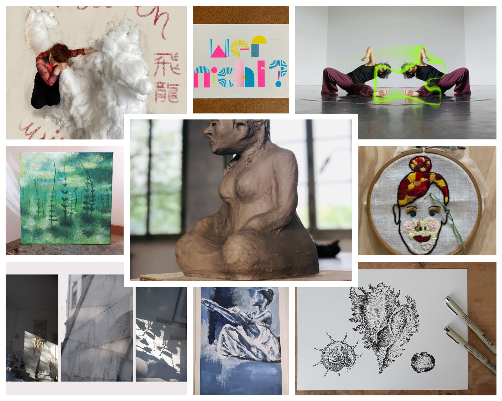

+++
title = "Kunst im Coworking - ein kreatives Biotop"
date = "2025-03-27"
draft = false
tags = [ "Kunst", "Community" ]
image = "kunst-im-coworking.jpg"
description = "Im Effinger arbeiten Entwickler*innen neben Designer*innen, Marketingexper*tinnen neben Architek*tinnen – genau das macht den Charme eines Coworking Spaces aus. Doch nicht nur die digitale und intellektuelle Vielfalt prägen diesen Ort, sondern auch die Kunst."
authors = [ "Sunita Asnani"]
comments = false
+++

Im Effinger arbeiten Entwickler*innen neben Designer*innen, Marketingexper*tinnen neben Architek*tinnen – genau das macht den Charme eines Coworking Spaces aus. Doch nicht nur die digitale und intellektuelle Vielfalt prägen diesen Ort, sondern auch die Kunst. Neben Bildschirmen und Besprechungsräumen gibt es hier ein Kunstatelier, in dem gemalt, skizziert und kreatives Denken in Form gebracht wird. Manchmal werden Meetings zwischen Staffeleien und Skulpturen abgehalten – was nicht selten zu ganz neuen Ideen führt.

## Eine Idee entsteht – und wächst

März 2020: Die Welt stand still. Der Lockdown begann, Begegnungen wurden selten. Initiiert von Anicia Kohler fanden sich drei Kunstschaffende und ich zusammen, um den kreativen Austausch trotz allem aufrechtzuerhalten. Was als loses Treffen begann, entwickelte sich rasch zu einem festen Ritual: Das Kunstzmittag war geboren – erst virtuell, dann vor Ort.

## Ein prägendes erstes Treffen
Vor genau vier Jahren, im März 2021, kamen wir zum ersten Mal physisch zusammen. Wir fingen an, damit zu experimentieren, was passiert, wenn wir uns eine gemeinsame Challenge geben. Eines davon war das Thema: Block – im wörtlichen und übertragenen Sinn.

- Isabel bestellte 30 Kilo Speckstein und formte eine [Gesichtsskulptur](https://www.aufzurkunst.ch/posts/am-anfang-war-der-klotz/).
- Damaris nutzte ihre doppelte Sicht als künstlerische Inspiration für ihre Fotografie. Siehe dazu [ihren Beitrag](https://dmrsbrgr.com/blog/2021/3/18/b-l-o-c-k-).
- Ich experimentierte mit der Choreografie von en bloque Bewegungen in Stop-Motion-Videos – diese schaue ich heute noch gerne, eines davon und ist [hier](https://vimeo.com/525590284) zu sehen.
- Anicia beschäftigte sich mit der Frage, wie sie das Komponieren mehr blockartig angehen, „kritzeln“ könnte – und versuchte dies mit einer kleinen musikalischen Skizze, die auch ihre Synästhesie, die Verbindung von Farben und Klängen, einbezog.

Dieses Treffen war beeindruckend, weil es den Wert und die Kraft unserer unterschiedlichen Perspektiven so fassbar auf den Tisch brachte. Es machte sichtbar, was Vielfalt ausmacht: Jede von uns brachte ihre eigene Herangehensweise ein, die in den entstandenen Werken und Diskussionen spürbar wurde. Verschiedene Blickwinkel erweitern den Horizont, fördern unerwartete Ideen und lösen kreative Blockaden – eine Dynamik, die nicht nur in der Kunst, sondern auch in innovativen Arbeitsumfeldern von zentraler Bedeutung ist.

Doch dafür braucht es etwas Entscheidendes: die Erlaubnis und den Mut, unfertige Gedanken zu teilen, zu experimentieren und Fehler als Teil des Prozesses zu akzeptieren – kurz: Psychologische Sicherheit. Nur in diesem offenen Austausch kann echtes gemeinsames Lernen entstehen.
Seither ist jedes Kunstzmittag für mich ein Highlight – eine Gelegenheit, Neues auszuprobieren, sich gegenseitig herauszufordern, zu inspirieren und gemeinsam zu wachsen.

## 52 Treffen und eine stetig wachsende Gemeinschaft

Was als kleine Initiative begann, ist längst fester Bestandteil des Effinger geworden. Inzwischen haben 52 Kunstmittags-Treffen stattgefunden, dokumentiert auf unserer Website: [Kunst im Coworking](https://www.kunstimcoworking.ch/).

## Zu den sich regelmässig treffenden Kunstschaffenden gehören heute:

- [Graziella Bärtsch](https://www.graziellabaertsch.ch/) – Visuelle Kunst
- [Damaris Berger](https://dmrsbrgr.com/) – Fotokunst
- [Isabel Jakob](https://www.isabeljakob.ch/) – Visuelle Kunst
- [Barbara Reichen](https://barbarareichen.com) – Performance & Installation
- [Sunita Asnani](https://www.sunitaasnani.com/) – Tanz & Performance
- Vijitha Veerakatty – Visuelle Kunst

Auch wenn [Anicia Kohler](https://www.aniciakohler.ch/) nicht mehr regelmässig bei den Kunstzmittags dabei ist, ist sie als Initiatorin fester Bestandteil unserer Gruppe und hat u.a. das [Effinger Kunstfestival](https://www.effinger.ch/blog/effinger-kunstfestival/) ins Leben gerufen – ein weiteres Beispiel dafür, wie sehr Kunst diesen Coworking Space durchdringt. 
Zum Stichwort “Gemeinsamständigkeit” (siehe dazu auch Urs’ Blogartikel zu Gemeinsamständigkeit): Inzwischen hat es schon mehrere künstlerische Zusammenarbeiten gegeben, die direkt aus dem Kunstzmittag geboren sind, wie z.B. die Zusammenarbeit von Barbara und Damaris, wie im [Blog 52](https://www.kunstimcoworking.ch/kunstzmittag-52/) beschrieben.

## Was kommt als Nächstes?
Das Kunstzmittag bleibt ein Ort für Experimente, Ideen und gegenseitige Inspiration. Hier teilen wir unfertige Arbeiten, erhalten Feedback und denken gemeinsam weiter.
Wer Lust auf kreativen Austausch hat, ist herzlich willkommen. Ich freue mich auf neue Perspektiven, spannende Diskussionen – und viele weitere inspirierende Mittagspausen!
Kontaktieren kannst du uns gerne unter: [hoi@sunitaasnani.com](mailto:hoi@sunitaasnani.com)

<a class="btn btn-primary" href="https://www.kunstimcoworking.ch" target="_blank">kunstimcoworking.ch</a>
