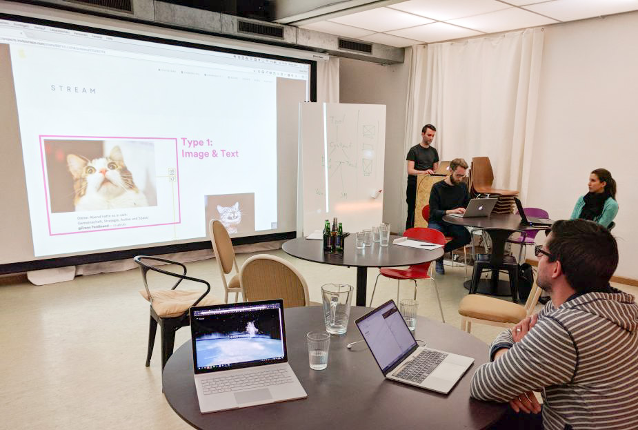
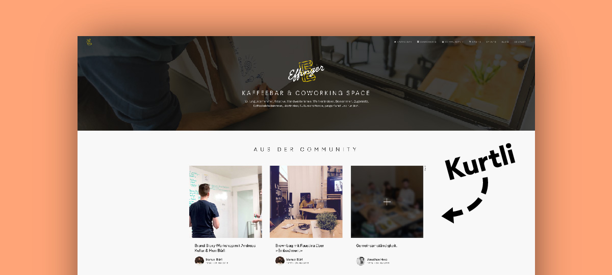

+++
title = "«Kurtli» hilft uns beim Storytelling"
date = "2018-11-30"
description = "Wir suchten nach einem Tool, um der Welt zu erzählen, was im Effinger alles abgeht. Wir entwickelten «Kurtli», der erste typisch-schweizerische Bot, der uns beim Storytelling hilft."
image = "kurtli.jpg"
author = "Manuel Bürli"
comments = true
tags = [ "Community" ]
+++

Wir suchten nach einem Tool, um der Welt zu erzählen, was im Effinger alles abgeht. Wir entwickelten «Kurtli», der erste typisch-schweizerische Bot, der uns beim Storytelling hilft.

Im Effinger entstehen täglich kollaborative Projekte und es finden kreative Workshops & Events statt. Doch wie erzählen wir all diese tollen Geschichten, bei denen wir wegen der Intensität selber kaum mitkommen?

Wir haben es mit Social Media versucht. Leider konnten sich bei uns Dienste wie Facebook & Twitter nicht richtig etablieren. Viele unserer Community Mitglieder nutzen diese Plattformen spärlich. Mit den Blogs auf der Effinger Website verlief es nicht besser – ein Blog-Beitrag pro Monat wurde unserem Kommunikationsbedürfnis nicht gerecht.

Dann war da noch «Slack». Die Instant-Messaging-App nutzen wir im Effinger exzessiv. Bis zu tausend Nachrichten schiessen wöchentlich durch unsere Leitungen. Leider ist dieses Tool geschlossen und nur mit einem Account zugänglich. Doch wie wäre es, wenn wir einen Weg fänden, Geschichten aus Slack auf der Website zu publizieren?
 
 

An einer Hacknight im Effinger bauen wir den ersten Prototypen.

## Dürfen wir vorstellen: «Kurtli» der Storytelling-Bot

Wie wir das bei solchen Problemen gerne tun, trafen wir uns zu einer Hack Night. Marco Jakob programmierte einen Prototypen, mit dem wir die ersten Fotos von Slack auf die Effinger Website posten konnten – ähnlich wie bei Instagram. Anschliessend haben wir es der Community vorgestellt und liessen es bis aufs Mark testen. Die positiven Reaktionen waren überwältigend. Selbst Social-Media-Muffel posteten Fotos und schrieben Texte. 

Wir haben das Tool «Kurtli» getauft. Ein richtiger Schweizer Bünzli-Bot. Zuverlässig, wie ein Schweizer Taschenmesser, hilft er uns, unsere Geschichten zu erzählen. Mit einem Klick können wir Bild und Text per Slack auf die Website posten. Eine simple Idee mit viel Impact.
 
 

 

Spannende Einblicke in das Effinger-Leben: Kurtli in Aktion auf unserer Website.

## Aus der Community für die Welt

Mit über 200 Bildern und tausenden von Besuchen auf der Effinger Website blieb «Kurtli» natürlich nicht unentdeckt. Bald schon fragten uns andere Coworking Spaces und Unternehmen an, ob Sie «Kurtli» auch übernehmen dürfen. So haben wir uns entschlossen, «Kurtli» neu als Produkt anzubieten. 

## «Kurtli» für dein Business?

Brauchst du Slack in deinem Team und stehst vor dem selben Problem wie wir? In zwei einfachen Schritten kannst du «Kurtli» installieren. In deinem Slack erscheint anschliessend ein neuer Kanal namens #kurtli-feed. Dort kannst du Fotos mit Text posten. Mit einem einfachen Code-Snippet werden die Fotos auf deiner Website sichtbar. Die jährliche Gebühr für «Kurtli» kostet 150 Franken – damit auch wirklich jedes Start-Up es sich leisten kann.

**Jetzt «Kurtli» für 14-Tage kostenlos testen:**   
[www.kurtli.com](https://www.kurtli.com)

**Das Kurtli-Team**   
Marco Jakob, Andreas Keller & Manuel Bürli   
[hello@kurtli.com](mailto:hello@kurtli.com)